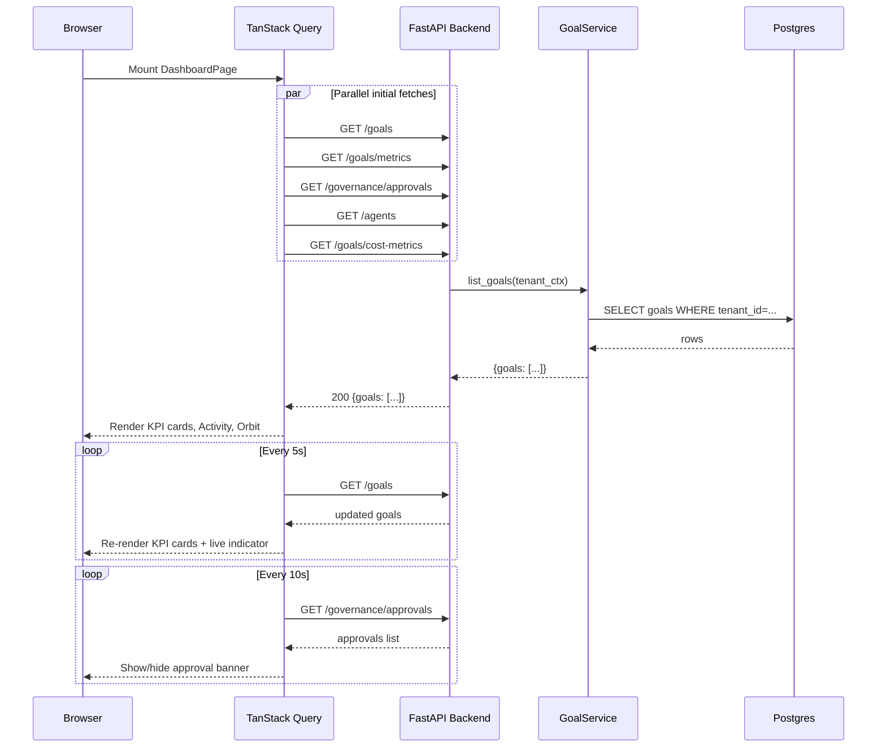

# Mission Control Dashboard

## Purpose

The Dashboard (`/`) is the operational nerve center of AgentVerse. It gives operators a real-time, tenant-scoped overview of every running, completed, and failed goal, how much those goals are costing, which agents are busy, and whether any actions are waiting on a human decision.

The page deliberately surfaces only actionable signal: no pagination, no deep drill-down — just the metrics that tell you in under five seconds whether your agent fleet is healthy. From here you can submit a goal, jump to a stalled approval, or navigate into any detail view with one click.

---

## Layout Structure

```
┌──────────────────────────────────────────────────────────────────┐
│ Header: "Mission Control" + live/standby indicator               │
├──────────────────────────────────────────────────────────────────┤
│ [Pending Approvals Banner — amber, conditional]                  │
│ [Onboarding Banner — shown for new users only]                   │
├────────────┬──────────────┬──────────────┬───────────────────────┤
│ Active     │ Success Rate │ Cost Today   │ Agents                │
│ Goals (KPI)│ (KPI)        │ (KPI)        │ (KPI)                 │
├──────────────────────────────────────────────────────────────────┤
│ Quick Goal Submit (full-width text input)                        │
├──────────────────────────────┬───────────────────────────────────┤
│ Live Activity Stream (3/5)   │ Agent Network Orbit (2/5)        │
├────────────┬─────────────────┼──────────────────┬────────────────┤
│ View Goals │ Manage Agents   │ Analytics        │ Governance     │
└────────────┴─────────────────┴──────────────────┴────────────────┘
```

Source: `agent-verse-frontend/src/features/dashboard/DashboardPage.tsx:237`

---

## Widgets in Detail

### 1. Header and Live Indicator

```tsx
// DashboardPage.tsx:239-259
<h1>Mission Control</h1>
<p>{activeGoals.length > 0 ? `${N} goals running right now` : "All systems nominal"}</p>
<div className={activeGoals.length > 0 ? "bg-green-500 animate-pulse" : "bg-muted-foreground/40"} />
```

The pulsing green dot and the subtitle dynamically reflect whether any goal is currently in `planning`, `executing`, or `verifying` state. "All systems nominal" appears only when zero active goals exist — a deliberate design choice that avoids false urgency.

---

### 2. KPI Cards

Four metric cards occupy a 2×2 (mobile) or 1×4 (desktop) grid. Each card is a `<button>` that navigates to a deeper view on click.

| Card | Icon | Accent | Value Source | Navigation |
|------|------|--------|--------------|-----------|
| Active Goals | Activity | Blue | `goals[status ∈ {planning, executing, verifying}].length` | `/goals` |
| Success Rate | CheckCircle2 | Green | `(completed / total) × 100` | `/analytics` |
| Cost Today | DollarSign | Amber | `costData.cost_today_usd` or `metrics.cost_today_usd` | `/observability/cost` |
| Agents | Bot | Violet | `agents.length` (total) + active count from orbit nodes | `/agents` |

#### How Metrics Are Computed

**Active Goals** is computed entirely client-side:

```tsx
// DashboardPage.tsx:191-193
const activeGoals = goalsArr.filter((g) =>
  ["planning", "executing", "verifying"].includes(g.status),
);
```

**Success Rate** is a ratio from the same in-memory list:

```tsx
// DashboardPage.tsx:199-202
const successRate =
  goalsArr.length > 0
    ? Math.round((completedGoals.length / goalsArr.length) * 100)
    : 0;
```

Note: this is a session-window rate across whatever goals the API returned, not a rolling 30-day rate. For historical analytics, use the `/analytics` page.

**Cost Today** is resolved with a two-tier fallback:

```tsx
// DashboardPage.tsx:203-206
const costToday =
  (costData as any)?.cost_today_usd ??
  (metrics as any)?.cost_today_usd ??
  0;
```

Primary source is `analyticsApi.getCostMetrics(1)` → `GET /goals/cost-metrics`. Fallback is the `governanceApi.goalMetrics()` response (`GET /goals/metrics`). Both endpoints are documented below.

**Trend indicators** are simple thresholds:

```tsx
trend={activeGoals.length > 0 ? "up" : "neutral"}
trend={successRate > 70 ? "up" : successRate > 40 ? "neutral" : "down"}
```

---

### 3. Pending Approvals Banner

```tsx
// DashboardPage.tsx:262-279
{pendingApprovals.length > 0 && (
  <button onClick={() => navigate("/approvals")}>
    <AlertTriangle />
    {N} action{s} require{s} your approval
    Review →
  </button>
)}
```

This amber banner appears whenever `governanceApi.listApprovals()` returns at least one approval with `status === "pending"`. It navigates to `/approvals` on click. It is intentionally rendered _above_ the KPI cards — it demands immediate attention before everything else.

The banner is hidden when there are zero pending approvals; it does not render a "no approvals" state.

**Refresh interval:** 10 seconds (`refetchInterval: 10_000`).

---

### 4. Onboarding Banner

```tsx
// DashboardPage.tsx:209-210 — condition
const isNewUser =
  !goalsLoading && agents.length === 0 && goalsArr.length === 0;
```

The banner renders when both conditions are simultaneously true:
1. No agents have been configured (`agents.length === 0`)
2. No goals have ever been submitted (`goalsArr.length === 0`)

This signal means the tenant is brand-new. The banner links to `/onboarding` and disappears permanently the moment either condition becomes false (e.g., the user creates their first agent).

---

### 5. Quick Goal Submit

A minimal inline form backed by `goalsApi.submit()`:

```tsx
// DashboardPage.tsx:111-118
const submit = useMutation({
  mutationFn: () => goalsApi.submit({ goal: goal.trim() }),
  onSuccess: (data) => {
    toast({ kind: "success", message: "Goal submitted! Tracking execution…" });
    qc.invalidateQueries({ queryKey: ["goals"] });
    navigate(`/goals/${data.goal_id ?? data.id}`);
  },
});
```

On success the goal list cache is invalidated and the user is immediately redirected to the new goal's detail page. The input supports `Enter` to submit. No agent selection, priority, or dry-run controls are exposed here — those are on the full Goals List page.

---

### 6. Live Activity Stream

The `<LiveActivityStream>` component (`src/features/dashboard/components/LiveActivityStream.tsx`) receives `goalsArr` (up to 10 items via `maxItems={10}`) and renders a chronological event feed. Each row is clickable and navigates to `/goals/:id`.

The feed shows the most recently active goals sorted by creation time, with status badges color-coded identically to the Goals List page.

---

### 7. Agent Orbit View

```tsx
// DashboardPage.tsx:213-226
const agentOrbitNodes = agents
  .map((a) => {
    const agentGoals = goalsArr.filter((g) => g.agent_id === a.agent_id);
    const isActive = agentGoals.some((g) =>
      ["planning", "executing", "verifying"].includes(g.status),
    );
    return { id, label, status: isActive ? "active" : "idle", goalCount };
  })
  .slice(0, 8);
```

The `<AgentOrbitView>` renders a 280×200 SVG canvas. Each agent is a node; active agents pulse. Hovering a node shows `label` and `goalCount`. At most 8 agents are shown. When no agents exist, an empty state with a "Create Agent" CTA replaces the view.

---

### 8. Quick Actions

Four navigation shortcuts — View Goals, Manage Agents, Analytics, Governance — rendered as icon-labeled buttons in a 2×2 (mobile) / 1×4 (desktop) grid.

---

## Backend API Reference

### `GET /goals`

Returns all goals for the authenticated tenant.

```
GET /goals
X-API-Key: <tenant-api-key>
```

Response:
```json
{
  "goals": [
    {
      "id": "abc123",
      "goal_id": "abc123",
      "goal": "Fix all prod-down JIRA bugs",
      "status": "executing",
      "priority": "high",
      "created_at": "2026-06-29T10:00:00Z",
      "agent_id": "agent-xyz",
      "cost_usd": 0.0042
    }
  ]
}
```

**Refresh interval on dashboard:** 5 seconds.

### `GET /goals/metrics`

Aggregated metrics for the tenant's goals. Used as a fallback source for `cost_today_usd`.

```
GET /goals/metrics
X-API-Key: <tenant-api-key>
```

Response (example):
```json
{
  "total_goals": 42,
  "completed": 35,
  "failed": 3,
  "active": 4,
  "cost_today_usd": 0.1243,
  "success_rate": 0.833
}
```

### `GET /goals/cost-metrics`

Extended cost metrics with daily budget context.

```
GET /goals/cost-metrics
X-API-Key: <tenant-api-key>
```

Response:
```json
{
  "cost_today_usd": 0.1243,
  "daily_budget_usd": 10.0,
  "per_goal_budget_usd": 1.0,
  "budget_utilization": 0.01243
}
```

Source: `agent-verse-backend/app/api/goals.py:206-224`

### `GET /agents`

Returns all agents for the tenant.

```
GET /agents
X-API-Key: <tenant-api-key>
```

**Refresh interval on dashboard:** 30 seconds.

### `GET /governance/approvals`

Returns all approval requests. Dashboard filters for `status === "pending"`.

```
GET /governance/approvals
X-API-Key: <tenant-api-key>
```

**Refresh interval on dashboard:** 10 seconds.

---

## Refresh Intervals

| Data | Interval | Rationale |
|------|----------|-----------|
| Goals list (`/goals`) | 5s | Goal status changes frequently during execution |
| Goal metrics (`/goals/metrics`) | 15s | Aggregate; lags by design |
| Approvals (`/governance/approvals`) | 10s | HITL time-sensitive but not sub-second |
| Agents (`/agents`) | 30s | Agent config rarely changes at runtime |
| Cost metrics (`/goals/cost-metrics`) | 30s | Budget burn is slow-moving |

All intervals are managed by TanStack Query's `refetchInterval` option. They are browser-tab-aware: queries pause when the tab is in the background and resume on focus.

---

## Dashboard Data Loading Sequence



---

## Reading the Dashboard: A Practical Guide

### What to look at first

1. **Pending Approvals banner** — If it's visible, stop and review it. A waiting approval blocks an agent from completing a high-risk step.
2. **Active Goals KPI** — Any non-zero count means the fleet is working. Click it to see which goals are executing.
3. **Success Rate KPI** — Below 70% (`trend: "down"`) is a warning sign. Navigate to Analytics to understand which goal types are failing.
4. **Cost Today KPI** — Compare against the budget utilization from `/goals/cost-metrics`. Sudden spikes indicate runaway agent loops.
5. **Agent Network** — All nodes grey/idle but active goals non-zero? The agent-to-goal association may be broken (goal was submitted without `agent_id`).

### Interpreting the trend arrows

| Arrow | Color | Meaning |
|-------|-------|---------|
| ↑ (up) | Green | Metric improving (more goals completing, rate > 70%) |
| ↓ (down) | Red | Metric degrading (rate < 40%, more failures) |
| — (neutral) | Muted | Steady state |

### Common questions

**"The success rate is 0% but I see goals running."**
All goals are still `executing` or `planning`. Success rate is `completed / total`, and `total` includes in-flight goals. Wait for completion.

**"Cost Today is $0 but goals clearly ran."**
The `analyticsApi.getCostMetrics` call returned no data (possibly a new tenant with no cost records yet). Check `GET /goals/cost-metrics` directly; `cost_today_usd` may be missing from the first response.

**"The Agent Network shows no agents but I submitted a goal."**
`GET /agents` returned empty. This typically means the goal was auto-routed to a virtual agent that is not persisted in the agent store. Check the goal detail page for `agent_id`.

---

## Troubleshooting

| Symptom | Likely cause | Fix |
|---------|-------------|-----|
| Dashboard perpetually loading | API unreachable / auth failure | Check `X-API-Key` in auth store; verify backend is running |
| KPI values all "—" | `goalsLoading: true` for >10s | Check network tab; backend may be returning 401 |
| Approval banner not disappearing after acting | `approvals` query cache stale | Click Refresh or wait for the 10s refetch interval |
| Agent Network empty | No agents registered or all failed RLS check | Create an agent at `/agents/create` |
| "All systems nominal" despite running goals | Goals exist but none in `{planning, executing, verifying}` | Status may be stuck as `waiting_human`; check approvals |
