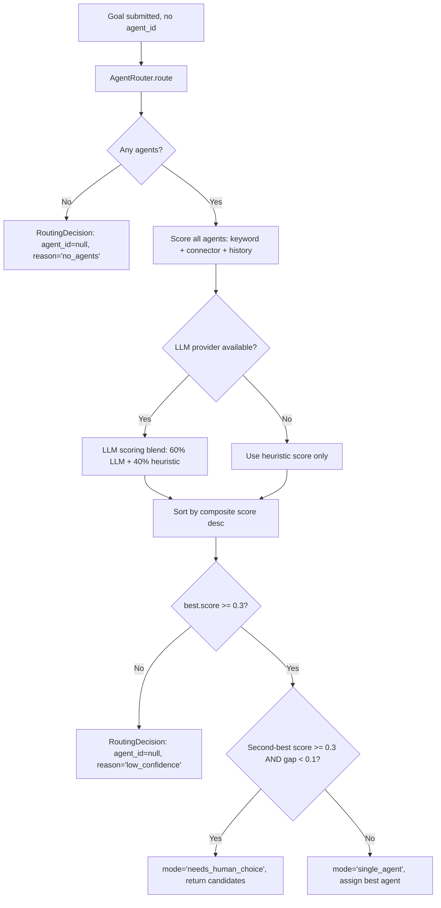

# Agents Overview

An **Agent** in AgentVerse is a persistent, reusable configuration object that defines *how* a class of goals should be executed. Where a Goal is a single ephemeral execution run, an Agent is the blueprint that governs every run spawned from it — including which tools it may call, which LLM tier backs each phase, how autonomously it acts, and what knowledge it may retrieve.

## The Agent Config Object

Every agent is stored as a flat record with the following fields. All fields are persisted to the `agents` Postgres table, enforced through Row-Level Security, and replicated into the in-memory `AgentStore` on startup.

| Field | Type | Default | Description |
|---|---|---|---|
| `agent_id` | `string` | auto (uuid hex) | Immutable primary key |
| `name` | `string` | required | Human-readable display name |
| `goal_template` | `string` | `""` | Default goal text submitted when `autorun=true`; also used as scoring signal during routing |
| `autonomy_mode` | `string` | `"bounded-autonomous"` | One of `supervised`, `bounded-autonomous`, `fully-autonomous` |
| `connector_ids` | `string[]` | `[]` | MCP connector IDs the agent is permitted to call |
| `system_prompt` | `string` | `""` | Additional system-level instructions prepended to every goal |
| `model_override` | `string` | `""` | Force a specific model instead of the tenant default (e.g. `claude-opus-4-8`) |
| `max_iterations` | `int` | `15` | Maximum plan-execute-verify cycles before the agent halts |
| `timeout_seconds` | `int` | `300` | Wall-clock deadline for the entire run |
| `allowed_collection_ids` | `string[]` | `[]` | Knowledge collections the agent may perform hybrid RAG queries against |
| `eval_suite_id` | `string\|null` | `null` | Release gate: required for `fully-autonomous` mode |
| `policy_ids` | `string[]` | `[]` | Governance policies evaluated before each tool call |
| `domain_context` | `string` | `"general"` | Compliance domain: `general`, `legal`, `healthcare`, `finance`, `education` |
| `domain_metadata` | `dict` | `{}` | Domain-specific identity (e.g. `bar_number` for `legal`) |
| `trigger_config` | `dict` | `{}` | Optional schedule trigger: `cron`, `interval`, or `event` |
| `cloned_from` | `string\|null` | `null` | Source agent ID if this agent was created via clone |
| `created_at` | `ISO 8601` | auto | Creation timestamp |

## Agent vs Goal

The distinction is critical and frequently misunderstood:

```
Agent:  Persistent config entity.  Lives until deleted.
        Has versions, credentials, policies, knowledge bindings.

Goal:   A single execution run against an agent.
        Ephemeral.  Created, executed, and completed/failed.
        Always references an agent_id (explicit or routed).
```

A single agent may execute thousands of goals over its lifetime. Metrics, costs, and evaluation results accumulate on the goals; the agent stores only its configuration. When you roll back an agent to a previous snapshot, you are restoring its configuration — not the results of past goals.

## Autonomy Modes

Autonomy mode is the single most important security control on an agent. It determines when the HITL (Human-in-the-Loop) gateway is invoked.

### `supervised`
Every step in the execution plan is paused and queued for human approval before the executor calls any tool. This is the safest mode: the agent never acts on its own. Use it for agents touching production infrastructure or sensitive data stores while you are still building trust.

### `bounded-autonomous`
The agent runs freely through most steps. The HITL gateway is invoked **only** when the step description contains high-risk keywords (e.g. `deploy`, `delete`, `prod`, `drop`, `rm -rf`, `truncate`). This is the recommended default for most production agents — fast for routine operations, guarded for destructive ones.

### `fully-autonomous`
The agent executes every step without pausing for human approval. This mode is gated behind an **eval suite release check**: an `eval_suite_id` must be attached to the agent before the API will accept `autonomy_mode: "fully-autonomous"`, and that suite must have a recorded passing run. NL-based creation (`POST /agents/create`) cannot directly produce a fully-autonomous agent; you must first create at `bounded-autonomous` or `supervised`, attach an eval suite, then upgrade via `PUT /agents/:id`.

## Agent Lifecycle

```mermaid
stateDiagram-v2
    [*] --> Created: POST /agents or POST /agents/create
    Created --> Configured: PUT /agents/:id (edit fields, attach connectors/knowledge)
    Configured --> Snapshot: POST /agents/:id/snapshot
    Snapshot --> Configured: POST /agents/:id/rollback/:snapshotId
    Configured --> Running: Goal submitted with agent_id (or auto-routed)
    Running --> Evaluated: Goal completes; EvalRunner scores it
    Evaluated --> Configured: Config unchanged — ready for next goal
    Evaluated --> Improved: SelfOptimizer proposes prompt update
    Improved --> Configured: Operator accepts updated config
    Configured --> Cloned: POST /agents/:id/clone
    Configured --> Deleted: DELETE /agents/:id (soft-delete, is_active=FALSE)
    Deleted --> [*]
```



## Auto-Routing: How Goals Find Agents

When a goal is submitted without an explicit `agent_id`, the `AgentRouter` (`app/agent/router.py`) scores every active agent for the tenant and selects the best fit.

### Scoring Algorithm

The router computes a **weighted composite score** for each candidate:

```
composite = (keyword_score × 0.40) + (connector_score × 0.40) + (history_score × 0.20)
```

**keyword_score** — Jaccard-style token overlap between the goal text and the agent's `name + goal_template`. Calculated as `|overlap| / max(|goal_tokens|, |agent_tokens|)`.

**connector_score** — Fraction of the agent's `connector_ids` that appear as substrings in the goal text. An agent with connectors `["github", "jira"]` scores 1.0 for a goal mentioning both services.

**history_score** — Average evaluation score from the last 30 days of that agent's goals, queried directly from the `evaluations` table:

```sql
SELECT AVG(average_score), COUNT(*)
FROM evaluations e
JOIN goals g ON e.goal_id = g.id
WHERE g.agent_id = :aid AND g.tenant_id = :tid
  AND e.created_at > NOW() - INTERVAL '30 days'
```

Falls back to 0.0 when no evaluation history exists.

### LLM Scoring Blend

When an LLM provider is available and more than one agent exists, the router additionally calls the LLM to classify the goal and score agents by domain match. The final score is blended:

```
final_score = (0.40 × heuristic_composite) + (0.60 × llm_score)
```

The LLM receives a concise agent summary list and returns `{best_agent_id, confidence, reasoning}`. This makes routing semantic rather than purely lexical.

### Routing Decision



A `RoutingDecision` always carries `confidence` (the winning score), `mode`, and `candidate_agents` for tie-break UI presentation.

## Model Routing: LLM Tier Selection

The `ModelRouter` (`app/agent/model_router.py`) selects the appropriate LLM model for each distinct role in the agent loop. This prevents over-spending on verification tasks while ensuring planning uses the most capable model.

### Task-to-Tier Mapping

| Task Type | Strategy | Anthropic Default | OpenAI Default | Groq Default |
|---|---|---|---|---|
| `planning` | Largest / best reasoning | `claude-opus-4-8` | `gpt-4o` | `llama-3.1-70b-versatile` |
| `execution` | Mid-tier, cost-balanced | `claude-sonnet-4-5` | `gpt-4o-mini` | `llama-3.1-8b-instant` |
| `verification` | Fastest / cheapest | `claude-haiku-3-5` | `gpt-4o-mini` | `llama-3.1-8b-instant` |
| `reflection` / `think` | Planning tier | `claude-opus-4-8` | `gpt-4o` | `llama-3.1-70b-versatile` |
| `classification` | Execution tier | `claude-sonnet-4-5` | `gpt-4o-mini` | `llama-3.1-8b-instant` |
| `embedding` | Dedicated embedding model | _(voyage via provider)_ | _(text-embedding-3)_ | _(n/a)_ |

### Per-Tenant Override

`get_router_for_tenant(tenant_cfg)` reads `provider` and `default_model` from the tenant's LLM config. If `default_model` is set, it replaces the `fallback_model` and fills any unset tiers. This means a tenant can pin a specific model without losing the tier-aware routing for tasks where a superior tier is configured.

## Core API Reference

```http
GET    /agents
POST   /agents
GET    /agents/{agent_id}
PUT    /agents/{agent_id}
DELETE /agents/{agent_id}
POST   /agents/create         # NL creation via MetaAgentPlanner
POST   /agents/{agent_id}/snapshot
GET    /agents/{agent_id}/versions
POST   /agents/{agent_id}/rollback/{snapshot_id}
GET    /agents/{agent_id}/export?format=openai|anthropic
POST   /agents/{agent_id}/clone
GET    /agents/{agent_id}/readiness
GET    /agents/{agent_id}/permissions
PUT    /agents/{agent_id}/permissions
POST   /agents/{agent_id}/knowledge/{knowledge_id}
DELETE /agents/{agent_id}/knowledge/{knowledge_id}
GET    /agents/{agent_id}/credentials
POST   /agents/{agent_id}/credentials
```

### List Agents

```http
GET /agents
X-API-Key: <tenant-api-key>
```

Response: array of agent objects ordered by `created_at DESC`. The `list_async` method queries Postgres directly (with RLS) and refreshes the in-memory cache.

### Create Agent (Manual)

```http
POST /agents
Content-Type: application/json
X-API-Key: <tenant-api-key>

{
  "name": "Jira Triage Agent",
  "goal_template": "Triage all open Jira tickets labelled 'bug' and add severity estimates",
  "autonomy_mode": "bounded-autonomous",
  "connector_ids": ["jira-mcp", "slack-mcp"],
  "max_iterations": 20,
  "system_prompt": "You are an expert software triage engineer."
}
```

Response `201 Created`:

```json
{
  "agent_id": "a3f1c2d4e5b6...",
  "name": "Jira Triage Agent",
  "autonomy_mode": "bounded-autonomous",
  "connector_ids": ["jira-mcp", "slack-mcp"],
  "goal_template": "Triage all open Jira tickets...",
  "created_at": "2026-06-29T10:30:00Z"
}
```
