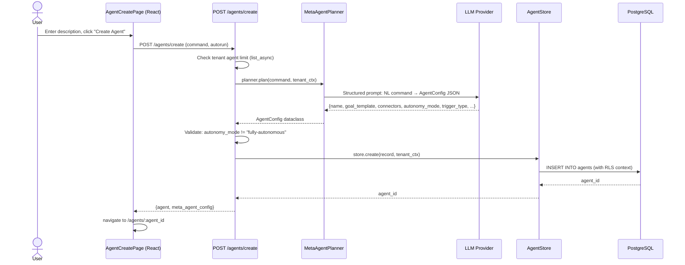
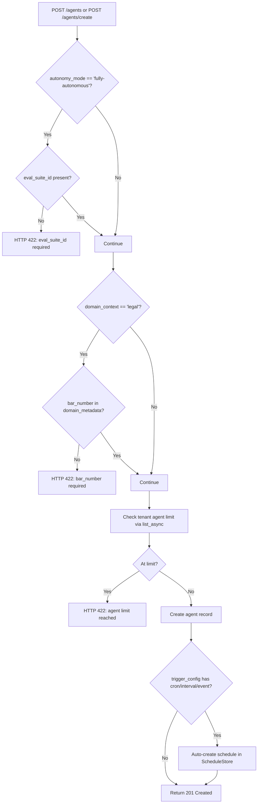

# Creating Agents

AgentVerse provides two creation paths: **AI Builder** (natural-language) and **Manual Configuration**. Both paths converge on the same agent record schema and the same persistence layer, but they differ in how the configuration is derived.

## Two Creation Modes

### AI Builder (Natural Language)

The AI Builder is the default tab on the Create Agent page. You describe the agent's purpose in plain English and the backend's `MetaAgentPlanner` translates that description into a full structured agent config.

Internally this calls `POST /agents/create` with a `MetaAgentCreateRequest`:

```json
{
  "command": "Create an agent that monitors GitHub issues labeled bug and creates JIRA tickets automatically",
  "autorun": false
}
```

### Manual Configuration

The Manual tab exposes every config field as a form control. This is the path to use when you need precise control over `max_iterations`, `system_prompt`, `connector_ids`, or domain-specific metadata. It calls `POST /agents` with a `CreateAgentRequest`.

```json
{
  "name": "GitHub → JIRA Bridge",
  "goal_template": "For each open GitHub issue labeled 'bug', create or update the corresponding JIRA ticket.",
  "autonomy_mode": "bounded-autonomous",
  "connector_ids": ["github-mcp", "jira-mcp"],
  "system_prompt": "You are an expert DevOps automation engineer.",
  "max_iterations": 20,
  "timeout_seconds": 600
}
```

## MetaAgentPlanner: NL → Config

The `MetaAgentPlanner` (`app/intelligence/meta_agent.py`) is an LLM-backed planner that converts a single natural-language command into a structured `AgentConfig` with all fields populated. It is wired onto `app.state.meta_agent` during application startup.

### How it Works



The response includes both the created `agent` record and a `meta_agent_config` object exposing the planner's reasoning — useful for debugging unexpected configurations:

```json
{
  "agent": {
    "agent_id": "b8e2f1a3...",
    "name": "GitHub Bug Triage",
    "autonomy_mode": "bounded-autonomous",
    "connector_ids": ["github-mcp", "jira-mcp"],
    "goal_template": "Monitor GitHub issues labeled 'bug'..."
  },
  "meta_agent_config": {
    "name": "GitHub Bug Triage",
    "goal_template": "Monitor GitHub issues...",
    "connectors": ["github-mcp", "jira-mcp"],
    "trigger_type": "event",
    "event_channel": "github.issue.labeled",
    "autonomy_mode": "bounded-autonomous",
    "policy_suggestions": ["no_delete_in_prod"]
  }
}
```

### NL Creation Restriction

NL-created agents are deliberately capped at `bounded-autonomous`. The API returns HTTP 422 if the planner outputs `fully-autonomous`:

```
"NL agent creation cannot directly produce fully-autonomous agents.
Create the agent first, attach an eval suite, and upgrade autonomy_mode via PUT."
```

This is a safety gate: fully-autonomous operation requires an attached eval suite with passing results. That cannot be established during initial NL creation.

## Complete Field Reference

### Required Fields

| Field | Type | Constraint |
|---|---|---|
| `name` | `string` | Non-empty. The agent's display name. |

### Frequently Used Optional Fields

| Field | Type | Default | Notes |
|---|---|---|---|
| `goal_template` | `string` | `""` | Max 5,000 chars. Used as the default goal text and as a routing signal. |
| `autonomy_mode` | `string` | `"bounded-autonomous"` | `supervised` \| `bounded-autonomous` \| `fully-autonomous` |
| `connector_ids` | `string[]` | `[]` | MCP connector IDs. Comma-separated in the UI. |
| `system_prompt` | `string` | `""` | Prepended to every goal's system context. |
| `model_override` | `string` | `""` | Force a specific LLM (e.g. `gpt-4o`, `claude-opus-4-8`). Empty = use `ModelRouter` defaults. |
| `max_iterations` | `int` | `15` | Plan-execute-verify cycles. UI clamps to 1–50. |
| `timeout_seconds` | `int` | `300` | Wall-clock deadline for a single goal run. |
| `allowed_collection_ids` | `string[]` | `[]` | Knowledge collections available for RAG during execution. |

### Advanced / Release-Gated Fields

| Field | Type | Default | Notes |
|---|---|---|---|
| `eval_suite_id` | `string\|null` | `null` | **Required** when `autonomy_mode = "fully-autonomous"`. |
| `policy_ids` | `string[]` | `[]` | Governance policy IDs evaluated before each tool call. |
| `trigger_config` | `dict` | `{}` | Auto-schedule on creation. Supports `cron`, `interval`, `event` trigger types. |
| `domain_context` | `string` | `"general"` | `legal` \| `healthcare` \| `finance` \| `education` \| `general` |
| `domain_metadata` | `dict` | `{}` | Domain-specific compliance fields. |

### Domain Metadata Rules

Specific `domain_context` values require corresponding fields in `domain_metadata`:

```python
# Legal agents require bar_number
@model_validator(mode="after")
def _validate_domain_metadata(self) -> CreateAgentRequest:
    if self.domain_context == "legal" and "bar_number" not in self.domain_metadata:
        raise ValueError("Legal agents require 'bar_number' in domain_metadata")
    return self
```

| Domain | Required metadata fields |
|---|---|
| `legal` | `bar_number`, `jurisdiction` |
| `healthcare` | `npi`, `specialty` |
| `finance` | `trader_id`, `desk` |
| `education` | `institution`, `faculty_type` |

## The `autorun` Flag

When `autorun: true` is passed to `POST /agents/create`, the backend immediately submits the agent's `goal_template` as a new goal upon creation. This means the agent executes its first run without any further API calls.

Use `autorun: true` when:
- The agent is event-driven and should start monitoring immediately
- You are creating agents programmatically in CI/CD and want an immediate health check
- The `goal_template` is a complete, self-contained instruction with no runtime variables

**Do not** use `autorun: true` if the `goal_template` contains unresolved placeholders or if the connectors are not yet authenticated — the goal will fail immediately.

## Validation Rules Summary



## Complete API Examples

### AI Builder Example — Jira Triage Agent

```bash
curl -X POST https://api.agentverse.dev/agents/create \
  -H "X-API-Key: $AGENTVERSE_KEY" \
  -H "Content-Type: application/json" \
  -d '{
    "command": "Create a Jira triage agent that monitors the backlog daily, labels tickets by severity (P0-P3), and posts a summary to the #eng-triage Slack channel",
    "autorun": false
  }'
```

The planner will infer: name, goal_template, `connector_ids: ["jira-mcp", "slack-mcp"]`, trigger type (probably `cron` with a daily schedule), and `autonomy_mode: "bounded-autonomous"`.

### AI Builder Example — GitHub PR Reviewer

```bash
curl -X POST https://api.agentverse.dev/agents/create \
  -H "X-API-Key: $AGENTVERSE_KEY" \
  -H "Content-Type: application/json" \
  -d '{
    "command": "Build a GitHub PR reviewer that checks for missing tests, security vulnerabilities, and style issues, then posts a structured review comment",
    "autorun": false
  }'
```

### Manual Config Example — Fully Autonomous Data Pipeline

```bash
# Step 1: Create at bounded-autonomous
curl -X POST https://api.agentverse.dev/agents \
  -H "X-API-Key: $AGENTVERSE_KEY" \
  -H "Content-Type: application/json" \
  -d '{
    "name": "ETL Pipeline Agent",
    "goal_template": "Execute the nightly ETL pipeline: extract from S3, transform, load into Redshift, validate row counts.",
    "autonomy_mode": "bounded-autonomous",
    "connector_ids": ["aws-s3-mcp", "redshift-mcp"],
    "max_iterations": 30,
    "timeout_seconds": 1800,
    "eval_suite_id": null
  }'

# Step 2: Attach eval suite after it passes staging runs
curl -X PUT https://api.agentverse.dev/agents/$AGENT_ID \
  -H "X-API-Key: $AGENTVERSE_KEY" \
  -H "Content-Type: application/json" \
  -d '{
    "autonomy_mode": "fully-autonomous",
    "eval_suite_id": "suite_abc123"
  }'
```

### Trigger-Based Agent (cron schedule auto-created)

```bash
curl -X POST https://api.agentverse.dev/agents \
  -H "X-API-Key: $AGENTVERSE_KEY" \
  -H "Content-Type: application/json" \
  -d '{
    "name": "Daily Report Generator",
    "goal_template": "Generate the daily executive summary from analytics data and email to stakeholders.",
    "autonomy_mode": "bounded-autonomous",
    "connector_ids": ["analytics-mcp", "email-mcp"],
    "trigger_config": {
      "trigger_type": "cron",
      "cron_expression": "0 8 * * 1-5"
    }
  }'
```

When `trigger_config` includes a `trigger_type` of `cron`, `interval`, or `event`, the API automatically creates a corresponding schedule in `ScheduleStore` — no separate schedule creation call is needed.
