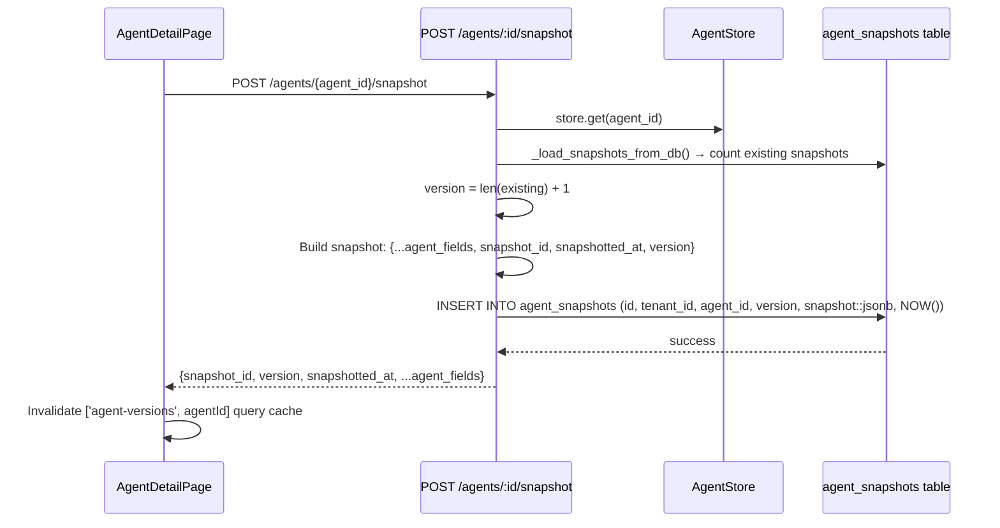

# Agent Detail Page

The Agent Detail Page (`/agents/:agentId`) is the primary management interface for a single agent. It consists of a persistent header with global actions and six tabs, each surfacing a distinct aspect of the agent's lifecycle.

## Header Actions

The header renders the agent's name, UUID, and autonomy mode, alongside five action buttons that are always accessible regardless of which tab is active:

| Button | Action | API |
|---|---|---|
| **Check Readiness** | Runs the rollout gate checks inline | `GET /agents/:id/readiness` |
| **Clone** | Creates an identical copy of this agent | `POST /agents/:id/clone` |
| **Edit / Cancel** | Toggles the inline edit form | — |
| **Health Radar** | Navigates to the 6-axis radar chart | `/agents/:id/radar` |
| **Personality** | Navigates to the slider-based config page | `/agents/:id/personality` |

The **Test Agent** panel (always visible below the header) accepts a free-text goal and submits it with `dry_run: true`. The backend executes the planning phase and returns the goal ID and initial plan structure without running any tools — useful for verifying that the agent's `goal_template` and `system_prompt` produce reasonable plans.

```typescript
// From AgentDetailPage.tsx
const data = await goalsApi.submit({
  goal: testGoal,
  agent_id: agentId,
  dry_run: true
});
// Returns: goal_id + plan or execution_context
```

## Tab 1 — Overview

The Overview tab provides a high-level config summary and the primary operational actions.

**Config summary cards:**
- `Status` — current agent status (default: `active`)
- `Created` — formatted `created_at` timestamp
- `Default Model` — `model_override` if set, otherwise `—`

**Connector IDs panel:** Renders each connector ID as a labelled chip. Only visible when `connector_ids.length > 0`.

**Actions panel:**
- **Take Snapshot** — calls `POST /agents/:id/snapshot` and displays the returned `snapshot_id` inline for 4 seconds
- **Export (OpenAI)** — calls `GET /agents/:id/export?format=openai` and triggers a browser download of `agent-{id}-openai.json`
- **Export (Anthropic)** — calls `GET /agents/:id/export?format=anthropic` and triggers a download of `agent-{id}-anthropic.json`

**Recent Goals panel:** Fetches all goals, filters client-side by `agent_id`, and displays the last 5 with status badges.

**Inline Edit form:** Activated by the **Edit** button in the header. Exposes `name`, `autonomy_mode`, and `goal_template` as editable inputs. Saves via `PUT /agents/:id`.

## Tab 2 — Versions

The Versions tab lists all saved snapshots of the agent's configuration, ordered by version number ascending (oldest first).

### Snapshot Algorithm

A snapshot captures the agent's entire configuration at a point in time. The algorithm in `app/api/agents.py`:



**What is stored:** The full agent config dict merged with three additional fields:

```json
{
  "snapshot_id": "e3a1b2c4...",
  "snapshotted_at": "2026-06-29T12:00:00Z",
  "version": 3,
  "name": "...",
  "goal_template": "...",
  "autonomy_mode": "bounded-autonomous",
  "connector_ids": ["..."],
  "system_prompt": "...",
  "model_override": "",
  "max_iterations": 15,
  "allowed_collection_ids": [],
  "eval_suite_id": null,
  "policy_ids": []
}
```

The `agent_snapshots` table stores the full JSON blob in a `jsonb` column alongside scalar columns for indexing (`tenant_id`, `agent_id`, `version`). RLS is applied via `sqlalchemy_rls_context` before every insert and select, ensuring cross-tenant isolation.

### Rollback

Each row in the Versions tab has a **Rollback** button. This calls `POST /agents/:id/rollback/:snapshotId` which:

1. Loads all snapshots from DB and finds the target by `snapshot_id`
2. Extracts `restore_data` — all fields except the snapshot metadata (`snapshot_id`, `snapshotted_at`, `version`, `agent_id`, `tenant_id`)
3. Calls `store.update_async()` which both updates the in-memory cache and executes an `UPDATE agents SET ... WHERE id = :id AND tenant_id = :tid` with RLS context
4. Returns `{agent_id, restored_from, status: "rolled_back"}`

```bash
curl -X POST https://api.agentverse.dev/agents/$AGENT_ID/rollback/$SNAPSHOT_ID \
  -H "X-API-Key: $AGENTVERSE_KEY"
# Response:
# {"agent_id": "...", "restored_from": "e3a1b2c4...", "status": "rolled_back"}
```

Rollback is non-destructive: it does **not** delete newer snapshots. After a rollback you can take a new snapshot and roll forward again.

## Tab 3 — Credentials

The Credentials tab (`CredentialsTab` component) manages API keys scoped to this specific agent. These credentials are different from the tenant-level API key — they carry explicit scopes and can be revoked independently.

**Issue a credential:**

```bash
curl -X POST https://api.agentverse.dev/agents/$AGENT_ID/credentials \
  -H "X-API-Key: $AGENTVERSE_KEY" \
  -H "Content-Type: application/json" \
  -d '{
    "key_type": "api_key",
    "scopes": ["goals:read", "goals:write"]
  }'
```

**Revoke a credential:**

```bash
curl -X DELETE https://api.agentverse.dev/agents/$AGENT_ID/credentials/$CRED_ID \
  -H "X-API-Key: $AGENTVERSE_KEY"
```

The full-featured credential manager (JWT, mTLS, expiry, domain identity) is on the dedicated Identity page at `/agents/:id/identity`. The Credentials tab provides a lighter in-context view for quick issuance/revocation without leaving the agent detail workflow.

## Tab 4 — Permissions

The Permissions tab displays the agent's RBAC permissions, fetched from `GET /agents/:id/permissions`. Permissions are stored in the `agent_permissions` table with `tool_name`, `level` (allow/deny), `daily_limit`, `per_goal_limit`, and `scope_pattern` columns.

The UI renders two columns: **Read scopes** and **Write scopes**, derived from the permissions array:

```json
{
  "agent_id": "...",
  "permissions": [
    {"tool_name": "jira.create_issue", "level": "allow", "per_goal_limit": 50},
    {"tool_name": "jira.delete_issue", "level": "deny"},
    {"tool_name": "slack.post_message", "level": "allow", "daily_limit": 100}
  ]
}
```

Update via `PUT /agents/:id/permissions`. Both list format (new) and dict format (legacy `{"tool": "level"}`) are accepted.

## Tab 5 — Knowledge

The Knowledge tab lists all available knowledge collections for the tenant and lets you assign or remove them from this agent's `allowed_collection_ids`.

- **Assign** calls `POST /agents/:id/knowledge/:knowledge_id` (204 No Content) — appends the collection ID to the agent's list
- **Remove** calls `DELETE /agents/:id/knowledge/:knowledge_id` (204 No Content) — filters it out
- Bulk update: `PUT /agents/:id/knowledge` with `{collection_ids: [...]}` replaces the entire list

Collections must exist in the `KnowledgeStore` before they can be assigned. Creating a collection is done from the Knowledge feature (`/knowledge`).

## Tab 6 — Rollout Gate

The Rollout Gate controls traffic steering for this agent version. It surfaces the data from `GET /agents/:id/rollout` — a per-agent canary/progressive delivery mechanism.

```json
{
  "gate_status": "passing",
  "traffic_pct": 25,
  "conditions": [
    "connector_health: jira-mcp healthy",
    "eval_pass_rate: 92% (threshold: 80%)",
    "credential_valid: true"
  ]
}
```

`gate_status` maps to a `StatusBadge` component with semantic colors. `traffic_pct` shows what percentage of new goals are routed to this agent version vs. the previous stable version. `conditions` lists individual readiness checks.

### Readiness Widget

The **Check Readiness** button in the header calls `GET /agents/:id/readiness` and renders an inline widget below the header card:

```json
{
  "ready": true,
  "checks": [
    {"status": "pass", "message": "All connectors reachable"},
    {"status": "pass", "message": "Eval suite: last run 2h ago, score 0.94"},
    {"status": "fail", "message": "Credential expires in 2 days — renew soon"}
  ]
}
```

A green dot + "Production Ready" or red dot + "Not Ready" summarises the aggregate, with individual check lines below.

## Export Formats

`GET /agents/:id/export?format=<format>` translates the agent config into a provider-native format. The backend also discovers tool definitions from the MCP client and includes them in the export.

### OpenAI Assistants Format

```json
{
  "object": "assistant",
  "name": "Jira Triage Agent",
  "instructions": "You are an expert software triage engineer. Triage all open Jira tickets...",
  "model": "gpt-4o",
  "tools": [
    {
      "type": "function",
      "function": {
        "name": "jira.list_issues",
        "description": "List Jira issues with optional filters",
        "parameters": { "type": "object", "properties": {...} }
      }
    }
  ]
}
```

### Anthropic System Prompt Format

```json
{
  "system": "You are an expert software triage engineer. Triage all open Jira tickets...",
  "model": "claude-opus-4-5",
  "max_tokens": 8096,
  "tools": [
    {
      "name": "jira.list_issues",
      "description": "List Jira issues with optional filters",
      "input_schema": { "type": "object", "properties": {...} }
    }
  ]
}
```

The export is downloaded as a JSON file named `agent-{agent_id}-{format}.json`. The tool list is capped at 20 tools (the first 20 discovered from the tenant's MCP connectors).

## Full API Reference

```http
# Core CRUD
GET    /agents/{agent_id}                    # Fetch agent (DB-backed, refreshes cache)
PUT    /agents/{agent_id}                    # Partial update (non-null fields only)
DELETE /agents/{agent_id}                    # Soft-delete (is_active=FALSE) + purge schedules

# Versioning
POST   /agents/{agent_id}/snapshot           # Capture current config as a version snapshot
GET    /agents/{agent_id}/versions           # List all snapshots ordered by version ASC
POST   /agents/{agent_id}/rollback/{id}      # Restore config from a named snapshot

# Export & Clone
GET    /agents/{agent_id}/export?format=     # openai | anthropic
POST   /agents/{agent_id}/clone              # {name?: string} → new agent with cloned_from set

# Permissions
GET    /agents/{agent_id}/permissions        # Read from agent_permissions table (with RLS)
PUT    /agents/{agent_id}/permissions        # Replace all permissions (list or dict format)

# Knowledge
POST   /agents/{agent_id}/knowledge/{kid}    # Append knowledge collection (204)
DELETE /agents/{agent_id}/knowledge/{kid}    # Remove knowledge collection (204)
PUT    /agents/{agent_id}/knowledge          # Bulk replace allowed_collection_ids

# Identity & Credentials
GET    /agents/{agent_id}/credentials        # List (public keys only — private never returned)
POST   /agents/{agent_id}/credentials        # Issue new credential
DELETE /agents/{agent_id}/credentials/{kid}  # Revoke immediately
GET    /agents/{agent_id}/token              # Fetch a short-lived JWT for the agent

# Health
GET    /agents/{agent_id}/readiness          # Aggregate readiness check result
GET    /agents/{agent_id}/rollout            # Rollout gate state + traffic percentage
```

### PUT /agents/:id — Partial Update

All fields are optional. Only non-null values are written. The endpoint also enforces the eval suite gate when switching to `fully-autonomous`:

```bash
curl -X PUT https://api.agentverse.dev/agents/$AGENT_ID \
  -H "X-API-Key: $AGENTVERSE_KEY" \
  -H "Content-Type: application/json" \
  -d '{
    "goal_template": "Updated triage instructions with P0 escalation path",
    "max_iterations": 25
  }'
```

### DELETE /agents/:id

Soft-delete: sets `is_active = FALSE` in Postgres (the record remains for audit purposes) and purges all associated schedules from `ScheduleStore`. The in-memory cache is also evicted. Returns `204 No Content`.
