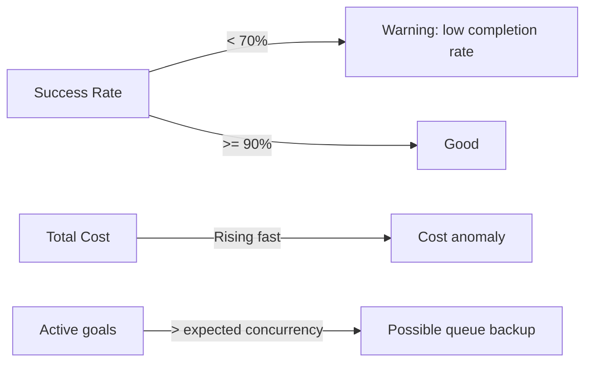
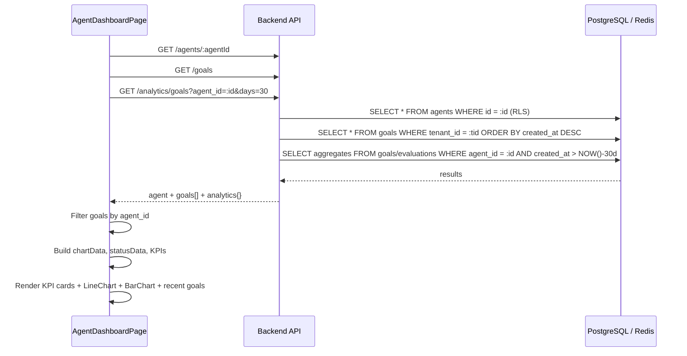

# Agent Dashboard

The Agent Dashboard (`/agents/:agentId/dashboard`) is a per-agent performance view. It aggregates goal execution history, success metrics, and cost data into a focused operational console for monitoring a single agent over time.

## Navigation

The dashboard is accessible from the Agent Detail page by navigating directly to `/agents/:agentId/dashboard`. There is no tab link inside the Detail page — it is a separate route. The page header includes a **Back to Agent** button that returns to `/agents/:agentId`.

## Data Sources

The dashboard makes three concurrent API calls on mount:

| Query | Endpoint | Purpose |
|---|---|---|
| `agent` | `GET /agents/:agentId` | Agent name and config |
| `goals` | `GET /goals` (filtered client-side) | All goals attributed to this agent |
| `analytics` | `GET /analytics/goals?agent_id=:agentId&days=30` | Platform-level aggregated analytics |

The goals query fetches all tenant goals and filters by `g.agent_id === agentId` in the browser. This is intentional for the current version — it avoids adding a server-side filter endpoint while keeping the payload manageable at typical tenant goal volumes (< 10,000). The `analytics` query hits the dedicated analytics endpoint which performs aggregations in Postgres.

## KPI Cards

Four summary cards sit at the top of the dashboard in a responsive 2×2 / 1×4 grid:

```
┌─────────────────┬─────────────────┬─────────────────┬─────────────────┐
│  Total Goals    │  Success Rate   │  Total Cost     │  Active         │
│  147            │  91.8%          │  $0.0423        │  2              │
└─────────────────┴─────────────────┴─────────────────┴─────────────────┘
```

**Total Goals** — `goals.length`. Counts every goal ever attributed to this agent, regardless of status.

**Success Rate** — `(completeCount / totalGoals) × 100`, formatted to one decimal place. Displayed as `—` when no goals exist.

**Total Cost** — Sum of `goal.cost_usd` across all goals. The `cost_usd` field is populated by the `CostTracker` subsystem after each goal completes. Displayed with 4 decimal places (costs can be fractions of a cent).

**Active** — Count of goals currently in `executing` status. This is a point-in-time snapshot of the filtered goals list; it is not a live SSE stream on this page.

## Charts

Two Recharts visualisations sit side-by-side in a 2-column grid below the KPI cards.

### Goals Over Time (LineChart)

A dual-line chart showing the last 14 days of goal activity.

```
Goals over time (last 14 days)
│
20│              ╭───╮
15│         ╭───╯   ╰───╮
10│    ╭───╯             ╰───
 5│───╯
 0│────────────────────────────
   06-16  06-20  06-24  06-28

   ── Total Goals (blue)   ── Successes (green)
```

**Data construction:** Goals are bucketed by the first 10 characters of `created_at` (the date portion). Each bucket accumulates `goals++` and `success++` (when `status === "complete"`). The last 14 buckets are sliced and sorted chronologically.

```typescript
// From AgentDashboardPage.tsx
const byDay: Record<string, { date: string; goals: number; success: number }> = {};
goals?.forEach((g) => {
  const d = g.created_at ? g.created_at.slice(0, 10) : 'unknown';
  if (!byDay[d]) byDay[d] = { date: d, goals: 0, success: 0 };
  byDay[d].goals++;
  if (g.status === 'complete') byDay[d].success++;
});
const chartData = Object.values(byDay).slice(-14).sort((a, b) => a.date.localeCompare(b.date));
```

**Recharts configuration:**
- `LineChart` with `CartesianGrid strokeDasharray="3 3"`
- X-axis: `date` key, ticks formatted to `MM-DD` (`.slice(5)`)
- Two `Line` series: `goals` (stroke `#3b82f6`) and `success` (stroke `#22c55e`), both `dot={false}` for clean rendering at high data density
- `ResponsiveContainer width="100%" height={200}`

### Goals by Status (BarChart)

A single-series bar chart showing goal count broken down by terminal status (`complete`, `failed`, `cancelled`, etc.).

```
Goals by status
│
50│  ██
40│  ██
30│  ██    ██
20│  ██    ██
10│  ██    ██    ██
 0│──────────────────
   complete failed cancelled
```

**Data construction:**

```typescript
const statusData = Object.entries(
  goals.reduce<Record<string, number>>((acc, g) => {
    acc[g.status] = (acc[g.status] ?? 0) + 1;
    return acc;
  }, {})
).map(([status, count]) => ({ status, count }));
```

**Recharts configuration:**
- `BarChart` with `CartesianGrid`
- Single `Bar dataKey="count"` in indigo (`#6366f1`), `radius={[4, 4, 0, 0]}` for rounded top corners

## Platform Analytics Panel

When `GET /analytics/goals?agent_id=:agentId&days=30` returns data, a third panel renders key-value pairs from the analytics response. Up to 8 fields are displayed in a 2×4 grid. Typical fields returned by the analytics endpoint include:

| Key | Description |
|---|---|
| `total_goals` | Total goals in the period |
| `avg_duration_s` | Average execution duration in seconds |
| `avg_cost_usd` | Mean cost per goal |
| `p95_latency_s` | 95th percentile latency |
| `tool_calls_total` | Total MCP tool invocations |
| `eval_avg_score` | Mean evaluation score across all scored goals |
| `token_usage_total` | Total LLM tokens consumed |
| `error_rate` | Fraction of goals that ended in `failed` or `error` |

Field keys are displayed with underscores replaced by spaces and capitalised via CSS `capitalize`.

## Recent Goals Table

The bottom of the page shows the 10 most recent goals attributed to this agent. Each row shows the goal text (truncated with ellipsis) and a colour-coded status badge:

| Status | Badge color |
|---|---|
| `complete` | Green (`bg-green-100 text-green-700`) |
| `failed` | Red (`bg-red-100 text-red-700`) |
| All others | Blue (`bg-blue-100 text-blue-700`) |

## Agent Health Indicators

The dashboard does not currently render a separate "health" section — health is available on the dedicated Health Radar page (`/agents/:id/radar`). The KPI cards serve as the primary health indicators:



An operator monitoring an agent should watch:
- **Success Rate** trending below 80% — usually indicates tool failures or prompt degradation
- **Total Cost** spiking — may indicate runaway iterations or inefficient tool calls
- **Active count** unexpectedly high — may indicate the agent is stalling in an iteration loop

## Skeleton Loading States

Both charts and the KPIs use loading skeletons from the shared `Skeleton` component during the initial data fetch. The page renders the agent name / header immediately (from the `agent` query) and fills in the metrics once `goals` and `analytics` resolve — avoiding a full-page blank flash.

## API Calls Summary



## Accessing the Dashboard Programmatically

The underlying data is available directly via the API for building custom dashboards or feeding into external monitoring tools:

```bash
# Fetch all goals for an agent (last 100)
curl "https://api.agentverse.dev/goals?limit=100" \
  -H "X-API-Key: $KEY" | jq '[.goals[] | select(.agent_id == "$AGENT_ID")]'

# Fetch 30-day analytics
curl "https://api.agentverse.dev/analytics/goals?agent_id=$AGENT_ID&days=30" \
  -H "X-API-Key: $KEY"
```
