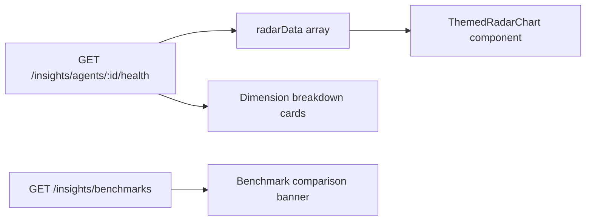
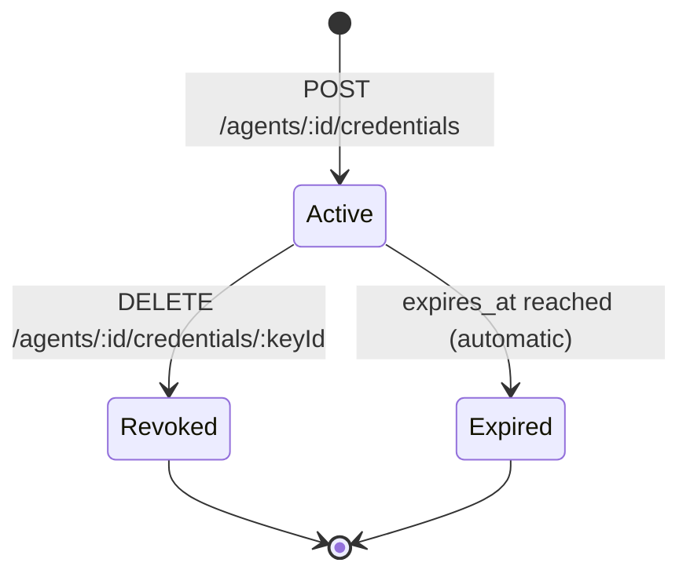

# Agent Personality, Radar, and Identity

This document covers three companion pages that live alongside the main Agent Detail view:

- **AgentPersonalityPage** (`/agents/:id/personality`) — slider-based configuration
- **AgentRadarPage** (`/agents/:id/radar`) — 6-axis health radar chart
- **AgentIdentityPage** (`/agents/:id/identity`) — cryptographic credential management

All three are reachable from the header action buttons on the Agent Detail page.

---

## Agent Personality

### What "Personality" Means

In AgentVerse, "personality" is a UX abstraction that maps four conceptual sliders to concrete agent config fields. Rather than requiring the operator to understand the relationship between `autonomy_mode`, `max_iterations`, and `model_override`, the Personality page surfaces these as intuitive axes that can be tuned visually.

```
Autonomy:    Supervised ←────────────────────→ Fully Autonomous
Thoroughness: Fast ←──────────────────────────→ Thorough
Strategy:    Deterministic ←──────────────────→ Creative
Quality/Cost: Cost-Optimized ←────────────────→ Quality-First
```

Every change to a slider immediately re-renders a **Generated Config** preview so the operator can see the real backend values before saving.

### The Four Sliders

| Slider | ID | Range | Step | Mapped Config Field |
|---|---|---|---|---|
| Autonomy | `autonomy` | 0–100 | 25 | `autonomy_mode` |
| Thoroughness | `thoroughness` | 0–100 | 10 | `max_iterations` |
| Strategy | `creativity` | 0–100 | 10 | _(conceptual: model temperature)_ |
| Quality vs Cost | `cost` | 0–100 | 25 | `model_override` |

### Slider → Config Mapping

The `sliderValuesToConfig()` function performs the translation:

```typescript
function sliderValuesToConfig(values: Record<string, number>) {
  // Autonomy → autonomy_mode
  const autonomyMode =
    values.autonomy >= 75 ? "fully-autonomous" :
    values.autonomy >= 50 ? "bounded-autonomous" :
    values.autonomy >= 25 ? "supervised" : "manual";

  // Thoroughness → max_iterations (range: 5–20)
  const maxIterations = Math.round(5 + (values.thoroughness / 100) * 15);

  // Cost → model_override
  const model =
    values.cost >= 75 ? "claude-opus-4" :
    values.cost >= 50 ? "claude-sonnet-4-5" :
    "claude-haiku-3-5";

  return { autonomy_mode: autonomyMode, max_iterations: maxIterations, model_override: model };
}
```

**Threshold table for Autonomy:**

| Slider value | `autonomy_mode` |
|---|---|
| 0–24 | `manual` |
| 25–49 | `supervised` |
| 50–74 | `bounded-autonomous` |
| 75–100 | `fully-autonomous` |

**Iteration budget for Thoroughness:**

| Slider value | `max_iterations` |
|---|---|
| 0 | 5 (fastest, most frugal) |
| 50 | 12–13 |
| 100 | 20 (most thorough) |

**Model for Quality/Cost:**

| Slider value | `model_override` |
|---|---|
| 0–49 | `claude-haiku-3-5` (cheapest, fastest) |
| 50–74 | `claude-sonnet-4-5` (balanced) |
| 75–100 | `claude-opus-4` (highest quality) |

### Config → Slider Hydration

When the page loads, `configToSliderValues()` reads the saved agent config and back-calculates slider positions. This ensures the UI reflects the current state of the agent:

```typescript
function configToSliderValues(agent) {
  const modeMap = {
    "fully-autonomous": 100, "bounded-autonomous": 50,
    "supervised": 25, "manual": 0,
  };
  const autonomy = modeMap[agent.autonomy_mode] ?? 50;
  const thoroughness = Math.round(((agent.max_iterations - 5) / 15) * 100);
  const costMap = {
    "claude-opus-4": 100, "claude-sonnet-4-5": 50, "claude-haiku-3-5": 25,
  };
  const cost = costMap[agent.model_override] ?? 50;
  return { autonomy, thoroughness, creativity: 50, cost };
}
```

Note that `creativity` always initialises to 50 — it is not currently persisted to any backend field. Future versions will wire it to a `temperature` parameter.

### Saving

**Save** calls `PUT /agents/:id` with the three fields derived from the sliders:

```bash
curl -X PUT https://api.agentverse.dev/agents/$AGENT_ID \
  -H "X-API-Key: $KEY" \
  -H "Content-Type: application/json" \
  -d '{
    "autonomy_mode": "bounded-autonomous",
    "max_iterations": 13,
    "model_override": "claude-sonnet-4-5"
  }'
```

The response invalidates the `["agent", agentId]` TanStack Query cache, so the Agent Detail page will reflect the new values on next load.

---

## Agent Health Radar

### What the Radar Visualises

The Health Radar (`/agents/:id/radar`) renders a hexagonal spider chart with one spoke per performance dimension. It answers: *"In which areas is this agent performing well, and where does it need attention?"*

The six dimensions are:

| Key | Label | Meaning |
|---|---|---|
| `speed` | Speed | How quickly goals execute relative to the iteration budget. A high score means the agent completes goals well under `max_iterations`. |
| `accuracy` | Accuracy | Average task completion score from `EvalRunner` evaluation results. |
| `cost_efficiency` | Cost Eff. | LLM spend per goal compared to a baseline. Higher score = leaner execution. |
| `tool_coverage` | Tool Coverage | Breadth of distinct tools called effectively across recent goals. Rewards agents that utilise their full connector repertoire. |
| `success_rate` | Success Rate | Fraction of goals ending in `complete` status. |
| `coherence` | Coherence | LLM-assessed logical coherence of the agent's execution plans. Derived from planner output scoring. |

All dimension values are normalised to [0, 1] before rendering.

### Data Source

The radar reads from two endpoints:

```typescript
// Agent health data (6-axis scores)
insightsApi.getAgentHealth(agentId)
// → GET /insights/agents/:agentId/health
// Returns: { health: {speed, accuracy, cost_efficiency, ...}, sample_size: 42 }

// Platform benchmarks (for comparison)
insightsApi.getBenchmarks()
// → GET /insights/benchmarks
// Returns: { platform_avg_success_rate: 0.74, ... }
// staleTime: 10 minutes (benchmark data changes slowly)
```

The `sample_size` field drives the benchmark comparison callout: when fewer than a threshold of samples exist, the UI displays "Insufficient data" instead of a percentage comparison.

### Benchmark Comparison Banner

A contextual banner above the radar compares this agent's `success_rate` against the platform average:

```
▲ Above platform average
  Your success rate: 91% · Platform avg: 74% · Based on 42 runs

vs.

▼ Below platform average
  Your success rate: 61% · Platform avg: 74% · Based on 8 runs
```

Green banner when `success_rate > platform_avg_success_rate`, amber when below.

### Overall Health Score

The overall health percentage shown in the top-right corner is the simple arithmetic mean of all six dimension scores:

```typescript
const avgScore = Object.values(health.health).reduce((a, b) => a + b, 0)
               / Object.keys(health.health).length;
// Displayed as Math.round(avgScore * 100) + "%"
```

### Dimension Cards

Below the radar, six cards break down each dimension individually:

- A progress bar styled in green (≥80%), amber (≥60%), or red (<60%)
- A one-sentence description of what the dimension measures
- The numeric percentage value



### ThemedRadarChart

The chart is rendered by the shared `ThemedRadarChart` component from `@/components/charts`. It accepts:

```typescript
<ThemedRadarChart
  data={radarData}   // [{metric: string, value: 0-1, fullMark: 1}]
  height={280}
  label="Score"
/>
```

The component adapts to light/dark mode via CSS custom properties, matching the application theme.

---

## Agent Identity

The Agent Identity page (`/agents/:id/identity`) is the full credential management interface. Where the Credentials tab on the Detail page provides quick in-context access, the Identity page provides complete lifecycle management with JWT decode, expiry countdown, private key one-time display, and domain identity configuration.

### Credential Types

Three key types are supported:

| Type | Use Case |
|---|---|
| `jwt` | Short-lived signed tokens for service-to-service calls |
| `api_key` | Long-lived opaque key for automation/CI use |
| `mtls` | Mutual TLS certificate for high-assurance environments |

### Available Scopes

```
goals:read       goals:write      goals:cancel
agents:read      agents:write     agents:delete
knowledge:read   knowledge:write
connectors:read  connectors:write
governance:read  governance:write
analytics:read
```

Scopes are granted at issuance time and cannot be expanded post-issuance — revoke and re-issue to change scope.

### Issuing a Credential

The **Issue Credential** modal collects:
- **Key type**: JWT, API Key, or mTLS
- **Scopes**: multi-select from the full scope list
- **Expiry**: 1d, 7d, 30d, 90d, or Never
- **Description**: optional free-text label for the credential

```bash
curl -X POST https://api.agentverse.dev/agents/$AGENT_ID/credentials \
  -H "X-API-Key: $KEY" \
  -H "Content-Type: application/json" \
  -d '{
    "key_type": "jwt",
    "scopes": ["goals:read", "goals:write", "knowledge:read"],
    "expires_in_days": 30,
    "description": "CI/CD pipeline credential"
  }'
```

**One-time private key disclosure:** For JWT and mTLS credentials, the response includes a `private_key` that is shown exactly once — immediately after issuance — in a dismissible yellow warning panel. The backend never returns the private key again. The UI displays a `Copy` button and requires an explicit "I've saved it — dismiss" acknowledgement.

### JWT Preview

The **JWT Preview** panel allows the operator to fetch a live short-lived JWT for the agent and inspect its decoded claims:

```typescript
// GET /agents/:id/token
const result = await credentialsApi.getToken(agentId);
// → { token: "eyJ..." }
// Claims decoded client-side via base64url decode of the middle segment
```

A `requestAnimationFrame` countdown timer shows the remaining validity of the current token in `Xm Ys` format, updating every frame until the token expires.

### Domain Identity

The Domain Identity section handles compliance-specific identity attestations. Selecting a domain context reveals domain-specific form fields:

| Domain | Fields |
|---|---|
| Legal | Bar Number, Jurisdiction |
| Healthcare | NPI Number, Specialty |
| Finance | Trader ID, Desk |
| Education | Institution, Faculty Type |

These fields correspond to the `domain_metadata` object on the agent record and are used by the compliance subsystem (`app/enterprise/compliance.py`) to verify that agents acting in regulated domains carry the required identity attributes.

### Credential Card UI

Each issued credential renders as a card with:
- Truncated `key_id` (first 8 chars + last 4) with a **Copy** button
- Type badge (JWT / API_KEY / MTLS) and status badge (active / revoked)
- Scope chips in monospace font
- Expiry countdown and last-used timestamp
- **Revoke** button (trash icon, triggers a `ConfirmModal` before executing)

Revocation is immediate and propagated across all replicas via the credentials store. Any service presenting a revoked credential receives `HTTP 401`.

### Credential Lifecycle



There is no "suspend" state — credentials are either active, revoked, or expired. Expiry is enforced at validation time by comparing `expires_at` against the current UTC timestamp; there is no background job that flips a status flag.
