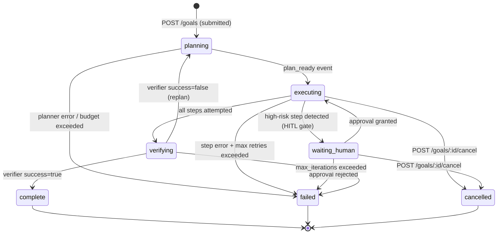
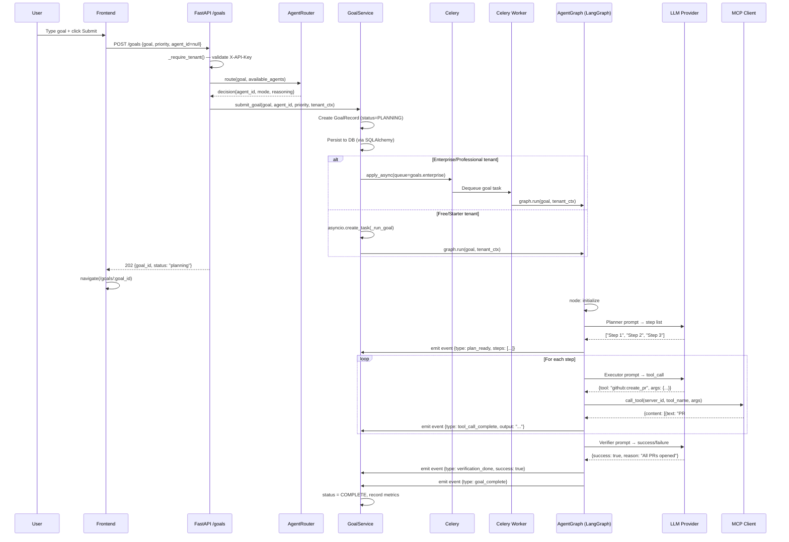
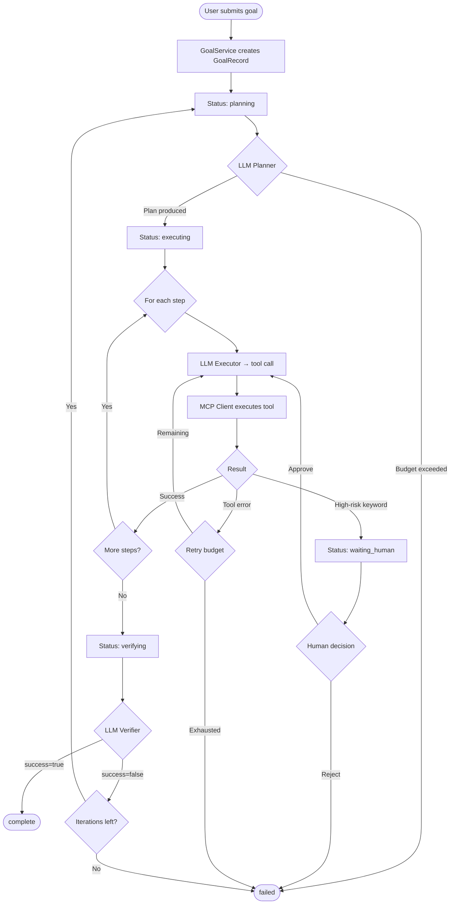

# Goals Overview

## What Is a "Goal" in AgentVerse?

A **Goal** is the fundamental unit of work in AgentVerse. It is a natural-language task description that an autonomous agent accepts, decomposes into a plan, executes via real-world tools (via MCP), verifies for correctness, and either completes or replans on failure — with zero hardcoded workflow logic.

When you write:

```
"Fix all JIRA bugs labelled prod-down and open a pull request for each fix"
```

…you are submitting a Goal. The platform translates that sentence into an autonomous multi-step execution: querying JIRA, reading code, writing patches, running tests, opening PRs. Every decision (which step to take next, whether the result is correct, when to retry) is made by the LLM agents at runtime.

Goals are tenant-scoped, prioritized, optionally assigned to a specific agent, and produce a complete audit trail.

---

## Goal Lifecycle State Machine

A goal transitions through a well-defined set of statuses. These are defined in `app/agent/state.py:16-23`:

```python
class GoalStatus(enum.StrEnum):
    PLANNING      = "planning"
    EXECUTING     = "executing"
    VERIFYING     = "verifying"
    WAITING_HUMAN = "waiting_human"
    COMPLETE      = "complete"
    FAILED        = "failed"
    CANCELLED     = "cancelled"
```

### State Transition Diagram



### Stable (Terminal) States

`complete`, `failed`, and `cancelled` are terminal. No further transitions occur. The in-memory `GoalRecord` is retained for 1 hour (`_COMPLETED_GOAL_TTL_SECONDS = 3600`) before eviction from the cache, giving SSE subscribers time to read the final state.

Source: `agent-verse-backend/app/services/goal_service.py:51-56`

---

## Priority Levels

Three priority tiers affect how goals are queued in Celery:

| Priority | String value | Queue route | Use case |
|----------|-------------|-------------|---------|
| Normal | `"normal"` | `goals.normal` | Default; background tasks |
| High | `"high"` | `goals.high` | User-facing tasks needing faster turnaround |
| Critical | `"critical"` | `goals.critical` | Incident response; SLA-bound tasks |

### Priority Queue Algorithm

Goals dispatched to Celery are scored for ordering using:

```
priority_score = priority.value × 1e12 + timestamp_microseconds
```

Where `priority.value` for the three tiers maps to integer weights such that critical goals always sort before high, which always sort before normal — regardless of submission time. Within the same priority tier, older goals execute first (FIFO).

This score is stored as the Celery task `countdown` inverse and as a `priority` field on the task message.

---

## Goal Submission Modes

### Standard Goal

```bash
POST /goals
Content-Type: application/json
X-API-Key: <key>

{
  "goal": "Summarise Q2 sales data and email the report to stakeholders",
  "priority": "normal",
  "dry_run": false,
  "agent_id": null,
  "workflow_mode": "single_agent"
}
```

Response (HTTP 202):
```json
{
  "goal_id": "3f8c1a2b9d4e",
  "id": "3f8c1a2b9d4e",
  "status": "planning",
  "goal": "Summarise Q2 sales data and email the report to stakeholders"
}
```

### Dry Run Mode

Setting `dry_run: true` tells the agent loop to produce a **plan preview** without executing any tool calls. The goal transitions directly from `planning` to `complete` after emitting a `dry_run_preview` event with the step list.

This is useful for validating that the planner interprets the goal correctly before committing to real execution. Dry run does **not** invoke any LLM — it skips the executor and verifier.

```bash
POST /goals
{
  "goal": "Delete all staging S3 buckets",
  "dry_run": true
}
```

The goal will produce `dry_run_preview` with the planned steps, then complete immediately.

> **Dry run vs. Ghost Run:** Dry run skips the LLM planner; it shows what steps would be taken based on keyword parsing. Ghost Run (see `03-ghost-run.md`) uses the **real LLM** but substitutes mock tool responses via `MockMCPClient` — giving you accurate AI-generated plans with zero side effects.

### Debate Mode

Multiple virtual agents propose competing plans; a consensus is reached before execution:

```json
{
  "goal": "...",
  "workflow_mode": "debate",
  "debate_rounds": 3
}
```

The `DebateOrchestrator` runs `debate_rounds` iterations of proposal + critique, converges on the `winning_proposal`, and injects it as `exec_ctx["debate_consensus"]` before executing.

Source: `agent-verse-backend/app/api/goals.py:80-93`

### Supervisor Mode

The Supervisor LLM decomposes the goal into sub-goals and dispatches them to parallel agents:

```json
{
  "goal": "...",
  "workflow_mode": "supervisor",
  "supervisor_max_parallel": 5
}
```

Returns `sub_goal_ids` for tracking individual sub-agent progress.

Source: `agent-verse-backend/app/api/goals.py:96-120`

### Multi-Agent Mode

The same goal is sent to N explicitly-specified agents simultaneously:

```json
{
  "goal": "...",
  "workflow_mode": "multi_agent",
  "agent_ids": ["agent-a", "agent-b", "agent-c"]
}
```

Maximum 5 agents enforced at the API layer. Results are returned as `sub_goal_ids`.

Source: `agent-verse-backend/app/api/goals.py:123-144`

### Batch Submission

Submit up to 100 goals in a single request:

```bash
POST /goals/batch

{
  "goals": [
    "Fix JIRA-101",
    "Fix JIRA-102",
    "Generate release notes for v2.3"
  ],
  "priority": "high",
  "max_parallel": 10
}
```

Response:
```json
{
  "batch_id": "a1b2c3d4",
  "total": 3,
  "queued": 3,
  "errors": 0,
  "goals": [
    { "goal_id": "abc...", "goal": "Fix JIRA-101", "status": "queued" },
    { "goal_id": "def...", "goal": "Fix JIRA-102", "status": "queued" },
    { "goal_id": "ghi...", "goal": "Generate release notes for v2.3", "status": "queued" }
  ]
}
```

Source: `agent-verse-backend/app/api/goals.py:408-448`

### Persistence Mode

For goals that should be retried until successful:

```json
{
  "goal": "...",
  "persistence_mode": true,
  "persistence_config": {
    "max_attempts": 10,
    "iterations_per_attempt": 15,
    "base_backoff_seconds": 30.0,
    "max_backoff_seconds": 600.0,
    "strategy_switch_after": 2,
    "escalate_after_failures": 6,
    "decompose_on_failure": true
  }
}
```

Source: `agent-verse-backend/app/api/goals.py:21-48`

---

## Goal Submission API: Full Field Reference

`POST /goals` accepts a `GoalRequest` body:

| Field | Type | Default | Description |
|-------|------|---------|-------------|
| `goal` | `str` | required | Natural language task (1–10,000 chars) |
| `priority` | `str` | `"normal"` | `normal` \| `high` \| `critical` |
| `dry_run` | `bool` | `false` | Preview plan without executing |
| `agent_id` | `str\|null` | `null` | Pin to a specific agent; `null` = auto-route |
| `workflow_mode` | `str` | `"single_agent"` | `single_agent` \| `debate` \| `supervisor` \| `multi_agent` |
| `debate_rounds` | `int` | `2` | Rounds for debate mode (1–10) |
| `persistence_mode` | `bool` | `false` | Retry until success |
| `persistence_config` | object | defaults | Backoff/retry configuration |
| `agent_ids` | `list[str]` | `[]` | Agent IDs for `multi_agent` mode |
| `supervisor_max_parallel` | `int` | `5` | Max sub-agents in supervisor mode |

Source: `agent-verse-backend/app/api/goals.py:32-48`

---

## Auto-Routing: How Agent Selection Works

When `agent_id` is `null`, the `AgentRouter` selects the best agent automatically:

```python
# agent-verse-backend/app/api/goals.py:148-175
agent_id = body.agent_id
if not agent_id:
    agent_router = getattr(request.app.state, "agent_router", None)
    if agent_router is not None:
        agents = await agent_store.list_async(tenant_ctx=tenant)
        decision = await agent_router.route(
            goal=body.goal,
            tenant_ctx=tenant,
            available_agents=agents,
        )
        agent_id = decision.agent_id
```

The routing decision is injected into `execution_context["routing_decision"]`. If the router determines multiple agents are equally capable (`mode == "needs_human_choice"`), the API returns a `needs_agent_selection` response with the routing details instead of submitting the goal.

You can preview routing without submission:

```bash
GET /goals/route?goal=Fix+all+production+outages
```

---

## How GoalService Routes to Celery vs Inline Execution

`GoalService.submit_goal()` makes a routing decision based on the tenant's plan tier:

```python
# Simplified from app/services/goal_service.py
if tenant_ctx.plan in (PlanTier.PROFESSIONAL, PlanTier.ENTERPRISE):
    # Dispatch to Celery worker via per-tier queue
    celery_task = goal_task.apply_async(
        args=[goal_id, ...],
        queue=f"goals.{tenant_ctx.plan.value}",
    )
else:
    # Run inline as an asyncio background task (free/starter tiers)
    asyncio.create_task(self._run_goal(goal_id, ...))
```

Enterprise tenants get their own Celery queue (`goals.enterprise`), isolating them from noisy-neighbour effects on shared queues. Free and Starter goals run as asyncio background tasks directly in the API process — simpler, but subject to process restarts.

The Celery queues are defined in `agent-verse-backend/app/scaling/celery_app.py`.

---

## Full Submission Sequence Diagram



---

## Goal Lifecycle Activity Diagram



---

## Frontend Goal List Page

The `GoalsListPage` (`agent-verse-frontend/src/features/goals/GoalsListPage.tsx`) provides a full CRUD surface:

- **Submission form** with agent selector, textarea, voice input, cost estimate widget, and dry-run toggle.
- **Status filter tabs**: `all`, `planning`, `executing`, `complete`, `failed`, `waiting_human`.
- **Search**: client-side, filters by goal text substring.
- **Pagination**: 25 per page by default; configurable.
- **Cancel action**: inline `XCircle` button for goals in `executing` or `planning` state.

The page polls `GET /goals` every **5 seconds** (`refetchInterval: 5_000`).

Source: `agent-verse-frontend/src/features/goals/GoalsListPage.tsx:42-46`

---

## Status Badge Color Reference

| Status | Badge color | Meaning |
|--------|------------|---------|
| `planning` | Yellow | Agent is building the execution plan |
| `executing` | Blue | Agent is actively running steps |
| `verifying` | — (no dedicated badge; shown as `executing`) | Verifier LLM is evaluating the result |
| `waiting_human` | Orange | HITL approval required |
| `complete` | Green | Goal finished successfully |
| `failed` | Red | Non-recoverable error or rejection |
| `cancelled` | Muted | Operator cancelled via API |

Source: `agent-verse-frontend/src/features/goals/GoalsListPage.tsx:15-22`

---

## Common Use Cases

### Submit and track a goal

```bash
# 1. Submit
curl -X POST https://api.agentverse.io/goals \
  -H "X-API-Key: $KEY" \
  -H "Content-Type: application/json" \
  -d '{"goal": "Create a summary of all open GitHub issues", "priority": "normal"}'

# 2. Track status
curl https://api.agentverse.io/goals/<goal_id> -H "X-API-Key: $KEY"

# 3. Stream live events
curl -N https://api.agentverse.io/goals/<goal_id>/stream \
  -H "X-API-Key: $KEY" \
  -H "Accept: text/event-stream"
```

### Cancel a running goal

```bash
POST /goals/<goal_id>/cancel
```

---

## Troubleshooting

| Symptom | Cause | Fix |
|---------|-------|-----|
| Goal stuck in `planning` for >2 min | LLM provider unreachable or rate-limited | Check `ANTHROPIC_API_KEY` / `OPENAI_API_KEY`; inspect logs for `planner_error` |
| Goal stuck in `waiting_human` | HITL gate triggered; no one approved | Navigate to `/approvals` and approve or reject |
| Goal immediately `failed` | Budget exceeded on submission | Check `GET /goals/cost-metrics` for `budget_utilization` |
| `needs_agent_selection` returned instead of goal_id | Auto-router found multiple candidates | Specify `agent_id` explicitly in the request |
| Batch submission: some goals have `status: "error"` | Individual goal validation failed | Check `error` field in the per-goal response object |
