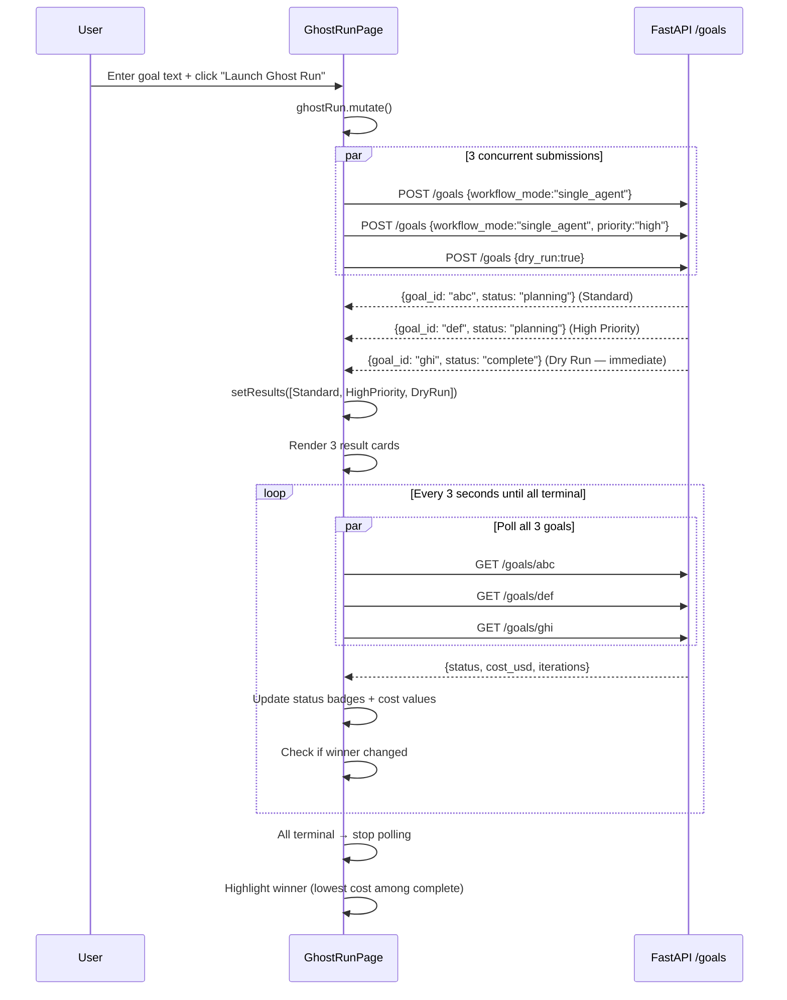

# Ghost Run: A/B Strategy Comparison

## What Is Ghost Run?

Ghost Run is a **multi-strategy goal execution comparison tool**. It submits the same natural-language goal three times simultaneously — using different execution strategies — and lets you compare the results side by side in real time.

The three strategies Ghost Run always launches:

| Strategy | Submission parameters | Purpose |
|----------|-----------------------|---------|
| Standard | `workflow_mode: "single_agent"`, `priority: "normal"` | Baseline execution |
| High Priority | `workflow_mode: "single_agent"`, `priority: "high"` | Faster queue placement |
| Dry Run | `dry_run: true` | Plan preview without execution |

After all three complete, Ghost Run identifies the **winner** — the cheapest successfully-completed goal — and highlights it with a trophy icon.

Source: `agent-verse-frontend/src/features/goals/GhostRunPage.tsx:23-67`

---

## Ghost Run vs. Dry Run vs. Simulation

These three modes are frequently confused. Here is a precise comparison:

| Mode | LLM Planner | LLM Executor | Real Tools | Use Case |
|------|-------------|-------------|-----------|---------|
| `dry_run: true` | No (stub) | No | No | Quick plan preview via keyword parsing |
| Ghost Run | Yes (real) | Yes (real) | **Yes** (real execution) | A/B comparison of execution strategies |
| Simulation | Yes (real) | Yes (real) | **No** (MockMCPClient) | Test agent logic without side effects |

**Key insight:** Ghost Run uses _real_ LLM calls and _real_ tool execution. It is not a sandbox. Submitting a Ghost Run goal that says "delete all staging databases" will actually attempt to delete them (modulo HITL gates). Use Simulation instead for pure testing.

The "Dry Run" column in Ghost Run is the exception — that single variant does skip execution, giving you a preview of what the plan would look like.

---

## When to Use Ghost Run

Ghost Run is best for answering these questions:

1. **Does priority matter for my workload?** Compare Standard vs. High Priority execution time when the Celery queues are under load.
2. **What plan does the LLM produce?** The Dry Run column shows the step list without executing it.
3. **Which approach is cheaper?** After both real runs complete, compare `cost_usd` values.
4. **Is my goal formulation clear?** If two real strategies produce very different plans, the goal text is ambiguous.
5. **Regression testing after agent changes:** Run Ghost Run before and after an agent configuration change to compare outcomes.

Ghost Run is **not** a sandbox. If you want to test without side effects, use the Simulation feature (`POST /enterprise/simulation`).

---

## How Ghost Run Works (Frontend)

```tsx
// GhostRunPage.tsx:28-66
const ghostRun = useMutation({
  mutationFn: async () => {
    const [single, highPrio, dryRun] = await Promise.allSettled([
      goalsApi.submit({ goal, workflow_mode: "single_agent" }),
      goalsApi.submit({ goal, workflow_mode: "single_agent", priority: "high" }),
      goalsApi.submit({ goal, dry_run: true }),
    ]);
    // Collect fulfilled results into GhostResult[]
    // ...
  },
  onSuccess: (strategies) => setResults(strategies),
});
```

Three `POST /goals` requests are fired concurrently using `Promise.allSettled`. `allSettled` (not `Promise.all`) is intentional: one strategy failing does not abort the others. Each fulfilled result produces a `GhostResult` object with `strategy`, `goalId`, and initial `status`.

### Polling for Updates

After submission, the page polls all three goal IDs simultaneously:

```tsx
// GhostRunPage.tsx:71-91
const { data: polledResults } = useQuery({
  queryKey: ["ghost-run-results", results.map(r => r.goalId).join(",")],
  queryFn: async () => {
    const fetched = await Promise.allSettled(
      results.map(r => goalsApi.get(r.goalId))
    );
    return fetched.map((r, i) => ({
      ...results[i],
      status: r.status === "fulfilled" ? r.value.status : results[i].status,
      cost: r.status === "fulfilled" ? r.value.cost_usd : undefined,
      iterations: r.status === "fulfilled" ? r.value.iterations : undefined,
    }));
  },
  enabled: results.length > 0,
  refetchInterval: (query) => {
    const allDone = query.state.data?.every(r => TERMINAL.has(r.status));
    return allDone ? false : 3000;  // Stop polling when all goals are terminal
  },
  staleTime: 0,
});
```

Polling fires every 3 seconds and **automatically stops** when every goal has reached a terminal status (`complete`, `completed`, `failed`, `cancelled`).

### Winner Selection

```tsx
// GhostRunPage.tsx:95-97
const winner = displayResults
  .filter(r => r.status === "complete" || r.status === "completed")
  .sort((a, b) => ((a.cost ?? 999) - (b.cost ?? 999)))[0];
```

The winner is the cheapest _completed_ goal. Failed goals and the Dry Run variant are excluded. If no goals complete, there is no winner.

---

## Full Ghost Run Workflow



---

## Reading Ghost Run Results

Each result card shows:

```
┌──────────────────────────────────────────────────────┐
│ Standard         [executing]  $0.0042  12 steps      │
│ goal_id: abc123...                           Track → │
├──────────────────────────────────────────────────────┤
│ High Priority    [complete]   $0.0031  8 steps  🏆   │
│ goal_id: def456...                           Track → │
├──────────────────────────────────────────────────────┤
│ Dry Run          [complete]   —                      │
│ goal_id: ghi789...                           Track → │
└──────────────────────────────────────────────────────┘
```

- **Status badge**: live-updating; shows current execution state
- **Cost**: displayed once the goal emits cost data (first tool completion)
- **Steps/iterations**: number of plan steps executed
- **Trophy**: marks the cheapest completed goal
- **Track →**: links directly to `GoalDetailPage` for that goal run

The Dry Run variant shows no cost because no LLM tokens are consumed beyond plan generation.

---

## Interpreting Results: Common Scenarios

### Scenario 1: High Priority finishes first and cheaper

This indicates queue contention. Your normal-priority goals are waiting behind other tenants' goals. Consider upgrading to a plan tier that uses the `goals.professional` or `goals.enterprise` Celery queue.

### Scenario 2: Standard and High Priority produce different plans

The LLM planner is not deterministic. This is expected. If the plans differ significantly in quality, your goal text is likely ambiguous — rephrase it more specifically.

### Scenario 3: One real strategy fails immediately

Check the goal detail page for that strategy. Common causes:
- Budget exceeded (cost controller rejected the goal)
- HITL gate triggered before any steps executed
- MCP server unreachable

### Scenario 4: Dry Run shows many steps but real runs fail early

The planner produces a reasonable plan but the executor fails on step 1. This typically indicates the required MCP tools are unavailable or the agent lacks permissions.

---

## Navigating from Ghost Run to Detailed Analysis

From each result card, "Track →" navigates to the full `GoalDetailPage` for that specific run. From there you can:

- Watch the live SSE event stream
- Inspect each tool call via `ToolCallInspector`
- View the `Eval` scorecard after completion
- Compare two of the three runs side-by-side using `Diff Run`
- Understand the agent decision tree via `View DNA`

---

## Important Caveats and Limitations

**Real side effects.** The Standard and High Priority strategies execute real tool calls. If your goal involves write operations (creating files, opening PRs, sending emails), all three runs will attempt those writes. The Dry Run variant is the only safe one.

**Cost multiplication.** Submitting a Ghost Run for an expensive goal (e.g., one that requires many LLM calls) will incur 2× the normal cost (2 real runs + 1 dry run). Monitor budget utilization on the dashboard.

**No deduplication.** The three goal IDs are independent. If your goal is idempotent (e.g., "check which JIRA bugs are open"), running three times is safe. If it is not idempotent (e.g., "create a JIRA bug"), you will create three bugs.

**Batch alternative.** For systematic A/B testing across many goals, use `POST /goals/batch` instead of Ghost Run. Batch gives you full control over strategy parameters.

---

## Backend APIs Used

Ghost Run itself is purely a frontend orchestration pattern — it does not have a dedicated backend endpoint. It calls the standard goals API three times:

```bash
# Strategy 1: Standard
POST /goals
{"goal": "...", "workflow_mode": "single_agent"}

# Strategy 2: High Priority
POST /goals
{"goal": "...", "workflow_mode": "single_agent", "priority": "high"}

# Strategy 3: Dry Run
POST /goals
{"goal": "...", "dry_run": true}
```

Polling: `GET /goals/:id` × 3 (every 3s)

For a true simulation with mock tools and no side effects, use the Simulation API:

```bash
POST /enterprise/simulation
{
  "goal": "...",
  "mock_tools": {
    "github:list_issues": [{"id": 1, "title": "Bug"}],
    "github:create_pr": {"number": 42, "url": "https://..."}
  }
}
```

See the Simulation section in the enterprise documentation for details.
