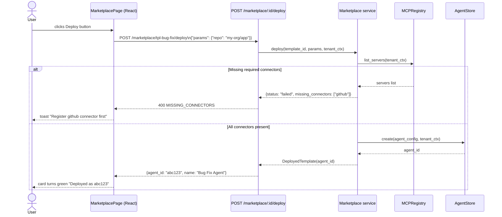
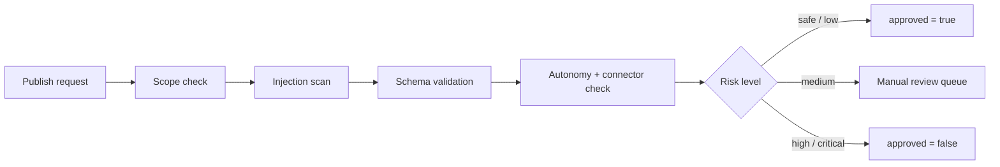

# Agent Marketplace

The Marketplace is AgentVerse's gallery of pre-built, deployable agent templates. Instead
of configuring an agent from scratch, operators browse curated templates, click **Deploy**,
and receive a fully-wired agent in seconds. Templates encode the goal pattern, required
connectors, autonomy level, and trigger type for a complete workflow class.

---

## Template Anatomy

Every template — built-in or community-published — is a JSON document with the following
structure:

```json
{
  "template_id": "tpl-bug-fix",
  "name": "Bug Fix Agent",
  "domain": "software",
  "description": "Fix JIRA bugs labeled prod-down and open a PR",
  "goal_template": "Fix all open bugs labeled {label} in {repo} and open PRs",
  "connectors": ["github", "jira", "sentry"],
  "required_connectors": ["github", "jira", "sentry"],
  "trigger_type": "webhook",
  "autonomy_mode": "bounded-autonomous",
  "author": "AgentVerse",
  "version": "1.0.0",
  "parameters_schema": {
    "type": "object",
    "properties": {
      "label": { "type": "string", "default": "prod-down" },
      "repo": { "type": "string" }
    },
    "required": ["repo"]
  },
  "visibility": "community"
}
```

| Field | Purpose |
|---|---|
| `template_id` | Stable slug used in deploy and version-history URLs |
| `goal_template` | Parameterised natural-language goal; `{vars}` are filled at deploy time |
| `required_connectors` | MCP server names that must be registered before deploy |
| `autonomy_mode` | `fully-autonomous` / `bounded-autonomous` / `supervised` |
| `trigger_type` | `webhook` / `event` / `cron` / `interval` |
| `parameters_schema` | JSON Schema draft-07 for deploy-time parameter validation |
| `visibility` | `private` (owner only) / `team` (same tenant) / `community` (all tenants) |

---

## Browsing Templates

The frontend fetches templates with domain filtering. Six built-in domains are supported:

| Domain | Color tag | Example template |
|---|---|---|
| `software` | Blue | Bug Fix Agent, Code Review Agent |
| `devops` | Purple | DevOps Watchdog, Incident Response |
| `testing` | Yellow | E2E Test Generator |
| `hr` | Pink | HR Onboarding Agent |
| `sales` | Green | Sales Follow-up Agent |
| `support` | Orange | Support Triage Agent |

The frontend polls `GET /marketplace/browse` on page load; no pagination is applied at the
card grid level — all templates for the domain filter are returned.

---

## Deploy Flow

Deploying a template creates a live agent entity in the `agents` table and, in V2, an
atomic install record that prevents "ghost agents" on failure.



The V2 deploy path (`POST /marketplace/templates/:id/deploy`) wraps agent creation and the
install record in a **single database transaction**, so a crash mid-deploy never leaves an
orphaned agent row.

### Deploy request

```http
POST /marketplace/tpl-bug-fix/deploy
X-API-Key: <tenant-key>
Content-Type: application/json

{}
```

With parameters:

```http
POST /marketplace/templates/tpl-bug-fix/deploy
X-API-Key: <tenant-key>
Content-Type: application/json

{
  "params": {
    "repo": "my-org/backend",
    "label": "prod-down"
  }
}
```

### Deploy response

```json
{
  "agent_id": "3f2504e0-4f89-11d3-9a0c-0305e82c3301",
  "name": "Bug Fix Agent"
}
```

---

## Publishing Templates

Any tenant can publish a template so that the rest of the organisation — or the whole
community — can deploy it.

```http
POST /marketplace/publish
X-API-Key: <tenant-key>
Content-Type: application/json

{
  "name": "Billing Alert Agent",
  "domain": "devops",
  "description": "Page on-call when Stripe revenue drops > 20% in 1h",
  "connectors": ["stripe", "pagerduty"],
  "autonomy_mode": "supervised",
  "visibility": "team"
}
```

Response:

```json
{
  "template_id": "tpl-billing-alert-7a3b",
  "name": "Billing Alert Agent"
}
```

The V2 publish endpoint (`POST /marketplace/templates`) accepts a richer payload including
`long_description`, `category`, `tags`, `parameters_schema`, and a `template_config` object
that houses the `goal_template` and `system_prompt`. Publishing via V2 automatically
triggers the **security review pipeline** (see below).

---

## Bundle Deployment

A bundle is a named group of templates deployed together. It is useful for standing up a
complete workflow platform in one operation — for example, deploying `tpl-bug-fix`,
`tpl-code-review`, and `tpl-e2e-testing` as the "Software Engineering Suite".

```http
POST /marketplace/bundles
X-API-Key: <tenant-key>
Content-Type: application/json

{
  "name": "Software Engineering Suite",
  "template_ids": ["tpl-bug-fix", "tpl-code-review", "tpl-e2e-testing"]
}
```

The marketplace service iterates the template list, deploying each in sequence. If any
deployment fails due to missing connectors, the failure is recorded in the bundle result
but other templates continue deploying.

---

## Template Versioning

Each template carries a `version` field (SemVer string). V2 persists every published
version as a separate row in `marketplace_templates`, keeping a full changelog. Operators
can:

- **List versions** for a template via `GET /marketplace/templates/:id/versions`
- **Roll back** to a prior version by re-deploying the versioned template ID
- **Pin** an agent to a specific template version so automatic updates do not affect it

---

## Visibility Scopes

| Scope | Who can browse | Who can deploy |
|---|---|---|
| `private` | Template author's tenant only | Same tenant |
| `team` | Same tenant | Same tenant |
| `community` | All tenants on the instance | All tenants |

The `browse` endpoint applies RLS at the Postgres layer — a tenant cannot see `private`
templates published by another tenant even if they guess the `template_id`.

---

## Security Review Pipeline

Templates published via V2 pass through `TemplateSecurityReviewer` before they become
discoverable. The reviewer runs four independent checks in sequence:



### Risk levels

| Level | Trigger |
|---|---|
| `safe` | No findings |
| `low` | Minor over-requested scopes, non-critical |
| `medium` | Invalid JSON Schema, medium-severity injection pattern |
| `high` | Critical scopes requested (`admin:*`, `connectors:admin`), high-severity injection |
| `critical` | `fully-autonomous` mode combined with `shell`, `filesystem`, or `ssh` connector |

### Scope classification

```python
PREAPPROVED_SCOPES = {
    "goals:read", "goals:write", "goals:execute",
    "agents:read", "knowledge:read", "mcp:read",
}

HIGH_RISK_SCOPES = {
    "goals:delete", "agents:delete", "agents:write",
    "governance:write", "governance:approve",
    "tenancy:write", "audit:export", "costs:admin",
    "admin:*", "connectors:admin",
}

CRITICAL_SCOPES = {
    "admin:*", "governance:approve",
    "agents:delete", "connectors:admin",
}
```

Templates requesting any scope outside `PREAPPROVED_SCOPES` **and** any scope in
`HIGH_RISK_SCOPES` simultaneously are rejected. The AND-logic (Amendment 7.1) prevents
false negatives where over-scoped templates slipped through by requesting at least one
pre-approved scope.

### Injection scan

The `_check_injection` method scans the `goal_template`, `system_prompt`, and
`description` fields against `InjectionGuard`. When the guardrail engine is unavailable,
a fallback pattern list catches the most common jailbreak phrases:

- `ignore all previous instructions` → critical
- `DAN mode` / `jailbreak` → critical
- `do anything now` → critical
- `bypass restrictions` → high

---

## API Reference

| Method | Path | Description |
|---|---|---|
| `GET` | `/marketplace/browse` | List all visible templates; filter by `?domain=` and `?q=` |
| `GET` | `/marketplace/templates` | V2 paginated list with full-text search |
| `GET` | `/marketplace/templates/:id` | Single template detail |
| `POST` | `/marketplace/:id/deploy` | V1 one-click deploy |
| `POST` | `/marketplace/templates/:id/deploy` | V2 atomic deploy (preferred) |
| `POST` | `/marketplace/publish` | V1 publish |
| `POST` | `/marketplace/templates` | V2 publish with security review |
| `POST` | `/marketplace/bundles` | Deploy a named group of templates |
