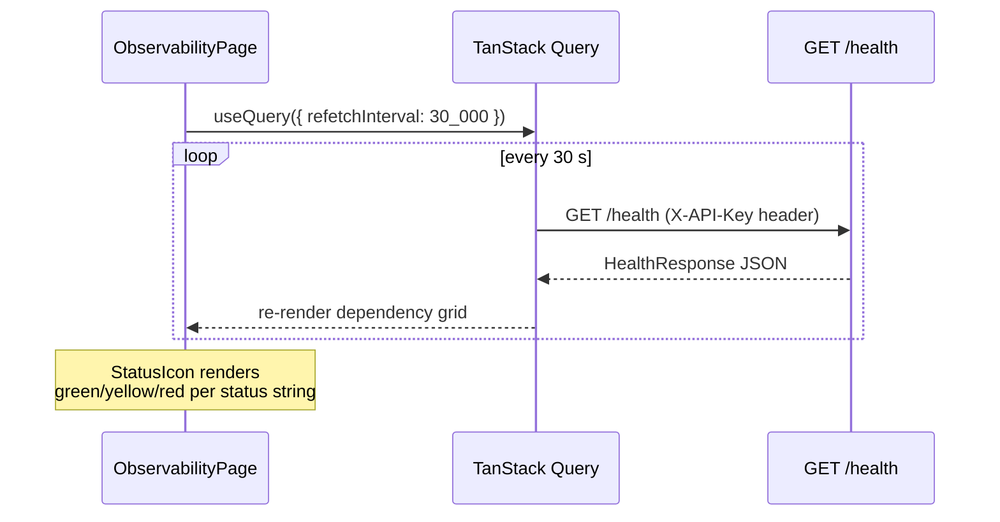
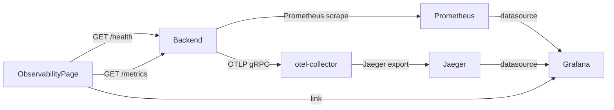

# Observability

The Observability page gives operators a single pane of glass for system health, raw
Prometheus metrics, and external dashboards. It polls the backend continuously so stale
data never lingers on screen.

---

## Page Layout

`ObservabilityPage` is composed of three independent panels rendered in a vertical stack:

1. **Grafana Dashboard link** — a quick-launch card that probes `VITE_GRAFANA_URL/api/health`
   with a 3-second timeout and dims itself when Grafana is unreachable.
2. **System Health grid** — dependency health cards, refreshed every **30 seconds** via
   TanStack Query's `refetchInterval`.
3. **Prometheus Metrics panel** — raw Prometheus text format, refreshed every **60 seconds**.

---

## Health Check Registry

`GET /health` aggregates every registered health check into a single response. Each check
is a pluggable function that probes one dependency and returns a `HealthDependency` object:

```typescript
interface HealthDependency {
  status: string;      // "ok" | "degraded" | "warn" | "down"
  latency_ms?: number; // round-trip time for the probe
  message?: string;    // human-readable detail
}

interface HealthResponse {
  status: string;          // overall rollup: "ok" | "degraded" | "down"
  version?: string;        // backend semver
  dependencies: Record<string, HealthDependency>;
}
```

Typical dependencies exposed:

| Dependency | What is probed |
|---|---|
| `postgres` | `SELECT 1` via asyncpg |
| `redis` | `PING` via redis-py |
| `mcp` | Reachability of at least one registered MCP server |
| `celery` | Celery worker heartbeat via Redis inspect |
| `vector_store` | pgvector extension presence check |

Example health response:

```json
{
  "status": "ok",
  "version": "0.9.1",
  "dependencies": {
    "postgres": { "status": "ok", "latency_ms": 4 },
    "redis":    { "status": "ok", "latency_ms": 1 },
    "mcp":      { "status": "degraded", "message": "1 of 3 servers unreachable", "latency_ms": 120 },
    "celery":   { "status": "ok", "latency_ms": 18 }
  }
}
```

---

## Frontend Health Polling Loop



The three-state `StatusIcon` component maps the status string:

| Status string | Icon | Background |
|---|---|---|
| `ok` / `healthy` / `up` | Green CheckCircle | `bg-green-50 border-green-200` |
| `degraded` / `warn` | Yellow AlertCircle | `bg-yellow-50 border-yellow-200` |
| any other | Red XCircle | `bg-red-50 border-red-200` |

When the `/health` endpoint is unreachable the panel shows "Failed to reach health endpoint"
in red; the 30-second retry loop continues regardless.

---

## Prometheus Metrics

`GET /metrics` returns the Prometheus text exposition format. The frontend renders it
verbatim inside a `<pre>` block with a 96-line scroll cap. The panel auto-refreshes every
60 seconds — twice the health interval to reduce backend load from the metrics scrape.

Custom metrics exported by the backend:

| Metric name | Type | Labels | Description |
|---|---|---|---|
| `agentverse_goals_total` | Counter | `tenant_id`, `status` | Total goals submitted |
| `agentverse_goal_duration_seconds` | Histogram | `tenant_id` | Wall-clock seconds per goal |
| `agentverse_llm_cost_usd_total` | Counter | `tenant_id`, `model` | Cumulative LLM spend |
| `agentverse_mcp_tool_calls_total` | Counter | `tenant_id`, `tool`, `outcome` | Tool invocations |
| `agentverse_mcp_tool_latency_seconds` | Histogram | `tool` | Tool call latency distribution |
| `agentverse_active_goals` | Gauge | `tenant_id` | Currently executing goals |
| `agentverse_budget_utilization_ratio` | Gauge | `tenant_id` | Budget used / budget limit |
| `agentverse_eval_score` | Histogram | `tenant_id`, `dimension` | Per-dimension eval scores |
| `agentverse_hitl_approvals_total` | Counter | `tenant_id`, `outcome` | HITL approval decisions |
| `agentverse_circuit_breaker_state` | Gauge | `service` | 0=closed, 1=half-open, 2=open |

Metrics are collected via the `prometheus-client` library and exposed without authentication
by default; tighten access in production via the `METRICS_AUTH` env var.

---

## OpenTelemetry Tracing

All agent executions emit OpenTelemetry spans. The backend is configured with service name
`agentverse-backend` and exports to an OTLP collector via `OTEL_EXPORTER_OTLP_ENDPOINT`.

### Span hierarchy

```
goal.execute                 (root span — goal_id attribute)
  ├── agent.plan             (Planner LLM call)
  │   └── llm.complete
  ├── agent.execute_step     (Executor LLM call, repeated per step)
  │   ├── llm.complete
  │   └── tool.call          (MCP tool invocation)
  │       └── mcp.http_call
  └── agent.verify           (Verifier LLM call)
      └── llm.complete
```

Standard span attributes:

| Attribute | Example value |
|---|---|
| `goal.id` | `"goal_abc123"` |
| `goal.tenant_id` | `"tenant_xyz"` |
| `tool.name` | `"github:create_pull_request"` |
| `llm.model` | `"anthropic/claude-3-5-sonnet"` |
| `llm.input_tokens` | `412` |
| `llm.output_tokens` | `87` |
| `llm.cost_usd` | `0.00183` |

Traces flow: **FastAPI instrumentation → OTLP collector → Jaeger**. The Jaeger UI is
accessible at `VITE_JAEGER_URL` (default `http://localhost:16686`).

---

## Grafana Integration

The Observability page embeds a direct link to the Grafana instance configured via
`VITE_GRAFANA_URL`. A `HEAD` request to `${GRAFANA_URL}/api/health` is fired on mount
with a 3-second AbortController timeout:

- **Grafana reachable** — card is fully opaque; clicking "Open" opens a new tab.
- **Grafana unreachable** — card has `opacity-50` and the link is pointer-events disabled.

### Provisioned dashboard

AgentVerse ships a provisioned Grafana dashboard in
`infra/grafana/dashboards/agentverse.json`. It contains panels for:

- Goal throughput (goals/min, success rate)
- LLM cost by model (stacked area)
- Tool call latency p50/p95/p99 (histogram panel)
- Budget utilization gauge (colour-coded: green < 50%, yellow 50–80%, red > 80%)
- Active goals time-series
- Eval score trends by dimension

To provision it automatically, mount the JSON under Grafana's dashboard provider path and
set `GRAFANA_DASHBOARDS_PATH=/etc/grafana/provisioning/dashboards` in the Grafana
container.

---

## Configuration Reference

| Env var | Default | Purpose |
|---|---|---|
| `VITE_API_URL` | `http://localhost:8000` | Backend base URL for health + metrics |
| `VITE_GRAFANA_URL` | `http://localhost:3001` | Grafana instance URL |
| `OTEL_EXPORTER_OTLP_ENDPOINT` | _(unset)_ | OTLP collector endpoint; disables tracing if unset |
| `OTEL_SERVICE_NAME` | `agentverse-backend` | Service name in traces |

---

## Full Observability Stack (docker-compose)



All five services (`otel-collector`, `prometheus`, `jaeger`, `grafana`, and `backend`)
are declared in `infra/docker-compose.yml` and start with a single `docker-compose up -d`.
