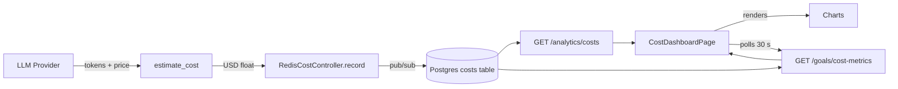
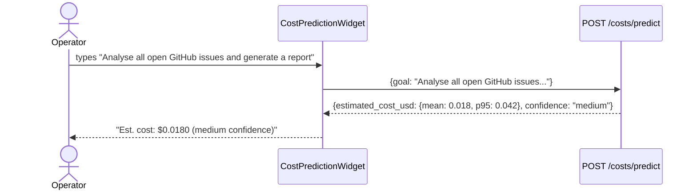
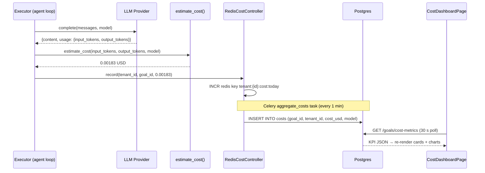

# Cost Dashboard

The Cost Dashboard gives operators real-time visibility into LLM spend per goal, per
agent, and per model. It combines live KPI polling, time-series charts, a budget progress
bar, cost anomaly alerts, and a pre-run cost predictor into a single page.

---

## Architecture Overview



Every time the Executor makes an LLM call it calls `estimate_cost(input_tokens,
output_tokens, model)` and passes the result to `RedisCostController.record()`.  Redis
provides cross-replica accuracy (a goal that migrates between workers accumulates cost
correctly).  A background Celery task (`aggregate_costs`) periodically flushes Redis
counters into the Postgres `costs` table where they become queryable.

---

## KPI Cards

Four top-of-page cards are populated by `GET /goals/cost-metrics` (polls every **30 seconds**):

| Card | Field | Meaning |
|---|---|---|
| **Cost Today** | `cost_today_usd` | Total USD spent since midnight UTC |
| **Budget Used** | `budget_utilization` (×100) | Fraction of `daily_budget_usd` consumed |
| **Goals Today** | `goals_today` | Number of goals started since midnight |
| **Total (Nd)** | `analytics.total_cost_usd` | Period total from `/analytics/costs` |

Full KPI response shape:

```json
{
  "cost_today_usd": 1.24,
  "daily_budget_usd": 10.00,
  "budget_utilization": 0.124,
  "active_goals": 3,
  "total_goals": 412,
  "goals_today": 17,
  "per_goal_budget_usd": 0.073
}
```

---

## Budget Progress Bar

The progress bar renders `budget_utilization × 100` as a percentage fill, with three
colour thresholds driven by inline Tailwind classes:

| Utilization | Bar colour | Badge colour |
|---|---|---|
| < 50% | `bg-green-500` | `bg-green-100 text-green-700` |
| 50–80% | `bg-yellow-500` | `bg-yellow-100 text-yellow-700` |
| > 80% | `bg-red-500` | `bg-red-100 text-red-700` |

When utilization exceeds 80% an `AlertCircle` warning with text "Budget almost exhausted"
appears inline beside the bar title.

---

## Time-Series Charts

The page has a period selector (`7d` / `30d` / `90d`) that re-fetches
`GET /analytics/costs?days=N`. Two charts share a two-column grid layout:

### Daily Cost Line Chart

Data key: `analytics.cost_by_day[]`

```json
[
  { "date": "2025-06-01", "cost_usd": 0.84 },
  { "date": "2025-06-02", "cost_usd": 1.12 },
  ...
]
```

Rendered as `ThemedLineChart` with a single line keyed on `cost_usd`, formatted via
`$X.XX` (4 decimal places for amounts below $0.01).

### Cost by Model Bar Chart

Data key: `analytics.cost_by_model{}`

```json
{
  "anthropic/claude-3-5-sonnet-20241022": 4.21,
  "openai/gpt-4o": 1.08,
  "google/gemini-pro": 0.33
}
```

Rendered as a vertical `ThemedBarChart` sorted by cost descending, capped at 8 models.
Model names are truncated to 14 characters (taking the last path segment after `/`).

---

## Per-Agent Cost Breakdown

Below the charts, a sortable table shows cost attribution by agent, powered by
`GET /costs/per-agent`:

| Column | Source field |
|---|---|
| Agent | `agent_name` |
| Total Cost | `total_cost_usd` |
| Goals | `goal_count` |
| Avg / Goal | `avg_cost_per_goal` |

This lets teams identify which agents are economically inefficient before they consume
significant budget.

---

## Cost Predictor

The **Cost Predictor** widget lets operators estimate the cost of a goal **before** running
it. The user types a goal description; once it exceeds 10 characters, a debounced query
fires against `POST /costs/predict` (stale time: 60 seconds so repeated identical goals
reuse the cached estimate).



Prediction response:

```json
{
  "estimated_cost_usd": {
    "mean": 0.018,
    "p5":  0.004,
    "p95": 0.042
  },
  "confidence": "medium",
  "model_breakdown": {
    "planner": 0.005,
    "executor": 0.010,
    "verifier": 0.003
  }
}
```

---

## Cost Anomaly Detection

`AnomalyPanel` polls `GET /costs/anomalies` every **60 seconds** and renders severity-
coloured alert banners above the KPI row:

| Severity | Card style |
|---|---|
| `high` | Red border + red background |
| `medium` | Yellow border + yellow background |
| `low` | Default border |

An anomaly object:

```json
{
  "id": "anom_7x3k",
  "type": "spike_single_goal",
  "severity": "high",
  "message": "Goal goal_abc123 cost $1.84 — 14× the 7-day average",
  "cost_delta_usd": 1.71
}
```

On the backend, the `scan_cost_anomalies` Celery task runs on a schedule (configurable
via `ANOMALY_SCAN_CRON`, default `*/15 * * * *`). It reads the last N goals from Postgres,
computes a rolling Z-score against the per-tenant baseline, and inserts anomaly records for
any goal exceeding a configurable sigma threshold (default σ = 3).

---

## Token Pricing Formula

Cost is calculated at LLM call time using:

```
cost_usd = (input_tokens  / 1_000_000) * price_per_M_input
         + (output_tokens / 1_000_000) * price_per_M_output
```

Reference prices (subject to provider changes):

| Model | Input $/M tokens | Output $/M tokens |
|---|---|---|
| `claude-3-5-sonnet-20241022` | $3.00 | $15.00 |
| `claude-3-haiku-20240307` | $0.25 | $1.25 |
| `gpt-4o` | $2.50 | $10.00 |
| `gpt-4o-mini` | $0.15 | $0.60 |
| `gemini-1.5-pro` | $3.50 | $10.50 |

Prices are stored in `app/providers/pricing.py` and can be overridden via
`LLM_PRICING_OVERRIDES` env JSON for custom deployments or negotiated rates.

---

## API Reference

| Method | Path | Query params | Description |
|---|---|---|---|
| `GET` | `/goals/cost-metrics` | — | Live KPI row (polls 30s) |
| `GET` | `/analytics/costs` | `days=7|30|90` | Aggregated cost time-series + model breakdown |
| `GET` | `/costs/per-agent` | — | Cost breakdown by agent |
| `POST` | `/costs/predict` | — | Body: `{goal: string}` → cost estimate |
| `GET` | `/costs/anomalies` | — | Active cost anomaly alerts |

---

## End-to-End Cost Flow


