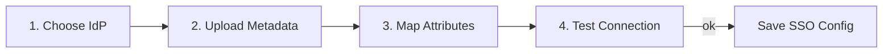
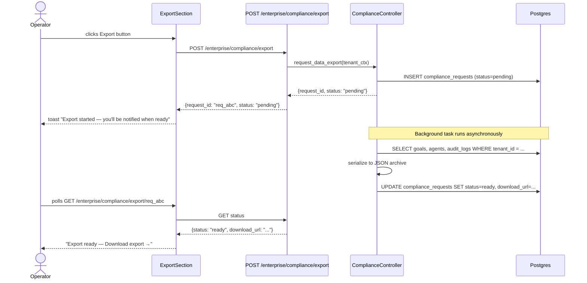

# Enterprise Features

The Enterprise page (`/enterprise`) is the operator control plane for compliance,
identity, data governance, and data sovereignty. It is intentionally separated from the
agent-runtime pages so that compliance actions are always one click from the navigation
rather than buried in settings.

---

## Page Layout

`EnterprisePage` renders seven stacked sections within a `max-w-3xl` centred column:

```
EnterprisePage
├── ComplianceDashboard   — framework status badges (GDPR, SOC2, HIPAA, ISO27001, PCI-DSS, CCPA)
├── SAMLWizard            — 4-step SSO configuration wizard
├── ScimSection           — SCIM 2.0 endpoint toggle
├── ContractsSection      — BAA / DPA / SLA status
├── ResidencySection      — data region + data centre info
├── ExportSection         — GDPR data export (async job)
└── DeleteSection         — GDPR right-to-erasure (irreversible)
```

---

## Compliance Dashboard

The `ComplianceDashboard` reads the active compliance frameworks from
`GET /enterprise/compliance/residency`. The six known frameworks are rendered as a 2×3
badge grid:

| Framework | Meaning |
|---|---|
| GDPR | EU General Data Protection Regulation |
| SOC2 | Service Organization Control 2 (Type II audit) |
| HIPAA | US Health Insurance Portability and Accountability Act |
| ISO27001 | Information security management certification |
| PCI-DSS | Payment Card Industry Data Security Standard |
| CCPA | California Consumer Privacy Act |

Active frameworks show a green `CheckCircle2`; inactive frameworks show a greyed-out
`XCircle`. The active set is determined by the `compliance_frameworks` array in the
`DataResidencyInfo` response from the backend.

---

## SAML / SSO Wizard

The four-step wizard guides an administrator through enterprise SSO configuration:



**Supported identity providers:** Okta, Azure AD, Google Workspace, OneLogin, PingIdentity.

| Step | What happens |
|---|---|
| **Choose IdP** | Select the identity provider from the card grid |
| **Upload Metadata** | Drag-and-drop or click-to-browse an IdP SAML metadata XML file |
| **Map Attributes** | Set the SAML attribute names for `email` and `displayName` |
| **Test Connection** | Fires a test SSO round-trip; shows green check or red X |

Completed configuration is submitted to `POST /enterprise/sso/configure`.

---

## SCIM 2.0 Provisioning

SCIM (System for Cross-domain Identity Management) 2.0 allows the IdP to automatically
provision and deprovision users when they join or leave the organisation. Toggling SCIM
enabled reveals the endpoint:

```
https://api.agentverse.io/scim/v2
```

The SCIM router is mounted at `/scim/v2` and implements:

| Endpoint | Description |
|---|---|
| `GET /scim/v2/Users` | List all provisioned users |
| `POST /scim/v2/Users` | Provision a new user |
| `PUT /scim/v2/Users/:id` | Update user attributes |
| `DELETE /scim/v2/Users/:id` | Deprovision user (revokes API key) |
| `GET /scim/v2/Groups` | List groups |

---

## GDPR Data Export (Right to Portability)

The export is an **async job** — it does not block the HTTP request. The UI fires
`POST /enterprise/compliance/export`, receives a `request_id`, then polls for completion.

### Flow



### Download

```http
GET /enterprise/compliance/export/{request_id}/download
X-API-Key: <tenant-key>
```

Returns a `Content-Disposition: attachment` JSON file named
`agentverse-export-{request_id}.json`. The archive contains:

- All goals and their full execution history
- All agents (configs, not model weights)
- Full audit trail (append-only)
- Cost records
- Knowledge base entries

### Status polling

```http
GET /enterprise/compliance/export/{request_id}
X-API-Key: <tenant-key>
```

```json
{
  "request_id": "req_abc123",
  "status": "ready",
  "payload": { "size_hint": "4.2MB" }
}
```

Possible statuses: `pending` → `processing` → `ready` | `failed`.

---

## GDPR Right to Erasure (Data Deletion)

`DELETE /enterprise/compliance/delete` schedules permanent deletion of all tenant data.
The frontend enforces a deliberate friction point: the operator must type the exact string
`DELETE MY DATA` into a confirmation input before the button becomes enabled.

The deletion:
1. Schedules the deletion job (returns `202 Accepted`)
2. Revokes all API keys for the tenant immediately
3. Queues a background task that runs within 30 days to hard-delete all rows across all
   tables where `tenant_id` matches, including the RLS-protected tables

```http
POST /enterprise/compliance/delete
X-API-Key: <tenant-key>

→ 202 Accepted
{
  "scheduled": true,
  "delete_after": "2025-07-29T00:00:00Z",
  "message": "Data deletion scheduled. Keys revoked immediately."
}
```

---

## Goal Simulation (Sandbox)

The `SimulationSection` on the Eval page uses `MockMCPClient` to run the full agent loop
with **fake tool responses** instead of real MCP server calls. This validates that the
planner, executor, and verifier behave correctly without touching production systems.

```http
POST /enterprise/simulation
X-API-Key: <tenant-key>
Content-Type: application/json

{
  "goal": "List all open GitHub issues and create a triage report",
  "mock_tools": {
    "github:list_issues": [
      {"id": 1, "title": "Login broken", "labels": ["bug", "P1"]},
      {"id": 2, "title": "Slow checkout", "labels": ["perf"]}
    ],
    "github:create_file": {"sha": "abc123", "committed": true}
  }
}
```

The `mock_tools` map uses tool names as keys and their mock return values as values. The
agent sees these as real tool responses. `cost_usd` in the simulation response is a
**simulated** estimate — no real LLM cost is incurred differently, but token usage is the
same as a live run.

A streaming variant (`POST /enterprise/simulation/stream`) returns SSE events as each step
executes, enabling real-time step-by-step observation in a developer workflow.

---

## SOC2 Audit Package

```http
GET /enterprise/compliance/soc2-report
X-API-Key: <tenant-key>
```

Returns a structured JSON report containing:
- Tenant configuration snapshot (autonomy modes, policy rules)
- HITL approval audit trail (last 90 days)
- Cost control configuration
- Access control summary (RBAC roles, API key count)
- Data residency statement

---

## PCI-DSS Compliance Report

```http
GET /enterprise/compliance/pci-report
X-API-Key: <tenant-key>
```

Returns evidence for PCI-DSS requirements:
- Network segmentation confirmation
- Encryption-at-rest and in-transit status
- Access control audit (who accessed what data)
- Vulnerability management summary

---

## Data Residency

`GET /enterprise/compliance/residency` returns the tenant's data region:

```json
{
  "region": "eu-west-1",
  "data_center": "AWS Dublin",
  "description": "All data processed and stored in EU. No cross-border transfer.",
  "compliance_frameworks": ["GDPR", "ISO27001"]
}
```

Available regions are listed by `GET /enterprise/compliance/regions`. Region selection
(for new tenants) is a provisioning-time decision enforced at the database layer via RLS
and connection routing.

---

## Interaction with Governance

Enterprise features sit on top of the governance layer. Specifically:

- **GDPR export** reads the append-only audit trail without modifying it.
- **Simulation runs** generate `source=simulation` audit events so simulated actions are
  distinguishable from real production actions.
- **Red team runs** generate `source=red_team` audit events.
- **Data deletion** is itself an audited operation that records the deletion request and
  scheduled date before any data is touched.

---

## API Reference

| Method | Path | Description |
|---|---|---|
| `GET` | `/enterprise/compliance/residency` | Data region + active frameworks |
| `GET` | `/enterprise/compliance/regions` | List available deployment regions |
| `POST` | `/enterprise/compliance/export` | Start async GDPR export |
| `GET` | `/enterprise/compliance/export/:id` | Poll export status |
| `GET` | `/enterprise/compliance/export/:id/download` | Download export JSON |
| `POST` | `/enterprise/compliance/delete` | Schedule data deletion |
| `GET` | `/enterprise/compliance/soc2-report` | SOC2 evidence package |
| `GET` | `/enterprise/compliance/pci-report` | PCI-DSS compliance report |
| `POST` | `/enterprise/simulation` | Run goal in sandbox with mock tools |
| `POST` | `/enterprise/simulation/stream` | Streaming simulation (SSE) |
| `POST` | `/enterprise/red-team` | Run adversarial test suite |
