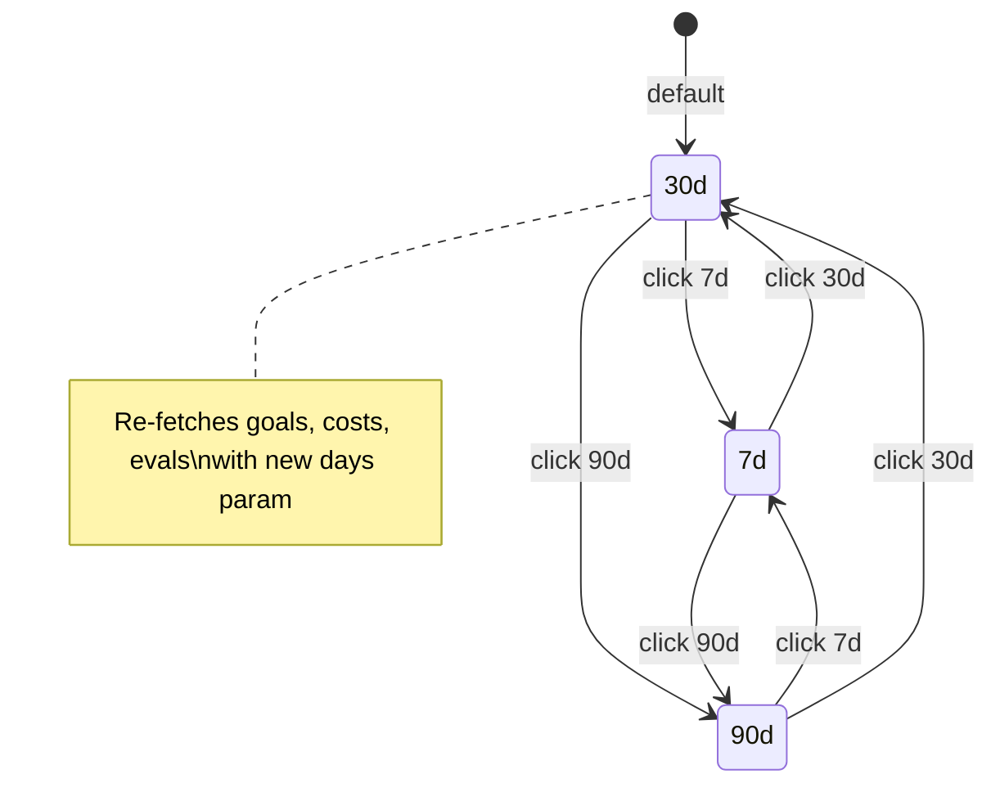
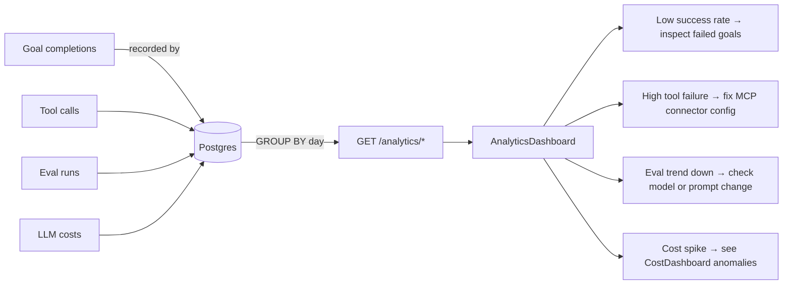

# Analytics Dashboard

The Analytics Dashboard (`/analytics`) provides historical trend analysis across four
data dimensions: goals, tools, evaluations, and costs. Unlike the real-time Cost Dashboard
(which polls every 30 seconds), the Analytics page is optimised for time-range exploration
— a period selector lets operators zoom out to 7, 30, or 90 days of history.

---

## Page Layout

```
AnalyticsDashboardPage
├── Header + Period selector (7d / 30d / 90d)
├── KPI row (4 cards)
├── Goals by Status — bar chart
├── Top Tools: Success vs Failed — grouped bar chart
├── Eval Pass Rate (Nd) — line chart
└── Eval Summary (Nd) — stats grid
```

Four independent TanStack Query hooks fan out concurrently on mount, each requesting its
own metric set:

| Hook query key | Endpoint | Refresh interval |
|---|---|---|
| `analytics-goals` | `GET /analytics/goals?days=N` | 60 s |
| `analytics-costs` | `GET /analytics/costs?days=N` | 30 s |
| `analytics-evals` | `GET /analytics/evals?days=N` | 60 s |
| `analytics-tools` | `GET /analytics/tools` | 60 s |

Re-selecting the period selector updates the `days` state variable, which invalidates the
`goals`, `costs`, and `evals` query keys simultaneously. The `tools` query is period-
independent — it returns a rolling all-time aggregation.

---

## KPI Row

Four summary cards give at-a-glance health for the selected period:

| Card | Source | Format |
|---|---|---|
| **Total Goals** | `goals.total` | Integer count |
| **Success Rate** | `goals.success_rate` | Percentage (×100, 1 dp) |
| **Eval Pass Rate** | `evals.pass_rate` | Percentage (×100, 1 dp) |
| **Cost (Nd)** | `costs.total_cost_usd` | `$X.XXXX` (4 dp) |

When a metric is not yet available (data still loading, or no data for the period) the
card displays `—` to distinguish "no data" from "zero".

---

## Goals by Status Chart

A vertical bar chart rendered by `ThemedBarChart` with a single bar series (`count`)
keyed on `status`. Data shape from `GET /analytics/goals`:

```json
{
  "total": 234,
  "success_rate": 0.871,
  "by_status": {
    "complete":  204,
    "failed":     19,
    "planning":    6,
    "executing":   5
  }
}
```

The chart transforms `by_status` into an array for Recharts:

```javascript
[
  { status: "complete",  count: 204 },
  { status: "failed",    count: 19  },
  { status: "planning",  count: 6   },
  { status: "executing", count: 5   }
]
```

Status values and their meanings:

| Status | Meaning |
|---|---|
| `complete` | Goal reached COMPLETE and verifier confirmed success |
| `failed` | Goal exhausted max iterations or the verifier returned failure |
| `planning` | Goal is in the planning phase (awaiting first plan) |
| `executing` | Goal is actively executing steps |
| `pending` | Goal is queued, not yet started |
| `hitl_pending` | Goal is awaiting human approval before a high-risk step |

---

## Top Tools: Success vs Failed Chart

A grouped bar chart showing the **top 10 MCP tools** by total call volume, with green
`success` bars and red `failed` bars side-by-side. Data from `GET /analytics/tools`:

```json
{
  "tools": [
    {
      "name": "github:create_pull_request",
      "success": 142,
      "failed": 3,
      "total": 145,
      "avg_latency_ms": 312
    },
    {
      "name": "jira:create_issue",
      "success": 89,
      "failed": 12,
      "total": 101,
      "avg_latency_ms": 198
    }
  ]
}
```

Tool names are truncated to 12 characters (last segment after `:`) for legibility on the
chart X-axis. The top 10 by `total` calls are shown; use `GET /analytics/tools?limit=50`
for a fuller list.

This chart is the fastest way to identify **unreliable tools** — a tool with a high
failure rate typically indicates a misconfigured MCP server, rate-limiting, or an
authentication problem.

---

## Eval Pass Rate Line Chart

A time-series line chart showing `pass_rate` per day for the selected period. Data from
`GET /analytics/evals?days=N`:

```json
{
  "total_evals": 89,
  "pass_rate": 0.831,
  "avg_score": 0.74,
  "evals_by_day": [
    { "date": "2025-06-20", "pass_rate": 0.80, "avg_score": 0.71 },
    { "date": "2025-06-21", "pass_rate": 0.85, "avg_score": 0.77 },
    { "date": "2025-06-29", "pass_rate": 0.83, "avg_score": 0.74 }
  ]
}
```

The Y-axis formatter converts the fraction to a percentage string (`${(v*100).toFixed(0)}%`).
Downward trends in this chart are the early-warning signal for model or prompt regressions.

---

## Eval Summary Grid

A 2-column stat grid showing period totals alongside the line chart:

| Stat | Source field | Format |
|---|---|---|
| Total Evals | `evals.total_evals` | Integer |
| Pass Rate | `evals.pass_rate` | `XX.X%` |
| Avg Score | `evals.avg_score` | `0.XX` (2 dp) |

---

## Period Selector

The `7d / 30d / 90d` segmented control is implemented as three buttons sharing a single
`border rounded-lg overflow-hidden` wrapper. The active period uses
`bg-primary text-primary-foreground`; inactive buttons use `hover:bg-muted`.



---

## Agent Analytics

The per-agent performance view (accessible via the Agent detail page) aggregates the same
metrics filtered to a single `agent_id`. It is surfaced via:

```http
GET /analytics/agents/:agent_id?days=30
X-API-Key: <tenant-key>
```

```json
{
  "agent_id": "agt_abc123",
  "agent_name": "Bug Fix Agent",
  "period_days": 30,
  "total_goals": 47,
  "success_rate": 0.894,
  "avg_cost_per_goal": 0.073,
  "avg_iterations": 3.2,
  "top_tools": [
    { "name": "github:create_pull_request", "success": 44, "failed": 2 }
  ],
  "eval_summary": {
    "pass_rate": 0.85,
    "avg_score": 0.79
  }
}
```

This is the primary view for identifying which agents deliver good ROI (high success rate,
low cost per goal) and which need prompt or policy tuning.

---

## Data Freshness

All analytics data is computed from the `goals`, `tool_calls`, and `evaluations` tables
in Postgres. The analytics endpoints use `GROUP BY DATE_TRUNC('day', ...)` aggregations
with Postgres indexes on `(tenant_id, created_at)`. For tenants with > 10,000 goals,
a materialized view (`analytics_daily_mv`) is refreshed by the
`refresh_analytics_materialized_views` Celery task (default: every 5 minutes).

---

## API Reference

| Method | Path | Query params | Description |
|---|---|---|---|
| `GET` | `/analytics/goals` | `days=7\|30\|90` | Goal counts by status + success rate |
| `GET` | `/analytics/tools` | `limit=10` | Tool call success/failure + latency |
| `GET` | `/analytics/evals` | `days=7\|30\|90` | Eval pass rate trend |
| `GET` | `/analytics/costs` | `days=7\|30\|90` | Cost time-series + model breakdown |
| `GET` | `/analytics/agents/:id` | `days=7\|30\|90` | Per-agent performance summary |
| `GET` | `/analytics/eval-suites/:id/trend` | — | Suite pass-rate trend |

---

## Connecting Analytics to Operations



The analytics page is designed to surface **actionable** patterns, not just raw numbers:
- A sudden drop in success rate correlates with a recent deployment — check the eval
  suite trend to confirm regression.
- Tools with high failure rates are candidates for MCP server investigation.
- Rising cost-per-goal without corresponding improvement in eval scores signals that the
  agent is taking more iterations without better results.
