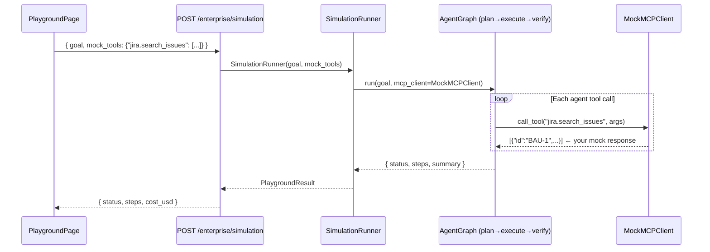

# Agent Playground

The **Playground** is AgentVerse's zero-risk experimentation environment. It lets you submit
any goal and see exactly how an agent would plan and execute it — without touching a single
real external system. Every tool call is intercepted and answered with a response you define
upfront in JSON.

---

## What is the Playground?

The Playground wraps the full AgentVerse simulation engine (`SimulationRunner`) behind a
simple two-panel interface:

- **Left panel**: Goal description + Mock Tools JSON editor
- **Right panel**: Execution result — status badge, simulated cost, and a numbered step-by-
  step trace

No real credentials are needed for the tools you mock. No side effects occur. The agent
plans, "executes", and returns a result as if everything succeeded — using your fake responses
as truth.

---

## Playground vs. Ghost Run

These two features are often confused. The distinction is fundamental:

| Dimension | Playground | Ghost Run |
|---|---|---|
| Tool responses | **You define** custom JSON per tool | Pre-built mocks; OR real executions in parallel |
| Purpose | Explore how an agent responds to specific tool outputs | Compare execution strategies side by side |
| Real execution | Never | Optional (Ghost Run includes a real run alongside a dry run) |
| Custom tool output | Yes — full JSON control | No |
| Strategy comparison | No — single run | Yes — 3 strategies launched simultaneously |
| Cost shown | Simulated estimate | Actual cost (for real-run strategies) |

**Rule of thumb:** Use Playground when you want to craft specific mock responses to test edge
cases. Use Ghost Run when you want to compare real execution strategies against each other.

---

## Mock Tools JSON Format

The Mock Tools editor accepts a JSON object where keys are tool names (in
`connector.tool_name` format) and values are the mock response that the simulation engine
will return when the agent calls that tool:

```json
{
  "jira.search_issues": [
    { "id": "BAU-1", "title": "Login page broken", "priority": "P1" },
    { "id": "BAU-2", "title": "Dark mode contrast issue", "priority": "P3" }
  ],
  "confluence.create_page": {
    "id": "12345",
    "url": "https://wiki.example.com/pages/12345",
    "status": "current"
  },
  "slack.post_message": {
    "ok": true,
    "ts": "1234567890.123456"
  }
}
```

The key format is flexible — any string is valid. The simulation engine performs a fuzzy match
against the tool name the agent requests. If no mock is found for a requested tool, the engine
returns a generic success response `{"result": "mocked"}` so the agent can continue planning.

---

## How the Simulation Engine Works

When `POST /enterprise/simulation` is called, the backend:

1. Parses the `goal` and `mock_tools` from the request body
2. Constructs a `MockMCPClient` that wraps the mock tools dictionary
3. Injects the `MockMCPClient` in place of the real `MCPClient` for this request
4. Runs the `SimulationRunner` — which drives the same `AgentGraph` loop as production, but
   with the swapped client
5. As the agent plans and "calls" tools, `MockMCPClient.call_tool()` intercepts each call,
   looks up the tool name in the mock dictionary, and returns the pre-defined response
6. Returns a `PlaygroundResult` with step-by-step traces and an estimated cost



The key architectural guarantee: **`SimulationRunner` uses the identical `AgentGraph` code
path as production.** The only difference is the injected `MockMCPClient`. This means
planning quality, prompt templates, verification logic, and token usage are all real — only
the tool responses are synthetic.

---

## PlaygroundResult Schema

```typescript
interface PlaygroundResult {
  status: "complete" | "completed" | "planning" | "failed";
  cost_usd?: number;       // Estimated token cost in USD (not charged)
  message?: string;        // Summary text from the verifier
  steps?: PlaygroundStep[];
}

interface PlaygroundStep {
  step: string;            // Natural-language description of what the agent did
  tool?: string;           // Tool name that was "called"
  output?: string;         // Truncated mock response
}
```

---

## Step-by-Step Results Display

Each step is rendered as a numbered item with:

- **Step number badge** (circular, `bg-primary/10`)
- **Step description** — the agent's natural-language plan for this step
- **Tool name** (monospaced, `→ jira.search_issues`)
- **Output excerpt** — truncated mock response (first 100 chars)

Example rendered trace:

```
① Fetch all open Jira issues from the BAU project
  → jira.search_issues
  [{"id":"BAU-1","title":"Login page broken"...

② Create a Confluence summary page with the issue list
  → confluence.create_page
  {"id":"12345","url":"https://wiki.example.com/pages/...

③ Post a Slack notification with the page link
  → slack.post_message
  {"ok":true,"ts":"1234567890.123456"}
```

The simulated cost (`~$0.0024 simulated`) is shown below the status badge. This is computed
from the token counts of the actual LLM calls made during planning and verification — the only
real LLM calls in a simulation run.

---

## When to Use the Playground

| Scenario | Use Playground? |
|---|---|
| Designing a new agent before writing any workflows | Yes |
| Testing how an agent responds when Jira returns 0 issues | Yes — mock empty array |
| Testing error recovery: mock a tool returning `{"error": "timeout"}` | Yes |
| Demonstrating the product in a customer demo (no real credentials) | Yes |
| Comparing which agent model performs better on a real goal | No → use Ghost Run |
| Benchmarking token cost of a real workflow | No → submit a real goal |

The Playground's zero-side-effect guarantee makes it the right choice for all exploratory
work before committing to production-bound integrations.

---

## API Reference

### POST /enterprise/simulation

**Request body:**

```json
{
  "goal": "Fetch all open Jira P1 issues and post a summary to Slack",
  "mock_tools": {
    "jira.search_issues": [{"id": "BAU-1", "title": "Example"}],
    "slack.post_message": {"ok": true}
  }
}
```

**Response:**

```json
{
  "status": "complete",
  "cost_usd": 0.0031,
  "message": "Found 1 P1 issue and posted summary to #engineering channel.",
  "steps": [
    {
      "step": "Search Jira for open P1 issues",
      "tool": "jira.search_issues",
      "output": "[{\"id\":\"BAU-1\",\"title\":\"Example\"}]"
    },
    {
      "step": "Post summary to Slack",
      "tool": "slack.post_message",
      "output": "{\"ok\":true}"
    }
  ]
}
```

**Error responses:**

| Code | Condition |
|---|---|
| `400` | Invalid JSON in `mock_tools` |
| `401` | Missing or invalid `X-API-Key` |
| `503` | Simulation runner not initialised |

---

## Implementation Notes

The `playgroundApi.simulate()` frontend client (`src/lib/api/client.ts`) serialises the mock
tools to JSON before POST. On the backend, `mock_tools` values are stored as-is — the mock
client returns them directly without parsing, so the agent receives the exact JSON structure
you provided.

JSON parse errors in the mock tools field surface as an inline error message below the input
area (`Invalid JSON in mock tools`) before the request is sent, thanks to client-side
validation in the `simulate.mutationFn`.
