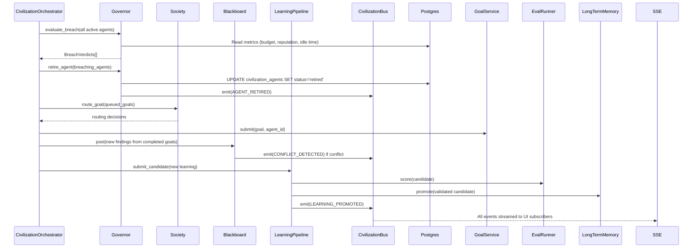

# Agent Civilization

**Civilization** is AgentVerse's multi-agent society substrate. Where a single agent executes
one goal at a time, a Civilization is a **persistent, self-governing population of agents**
that collectively solves goals through emergent coordination, reputation-based routing, and
constitution-enforced policy.

Think of it as a company of AI employees: they have roles, a shared knowledge board, a chain
of command (Governor), and a code of conduct (Constitution). New specialists can be spawned
when the workload demands them; under-performers can be retired.

---

## Core Concepts

| Concept | Description |
|---|---|
| **Civilization** | A named population of agents with a shared Constitution and Blackboard |
| **Society** | The membership registry — tracks agents, roles, and reputation scores |
| **Governor** | The sole authority that spawns or retires agents; enforces the Constitution |
| **Constitution** | The rules governing agent population limits, budget caps, and spawn rates |
| **Blackboard** | A shared knowledge space where agents post and query findings |
| **CivilizationBus** | The internal event bus connecting all sub-systems |
| **LearningPipeline** | Curated learning promotion from agent outputs to shared long-term memory |

---

## CivilizationOrchestrator

`app/civilization/orchestrator.py` — `CivilizationOrchestrator`

The Orchestrator is the **runtime coordinator**. It is the only component that enqueues Celery
tasks. Its responsibilities:

- Accept incoming goals and route them into the Society
- Trigger multi-agent debates when multiple members bid for the same goal
- Run the collective learning pipeline after goal completion
- Check Constitution breaches on each tick
- Emit SSE events for live UI subscriptions

```python
class CivilizationOrchestrator:
    def __init__(self, *, civilization_id, tenant_id, constitution,
                 governor, society, bus, blackboard, goal_service,
                 debate_orchestrator, supervisor_agent, learning_pipeline, ...):
        ...
```

All dependencies are injected at construction time. The Orchestrator is stateless between
calls — all state lives in Postgres, Redis, or the injected services.

### Goal routing

```python
async def submit_goal(self, goal: str, priority: str = "normal") -> dict:
    routing = await self._society.route_goal(goal=goal, tenant_ctx=...)
    mode = routing.get("mode", "single_agent")   # "single_agent" | "debate" | "supervisor"
    agent_id = routing.get("agent_id")
    ...
```

The Society's `AgentRouter` selects the best member based on capability match and reputation
score. Routing mode determines whether a single agent handles the goal, a debate is triggered
for high-stakes decisions, or the supervisor agent orchestrates a multi-agent workflow.

---

## Governor

`app/civilization/governor.py` — `Governor`

The Governor is the **sole authority** for creating or retiring agents within a civilization.
Every spawn and retirement decision is audited. The Governor is stateless between calls.

### Spawn evaluation

```python
async def evaluate_spawn_request(
    self, *, requester_agent_id, requested_capability, goal_text,
    depth, parent_budget_usd, parent_policy_ids, tenant_ctx,
) -> SpawnVerdict:
```

The Governor evaluates a spawn request against the Constitution using the pure `evaluate_spawn()`
function. A `SpawnVerdict` is returned with `APPROVED` or `DENIED` plus a snapshot of all
enforcement metrics at decision time. Approved spawns are immediately recorded in the audit
log via `AuditLog.log_event()`.

### Breach evaluation

Every civilization tick, the Orchestrator calls `Governor.evaluate_breach()` for each active
agent. A breach is a violation of Constitution limits (e.g., an agent exceeding its budget,
producing low-quality output for N consecutive goals, or idle for too long). Breach verdicts
can result in an agent being retired.

---

## Constitution

`app/civilization/constitution.py` — pure policy evaluator, zero I/O.

The Constitution defines hard limits for the civilization:

| Rule | Description |
|---|---|
| `max_depth` | Maximum agent spawn depth (prevents infinite recursion) |
| `max_total_agents` | Hard cap on total agents alive at once |
| `max_concurrent_agents` | Maximum agents running simultaneously |
| `spawn_rate_limit_per_min` | Rate limit on agent creation (prevents runaway spawning) |
| `total_budget_usd` | Total USD budget for the entire civilization |
| `compute_child_budget()` | Computes a child agent's budget as a fraction of parent budget |

```python
def evaluate_spawn(ctx: SpawnContext, constitution: Constitution) -> SpawnVerdict:
    # Check depth, total agents, concurrent agents, spawn rate, budget
    # Returns SpawnVerdict(decision=APPROVED|DENIED, enforcement_snapshot=...)
```

The Constitution editor in the UI (`ConstitutionEditor.tsx`) lets operators adjust these
limits in real time. Changes persist to the DB and take effect on the next tick.

---

## Blackboard

`app/civilization/blackboard.py` — `Blackboard`

The Blackboard is the civilization's **shared knowledge space**. Agents post findings with
a topic tag and confidence score. Before acting, an agent queries the Blackboard to check if
another member already has relevant knowledge, avoiding duplicate work.

**Optimistic concurrency:** Each entry has a `version` integer. Updates must supply the
expected version or they are rejected with `BlackboardConflictError`. This prevents
last-write-wins race conditions when multiple agents update the same finding concurrently.

**Conflict detection:** When two agents post conflicting high-confidence findings on the same
topic (both confidence ≥ 0.75), the Blackboard emits a `CONFLICT_DETECTED` event on the
`CivilizationBus`, which the Orchestrator routes to the `DebateOrchestrator` to resolve.

```python
async def post(self, *, agent_id, topic, content, confidence, ...):
    # Check for conflicts → trigger debate if both confidences > threshold
    # Store with optimistic version check
```

---

## A2A Dispatch within Civilization

`app/civilization/a2a_dispatch.py`

Agents within a civilization communicate via the **Agent-to-Agent (A2A) protocol**. Instead
of calling tools directly, an agent can dispatch a sub-goal to another agent in the same
civilization. The dispatch goes through:

1. `A2ADispatcher.dispatch()` — validates the request against the Constitution
2. `Governor.evaluate_spawn_request()` — spawn approval if a new agent is needed
3. `GoalService.submit()` — actual goal submission
4. Result returned to the requesting agent's context

This creates a recursive, emergent problem-solving topology where agents self-organise into
capability chains to solve goals that no single agent could handle alone.

---

## Society and Reputation

`app/civilization/society.py` — `Society`

The Society is the membership registry. Each member has:

- `role`: `worker`, `specialist`, `coordinator`, `supervisor`
- `reputation`: float seeded at 0.5, updated by EvalRunner EWMA
  (`new_rep = 0.8 * old_rep + 0.2 * new_score` using `_REPUTATION_EWMA_ALPHA = 0.2`)
- `depth`: spawn depth from the root agent
- `budget_usd` / `budget_spent_usd`: individual cost envelope
- `last_active_at`: used for idle-based retirement

Goal routing selects the agent with the highest reputation score that matches the requested
capability, maximising the quality of goal assignments over time.

---

## Learning Pipeline

`app/civilization/learning.py` — `LearningPipeline`

The Learning Pipeline enables the civilization to accumulate knowledge across runs without
contaminating shared memory with bad learnings.

**State machine:** `candidate → validated | rejected → promoted`

1. An agent submits a learning candidate after completing a goal
2. The `EvalRunner` scores the candidate (score thresholds: ≥ 0.7 → promote, ≤ 0.35 → reject)
3. Validated candidates are promoted to `LongTermMemoryStore` (shared across all civilization agents)
4. Rejected candidates are never promoted — preventing bad-learning contamination
5. The `LearningLedger` UI component shows the promotion/rejection timeline in real time

---

## Civilization Metrics

The `CivilizationMetrics` component polls the civilization's metrics endpoint and displays:

- **Agent count** — current active / peak active
- **Goal completion rate** — percentage of submitted goals that completed successfully
- **Civilization health** — composite score (reputation average × completion rate)
- **Budget consumed** — dollars spent vs. Constitution budget cap
- **Spawn rate** — agents created in the last minute vs. spawn rate limit

---

## REST API Reference

| Method | Path | Description |
|---|---|---|
| `GET` | `/civilization` | List all civilizations for the tenant |
| `POST` | `/civilization` | Create a new civilization |
| `GET` | `/civilization/:id` | Get civilization state and metrics |
| `POST` | `/civilization/:id/control` | Send a control command (`pause`, `resume`, `tick`) |
| `GET` | `/civilization/:id/events` | SSE stream of civilization events |
| `POST` | `/civilization/:id/goals` | Submit a goal to the civilization |
| `GET` | `/civilization/:id/blackboard` | Query Blackboard entries |

---

## Civilization Tick Sequence



---

## UI: Civilization Theater

The Civilization Theater page (`CivilizationPage.tsx`) organises into 7 panels:

| Panel | Description |
|---|---|
| **Map** | `CivilizationMap` — ReactFlow graph of agents as nodes, A2A calls as edges |
| **Blackboard** | `BlackboardFeed` — live feed of posted and queried findings |
| **Learnings** | `LearningLedger` — promotion/rejection timeline |
| **Spawns** | `SpawnLineageTimeline` — tree of parent→child agent spawns |
| **Debates** | `DebateViewer` — shows active and past inter-agent debates |
| **Constitution** | `ConstitutionEditor` — live-edit constitution limits |
| **Replay** | Replay a past run event-by-event |

Events arrive via `useCivilizationStream()` (SSE hook polling `/civilization/:id/events`
every 5 seconds), animating the map, metrics, and feed panels in real time.
