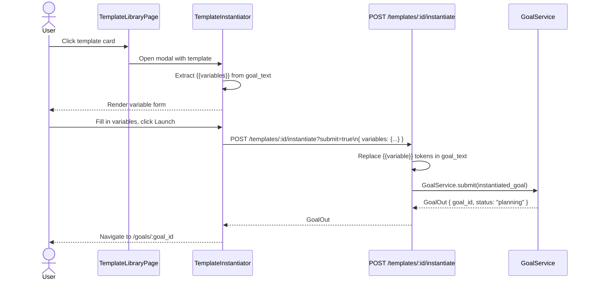

# Template Library

The **Template Library** is AgentVerse's catalog of reusable, versioned goal patterns. A
template packages a goal description with named placeholders (`{{variable}}` syntax) so it
can be instantiated repeatedly with different variable values — enabling teams to codify and
share standard operating procedures without copy-pasting goal text.

---

## Why Templates Exist

Goals in AgentVerse are one-shot: you submit them, they run, they're done. If you need to
run the "same" goal repeatedly with minor variations — different environments, services, or
time windows — you would normally re-type the whole goal each time. Templates eliminate that
friction by:

1. **Parameterising** the variable parts of a goal with `{{placeholder}}` tokens
2. **Versioning** the template text so the team knows what changed
3. **Storing** institutional knowledge about how a goal should be framed for best results
4. **Instantiating** with one click from the UI or one API call from CI

---

## Template vs. Marketplace

These two features overlap in surface but differ in scope:

| Dimension | Template Library | Marketplace |
|---|---|---|
| Ownership | Internal to your org / tenant | Public catalog (cross-tenant) |
| Audience | Your team | Any AgentVerse user |
| Discovery | Search within your tenant | Public browsing, ratings |
| Customisation | Full control over goal text | Use as-is or fork |
| Variables | Yes — `{{parameter}}` syntax | Can include variables |
| Source | Created by your team | Created by AgentVerse or community |

**Rule:** Use Templates for operationalising your org's own workflows. Use the Marketplace
to find and adopt community-built patterns.

---

## Template Anatomy

A template has the following fields:

| Field | Type | Description |
|---|---|---|
| `id` | UUID | System-generated identifier |
| `name` | string | Human-readable name, e.g. `"Deploy Microservice"` |
| `description` | string | Explains what the template does and when to use it |
| `goal_text` | string | The goal pattern with `{{variable}}` placeholders |
| `domain` | string | Category: `general`, `devops`, `engineering`, `data`, `marketing`, `sales`, `support` |
| `created_at` | ISO datetime | Creation timestamp |
| `updated_at` | ISO datetime | Last modification timestamp |

### Example template

```json
{
  "id": "tpl_abc123",
  "name": "Deploy Microservice",
  "description": "Deploys a containerised service to Kubernetes, runs smoke tests, and notifies Slack.",
  "goal_text": "Deploy {{service}} to the {{environment}} environment with image tag {{tag}}. Run smoke tests against {{health_endpoint}}. Post results to {{slack_channel}}.",
  "domain": "devops",
  "created_at": "2025-01-15T10:00:00Z",
  "updated_at": "2025-06-01T14:30:00Z"
}
```

---

## Variable Substitution

Variables are `{{double-curly-brace}}` tokens embedded in `goal_text`. The Template
Library UI automatically extracts all variable names from the template and renders a form
field for each one at instantiation time.

**Extraction logic:** The `TemplateInstantiator` component uses a regex to find all
`{{variable_name}}` tokens in `goal_text` and renders a text input for each unique name.

**Substitution at instantiation:** When the user fills the form and clicks "Use Template",
the `TemplateInstantiator` replaces every `{{variable_name}}` with the entered value before
submitting to `POST /templates/:id/instantiate`.

**Example substitution:**

```
Template:  "Deploy {{service}} to {{environment}} with tag {{tag}}"
Variables: { service: "payments-api", environment: "production", tag: "v2.4.1" }
Result:    "Deploy payments-api to production with tag v2.4.1"
```

The instantiated goal string is then sent to the agent loop as a normal goal.

---

## Creating a Template

Via the UI:

1. Click **New Template** (top-right of the Template Library page)
2. Enter a name, optional description, and the goal template text (use `{{variable}}` for
   any values that change per-use)
3. Select a domain from the dropdown
4. Click **Create Template**

The `POST /templates` endpoint creates the template and it immediately appears in the library
grid.

Via the API:

```bash
curl -X POST /templates \
  -H "X-API-Key: $API_KEY" \
  -H "Content-Type: application/json" \
  -d '{
    "name": "Weekly Jira Sprint Report",
    "description": "Generates a sprint report and emails it to the team",
    "goal_text": "Fetch all closed issues from Jira sprint {{sprint_id}} in project {{project_key}}. Create a Confluence page with a summary table. Email the page link to {{team_email}}.",
    "domain": "engineering"
  }'
```

---

## Searching and Filtering

The Template Library page includes:

- **Full-text search**: filters templates by `name`, `description`, and `goal_text` content
  (client-side, no extra API call)
- **Domain chips**: single-select domain filter; the selected domain is passed as a query
  parameter to `GET /templates?domain=devops`

Both filters apply simultaneously. Clearing the domain chip shows all templates again.

---

## Instantiating a Template

### Via UI

1. Click a template card → the **TemplateInstantiator** modal opens
2. Fill in all `{{variable}}` fields
3. Click **Launch** (or **Submit + Run** to submit immediately)

The modal sets the instantiated goal text in an editable textarea so you can review or tweak
the final goal before submitting.

### Via API

```bash
# Instantiate and submit immediately
POST /templates/:id/instantiate?submit=true
{
  "variables": {
    "service": "payments-api",
    "environment": "staging",
    "tag": "v2.3.0"
  }
}
```

With `submit=true` the backend instantiates the template, submits the resulting goal to
`GoalService`, and returns a `GoalOut` object. Without `submit=true` it returns only the
instantiated goal text for review.

---

## Instantiation Flow



---

## Version History

Every `PUT /templates/:id` call bumps an internal `version` integer. The Template Library
records the change in an `updated_at` timestamp. A dedicated version history endpoint
(`GET /templates/:id/versions`) returns a paginated list of past versions with diffs — on
the roadmap for a future release.

**Best practice:** Treat templates like source code — use meaningful names, increment
versions intentionally, and document what changed in the description field.

---

## REST API Reference

| Method | Path | Description |
|---|---|---|
| `GET` | `/templates` | List templates; optional `?domain=devops` filter |
| `POST` | `/templates` | Create a new template |
| `GET` | `/templates/:id` | Fetch a specific template |
| `PUT` | `/templates/:id` | Update template fields (bumps version) |
| `DELETE` | `/templates/:id` | Permanently delete a template |
| `POST` | `/templates/:id/instantiate` | Instantiate with variable substitution. `?submit=true` to auto-submit as goal |

### Template deletion safety

Deleting a template does **not** affect goals that were already submitted from it. The goal
text is copied at instantiation time, so running goals continue unaffected. The delete
confirmation modal (`ConfirmModal`) in the UI makes this explicit.

---

## Template Grid Layout

The template library renders a responsive 3-column grid (`lg:grid-cols-3`). Each card
(`TemplateCard.tsx`) shows:

- Template name and domain badge
- First 100 characters of `goal_text`
- **Use** button that opens the `TemplateInstantiator` modal

Cards are sorted by `updated_at` descending so recently modified templates surface first.
