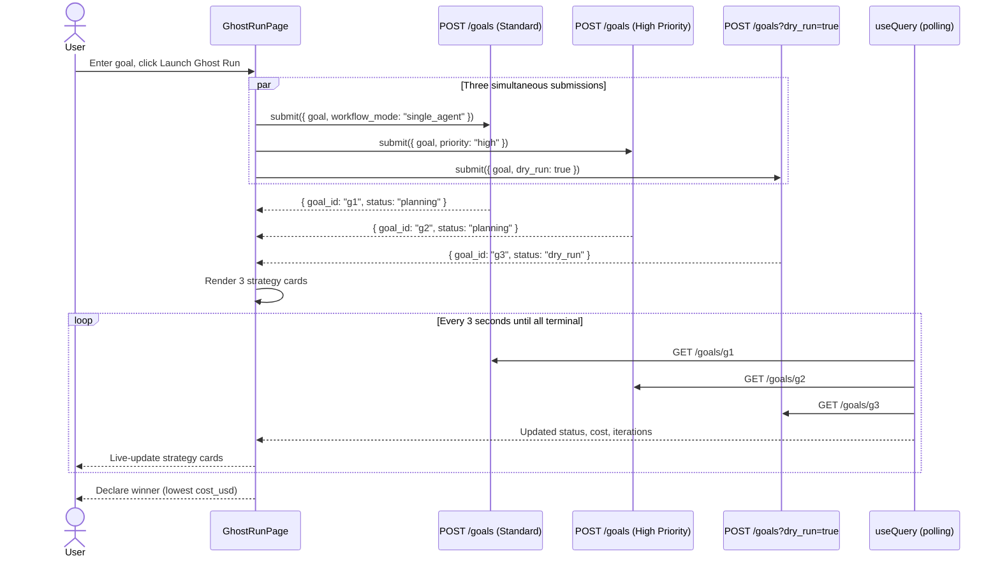

# Ghost Run — Multi-Strategy A/B Comparison

**Ghost Run** is AgentVerse's strategy comparison tool. It submits the **same goal
simultaneously under three different execution strategies** — Standard, High Priority, and
Dry Run — and presents a live comparison dashboard so you can determine which strategy
performs best before committing to production.

---

## What Ghost Run Is (and Is Not)

Ghost Run is frequently confused with the Playground. They are distinct tools with different
purposes:

| | Ghost Run | Playground |
|---|---|---|
| Real execution | Yes (Standard + High Priority strategies) | Never |
| Dry run | Yes (one of the three strategies) | Always |
| Custom mocks | No | Yes — you define every tool response |
| Purpose | Compare execution strategies | Test edge cases with synthetic responses |
| Output | Three goal IDs you can navigate to individually | Inline step-by-step trace |
| Cost | Actual cost for real-run strategies | Simulated estimate only |

Ghost Run's defining characteristic is **parallel real execution**. It is not a safe sandbox
— two of its three strategies create real goals that call real tools.

---

## The Three Strategies

When you click **Launch Ghost Run**, `GhostRunPage.tsx` calls `Promise.allSettled()` on three
simultaneous API calls:

```typescript
const [single, highPrio, dryRun] = await Promise.allSettled([
    goalsApi.submit({ goal, workflow_mode: "single_agent" }),
    goalsApi.submit({ goal, workflow_mode: "single_agent", priority: "high" }),
    goalsApi.submit({ goal, dry_run: true }),
]);
```

| Strategy | Submission params | Description |
|---|---|---|
| **Standard** | `workflow_mode: "single_agent"` | Default agent loop, normal priority queue |
| **High Priority** | `workflow_mode: "single_agent", priority: "high"` | Jumps the Celery queue to `goals.professional` routing |
| **Dry Run** | `dry_run: true` | No tools called; returns planned steps immediately |

All three goals are created simultaneously. The UI polls all three every 3 seconds until they
reach a terminal state (`complete`, `failed`, `cancelled`).

---

## Winner Selection

The "Best" badge is awarded to the completed strategy with the lowest `cost_usd`:

```typescript
const winner = displayResults
    .filter(r => r.status === "complete" || r.status === "completed")
    .sort((a, b) => ((a.cost ?? 999) - (b.cost ?? 999)))[0];
```

This heuristic favours cost efficiency. If both Standard and High Priority complete, the
winner is whichever spent fewer tokens. If only one completes, it wins by default. If
neither completes (both failed), no winner is declared.

---

## Live Polling

After the initial submission, the UI polls all three goal statuses simultaneously every 3
seconds using TanStack Query:

```typescript
const { data: polledResults } = useQuery({
    queryKey: ["ghost-run-results", results.map(r => r.goalId).join(",")],
    queryFn: async () => {
        const fetched = await Promise.allSettled(
            results.map(r => goalsApi.get(r.goalId))
        );
        return fetched.map((r, i) => ({ ...results[i], status: r.value.status, ... }));
    },
    refetchInterval: (query) => {
        const allDone = query.state.data?.every(r => TERMINAL.has(r.status));
        return allDone ? false : 3000;  // Stop polling when all terminal
    },
});
```

Polling stops automatically when all three goals reach a terminal state.

---

## Comparing Plan Depth

The Dry Run strategy returns a plan immediately without executing any tools. Comparing its
`iterations` (planned step count) against the actual `iterations` of the Standard run tells
you how accurately the planner predicted execution depth:

- **Planner accuracy**: If `dryRun.iterations ≈ standard.iterations`, the planner is reliable
- **Over-planning**: If `dryRun.iterations >> standard.iterations`, the planner was conservative
- **Under-planning**: If `dryRun.iterations << standard.iterations`, the agent replanned mid-run

Navigate to `/goals/:goalId` for each strategy to see full execution traces, SSE event logs,
and verifier scores.

---

## When to Use Ghost Run

| Scenario | Use Ghost Run? |
|---|---|
| Before the first production deployment of a new agent | Yes — compare Standard vs High Priority cost |
| Verifying a change to an agent's system prompt | Yes — compare old vs new (submit twice) |
| Testing whether High Priority actually improves latency | Yes |
| Checking that the Dry Run plan matches real execution | Yes |
| Debugging a broken tool integration | No → use Playground (safe mocks) |
| Exploring how an agent handles edge-case inputs | No → use Playground |

**Important:** Ghost Run submits real goals that consume quota and may interact with external
systems. Ensure the goal text is appropriate for production tool access before launching.

---

## API: Underlying Goal Submissions

Ghost Run uses the standard goals API. There is no dedicated `/ghost-run` endpoint. Each
strategy maps to a `POST /goals` call with different parameters:

```bash
# Strategy 1: Standard
POST /goals
{ "goal": "...", "workflow_mode": "single_agent" }

# Strategy 2: High Priority
POST /goals
{ "goal": "...", "workflow_mode": "single_agent", "priority": "high" }

# Strategy 3: Dry Run
POST /goals?dry_run=true
{ "goal": "..." }
```

The `dry_run=true` query parameter routes the goal through the agent planning phase only.
The planner generates a `WorkflowPlan`, the verifier labels it `status: "dry_run"`, and the
response is returned immediately without ever entering the Celery task queue.

---

## Ghost Run Sequence



---

## Interpreting Results

Each strategy card shows:

- **Strategy name**: Standard, High Priority, or Dry Run
- **Status badge**: `StatusBadge` component — colour-coded (green=complete, red=failed, etc.)
- **Cost**: `$0.0042` (actual spend for real runs; blank for Dry Run)
- **Iterations**: number of execution steps taken
- **Best badge**: Trophy icon on the lowest-cost completed strategy
- **Track link**: navigates to `/goals/:goalId` for the full execution trace

The Dry Run result is always the fastest to appear (sub-second). Standard and High Priority
results appear as the agent loop progresses.

---

## Production Safeguards

Before launching a Ghost Run in production:

1. **Check tool policies**: Some MCP connectors have write operations (Jira issue creation,
   Slack messages). If the goal might trigger writes, use Playground first to validate the
   plan, then Ghost Run with caution.
2. **Budget limits**: High Priority goals consume the same tokens as Standard. Running both
   doubles the token cost for this goal.
3. **HITL gates**: If the agent encounters high-risk steps (`deploy`, `delete`, `prod`), both
   real strategies will pause at the Human Approval gate. Ensure approvers are online.
4. **Rate limits**: Ghost Run submits 3 goals simultaneously. If your plan is set to a low
   per-tenant goal concurrency limit, the third submission may be queued.
