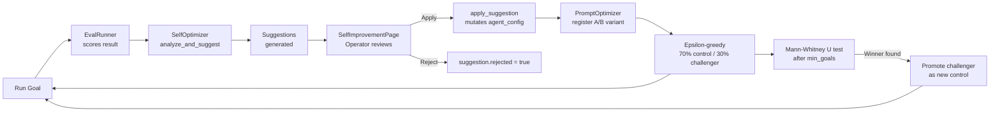
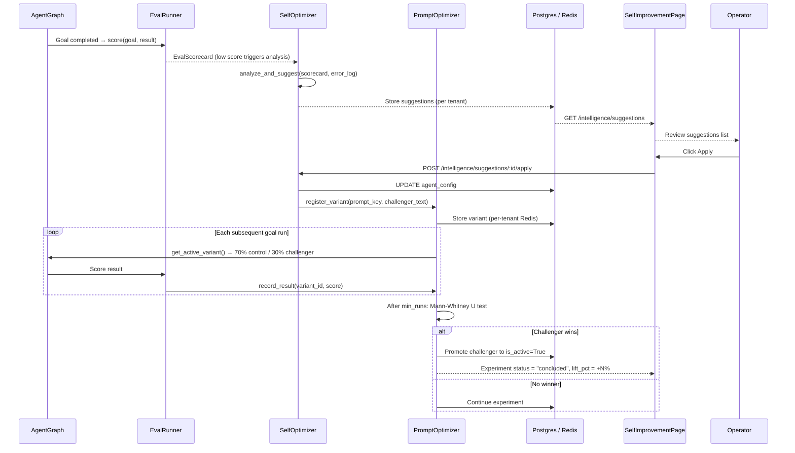

# Self-Improvement

**Self-Improvement** is AgentVerse's closed-loop optimization system. It automatically
observes agent performance, identifies failure patterns, generates targeted improvement
suggestions, and uses Bayesian A/B testing to validate that changes actually improve outcomes
before promoting them permanently.

---

## The Self-Improvement Loop



The loop runs continuously in production. Human operators only need to review the suggestions
queue on the **Suggestions tab** — applying good ones and rejecting bad ones. The statistical
testing and promotion happen automatically.

---

## SelfOptimizer v1

`app/intelligence/self_optimization.py` — `SelfOptimizer`

The v1 optimizer is rule-based. It analyses a failed or low-scoring `EvalScorecard` and
produces `OptimizationSuggestion` objects based on heuristic pattern matching:

| Pattern | Suggestion | Change type |
|---|---|---|
| `scorecard.average_score() < 0.5` | "Add more specific planning instructions" | `improve_planner_prompt` |
| `"tool"` or `"not found"` in error log | "Expand available tool context in executor" | `add_tool_access` |
| `efficiency_score < 0.4` | "Reduce max_iterations or add early-termination" | `increase_iterations` |

Each suggestion has a `confidence` field (0.0–1.0), a `before`/`after` showing the current
vs. recommended state, and a `change_type` that drives the mutation logic in `apply_suggestion()`.

### Suggestion categories

| Category | Change types | What it changes |
|---|---|---|
| `prompt` | `improve_planner_prompt`, `improve_executor_prompt`, `add_domain_context` | Appends text to `agent_config["goal_template"]` |
| `tool_selection` | `add_tool_access` | Appends connector_id to `agent_config["connector_ids"]` |
| `retry_strategy` | `increase_iterations` | Sets `agent_config["max_iterations"]` to a new value |

---

## Applying a Suggestion

`SelfOptimizer.apply_suggestion()` performs two actions atomically:

### 1. Mutate agent config

```python
# Prompt improvement
if change_type in ("improve_planner_prompt", "improve_executor_prompt", "add_domain_context"):
    if agent_config and "goal_template" in agent_config:
        agent_config["goal_template"] += f"\n\n{suggestion.after}"

# Increase iterations
elif change_type == "increase_iterations":
    agent_config["max_iterations"] = int(suggestion.after or "5")

# Add tool access
elif change_type == "add_tool_access":
    agent_config["connector_ids"] = existing + [suggestion.after]
```

### 2. Register A/B variant in PromptOptimizer

For prompt-type suggestions, the system automatically registers a prompt variant for A/B
testing:

```python
variant = PromptVariant(
    variant_id=suggestion.suggestion_id,
    prompt_key="planner" if "planner" in change_type else "executor",
    prompt_text=suggestion.after,
    is_control=False,
)
_default_optimizer.register_variant(...)
```

This means applying a suggestion doesn't immediately force all agents to use the new prompt.
Instead it enters the A/B testing pipeline where it competes against the current control.

---

## SelfOptimizerV2: Production-Grade Bayesian Testing

`app/intelligence/self_optimizer_v2.py` — `SelfOptimizerV2`

V2 addresses four critical bugs in v1 and adds a statistically rigorous A/B testing engine:

| Fix | Description |
|---|---|
| **Fix 1** | `apply_suggestion()` passes the actual agent config from DB (v1 passed nothing) |
| **Fix 2** | Reads real current agent config from DB (v1 used literal string `"before"`) |
| **Fix 3** | Per-tenant Redis state (`optstate:{tenant_id}:{agent_id}`) replaces global dict |
| **Fix 4** | `DEFAULT_MIN_GOALS = 5` — optimizer triggers after 5 completions (was 50) |
| **Fix 5** | `_maybe_conclude_experiment()` uses single DB session (no stale session after commit) |
| **Fix 6** | `_bayesian_prob_better()` uses `numpy.default_rng()` per call (thread-safe) |

### Domain-specific success metrics

V2 maps agent domains to appropriate success metrics:

```python
DOMAIN_METRICS = {
    "legal":      "citation_accuracy",
    "healthcare": "eval_score",       # HIPAA-safe: no PHI in eval
    "finance":    "compliance_rate",
    "education":  "resolution_rate",
    "ecommerce":  "conversion_rate",
}
```

### LLM-generated improvement suggestions

The V2 optimizer uses a structured LLM prompt to generate suggestions:

```
You are an AI agent optimization specialist.
Given an agent's current configuration and performance metrics, suggest ONE targeted
improvement to the system prompt or configuration...

Respond with ONLY valid JSON:
{
  "suggested_change": {
    "field": "system_prompt",
    "current_value_excerpt": "...",
    "new_value": "complete new value for this field"
  },
  "rationale": "This change improves citation accuracy by...",
  "expected_uplift_pct": 8.5,
  "confidence": "medium"
}
```

This generates specific, actionable suggestions with an expected uplift percentage, rather
than vague heuristic rules.

---

## PromptOptimizer: A/B Testing Engine

`app/intelligence/prompt_optimizer.py` — `PromptOptimizer`

### Variant selection: epsilon-greedy

When the agent loop selects a prompt variant for a goal run, the optimizer uses an
**epsilon-greedy** strategy:

- **70% of runs** use the current control (the active, known-good variant)
- **30% of runs** use a challenger variant (the new suggestion being tested)

This ensures the control continues to serve most traffic while gathering sufficient data on
the challenger.

### Promotion: Mann-Whitney U test

After `min_runs_for_promotion` (default 100, configurable) runs on both arms, the optimizer
calls the Mann-Whitney U non-parametric test on the two distributions of `eval_scores`:

```python
# Conceptually:
u_stat, p_value = mannwhitneyu(control_scores, challenger_scores, alternative='less')
if p_value < (1 - self._confidence) and np.mean(challenger) > np.mean(control):
    # Challenger wins — promote to is_active=True, archive control
    ...
```

The Mann-Whitney U test is used instead of a t-test because eval scores are not normally
distributed. A p-value threshold of `1 - confidence` (default 0.05 for 95% confidence) gates
promotion.

### Variant registry

Each tenant has an isolated variant registry (fixing the cross-tenant leakage bug from v1):

```python
self._variants: dict[str, dict[str, PromptVariant]] = {}  # tenant_id → {variant_id: ...}
self._active: dict[str, dict[str, str]] = {}               # tenant_id → {prompt_key: variant_id}
```

Per-tenant Redis keys (`optstate:{tenant_id}:{agent_id}`) persist optimization state with a
90-day TTL.

---

## SelfImprovementPage UI

The UI has three tabs:

### Experiments tab

Lists active and concluded A/B experiments. Each experiment card shows:

- Experiment name and status badge (`running`, `concluded`, `pending`)
- Lift percentage (`+4.2%` in green / `-1.1%` in red)
- Agent ID (first 12 chars + `…`)
- Expandable detail with a side-by-side bar chart of Control vs. Challenger config values
- Conclusion date and start date

### Suggestions tab

Lists pending, applied, and rejected optimization suggestions. Each card shows:

- Suggestion type (formatted as human-readable: `improve planner prompt`)
- Status badge with colour coding
- Confidence percentage (`70% confidence`)
- Description text
- Agent ID
- **Apply** (green) and **Reject** (border) action buttons for pending suggestions

A badge count on the Suggestions tab shows the number of pending items awaiting review.

### History tab

A vertical timeline of all **concluded** experiments, ordered by `concluded_at`. Each
timeline node shows the experiment name, lift percentage, and conclusion date.

---

## REST API Reference

| Method | Path | Description |
|---|---|---|
| `GET` | `/intelligence/suggestions` | List all suggestions for the tenant |
| `POST` | `/intelligence/suggestions/:id/apply` | Apply a suggestion (mutates agent config + registers A/B variant) |
| `POST` | `/intelligence/suggestions/:id/reject` | Reject a suggestion |
| `GET` | `/intelligence/experiments` | List A/B experiments |
| `GET` | `/intelligence/experiments/:id` | Get experiment detail with lift and config diff |

---

## Optimization Cycle Summary


