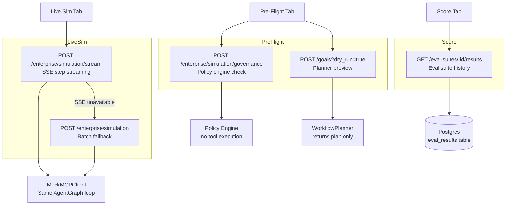
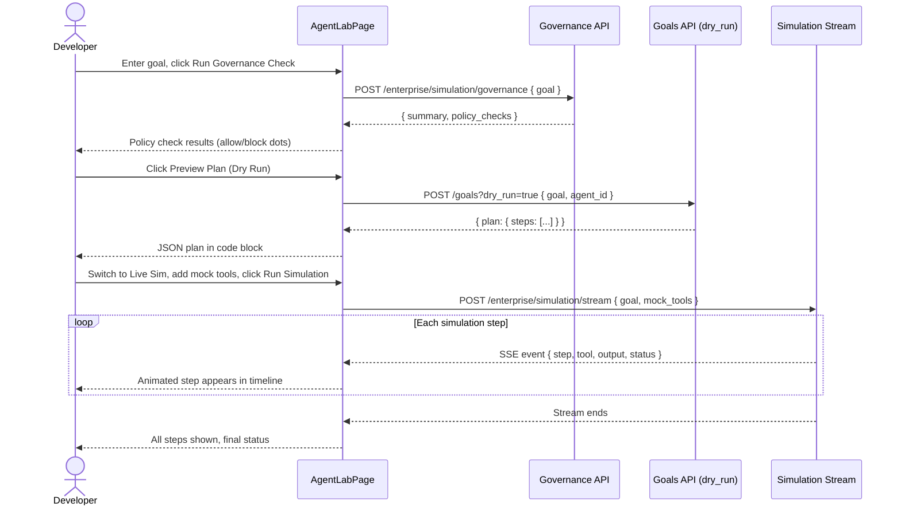

# Agent Lab

**Agent Lab** is AgentVerse's experimental workbench for testing and validating agent
configurations before they touch production. It consolidates three distinct testing modes —
Pre-Flight governance checks, Live Simulation with custom mocks, and Eval Suite scoring —
into a single tabbed interface.

---

## Overview

Where the Playground tests a single goal with custom tool responses, and Ghost Run compares
execution strategies against real systems, Agent Lab is the **pre-flight validation surface**
— a place to answer the question: "Is this agent configuration safe and correct to deploy?"

The Lab has three tabs:

| Tab | Purpose | Real tools? |
|---|---|---|
| **Pre-Flight** | Governance and policy check + Dry Run plan preview | No |
| **Live Sim** | SSE-streamed simulation with custom mock tools | No |
| **Score** | Eval suite results and red-team status dashboard | No (reads historical data) |

---

## Tab 1: Pre-Flight

The Pre-Flight tab answers two questions before a goal is submitted to production:

1. **Will governance policies allow this goal to run?**
2. **What does the planner intend to do?**

### Governance Check

Calls `simulationApi.runGovernance(goal)` → `POST /enterprise/simulation/governance`.

The governance check runs the goal through the **policy engine** (without executing any
tools) and returns:

```json
{
  "summary": {
    "allowed_tools": 3,
    "blocked_tools": 1,
    "risk_level": "medium",
    "hitl_required": true
  },
  "policy_checks": [
    { "tool": "kubernetes.apply", "result": "block" },
    { "tool": "jira.search_issues", "result": "allow" },
    { "tool": "confluence.create_page", "result": "allow" },
    { "tool": "slack.post_message", "result": "allow" }
  ]
}
```

Each policy check is rendered as a coloured dot: green for `allow`, red for `block`. A
blocked tool means the goal will fail or require a policy exception before it can run.

### Dry Run Plan Preview

Calls `goalsApi.submit({ goal, agent_id, dry_run: true })` → `POST /goals?dry_run=true`.

Returns the planner's intended execution steps as a JSON object. Rendered in a code block
for inspection. This lets you verify that the agent understood the goal correctly before
it runs anything.

### Why Pre-Flight Matters

Running a governance check before a production deployment catches policy blockers early —
preventing the frustrating scenario where a goal starts executing, completes 8 of 10 steps,
and then fails because a tool was blocked.

---

## Tab 2: Live Sim

The Live Sim tab is a more powerful version of the standalone Playground. It adds:

- **SSE streaming**: steps appear one by one as the simulation progresses, with animated
  status rings (blue=running, green=done, red=error)
- **Per-tool mock builder**: a structured UI for adding/editing/removing mock tools (vs. raw
  JSON in the Playground)
- **Stop button**: abort the simulation mid-run via `AbortController`
- **Fallback to batch mode**: if the SSE endpoint is unavailable, automatically falls back to
  `playgroundApi.simulate()` and renders all steps at once

### Mock Tools Builder

The `MockToolsBuilder` component renders each mock tool as two fields:

```
┌──────────────────────────────┐
│ tool_name                    │  ← instrument.tool_name format
│ {"result": "mock output"}    │  ← raw JSON response
│                         [✕]  │  ← remove
└──────────────────────────────┘
```

Tools with empty names are valid — they act as catch-all responses. The mock map is
serialised as `Record<string, string>` and sent to `POST /enterprise/simulation/stream`.

### SSE Step Streaming

The Live Sim connects to `POST /enterprise/simulation/stream` and reads the response body
as a Server-Sent Events stream:

```
data: {"step": "Fetch open Jira issues", "tool": "jira.search_issues", "status": "done", "output": "[{\"id\":\"B-1\"..."}

data: {"step": "Create Confluence page", "tool": "confluence.create_page", "status": "done", "output": "{\"id\":\"1234\""}
```

Each `data:` line is parsed as a `SimStep` and appended to the step timeline, which
re-renders in real time. The `StepTimeline` component applies status-specific border and
background colours:

| Status | Border | Background |
|---|---|---|
| `running` | `border-blue-300` | `bg-blue-50/40` (pulsing badge) |
| `done` | `border-green-300/50` | `bg-green-50/30` |
| `error` | `border-red-300/50` | `bg-red-50/30` |
| `pending` | `border-border` | `bg-card` |

---

## Tab 3: Score

The Score tab surfaces historical eval suite performance and red-team status.

### Eval Suite Results Chart

Queries the latest eval suite run results via `evalSuitesApi.getSuiteResults()`. Renders
the last 10 runs as a grouped bar chart (`ThemedBarChart`) with three series:

- **Score** (blue): `overall_score` for the run (0.0–1.0 scaled to percentage)
- **Passed** (green): number of test cases that passed
- **Failed** (red): number of test cases that failed

X-axis labels are the first 8 characters of each `run_id`. This gives an instant visual of
whether agent quality is trending up, down, or stable across recent runs.

### Agent selector

A dropdown filters eval results by agent ID. The "All agents" option aggregates results
across all agents for a civilization-level view.

### Red-Team Status

Displays a static summary of the red-team testing configuration. Full red-team result data
(adversarial prompt attempts, jailbreak resistance scores, prompt injection test outcomes)
is managed from the Enterprise section.

---

## Architecture: How the Three Tabs Connect



---

## Pre-Flight + Live Sim Sequence



---

## Lab vs. Other Testing Tools

| Question | Tool |
|---|---|
| Will governance block this tool? | **Agent Lab → Pre-Flight** |
| What will the planner produce? | **Agent Lab → Pre-Flight** |
| How does the agent behave with specific mock responses? | **Agent Lab → Live Sim** (or Playground) |
| Is quality improving over time? | **Agent Lab → Score** |
| Compare Standard vs. High Priority execution | **Ghost Run** |
| Test extreme edge cases with crafted responses | **Playground** |

---

## Exporting a Winning Config

After using the Score tab to identify which agent configuration produces the best eval
scores, use the following workflow to promote it:

1. Navigate to **Agents → Agent Detail** (`/agents/:agentId`)
2. Compare the current config with the challenger config shown in the A/B experiment detail
   (from **Self-Improvement → Experiments**)
3. Apply the winning config fields manually via the Agent Edit form, or use
   `PUT /agents/:agentId` with the updated `system_prompt` / `goal_template` /
   `max_iterations`
4. Re-run an eval suite from the Score tab to confirm the production agent now achieves
   the expected score improvement

There is no one-click "promote to production" button yet — the config update requires an
intentional edit to the agent record. This is by design: it forces a human review before
mutating a production agent's behaviour.
