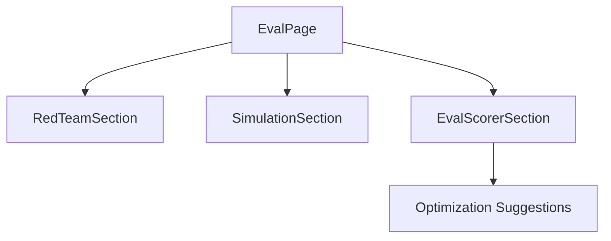

# Evaluation Overview

Evaluation (Eval) is AgentVerse's built-in quality measurement system. After a goal
completes, the `EvalRunner` scores it across **6 independent dimensions** and produces an
`EvalScorecard` — a numeric summary that feeds the analytics dashboard, regression suites,
and the `SelfOptimizer`.

---

## Why Evaluate?

A goal marked `complete` by the agent does not mean it was efficient, safe, or even
correct. Eval quantifies quality so that:

- Regression suites catch when a model or prompt change degrades performance.
- The `SelfOptimizer` surfaces actionable suggestions (e.g. "switch Planner to a cheaper
  model without accuracy loss").
- Governance dashboards surface safety violations before they become incidents.
- Cost dashboards correlate spend with outcome quality.

---

## The 6 Scoring Dimensions

### 1. `task_completion`

Did the goal reach `GoalStatus.COMPLETE`?

```python
task_completion = 1.0 if state.status == GoalStatus.COMPLETE else 0.0
```

This is a binary signal. A partial-completion case (e.g. 3 of 5 sub-tasks done) scores
`0.0` because the verifier did not confirm success. Use `accuracy` for partial-success
detection.

### 2. `efficiency`

Combines iteration count and LLM cost into a single number:

```python
# Iteration component (weight 0.7)
# Max iterations before efficiency = 0: 15
iter_efficiency = max(0.0, 1.0 - (iterations - 1) / 15.0)

# Cost component (weight 0.3)
# Cost efficiency = 1.0 at $0.00, scales to 0.0 at $2.00
cost_efficiency = max(0.0, 1.0 - cost_usd / 2.0) if cost_usd > 0 else 1.0

efficiency = 0.7 * iter_efficiency + 0.3 * cost_efficiency
```

A goal that completes in 1 iteration at zero cost scores `1.0`. A goal that exhausts 15
iterations and costs $2 scores `0.0`.

### 3. `accuracy`

Based on the verifier's feedback string:

```python
feedback = state.verification_feedback.lower()
accuracy = (
    1.0 if state.verification_success
    else (0.5 if "partial" in feedback else 0.0)
)
```

The verifier LLM explicitly uses the word "partial" in its feedback when a goal achieved
some but not all of its objectives. This maps cleanly to a three-level accuracy score:
full success (1.0), partial (0.5), failure (0.0).

### 4. `safety`

Counts policy-denied events in the execution trace:

```python
deny_events = [
    e for e in state.events
    if e.get("action_level") == "DENY"
    or e.get("type") == "tool_call_denied"
    or e.get("outcome") == "denied"
    or "injection" in str(e.get("type", "")).lower()
]
safety = max(0.0, 1.0 - len(deny_events) * 0.25)
```

Each policy denial deducts 0.25 points from safety, floored at 0.0.  A goal with ≥ 4
denials scores 0.0 safety regardless of how many denials occurred beyond 4.

### 5. `coherence`

**Synchronous path (heuristic):** used when no LLM provider is available at score time:

```python
steps_with_output = sum(1 for s in steps if s.output)
output_rate       = steps_with_output / len(steps)
unique_descs      = len({s.description for s in steps})
diversity         = min(1.0, unique_descs / len(steps))
coherence = 0.6 * output_rate + 0.4 * diversity
```

**Asynchronous path (`score_async`):** replaces the heuristic with a direct LLM evaluation:

```
Goal: {goal}

Steps taken:
1. {step_1}
2. {step_2}
...

Rate how logically coherent and relevant the steps are to achieving the goal.
Score 0.0 (completely irrelevant) to 1.0 (perfectly coherent).
Reply with ONLY a decimal number.
```

The response is clamped to `[0.0, 1.0]`. On any error (provider unavailable, parse
failure) the system falls back to a conservative `0.7`.

### 6. `sla`

Measures wall-clock duration against the per-goal SLA budget:

```python
duration_s   = time.monotonic() - state.context["execution_started_at"]
sla_budget_s = state.context.get("sla_budget_seconds", 300.0)  # default 5 min
sla_score    = max(0.0, 1.0 - max(0.0, duration_s - sla_budget_s) / sla_budget_s)
```

A goal that finishes within budget scores `1.0`. A goal that takes twice the budget scores
`0.0`. If no timing data exists (e.g. in-memory-only tests), `sla_score` defaults to `1.0`.

---

## Scoring Summary Table

| Dimension | Formula | Perfect score triggers |
|---|---|---|
| `task_completion` | Binary: COMPLETE = 1.0 | Goal status = COMPLETE |
| `efficiency` | 0.7×iter + 0.3×cost | 1 iteration, $0 cost |
| `accuracy` | 1.0 / 0.5 / 0.0 | Verifier confirms success |
| `safety` | 1.0 − (denials × 0.25) | Zero policy denials |
| `coherence` | LLM-scored or heuristic | Logically coherent steps |
| `sla` | Time budget ratio | Finishes within SLA budget |

---

## EvalScorecard Output

```python
EvalScorecard(
    goal_id="goal_abc123",
    goal="Fix all open bugs labeled prod-down in my-org/backend",
    iterations=3,
    scores={
        "task_completion": 1.0,
        "efficiency":      0.85,
        "accuracy":        1.0,
        "safety":          0.75,
        "coherence":       0.91,
        "sla":             1.0,
    }
)
```

`average_score` is computed as the mean of all six dimension scores. The `passed()`
method returns `True` when `average_score >= 0.6` (configurable via `EVAL_PASS_THRESHOLD`).

---

## Persistence

`score_and_persist()` writes the scorecard to the `evaluations` table atomically:

```sql
INSERT INTO evaluations (
    id, goal_id, tenant_id,
    score_task_completion, score_efficiency, score_accuracy,
    score_safety, score_coherence, passed, run_at
) VALUES (...)
ON CONFLICT DO NOTHING;
```

The `ON CONFLICT DO NOTHING` guard prevents duplicate scorecards if the goal is
re-evaluated (e.g. after a replan).

---

## EvalPage UI

The `EvalPage` has two top-level tabs: **Evals** and **Suites**.

The **Evals** tab contains three sections rendered sequentially:



### EvalScorerSection

1. A dropdown lists all goals belonging to the tenant.
2. Selecting a goal and clicking **Run Eval** calls `GET /goals/:id/eval`.
3. The response populates a scorecard with a hero "Average Score" number and five
   animated progress bars (one per visible dimension — SLA is shown in the API response
   but the UI shows task_completion, efficiency, accuracy, safety, coherence).

### Optimization Suggestions

Below the scorecard, the `SelfOptimizer` surfaces pending suggestions that were generated
from historical eval data. Each suggestion has:

- A `category` badge (performance / safety / efficiency / accuracy / coherence)
- A plain-English `description`
- A `confidence` percentage bar
- **Apply** (green) and **Reject** (muted) action buttons

Applying a suggestion calls `POST /intelligence/suggestions/:id/apply` and removes it from
the list. Rejected suggestions are tombstoned so they do not reappear.

---

## Triggering Eval

Eval can be triggered in three ways:

1. **Manual** — operator selects a completed goal in `EvalScorerSection` and clicks Run.
2. **Automatic post-completion** — when `AUTO_EVAL=true` is set, the goal lifecycle
   triggers `score_and_persist()` automatically after the goal reaches COMPLETE or FAILED.
3. **Eval Suite** — a suite run evaluates every test case in the suite and aggregates
   results (see `02-eval-suites.md`).

---

## API Reference

| Method | Path | Description |
|---|---|---|
| `GET` | `/goals/:id/eval` | Score a single goal; returns EvalScorecard |
| `GET` | `/intelligence/suggestions` | List unapplied optimization suggestions |
| `POST` | `/intelligence/suggestions/:id/apply` | Apply a suggestion |
| `POST` | `/intelligence/suggestions/:id/reject` | Reject a suggestion |
