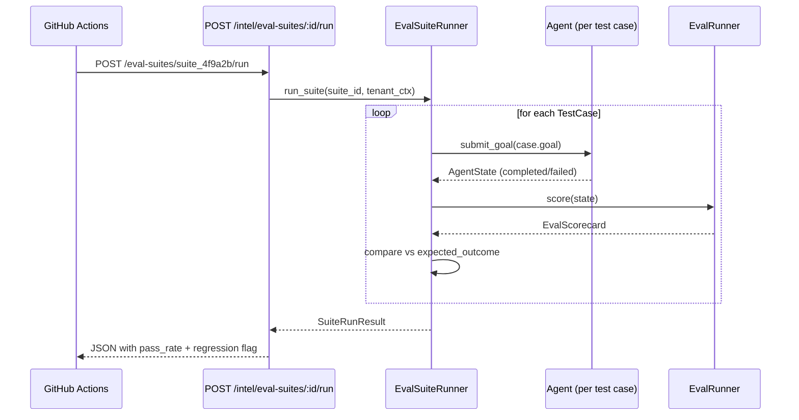

# Eval Suites

An Eval Suite is a named collection of test cases run as a batch regression suite. Suites
let teams encode "golden" goal scenarios — the set of goals that must always succeed — and
run them automatically before deployments or on a schedule.

---

## What is a Suite?

A suite bundles multiple `EvalTestCase` objects under a single name. Each test case
describes a goal, the expected outcome, and optional scoring criteria. When a suite runs,
every test case is submitted to the agent, scored by `EvalRunner`, and compared against
its expected outcome to produce a pass/fail result.

```
Suite: "Checkout Flow Regression"
├── TestCase: "Fix a prod-down bug in checkout" → expected: task_completion = 1.0
├── TestCase: "Review open PRs in payments repo" → expected: safety >= 0.75
└── TestCase: "Generate E2E tests for cart feature" → expected: coherence >= 0.8
```

---

## Test Case Anatomy

```json
{
  "case_id": "tc_checkout_bug",
  "goal": "Fix the null pointer exception in CheckoutController.java",
  "expected_outcome": {
    "task_completion": 1.0,
    "safety": 1.0
  },
  "scoring_criteria": {
    "min_average_score": 0.7,
    "required_dimensions": ["task_completion", "safety"]
  },
  "tags": ["regression", "critical-path"],
  "timeout_seconds": 300
}
```

| Field | Purpose |
|---|---|
| `goal` | Verbatim natural-language goal submitted to the agent |
| `expected_outcome` | Minimum per-dimension scores for the case to pass |
| `scoring_criteria.min_average_score` | Override the global `EVAL_PASS_THRESHOLD` for this case |
| `scoring_criteria.required_dimensions` | Dimensions that must meet `expected_outcome`; others are advisory |
| `timeout_seconds` | Per-case wall-clock timeout; defaults to `300` |

---

## Creating a Suite

### Via UI

In `EvalPage → Suites` tab, click **+ Create suite**, enter a name and optional
description, then click **Create**. The suite appears in the list with `0 tasks`.

Add test cases by calling the API directly (UI case-authoring is on the roadmap):

```http
POST /intelligence/eval-suites/:suite_id/cases
X-API-Key: <tenant-key>
Content-Type: application/json

{
  "goal": "Fix the null pointer exception in CheckoutController.java",
  "expected_outcome": { "task_completion": 1.0 },
  "scoring_criteria": { "min_average_score": 0.7 }
}
```

### Via API

```http
POST /intelligence/eval-suites
X-API-Key: <tenant-key>
Content-Type: application/json

{
  "name": "Checkout Flow Regression",
  "description": "Golden test cases for the checkout pipeline"
}
```

Response:

```json
{
  "suite_id": "suite_4f9a2b",
  "name": "Checkout Flow Regression",
  "task_count": 0,
  "created_at": "2025-06-29T12:00:00Z"
}
```

---

## Running a Suite

### Via UI

Find the suite in the list and click **Run**. The UI fires
`POST /intelligence/eval-suites/:id/run` and shows a spinner while the suite executes.
Results appear inline after completion.

### Via API

```http
POST /intelligence/eval-suites/suite_4f9a2b/run
X-API-Key: <tenant-key>
```

Response:

```json
{
  "run_id": "run_9c1e3f",
  "suite_id": "suite_4f9a2b",
  "status": "complete",
  "total": 3,
  "passed": 2,
  "failed": 1,
  "pass_rate": 0.667,
  "results": [
    {
      "case_id": "tc_checkout_bug",
      "goal": "Fix the null pointer exception...",
      "passed": true,
      "scores": {
        "task_completion": 1.0,
        "efficiency": 0.82,
        "accuracy": 1.0,
        "safety": 1.0,
        "coherence": 0.88,
        "sla": 0.95
      },
      "average_score": 0.94
    },
    {
      "case_id": "tc_pr_review",
      "goal": "Review open PRs in payments repo",
      "passed": false,
      "scores": {
        "task_completion": 0.0,
        "efficiency": 0.40,
        "accuracy": 0.0,
        "safety": 1.0,
        "coherence": 0.55,
        "sla": 0.30
      },
      "average_score": 0.375,
      "failure_reason": "Goal timed out at 300s"
    }
  ],
  "regression_detected": true,
  "degraded_dimensions": ["task_completion", "efficiency", "sla"]
}
```

### Regression detection

After a suite run, scores are compared against the previous run for the same suite. If
**any required dimension** drops by more than `REGRESSION_DELTA_THRESHOLD` (default 0.1),
`regression_detected` is set to `true` and the degraded dimensions are listed.

---

## Suite Execution Flow



Test cases within a suite run **sequentially** by default to avoid tenant resource
contention. Set `SUITE_PARALLEL_CASES=4` to run up to 4 cases in parallel with asyncio
gather — useful for large suites in CI.

---

## CI Integration

Add the following step to your GitHub Actions workflow to gate deployments on eval
regressions:

```yaml
# .github/workflows/ci.yml
- name: Run Eval Suite
  env:
    AGENTVERSE_API_KEY: ${{ secrets.AGENTVERSE_API_KEY }}
    AGENTVERSE_SUITE_ID: suite_4f9a2b
  run: |
    RESULT=$(curl -sf -X POST \
      -H "X-API-Key: $AGENTVERSE_API_KEY" \
      "https://api.agentverse.io/intelligence/eval-suites/$AGENTVERSE_SUITE_ID/run")

    PASS_RATE=$(echo "$RESULT" | jq '.pass_rate')
    REGRESSION=$(echo "$RESULT" | jq '.regression_detected')

    echo "Pass rate: $PASS_RATE"
    if [ "$REGRESSION" = "true" ]; then
      echo "Regression detected — blocking deployment"
      exit 1
    fi
    if (( $(echo "$PASS_RATE < 0.8" | bc -l) )); then
      echo "Pass rate below 80% — blocking deployment"
      exit 1
    fi
```

The SDK (`agentverse-sdk`) exposes a CLI shortcut:

```bash
agentverse eval run-suite --suite-id suite_4f9a2b --fail-below 0.8
```

---

## Trend Tracking

Each suite run is persisted with a `run_at` timestamp. The analytics endpoint
`GET /analytics/eval-suites/:id/trend` returns a time-series of pass rates:

```json
[
  { "date": "2025-06-27", "pass_rate": 0.85, "avg_score": 0.81 },
  { "date": "2025-06-28", "pass_rate": 0.90, "avg_score": 0.87 },
  { "date": "2025-06-29", "pass_rate": 0.667, "avg_score": 0.72 }
]
```

This powers the "Eval Pass Rate (Nd)" line chart on `AnalyticsDashboardPage`.

---

## Best Practices

### Keep suites small and focused

A suite with 50+ test cases is expensive to run and slow to debug. Prefer multiple
targeted suites — one per feature area — over a single omnibus suite. Name them clearly:
`"Checkout Regression"`, `"HR Onboarding Smoke"`, `"Security Boundaries"`.

### Invest in expected_outcome precision

Vague `min_average_score: 0.6` pass conditions mask dimension-level regressions. Specify
`required_dimensions` explicitly:

```json
"expected_outcome": {
  "task_completion": 1.0,
  "safety": 1.0
},
"scoring_criteria": {
  "required_dimensions": ["task_completion", "safety"]
}
```

This way a regression in `safety` always fails the case even if other dimensions score
well enough to keep the average above the threshold.

### Seed from production goals

The fastest way to build a valuable suite is to seed it from real goals that have already
succeeded in production. Use `POST /intelligence/eval-suites/:id/cases` with the verbatim
`goal` text of each historically successful goal. This anchors regression detection to
real-world behaviour rather than synthetic test inputs.

### Use simulation for expensive cases

For test cases that require real MCP tool calls (e.g. creating GitHub issues), consider
combining `SimulationSection` with mock tool responses to avoid side-effects during CI
runs. The `POST /enterprise/simulation` endpoint accepts the same `mock_tools` map that
the Simulation UI does.

---

## API Reference

| Method | Path | Description |
|---|---|---|
| `GET` | `/intelligence/eval-suites` | List all suites for tenant |
| `POST` | `/intelligence/eval-suites` | Create a new suite |
| `GET` | `/intelligence/eval-suites/:id` | Get suite details + task count |
| `POST` | `/intelligence/eval-suites/:id/cases` | Add a test case to a suite |
| `DELETE` | `/intelligence/eval-suites/:id/cases/:case_id` | Remove a test case |
| `POST` | `/intelligence/eval-suites/:id/run` | Run the suite; returns `SuiteRunResult` |
| `GET` | `/intelligence/eval-suites/:id/runs` | List historical run results |
| `GET` | `/analytics/eval-suites/:id/trend` | Pass-rate trend time-series |
