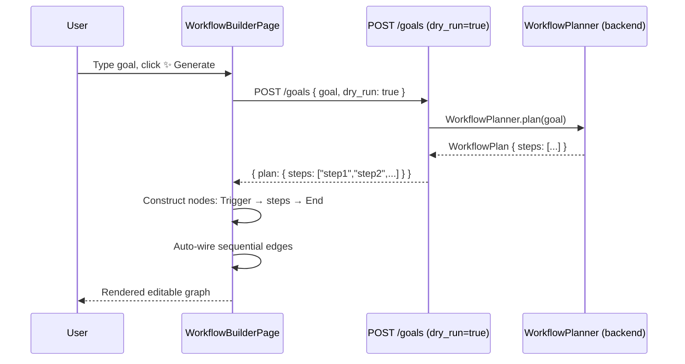
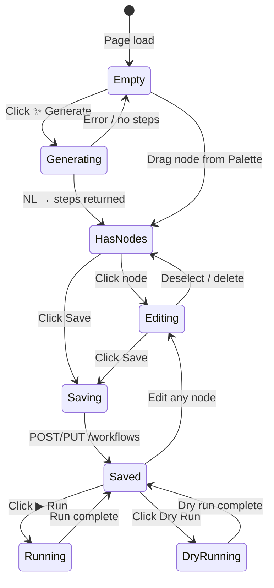

# Workflow Builder — Overview

The **Workflow Builder** is AgentVerse's visual, graph-based automation IDE. Where a _goal_ is a
one-shot instruction submitted to the agent loop, a _workflow_ is a **persistent, versioned,
reusable DAG** that encodes an entire automation pattern: its nodes, edges, branching logic, and
integration points. A workflow survives beyond a single run; it can be executed repeatedly,
imported/exported between tenants, and evolved over time through an explicit version history.

---

## Goals vs. Workflows

| Dimension | Goal | Workflow |
|---|---|---|
| Lifespan | One-shot, ephemeral | Persistent, survives indefinitely |
| Reuse | Not designed for it | First-class citizen — runs many times |
| Versioning | No history | `version` integer incremented on every PUT |
| Authorship | Natural language | Visual drag-and-drop or NL-generated |
| Execution path | Agent loop decides | Pre-defined DAG drives execution |
| Edit | Cannot be changed once submitted | Edit anytime; saved changes create a new version |

A workflow is the right primitive when you need **repeatability**: scheduled deployments,
recurring report generation, standard operating procedures, or anything your team runs more
than once.

---

## Canvas Architecture

The canvas is built on **[@xyflow/react](https://reactflow.dev/)** (React Flow v12). Three
ReactFlow sub-components are always visible:

| Component | Purpose |
|---|---|
| `<Background variant="Dots" gap={16} />` | 16 px dot-grid gives spatial reference while panning |
| `<Controls />` | Zoom-in / zoom-out / fit-view / lock controls in the bottom-left corner |
| `<MiniMap />` | Bird's-eye thumbnail in the bottom-right; click to navigate |

**Interaction model**

- **Pan**: click-and-drag on empty canvas
- **Zoom**: scroll wheel, or pinch on trackpad
- **Select node**: single-click — opens Node Inspector in the right panel
- **Deselect**: click empty canvas
- **Delete node**: `Backspace` key when a node is selected, or the "Delete Node" button in the
  Inspector
- **Connect nodes**: drag from an output handle to an input handle; edges are rendered with
  indigo stroke (`#6366f1`, 2 px) and a closed-arrow marker
- **Snap to grid**: all node positions snap to a 16 × 16 px grid

All graph state is managed via `useNodesState` / `useEdgesState` React hooks from ReactFlow.
The component receives `onNodesChange` and `onEdgesChange` callbacks that apply atomic change
objects (position, removal, selection) without full re-renders.

---

## Three-Panel Layout

```
┌───────────┬──────────────────────────────┬───────────────┐
│  Node     │                              │   Node        │
│  Palette  │        ReactFlow Canvas      │  Inspector    │
│  (192px)  │        (flex-1)              │   (256px)     │
└───────────┴──────────────────────────────┴───────────────┘
```

### Node Palette (left, 192 px wide)

Lists all 9 node types as clickable tiles. Each tile uses the node's colour scheme
(`NODE_COLORS` map in `WorkflowBuilderPage.tsx`) so the palette doubles as a visual legend.
Clicking a tile calls `addNode(type, label)`, which appends a new node at a random position
in the upper-left quadrant (200 + random offset).

Above the tile list is the **NL-Generate** textarea:

```
┌─────────────────────────────┐
│ Describe workflow…          │
│ [✨ Generate]               │
└─────────────────────────────┘
```

### Node Inspector (right, 256 px wide)

When no node is selected the panel shows a hint. When a node is selected it exposes:

- **Label** — inline text input; edits propagate to the canvas node in real time via
  `setNodes(nds => nds.map(…))`
- **Description** — multiline textarea (maps to `subtitle`); rendered as a secondary line on
  the node tile
- **Node ID / Type** — read-only metadata
- **Delete Node** — removes the node and all edges connected to it atomically

Run output (the raw JSON response from `POST /workflows/:id/run`) is appended below the
Inspector after each execution.

---

## NL-Generate: From Goal to Graph

The **Generate** button converts freeform text into an editable workflow graph in two steps:



The frontend reads `data.plan.steps` (or `data.execution_context.plan.steps` for legacy
format). Up to 10 steps are rendered as `tool_call` nodes between a `trigger` Start node and
an `end` node. All edges are auto-created sequentially. The user can then:

1. Drag nodes to rearrange
2. Click nodes to rename/describe them
3. Delete unwanted nodes
4. Add additional nodes from the Palette
5. Save the refined graph

This flow lets non-engineers bootstrap a workflow from a sentence and then refine it
visually — no JSON authoring required.

---

## Import / Export JSON

Every workflow is serialised to a `definition` object in the REST API:

```json
{
  "steps": [
    { "id": "start", "type": "trigger", "label": "Start", "position": { "x": 250, "y": 50 } },
    { "id": "step_0", "type": "tool_call", "label": "Fetch open Jira issues", "position": { "x": 250, "y": 150 } },
    { "id": "end", "type": "end", "label": "End", "position": { "x": 250, "y": 350 } }
  ],
  "edges": [
    { "source": "start", "target": "step_0" },
    { "source": "step_0", "target": "end" }
  ]
}
```

`PUT /workflows/:id` accepts an updated `definition` object and bumps the `version` integer.
This definition can be exported as a JSON file and imported into any other AgentVerse tenant
by posting it to `POST /workflows`.

---

## Auto-Layout

The `loadWorkflow` function restores node positions from the stored `definition.steps[].position`
field. When positions are absent (e.g., a workflow imported without layout metadata), nodes
default to `{ x: 200, y: 200 }` and the user can use ReactFlow's built-in **Fit View** control
to frame the graph.

Future iterations will expose a **dagre-based BFS depth layout** (`layeredLayout`) that
computes a clean top-down layered arrangement automatically. The topological sort already
exists in `WorkflowPlan.execution_waves()` (backend) and will drive the layout algorithm.

---

## Dirty-State and Autosave

The toolbar shows a **Save** button. The current implementation uses manual save; the button
calls `workflowsApi.create()` for new workflows and `workflowsApi.update()` for existing ones.
A dirty-state indicator (unsaved changes warning) is planned for a future release.

The `currentWfId` state variable tracks whether the canvas corresponds to a saved workflow:
- `null` → unsaved (new)
- a UUID string → saved; Runs auto-save before executing

---

## REST API Reference

| Method | Path | Description |
|---|---|---|
| `GET` | `/workflows` | List all workflows for the authenticated tenant |
| `POST` | `/workflows` | Create a new workflow. Body: `WorkflowCreate` |
| `GET` | `/workflows/:id` | Fetch a single workflow definition |
| `PUT` | `/workflows/:id` | Update name / description / definition (bumps version) |
| `DELETE` | `/workflows/:id` | Delete a workflow permanently |
| `POST` | `/workflows/:id/run` | Execute a saved workflow |
| `POST` | `/workflows/:id/run?dry_run=true` | Dry-run: validate without executing tools |

### WorkflowCreate / WorkflowUpdate schema

```json
{
  "name": "Daily Jira Summary",
  "description": "Fetch open issues and send a Slack digest",
  "definition": { "steps": [...], "edges": [...] }
}
```

### WorkflowOut schema

```json
{
  "id": "wf_abc123",
  "name": "Daily Jira Summary",
  "description": "...",
  "definition": { "steps": [...], "edges": [...] },
  "status": "draft",
  "version": 3,
  "created_at": "2025-06-01T10:00:00Z",
  "updated_at": "2025-06-29T14:22:11Z"
}
```

The `version` field is monotonically increasing; each `PUT` increments it. In production the
backend stores versions in the `workflows` table with Row-Level Security ensuring cross-tenant
isolation at the database layer.

---

## Full Canvas Lifecycle Diagram


