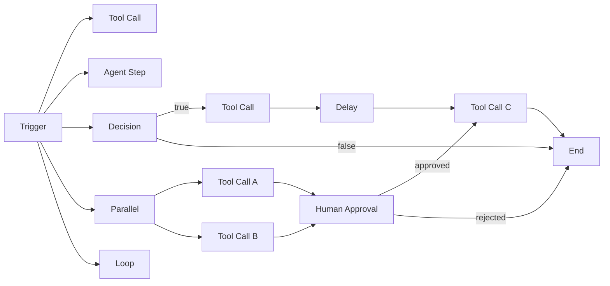

# Workflow Builder — Node Types

AgentVerse Workflow Builder ships with **9 node types**. Each type maps to a distinct
execution semantic in the backend `WorkflowExecutor` / `AgentGraph` pipeline. Every node is
rendered as a colour-coded tile on the canvas. Below is the definitive reference for all node
types: their visual identity, required configuration, connection rules, and example use cases.

---

## Node type quick reference

| # | Type key | Label | Colour | Icon |
|---|---|---|---|---|
| 1 | `trigger` | Trigger / Start | Green | ▶ |
| 2 | `tool_call` | Tool Call | Blue | 🔧 |
| 3 | `agent_step` | Agent Step | Purple | 🤖 |
| 4 | `decision` | Decision / Branch | Yellow | ❓ |
| 5 | `parallel` | Parallel Fan-out | Orange | ⫸ |
| 6 | `loop` | Loop / Map | Cyan | ↻ |
| 7 | `human_approval` | Human Approval | Red | 👤 |
| 8 | `delay` | Delay / Wait | Slate | ⏱ |
| 9 | `end` | End | Muted | ⬛ |

---

## 1. Trigger / Start

**Visual:** Green tile (`bg-green-100 border-green-400 text-green-800`), icon `▶`.

**What it is:** The single entry-point of every workflow. Exactly one `trigger` node must
exist; it has no inbound edges and one outbound edge. The `subtitle` field holds a short
description of the firing condition (e.g. `"Runs every weekday at 09:00"` or the first 40
characters of the NL goal used to generate the workflow).

**Required config fields:**

| Field | Description |
|---|---|
| `label` | Human-readable name, e.g. `"Fetch Jira Issues"` |
| `subtitle` | Condition or cron expression. Free text in the current release. |

**Connection rules:**
- Inbound edges: **0** (entry point)
- Outbound edges: **1** (exactly one successor)

**Execution behaviour:** When `POST /workflows/:id/run` is called the executor begins at the
trigger node and follows its single outbound edge. The trigger node itself executes
immediately without calling any external tool.

**Example use case:** A trigger labelled `"End-of-sprint Jira sync"` with subtitle
`"Every Friday 17:00"` marks the start of a workflow that pulls Jira issues, creates a
Confluence page, and emails a summary.

---

## 2. Tool Call

**Visual:** Blue tile (`bg-blue-100 border-blue-400 text-blue-800`), icon `🔧`.

**What it is:** Calls a single tool from a connected MCP connector. This is the workhorse
node — most automated steps reduce to one tool invocation.

**Required config fields:**

| Field | Description |
|---|---|
| `label` | Describes what the tool does, e.g. `"Search open Jira issues"` |
| `subtitle` | Tool name or free-form arguments. Maps to `WorkflowStep.tool` in the backend. |

**Backend mapping:** When executed, `WorkflowExecutor._execute_step()` checks `step.tool`. If
non-empty and an `mcp_client` is wired, it calls:

```python
await mcp_client.call_tool(
    server_id="",
    tool_name=step.tool,
    arguments={"description": step.description, "context": prior_context},
    tenant_ctx=tenant_ctx,
)
```

If the MCP call fails, execution falls back to LLM completion using the step description.

**Connection rules:**
- Inbound edges: **1+** (can receive from any prior node)
- Outbound edges: **1** (passes result to next node)

**Example use case:** Node labelled `"Create Confluence page"` with subtitle
`"confluence.create_page"` takes the output of a preceding Jira fetch node as its
`prior_context` and creates a summary document.

---

## 3. Agent Step

**Visual:** Purple tile (`bg-purple-100 border-purple-400 text-purple-800`), icon `🤖`.

**What it is:** Delegates a sub-goal to a named AgentVerse agent. Instead of calling a
single tool, the entire AgentGraph loop runs for the step's description using the specified
agent.

**Required config fields:**

| Field | Description |
|---|---|
| `label` | High-level description of what this agent should accomplish |
| `subtitle` | `agent_id` of the target agent (UUID). Empty = use default routing. |

**Backend mapping:** The executor submits the step description as a new goal via
`GoalService.submit()` with the `agent_id` from the `subtitle` field. The sub-goal executes
the full plan → execute → verify loop. Results are collected and passed to downstream nodes.

**Connection rules:**
- Inbound edges: **1+**
- Outbound edges: **1**

**Example use case:** A workflow for a complex code review: one Agent Step node runs
`security-audit-agent` (agent_id from subtitle), another runs `performance-analysis-agent`.
Their outputs are merged by a subsequent node.

---

## 4. Decision / Branch

**Visual:** Yellow tile (`bg-yellow-100 border-yellow-400 text-yellow-800`), icon `❓`.

**What it is:** Evaluates a boolean condition against the output of the preceding node.
Routes execution to one of two branches: `true` (primary output handle) or `false` (secondary
output handle).

**Required config fields:**

| Field | Description |
|---|---|
| `label` | The condition being evaluated, e.g. `"Issues count > 0?"` |
| `subtitle` | Condition expression or natural-language description |

**Connection rules:**
- Inbound edges: **1**
- Outbound edges: **2** — one labelled `true`, one labelled `false`

In the current ReactFlow implementation both outbound edges are standard; the executor
determines the branch based on the step's output evaluation. Future releases will add explicit
`true`/`false` handle labels to the node.

**Example use case:** After fetching Jira issues, a Decision node checks "Has P1 issue?". If
`true`, a Human Approval node triggers before sending a Slack alert. If `false`, the workflow
proceeds directly to the End node.

---

## 5. Parallel Fan-out

**Visual:** Orange tile (`bg-orange-100 border-orange-400 text-orange-800`), icon `⫸`.

**What it is:** Splits the execution path into multiple independent branches that run
concurrently via `asyncio.gather()`. This node maps directly to the
`WorkflowPlan.execution_waves()` mechanism — all steps in a single _wave_ have no
inter-dependencies and execute in parallel.

**Required config fields:**

| Field | Description |
|---|---|
| `label` | Name of the fan-out gate, e.g. `"Parallel data fetch"` |
| `subtitle` | Number of branches or brief description |

**Connection rules:**
- Inbound edges: **1**
- Outbound edges: **2 to N** — each outbound edge is a parallel branch

**Backend mapping:** `WorkflowExecutor.execute()` iterates through waves returned by
`plan.execution_waves()`. When a wave contains multiple steps, they are executed via:

```python
wave_results = await asyncio.gather(*tasks, return_exceptions=True)
```

Individual step failures within a wave are collected; any non-`continue_on_error` failure
short-circuits the entire workflow.

**Example use case:** Simultaneously call `github.list_prs`, `jira.fetch_sprint`, and
`slack.get_recent_messages` — three independent data sources. All three resolve before a
merge node aggregates their outputs.

---

## 6. Loop / Map

**Visual:** Cyan tile (`bg-cyan-100 border-cyan-400 text-cyan-800`), icon `↻`.

**What it is:** Iterates over a collection produced by a previous node, executing the loop
body once per item. Analogous to a `for item in collection` construct.

**Required config fields:**

| Field | Description |
|---|---|
| `label` | What is being iterated, e.g. `"For each Jira issue"` |
| `subtitle` | Max iterations guard (integer) to prevent runaway loops |

**Connection rules:**
- Inbound edges: **1** (the collection source)
- Outbound edges: **1** (the loop body, executed per item)
- After the loop completes, a second outbound edge connects to the post-loop node

**Backend mapping:** The `WorkflowStep.estimated_minutes` field is used to compute expected
loop duration. The executor currently executes loop items sequentially; parallel iteration is
on the roadmap via `execution_waves()` with synthetic step IDs.

**Example use case:** For each of the 12 open Jira issues returned by a Tool Call node,
run an Agent Step that analyses the issue and generates a comment.

---

## 7. Human Approval

**Visual:** Red tile (`bg-red-100 border-red-400 text-red-800`), icon `👤`.

**What it is:** Pauses workflow execution and creates an entry in the **HITL (Human-in-the-
Loop) approval queue**. Execution resumes only when a human operator approves or rejects the
gate.

**Required config fields:**

| Field | Description |
|---|---|
| `label` | Describes what is being approved, e.g. `"Approve Confluence publish"` |
| `subtitle` | Approver group or instructions shown in the approval UI |

**Backend mapping:** Maps to `HITLGateway.create_approval_request()`. The gateway stores the
request in Redis pub/sub and the `hitl_approvals` DB table. SSE pushes a notification to the
Approvals page (`/approvals`). The workflow executor polls or awaits a Redis key
`hitl:{approval_id}:result` before continuing.

High-risk keywords (`deploy`, `delete`, `prod`, `production`, `rm`) in the node label
automatically trigger HITL in the agent loop even without an explicit Human Approval node,
providing a second safety layer.

**Connection rules:**
- Inbound edges: **1**
- Outbound edges: **2** — `approved` path and `rejected` path

**Example use case:** A deployment workflow requires approval before `kubectl apply` is run
in the production cluster.

---

## 8. Delay / Wait

**Visual:** Slate tile (`bg-slate-100 border-slate-400 text-slate-700`), icon `⏱`.

**What it is:** Introduces a deliberate pause in workflow execution. Useful for rate-limiting
downstream API calls, waiting for an external system to propagate changes, or scheduling
time-sensitive steps.

**Required config fields:**

| Field | Description |
|---|---|
| `label` | Why the delay exists, e.g. `"Wait for CDN propagation"` |
| `subtitle` | Duration (`30s`, `5m`) or condition expression |

**Backend mapping:** `WorkflowStep.estimated_minutes` is used for UI cost estimation.
The actual delay is implemented as `asyncio.sleep(seconds)` in `_execute_step()`, with the
duration parsed from `subtitle`.

**Connection rules:**
- Inbound edges: **1**
- Outbound edges: **1**

**Example use case:** After deploying a new Lambda function, wait 30 seconds before running
smoke tests to allow cold-start initialisation.

---

## 9. End

**Visual:** Muted tile (`bg-muted/60 border-muted-foreground/50`), icon `⬛`.

**What it is:** The terminal node of every workflow. Marks successful completion. The
executor collects all `step.result` outputs from completed steps and joins them into a
`summary` field in the final response.

**Required config fields:**

| Field | Description |
|---|---|
| `label` | Optional label, e.g. `"Done"` or `"Report sent"` |

**Connection rules:**
- Inbound edges: **1+** (multiple branches can converge here)
- Outbound edges: **0**

**Example use case:** All workflow branches — normal path, approved path, and error recovery
path — converge at a single End node that aggregates results into a final Slack message.

---

## Node Connection Rules Summary



---

## Node Colour Reference

The colour system is defined in `WorkflowBuilderPage.tsx:NODE_COLORS`. Colors encode
semantic meaning at a glance:

| Colour | Node type | Meaning |
|---|---|---|
| Green | Trigger | Entry / safe start |
| Blue | Tool Call | External integration |
| Purple | Agent Step | AI sub-agent delegation |
| Yellow | Decision | Control flow fork |
| Orange | Parallel | Concurrency fan-out |
| Cyan | Loop | Iteration |
| Red | Human Approval | Human gate / high risk |
| Slate | Delay | Time-based pause |
| Muted/Grey | End | Terminal state |
