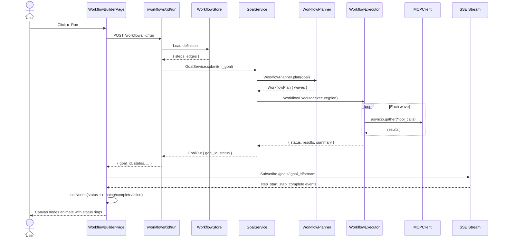

# Workflow Builder — Execution Engine

This document describes everything that happens _after_ the user clicks **▶ Run** — from the
HTTP request through the backend execution engine to the live canvas animation.

---

## Architecture Overview

```mermaid
flowchart TD
    UI[WorkflowBuilderPage\n▶ Run clicked]
    API[POST /workflows/:id/run]
    WS[_WorkflowStore\nLoad definition]
    NL[Convert definition → NL goal string]
    GS[GoalService.submit()]
    WP[WorkflowPlanner.plan()]
    WE[WorkflowExecutor.execute()]
    EW[execution_waves()\nTopological sort]
    AG[asyncio.gather()\nParallel wave]
    SE[_execute_step()\nMCP tool → LLM fallback]
    SSE[SSE stream to client]
    CA[Canvas node status rings]

    UI --> API --> WS --> NL --> GS --> WP --> WE --> EW
    EW --> AG --> SE --> SSE --> CA
```

---

## WorkflowPlanner: Goal → DAG

`app/agent/workflow_planner.py` contains two distinct planners:

### 1. Static keyword-based planner (`build_static_workflow`)

The legacy planner. Inspects the goal string for keywords (`jira`, `confluence`, `mail`,
`browser`) and assembles a `_StaticWorkflowPlan` of `_StaticWorkflowStep` objects, each
targeting a specific connector. This planner is deterministic and requires zero LLM calls.

```python
def build_static_workflow(goal: str) -> _StaticWorkflowPlan:
    ...
    if "jira" in goal_lower:
        add_step("jira", "fetch_open_issues", [])
    if "confluence" in goal_lower:
        add_step("confluence", "create_summary_page", [last_jira_step_id])
```

Dependencies (`input_from`) produce a sequential chain automatically.

### 2. LLM-based DAG planner (`WorkflowPlanner.plan()`)

The production planner. Given a goal and available tools from the MCP registry, it sends a
structured prompt to the tenant's LLM provider and parses the JSON response into a
`WorkflowPlan`:

```python
prompt = """You are a workflow orchestration engine. Given a goal, produce a parallel-aware
execution plan.
...
Return a JSON workflow plan:
{
  "steps": [
    {"id": "s1", "description": "...", "tool": "tool_name_or_empty",
     "depends_on": [], "can_parallel": true, "estimated_minutes": 1}
  ]
}
"""
```

**Rules encoded in the prompt:**
- Steps with empty `depends_on` can start immediately (including in parallel)
- `depends_on` contains step IDs that must complete first
- `can_parallel=true` means the step can run alongside other independent steps
- Maximum 10 steps to keep plans tractable

If the LLM call fails or returns unparseable JSON, `_heuristic_plan()` returns a single-step
plan wrapping the entire goal — execution degrades gracefully rather than failing hard.

---

## WorkflowPlan Data Model

```python
@dataclass
class WorkflowStep:
    id: str
    description: str
    tool: str = ""            # MCP tool name; empty = LLM completes the step
    depends_on: list[str]     # IDs of steps that must complete before this one
    can_parallel: bool = True
    estimated_minutes: int = 1
    status: str = "pending"   # pending | running | complete | failed
    result: str = ""
    error: str = ""

@dataclass
class WorkflowPlan:
    goal: str
    steps: list[WorkflowStep]
```

---

## execution_waves(): Topological Sort

`WorkflowPlan.execution_waves()` is the core scheduling primitive. It converts the `depends_on`
DAG into a list of _waves_, where each wave is a set of steps that can run concurrently:

```python
def execution_waves(self) -> list[list[WorkflowStep]]:
    completed: set[str] = set()
    remaining = list(self.steps)
    waves: list[list[WorkflowStep]] = []
    max_iterations = len(self.steps) + 1
    iteration = 0
    while remaining and iteration < max_iterations:
        iteration += 1
        # A step is ready when all its dependencies are in 'completed'
        wave = [s for s in remaining if all(d in completed for d in s.depends_on)]
        if not wave:
            # Circular dependency or unresolvable — add all remaining as one wave
            waves.append(remaining)
            break
        waves.append(wave)
        completed.update(s.id for s in wave)
        remaining = [s for s in remaining if s.id not in completed]
    return waves
```

**Example:** Given steps `s1 → s2`, `s1 → s3`, `s2 → s4`, `s3 → s4`:

```
Wave 1: [s1]          (no dependencies)
Wave 2: [s2, s3]      (both depend only on s1, which is complete)
Wave 3: [s4]          (depends on s2 and s3, both complete)
```

Circular dependency detection: if `wave` is empty but `remaining` is non-empty, there is a
cycle. The algorithm defensively adds all remaining steps as one last wave rather than
entering an infinite loop.

---

## WorkflowExecutor: Wave-by-Wave Execution

`app/agent/workflow_executor.py` — `WorkflowExecutor.execute()`:

```python
async def execute(self, plan: WorkflowPlan, tenant_ctx: Any) -> dict[str, Any]:
    results: dict[str, Any] = {}
    waves = plan.execution_waves()

    for wave in waves:
        if len(wave) == 1:
            # Single-step wave — no overhead of asyncio.gather
            result = await self._execute_step(step, tenant_ctx, prior_results=results)
            ...
        else:
            # Parallel execution
            tasks = [self._execute_step(step, tenant_ctx, prior_results=results)
                     for step in wave]
            wave_results = await asyncio.gather(*tasks, return_exceptions=True)
            ...

    return {
        "status": "complete",
        "steps_executed": len(results),
        "waves": len(waves),
        "results": results,
        "summary": "\n\n".join(filter(None, final_outputs)),
    }
```

### Step execution priority chain

`_execute_step()` tries three paths in order:

1. **MCP tool call** — if `step.tool` is non-empty and `mcp_client` is available, calls the
   named tool with `{"description": step.description, "context": prior_context}` as args.
2. **LLM fallback** — if MCP fails or `step.tool` is empty, generates a completion using the
   step description and prior step outputs as context.
3. **Stub** — if neither provider nor MCP is available (e.g. in tests), returns
   `{"status": "complete", "output": "stub output for: {description}"}`.

**Prior context propagation:** Steps inherit the `output` values of all their `depends_on`
predecessors via the `prior_results` dict, joined with newlines. This gives downstream steps
access to upstream data without explicit data-flow wiring.

---

## Run vs. Dry Run

| Mode | Endpoint | What happens |
|---|---|---|
| **Live run** | `POST /workflows/:id/run` | Full execution — MCP tools called, state mutated |
| **Dry run** | `POST /workflows/:id/run?dry_run=true` | Returns `status: "dry_run"` immediately without executing tools |

In dry-run mode the API responds before calling `GoalService.submit()`. The frontend marks all
canvas nodes with `status: "complete"` to show the planned execution path visually:

```typescript
if (dryRun) {
    setNodes(nds => nds.map(n => ({ ...n, data: { ...n.data, status: 'complete' } })));
}
```

This gives designers a way to verify the workflow graph is wired correctly before committing
to a real execution that touches production systems.

---

## Live Execution on Canvas

Node status is surfaced as a colour-coded indicator on each node tile:

| Status | Colour | Meaning |
|---|---|---|
| `null` | (none) | Not yet reached |
| `running` | Blue (`text-blue-600`) | Currently executing |
| `complete` | Green (`text-green-600`) | Finished successfully |
| `failed` | Red (`text-red-600`) | Error during execution |

The `● {status}` dot is rendered at the bottom of the node tile when `data.status` is set.
In a full SSE-connected run, the frontend would subscribe to the goal's event stream and
update node statuses in real time as `step_start` / `step_complete` / `step_failed` events
arrive. The current release uses the batch run response to mark all nodes complete after the
full workflow finishes.

---

## Run History and Replay

The `GET /workflows` response includes a `status` field (`draft`, `running`, `complete`,
`failed`). A dedicated run-history endpoint (`GET /workflows/:id/runs`) is on the roadmap to
expose a paginated list of past executions with timestamps, step counts, and cost.

**Replay last run** will re-execute the workflow with the same definition version using
`POST /workflows/:id/run`, passing the `version` as a query parameter to pin execution to a
specific definition snapshot.

---

## Full Sequence: Run Clicked → Canvas Animation



---

## Error Handling

| Failure point | Behaviour |
|---|---|
| `WorkflowPlanner` LLM fails | Falls back to `_heuristic_plan()` (single-step) |
| MCP tool call fails | Falls back to LLM completion; logs `workflow_step_tool_failed` |
| Step returns `status: "failed"` without `continue_on_error` | Whole workflow aborted; `failed_step` returned |
| Wave has multiple failures | All failing step IDs returned in `failed_steps`; workflow aborted |
| `execution_waves()` detects cycle | Defensive: remaining steps added as one wave; execution continues |

Failed workflows set `status: "failed"` in the WorkflowOut response, enabling the frontend
to mark the failing node red on the canvas.
