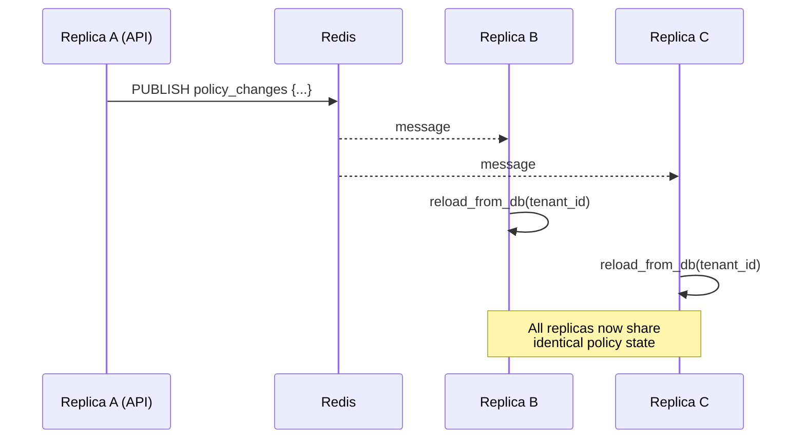

# Policies

## What a Policy Is

A policy is a declarative rule that says "when a tool name matches this pattern, enforce this action." Policies are evaluated by `PolicyEngine` (`app/governance/policies.py`) before every tool call in the agent loop. They are tenant-scoped, time-aware, and propagated across replicas via Redis pub/sub.

There are two distinct data structures:

- **`Policy`** — the engine's evaluation object; carries `denied_tools`, `approval_tools`, time windows, and timezone.
- **`GovernancePolicy`** — the lightweight DB record used by the REST API; carries `name`, `action`, and `tool_pattern`.

On reload from the database, `GovernancePolicy` rows are translated into `Policy` objects and loaded into the engine.

---

## Policy Anatomy

```python
@dataclass
class Policy:
    name: str
    description: str = ""
    denied_tools: list[str]          # glob patterns → DENY
    approval_tools: list[str]        # glob patterns → REQUIRE_APPROVAL
    scope: str = "global"
    allowed_hours_utc: tuple[int, int] | None  # (9, 17) = 9:00–17:00 UTC
    allowed_weekdays: list[int] | None          # 0=Mon … 6=Sun
    tenant_id: str = ""
    timezone: str = "UTC"            # IANA name, e.g. "America/New_York"
```

The REST API works with a simpler form:

| Field | Type | Description |
|---|---|---|
| `policy_id` | `string` | UUID, assigned on creation |
| `name` | `string` | Human-readable identifier |
| `tools_pattern` | `string` | A single glob pattern |
| `action` | `"deny" \| "require_approval"` | What to do on a match |
| `created_at` | `ISO-8601` | Server-assigned timestamp |

---

## Glob Matching with `fnmatch`

The engine uses Python's `fnmatch.fnmatch(tool_name, pattern)` for pattern matching. This is Unix shell-style globbing, not regex.

| Pattern | Matches | Does not match |
|---|---|---|
| `shell:*` | `shell:execute`, `shell:eval`, `shell:bash` | `postgres:query` |
| `*.delete*` | `github.delete_branch`, `s3.delete_object` | `github.create_branch` |
| `github.*` | `github.create_pr`, `github.merge_branch` | `gitlab.create_mr` |
| `postgres.*` | `postgres.execute_query`, `postgres.drop_table` | `mysql.query` |
| `*` | everything | — |

Patterns are evaluated in policy order. The engine iterates through all applicable policies (in insertion order) and checks every `denied_tools` pattern first, then every `approval_tools` pattern. The most restrictive matching policy wins.

**DENY takes precedence.** If `denied_tools` matches, evaluation stops immediately and returns `DENY` without checking `approval_tools` in later policies.

---

## Time-Window Enforcement

Policies can be restricted to specific hours and days. Time-window logic lives in `_is_within_time_window()`:

```python
def _is_within_time_window(self, policy: Policy) -> bool:
    tz = ZoneInfo(policy.timezone or "UTC")
    now = datetime.now(tz)
    if policy.allowed_weekdays is not None:
        if now.weekday() not in policy.allowed_weekdays:
            return False          # outside allowed days → skip policy
    if policy.allowed_hours_utc is not None:
        start_h, end_h = policy.allowed_hours_utc
        if not (start_h <= now.hour < end_h):
            return False          # outside allowed hours → skip policy
    return True
```

A policy whose time window is **not active** is silently skipped — it does not block or approve anything. This means a "deny shell:* on weekends" policy has zero effect on weekdays.

### Common patterns

```json
// Block destructive tools outside business hours (Mon–Fri, 09:00–17:00 UTC)
{
  "name": "no-destructive-after-hours",
  "tools_pattern": "*.delete*",
  "action": "deny",
  "allowed_hours_utc": [17, 9],    // inverted range — active outside 09-17
  "allowed_weekdays": [5, 6]       // Saturday, Sunday
}

// Require approval for prod deployments on any day, any time
{
  "name": "prod-deploy-approval",
  "tools_pattern": "deploy:*prod*",
  "action": "require_approval"
}
```

---

## Policy Version History

`PolicyVersionManager` (`app/governance/policies.py`) writes an immutable snapshot row to the `policy_versions` table for every mutation. Each version is identified by `(policy_id, version_number)`.

### Operations

| Method | Description |
|---|---|
| `create_policy(db, tenant_id, name, rules, ...)` | Inserts version 1; `is_active=True` |
| `update_policy(db, tenant_id, policy_id, updates, ...)` | Deactivates current version, inserts `version_number + 1`; atomic |
| `rollback_to_version(db, tenant_id, policy_id, version_number)` | Copies the target snapshot as a new active version |
| `list_versions(db, tenant_id, policy_id)` | Returns all snapshots ordered by version number |

The immutability guarantee: no row in `policy_versions` is ever updated or deleted. Rollback creates a new version that contains the old rule set — the history is always complete.

### Why this matters for compliance

SOX, HIPAA, and SOC2 auditors require evidence that policy changes are traceable and attributable. The `changed_by` and `change_summary` fields in each version row satisfy this requirement without any external tooling.

---

## Redis Pub/Sub Propagation

When a policy is created or deleted via the API, the router calls:

```python
await PolicyEngine.publish_change(redis, tenant_id=ctx.tenant_id, action="created")
```

This writes a JSON message to the `policy_changes` Redis channel:

```json
{
  "tenant_id": "tenant_abc123",
  "action": "created",
  "ts": "2026-06-29T10:00:00Z"
}
```

Every replica runs a background task created by `start_policy_subscriber()` at lifespan startup. The subscriber:

1. Opens a dedicated Redis pub/sub connection (pub/sub requires its own connection)
2. Subscribes to `policy_changes`
3. On each message, calls `engine.reload_from_db(db, tenant_id=tenant_id)` which re-fetches only that tenant's rows
4. If the Redis connection drops, it waits 5 seconds and reconnects

This ensures all replicas converge to the same effective policy set within the Redis round-trip latency (typically < 10ms).



---

## API Reference

### List policies

```
GET /governance/policies
X-API-Key: <key>

Response 200:
[
  {
    "policy_id": "3f8e...",
    "name": "block-shell",
    "tools_pattern": "shell:*",
    "action": "deny",
    "created_at": "2026-06-29T08:00:00Z"
  }
]
```

### Create a policy

```
POST /governance/policies
X-API-Key: <key>
Content-Type: application/json

{
  "name": "block-shell",
  "tools_pattern": "shell:*",
  "action": "deny"
}

Response 201:
{ "policy_id": "...", "name": "block-shell", ... }
```

### Delete a policy

```
DELETE /governance/policies/:policy_id
X-API-Key: <key>

Response 204 No Content
```

### Roll back to a previous version

```
POST /governance/policies/:policy_id/rollback
X-API-Key: <key>
Content-Type: application/json

{ "version_number": 3 }

Response 200:
{ "policy_id": "...", "version_number": 5, "change_summary": "Rolled back to v3" }
```

---

## Worked Examples

### Block all destructive tools at night

```json
{
  "name": "no-night-deletes",
  "tools_pattern": "*.delete*",
  "action": "deny",
  "allowed_hours_utc": [0, 8],
  "allowed_weekdays": [0, 1, 2, 3, 4]
}
```

Active Monday–Friday between 00:00–08:00 UTC (before business hours). Any `*.delete*` call during this window is blocked outright.

### Require approval for all production database writes

```json
{
  "name": "prod-db-writes",
  "tools_pattern": "postgres.*write*",
  "action": "require_approval"
}

{
  "name": "prod-db-drop",
  "tools_pattern": "postgres.drop*",
  "action": "deny"
}
```

`DROP` statements are outright blocked. Other write operations pause for human review. Both policies stack — the engine checks `deny` patterns before `require_approval`.

### Regulated-domain fail-closed

For `healthcare` or `finance` tenants, no explicit policy is needed to fail closed. The `evaluate_with_domain_failsafe()` helper returns `REQUIRE_APPROVAL` whenever the engine would otherwise return `ALLOW`:

```python
REGULATED_DOMAINS = frozenset(
    {"healthcare", "hipaa", "legal", "finance", "sox", "fintech", "pci"}
)
```

Set the tenant's `domain` field at creation time and every unmatched tool call will gate on human approval by default.
