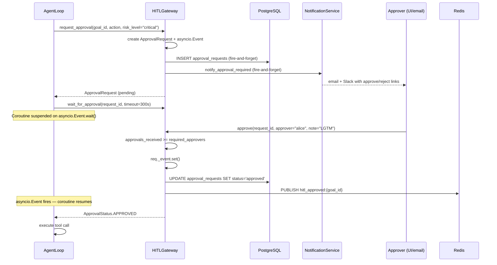

# Approvals (HITL Gateway)

## What HITL Means Here

Human-In-The-Loop (HITL) is the mechanism by which the agent loop is literally suspended — paused mid-execution — waiting for a human to render a decision before proceeding. This is distinct from a post-hoc review. The agent has not executed the risky tool yet. It is waiting.

The implementation lives in `app/governance/hitl.py` as `HITLGateway`. The frontend surfaces the inbox at the `/approvals` route (`ApprovalsPage`), which maintains a live connection via Server-Sent Events and shows every pending request with Approve / Reject actions.

---

## The `asyncio.Event` Blocking Mechanism

When the agent loop determines that a step requires approval, it calls `HITLGateway.request_approval()`, which:

1. Creates an `ApprovalRequest` dataclass with a new UUID `request_id`
2. Stores it in `self._requests[(tenant_id, request_id)]`
3. Computes `_expires_at_dt = now + timedelta(seconds=timeout)` (default 300 s)
4. Persists the row to PostgreSQL via a fire-and-forget `asyncio.create_task()`
5. Dispatches a notification to all configured channels via a second fire-and-forget task
6. Returns the `ApprovalRequest` object

The agent loop then calls `await gateway.wait_for_approval(request_id, tenant_ctx=ctx)`, which executes:

```python
async def wait_for_approval(self, request_id, *, tenant_ctx, timeout=None) -> ApprovalStatus:
    req = self._requests.get((tenant_ctx.tenant_id, request_id))
    timeout_s = timeout if timeout is not None else self._timeout
    try:
        await asyncio.wait_for(req._event.wait(), timeout=timeout_s)
    except TimeoutError:
        req.status = ApprovalStatus.TIMED_OUT
        req._event.set()   # unblock any other coroutine waiting on this event
    return req.status
```

The `asyncio.Event` is created fresh for each `ApprovalRequest`. The coroutine yields the event loop back to Python's scheduler. The agent worker is suspended but consumes no CPU. When a human acts, `approve()` or `reject()` calls `req._event.set()`, which wakes the suspended coroutine on the next event loop tick.

---

## Multi-Approver Threshold (N-of-M)

The `required_approvers` field on `ApprovalRequest` enables quorum-style approvals. The default is `1`, but high-risk steps can require multiple independent approvers:

```python
gateway.request_approval(
    goal_id=goal_id,
    action="deploy to production",
    risk_level="critical",
    tenant_ctx=ctx,
    required_approvers=3,   # require 3 distinct approvers
)
```

The `approve()` method tracks each unique approver in `approvers_list` and increments `approvals_received`. Duplicate votes from the same approver are silently ignored. The `asyncio.Event` is only set when `approvals_received >= required_approvers`:

```python
if approver not in req.approvers_list:
    req.approvers_list.append(approver)
    req.approvals_received += 1
if req.approvals_received >= req.required_approvers:
    req.status = ApprovalStatus.APPROVED
    req._event.set()
```

---

## DB Persistence — Surviving Pod Restarts

Approval requests are persisted to the `approval_requests` table immediately after creation. If the pod running the waiting coroutine crashes, the approval request row remains in the database with `status = 'pending'`.

On restart, the lifespan re-hydrates in-memory state from the database via `sync_from_db()`. Pending requests are reconstructed, new `asyncio.Event` objects are created, and agents that poll for status on reconnect can resume waiting.

The schema for the table used by `_db_persist_approval_request()`:

```sql
INSERT INTO approval_requests
    (id, tenant_id, goal_id, action, risk_level, status, created_at)
    VALUES (:id, :tid, :gid, :action, :risk, 'pending', NOW())
    ON CONFLICT (id) DO NOTHING
```

---

## 5-Minute Default Timeout and Escalation

`HITLGateway.DEFAULT_TIMEOUT = 300.0` (5 minutes). When `asyncio.wait_for()` raises `TimeoutError`:

1. `req.status` is set to `ApprovalStatus.TIMED_OUT`
2. `req._event.set()` unblocks any other waiters
3. `wait_for_approval()` returns `TIMED_OUT`
4. The agent loop treats `TIMED_OUT` identically to `REJECTED` — the step fails

Escalation on expiry is handled by the notification service: a `hitl_timeout` event triggers a secondary notification (e.g. Slack DM to the tenant admin) when the default channel has not responded in time.

---

## Notification Dispatch

When `HITLGateway.request_approval()` is called, it fires a notification via:

```python
await self._notification_service.notify_approval_required(
    request_id=req.request_id,
    goal_id=goal_id,
    action=action,
    risk_level=risk_level,
    tenant_id=tenant_ctx.tenant_id,
)
```

The `_notification_service` is injected by `create_app()` during lifespan. Notifications are dispatched to all channels configured for the tenant (Slack, webhook, Teams, email). The email channel includes a one-click approval link containing a signed token — see the email-link approval flow below.

---

## Email-Link Approval Flow

Approvers who receive an email notification can approve or reject without opening the UI. The email body contains two links:

```
[Approve] https://app.agentverse.io/approve?token=<signed_jwt>&decision=approve
[Reject]  https://app.agentverse.io/approve?token=<signed_jwt>&decision=reject
```

The `token` is a short-lived JWT signed with the tenant's HITL signing key, containing `request_id` and `tenant_id`. The frontend handles the `/approve` route, validates the token server-side, and calls `POST /governance/approvals/:id/approve` or `POST /governance/approvals/:id/reject`.

---

## Risk Levels and Visual Indicators

Every approval request carries a `risk_level` string. The frontend assigns color-coded badges:

| Risk level | Badge color | Typical triggers |
|---|---|---|
| `low` | Green | Read-only queries, analytics |
| `medium` | Yellow | State-changing but reversible operations |
| `high` | Orange | Irreversible writes, external integrations |
| `critical` | Red | Production deploys, mass deletes, financial operations |

Risk levels are set by `tool_risk.py` in the agent module, which classifies tool names using keyword detection (e.g. `deploy`, `delete`, `prod`, `drop`). The governance router surfaces the risk level in the approval inbox so approvers can prioritize critical items at a glance.

---

## Rejection Pub/Sub

When an approver rejects a request, the gateway publishes a Redis event so the goal planner can include the rejection reason in its next replan:

```python
await self._redis.publish(
    f"hitl_rejected:{req.goal_id}",
    json.dumps({
        "request_id": str(request_id),
        "goal_id": req.goal_id,
        "note": note,
        "rejected_by": tenant_ctx.api_key_id,
        "ts": datetime.now(UTC).isoformat(),
    })
)
```

`GoalService` subscribes to `hitl_rejected:{goal_id}` and forwards the rejection note to the LangGraph planner, which can propose an alternative approach that avoids the rejected tool.

---

## Full Approval Sequence



---

## API Reference

### List approval requests

```
GET /governance/approvals
X-API-Key: <key>

Response 200:
[
  {
    "request_id": "a1b2...",
    "goal_id": "goal_xyz",
    "action": "deploy to production",
    "risk_level": "critical",
    "status": "pending",
    "created_at": "2026-06-29T10:00:00Z",
    "required_approvers": 2,
    "approvals_received": 1
  }
]
```

### Approve a request

```
POST /governance/approvals/:request_id/approve
X-API-Key: <key>
Content-Type: application/json

{
  "approver": "alice@example.com",
  "note": "Reviewed and approved"
}

Response 200:
{ "status": "approved", "approver": "alice@example.com" }
```

### Reject a request

```
POST /governance/approvals/:request_id/reject
X-API-Key: <key>
Content-Type: application/json

{
  "approver": "bob@example.com",
  "note": "Not during business hours"
}

Response 200:
{ "status": "rejected" }
```

### Live updates via SSE

```
GET /governance/approvals/stream
X-API-Key: <key>
Accept: text/event-stream
```

The `ApprovalsPage` subscribes to this stream via `useEventStream()` and invalidates the TanStack Query cache on every event, ensuring the inbox reflects changes within seconds without polling.

---

## Dual-Mode API (`_AwaitableBool`, awaitable `ApprovalRequest`)

The gateway is designed for backward compatibility with code that predates the async implementation. Both `request_approval()` and `approve()` return objects that work in sync and async contexts:

```python
# Sync usage (legacy)
req_id = gateway.request_approval(...)   # req_id acts as a string via __str__
ok = gateway.approve(req_id, ...)         # ok evaluates as bool

# Async usage (modern)
req = await gateway.request_approval(...)  # req is full ApprovalRequest
ok = await gateway.approve(req_id, ...)    # ok is awaitable
```

This is implemented via `__await__` generators and the `_AwaitableBool` class, neither of which requires callers to change their code.
