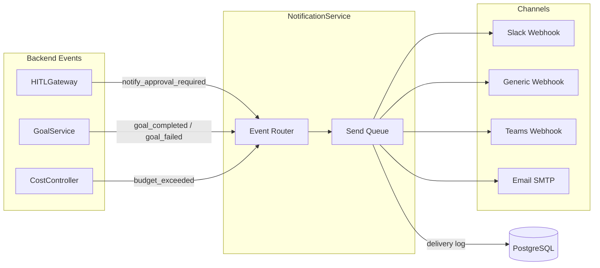

# Notification Center

## Overview

The Notification Center (`/notifications`, `NotificationCenterPage`) is the channel management console for governance-triggered alerts. When an agent hits a high-risk step, a goal fails, a budget is exceeded, or an approval times out, AgentVerse needs somewhere to send that alert. The Notification Center is where operators register those destinations.

The backend persists channel registrations in the `notification_channels` table and routes events through the `NotificationService` (`app/services/notification_service.py`), which fans out to all active channels for the tenant.

---

## Channel Types

The frontend exposes three channel types:

| Type | Config fields | Typical use |
|---|---|---|
| `slack` | `{ "webhook_url": "https://hooks.slack.com/..." }` | Team alerting |
| `webhook` | `{ "url": "https://your-server.example.com/hook" }` | Custom integrations, PagerDuty, OpsGenie |
| `teams` | `{ "webhook_url": "https://outlook.office.com/webhook/..." }` | Microsoft Teams |

The config is a free-form JSON object stored verbatim in the database. The dispatch layer reads the channel type and routes accordingly. Adding a new channel type requires only a new case in the delivery router — the storage and API layers are type-agnostic.

---

## Managing Channels

### Adding a channel

Fill in the **Type** selector and the **Config (JSON)** field, then click **Add channel**. The frontend validates that the config is parseable JSON before submitting. An error toast is shown if the server rejects the registration.

```
POST /governance/notifications
X-API-Key: <key>
Content-Type: application/json

{
  "channel_type": "slack",
  "config": {
    "webhook_url": "https://hooks.slack.com/services/T.../B.../..."
  }
}

Response 201:
{
  "channel_id": "ch_abc123",
  "type": "slack",
  "enabled": true
}
```

### Listing channels

```
GET /governance/notifications
X-API-Key: <key>

Response 200:
[
  { "channel_id": "ch_abc123", "type": "slack",   "enabled": true },
  { "channel_id": "ch_def456", "type": "webhook", "enabled": true },
  { "channel_id": "ch_ghi789", "type": "teams",   "enabled": false }
]
```

Disabled channels (`enabled: false`) are shown with a `(disabled)` label in the UI and skipped during dispatch. Use the enable/disable toggle to temporarily silence a channel without losing its configuration.

### Deleting a channel

```
DELETE /governance/notifications/:channel_id
X-API-Key: <key>

Response 204 No Content
```

---

## Events That Trigger Notifications

The following system events dispatch notifications to all active channels for the tenant:

| Event | Triggered by | Payload fields |
|---|---|---|
| `hitl_approval_required` | `HITLGateway.request_approval()` | `request_id`, `goal_id`, `action`, `risk_level` |
| `hitl_approval_timeout` | `asyncio.wait_for` TimeoutError | `request_id`, `goal_id` |
| `goal_completed` | `GoalService` on status → `completed` | `goal_id`, `goal_text`, `duration_ms` |
| `goal_failed` | `GoalService` on status → `failed` | `goal_id`, `error`, `failed_step` |
| `budget_exceeded` | `CostController.check_and_record()` → False | `goal_id`, `limit_type`, `limit_usd`, `actual_usd` |

The `hitl_approval_required` event is the most critical: it carries a direct link to the Approvals inbox and, for email channels, the one-click approve/reject tokens.

---

## Notification Payload Structure

Every event dispatched by `NotificationService` follows a common envelope:

```json
{
  "event_type": "hitl_approval_required",
  "tenant_id": "tenant_abc",
  "timestamp": "2026-06-29T10:00:00Z",
  "data": {
    "request_id": "req_xyz",
    "goal_id": "goal_abc",
    "action": "deploy to production",
    "risk_level": "critical"
  },
  "links": {
    "inbox": "https://app.agentverse.io/approvals",
    "approve": "https://app.agentverse.io/approve?token=...",
    "reject":  "https://app.agentverse.io/approve?token=...&decision=reject"
  }
}
```

For Slack, this is rendered as a Block Kit message with colored side-bars (red for critical, orange for high). For webhooks, the raw JSON is POST'd with a `Content-Type: application/json` header and an HMAC-SHA256 signature in `X-AgentVerse-Signature`.

---

## Delivery Logs

> **Current state:** Per-channel delivery history is tracked in the backend but not yet surfaced in the Notification Center UI. The delivery log section in the UI shows a placeholder message. A future release will expose individual delivery events here.

The backend records every dispatch attempt in `notification_delivery_log` with fields:

| Field | Description |
|---|---|
| `delivery_id` | UUID |
| `channel_id` | FK to `notification_channels` |
| `event_type` | e.g. `hitl_approval_required` |
| `status` | `sent`, `failed`, `retried` |
| `http_status` | HTTP response code from the channel endpoint |
| `sent_at` | ISO-8601 timestamp |
| `error` | Error message if status is `failed` |

When a channel returns a non-2xx response, the service retries with exponential backoff (up to 3 attempts, max 60-second delay). After exhausting retries, the `status` is set to `failed` and the tenant admin is notified via the fallback email channel if one is configured.

---

## Webhook Security

For `webhook` channels, every POST includes:

```
X-AgentVerse-Signature: sha256=<hex_digest>
X-AgentVerse-Timestamp: 1719648000
```

The signature is computed as:

```
HMAC-SHA256(key=<channel_signing_secret>, msg=<timestamp>.<raw_body>)
```

The signing secret is generated at channel creation and stored encrypted in the vault. To retrieve it:

```
GET /governance/notifications/:channel_id/secret
X-API-Key: <admin_key>

Response 200:
{ "signing_secret": "whsec_..." }
```

Validate incoming requests on your server:

```python
import hmac, hashlib, time

def verify_signature(payload: bytes, timestamp: str, signature: str, secret: str) -> bool:
    msg = f"{timestamp}.".encode() + payload
    expected = hmac.new(secret.encode(), msg, hashlib.sha256).hexdigest()
    return hmac.compare_digest(f"sha256={expected}", signature)
```

---

## Channel Configuration by Type

### Slack

```json
{
  "channel_type": "slack",
  "config": {
    "webhook_url": "https://hooks.slack.com/services/T.../B.../xxx",
    "channel": "#agent-alerts",
    "username": "AgentVerse",
    "icon_emoji": ":robot_face:"
  }
}
```

### Webhook (generic)

```json
{
  "channel_type": "webhook",
  "config": {
    "url": "https://api.pagerduty.com/generic/2010-04-15/create_event.json",
    "headers": {
      "Authorization": "Token token=YOUR_TOKEN"
    }
  }
}
```

Custom headers are encrypted at rest in the vault. Raw header values are never returned by the API after creation.

### Microsoft Teams

```json
{
  "channel_type": "teams",
  "config": {
    "webhook_url": "https://outlook.office.com/webhook/.../IncomingWebhook/..."
  }
}
```

Teams channels receive Adaptive Card payloads for rich formatting with action buttons.

---

## Architecture


