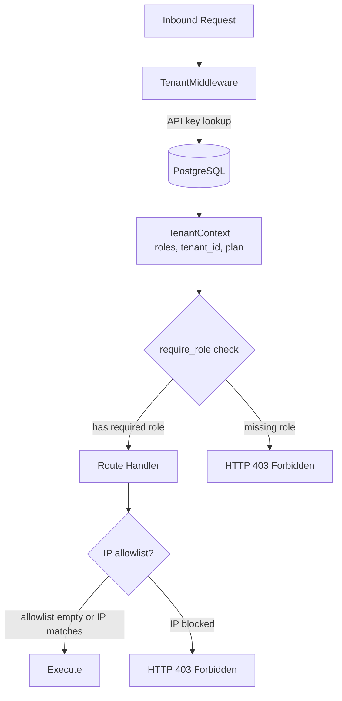

# Access Control (RBAC)

## Overview

AgentVerse's role-based access control is implemented in `app/tenancy/rbac.py` and surfaced on the `/access-control` route (`RbacPage`). It enforces a strict hierarchy of four built-in roles and optionally restricts API access by client IP using CIDR allowlists.

Every inbound request passes through `TenantMiddleware`, which extracts the tenant context and resolves the caller's roles. Downstream FastAPI route handlers then declare their minimum role requirement via `Depends(require_role("admin"))`.

---

## The Four Built-in Roles

```python
ROLE_ADMIN    = "admin"
ROLE_OPERATOR = "operator"
ROLE_APPROVER = "approver"
ROLE_VIEWER   = "viewer"
```

### Role capabilities

| Role | Scopes | Description |
|---|---|---|
| `admin` | `goals:*`, `agents:*`, `governance:*`, `analytics:*` | Full platform control: emergency stop, user management, all writes, all reads |
| `operator` | `goals:write`, `goals:cancel`, `agents:read` | Create and cancel goals, read agent configs — day-to-day operations |
| `approver` | `goals:read`, `governance:approve`, `analytics:read` | Review and decide on HITL requests; read audit and analytics |
| `viewer` | `goals:read`, `agents:read`, `analytics:read` | Read-only across all resources |

### Role hierarchy

```
admin
├── operator  (implies viewer)
├── approver  (implies viewer)
└── viewer
```

Defined in code as:

```python
_ROLE_IMPLIES: dict[str, frozenset[str]] = {
    "admin":    frozenset({"admin", "operator", "viewer", "approver"}),
    "operator": frozenset({"operator", "viewer"}),
    "approver": frozenset({"approver", "viewer"}),
    "viewer":   frozenset({"viewer"}),
}
```

`effective_roles(ctx)` expands a tenant's assigned roles through this hierarchy. An `admin` API key automatically passes any `require_role("viewer")` or `require_role("operator")` check.

---

## `require_role()` — FastAPI Dependency

`require_role(*roles)` is a factory that returns a FastAPI `Depends`-compatible callable:

```python
def require_role(*roles: str) -> Callable:
    def dependency(request: Request) -> None:
        ctx: TenantContext | None = getattr(request.state, "tenant", None)
        if ctx is None:
            raise HTTPException(401, "Authentication required")
        if not has_any_role(ctx, list(roles)):
            raise HTTPException(
                403,
                f"Insufficient permissions. Required: one of {list(roles)}. "
                f"Your roles: {list(ctx.roles)}"
            )
    return dependency
```

Usage in a route handler:

```python
from app.tenancy.rbac import require_role

@router.post("/governance/emergency-stop")
async def emergency_stop(
    request: Request,
    _: None = Depends(require_role("admin")),
):
    ...
```

The `_` binding convention discards the return value (always `None`) while still running the dependency. The error messages include both the required roles and the caller's actual roles, making permission denials debuggable without needing log access.

---

## IP Allowlist (CIDR Notation)

When at least one CIDR entry exists for a tenant, `is_ip_allowed()` rejects any request whose `client_ip` does not fall within an allowed range:

```python
def is_ip_allowed(client_ip: str, allowed_cidrs: list[str]) -> bool:
    if not allowed_cidrs:
        return True          # empty list = no restriction

    ip = ipaddress.ip_address(client_ip)
    if ip.is_loopback:
        return True          # 127.x and ::1 always allowed

    for cidr in allowed_cidrs:
        network = ipaddress.ip_network(cidr, strict=False)
        if ip in network:
            return True
    return False
```

**Key behaviors:**
- An **empty** allowlist means **all IPs are allowed**. Adding the first entry immediately restricts access to only that range.
- Loopback addresses (`127.0.0.1`, `::1`) are always permitted, preventing local healthcheck failures.
- Malformed CIDR entries are silently skipped (the loop uses `continue` on `ValueError`).
- Invalid IP strings are rejected (`return False` after `ValueError`).

The frontend validates CIDR format client-side before submitting:

```typescript
/^(25[0-5]|2[0-4]\d|[01]?\d\d?)\.(...)\/((3[0-2]|[12]?\d))$/
```

Common CIDR examples:

| CIDR | Meaning |
|---|---|
| `10.0.0.0/8` | All RFC-1918 10.x.x.x addresses |
| `192.168.1.0/24` | A single /24 subnet |
| `203.0.113.42/32` | A specific single IP |
| `0.0.0.0/0` | Entire IPv4 space (effectively unrestricted) |

---

## JWT Role Extraction

When tenants authenticate via Keycloak (or any OIDC provider), roles are extracted from the JWT payload by `extract_roles_from_jwt()`. The function searches three locations in priority order:

```python
def extract_roles_from_jwt(jwt_payload: dict) -> tuple[str, ...]:
    roles: set[str] = set()

    # 1. Keycloak standard: realm_access.roles
    for r in jwt_payload.get("realm_access", {}).get("roles", []):
        if r in VALID_ROLES:
            roles.add(r)

    # 2. Keycloak client-specific: resource_access.agentverse.roles
    for r in jwt_payload.get("resource_access", {}).get("agentverse", {}).get("roles", []):
        if r in VALID_ROLES:
            roles.add(r)

    # 3. Custom mapper: top-level "roles" claim
    for r in jwt_payload.get("roles", []):
        if r in VALID_ROLES:
            roles.add(r)

    return tuple(roles)
```

Only roles present in `VALID_ROLES = frozenset({"admin", "operator", "viewer", "approver"})` are accepted. Unknown roles in the JWT are silently discarded, preventing privilege escalation via unexpected role names from an external IdP.

### Keycloak configuration

To map AgentVerse roles in Keycloak:

1. Create realm roles: `admin`, `operator`, `approver`, `viewer`
2. Assign users to roles via the Keycloak admin console
3. The standard `realm_access.roles` claim is populated automatically

For client-specific roles (source 2), create a protocol mapper in the Keycloak client configuration that maps `agentverse` client roles into `resource_access.agentverse.roles`.

---

## Custom Roles

Beyond the four built-in roles, the UI exposes a `CustomRoleCreator` that allows admins to define fine-grained role combinations:

- **Role name** — identifier used in API key assignments (e.g. `data-analyst`)
- **Inherits from** — a parent built-in role that provides the base permission set
- **Additional scopes** — a cherry-picked set of extra capabilities

All available scopes:

```
goals:read      goals:write     goals:cancel    goals:batch
agents:read     agents:write    agents:delete
knowledge:read  knowledge:write
governance:read governance:approve
analytics:read  analytics:export
```

Custom roles are stored in a `custom_roles` table and resolved at authentication time alongside the built-in hierarchy.

---

## Role Assignment API

### List current role assignments

```
GET /tenants/me/roles
X-API-Key: <admin_key>

Response 200:
[
  { "id": "ra_001", "user_id": "alice@example.com", "role": "operator" },
  { "id": "ra_002", "user_id": "bob@example.com",   "role": "approver:agent_id=abc123" }
]
```

### Grant a role

```
POST /tenants/me/roles
X-API-Key: <admin_key>
Content-Type: application/json

{
  "user_id": "carol@example.com",
  "role": "viewer"
}

Response 201:
{ "id": "ra_003", "user_id": "carol@example.com", "role": "viewer" }
```

Conditional roles narrow the scope to specific resources:

```json
{ "user_id": "dave@example.com", "role": "operator:agent_id=\"abc123\"" }
```

This grants `operator` permissions only for the agent with `agent_id = abc123`.

### Revoke a role

```
DELETE /tenants/me/roles/:assignment_id
X-API-Key: <admin_key>

Response 204 No Content
```

Permission is revoked immediately on the next request — there is no token invalidation delay because AgentVerse roles are checked on every request from the database, not from a token cache.

---

## IP Allowlist API

### List allowlist entries

```
GET /tenants/me/ip-allowlist
X-API-Key: <admin_key>

Response 200:
[
  { "id": "ip_001", "cidr": "10.0.0.0/8",      "description": "VPN range" },
  { "id": "ip_002", "cidr": "203.0.113.42/32",  "description": "Office static IP" }
]
```

### Add an entry

```
POST /tenants/me/ip-allowlist
X-API-Key: <admin_key>
Content-Type: application/json

{
  "cidr": "10.10.0.0/16",
  "description": "AWS VPC subnet"
}

Response 201:
{ "id": "ip_003", "cidr": "10.10.0.0/16", "description": "AWS VPC subnet" }
```

### Remove an entry

```
DELETE /tenants/me/ip-allowlist/:entry_id
X-API-Key: <admin_key>

Response 204 No Content
```

---

## RBAC Enforcement Flow


