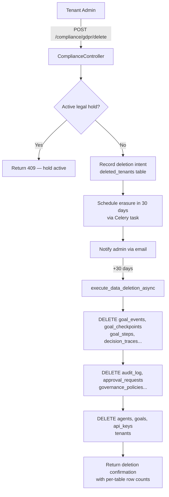

# Compliance

## Overview

The Compliance module (`app/enterprise/compliance.py`, frontend at `/compliance`) implements statutory obligations under GDPR, SOC2, and PCI-DSS. It is built around `ComplianceController`, which receives injected references to all data-owning services at startup and coordinates cross-service operations like data export and erasure.

The controller operates in two modes: in-memory (used in tests and local dev without a database) and PostgreSQL-backed (production), with automatic fallback between them.

---

## GDPR Right to Erasure

Article 17 of GDPR ("right to be forgotten") requires that all personal data associated with a subject be deleted on request. In AgentVerse, the tenant is the data subject, and deletion must cascade across every table that holds tenant data.

### Two-phase deletion

Deletion is intentionally delayed by 30 days to allow for reconsideration and legal hold review:

```python
async def request_data_deletion(self, *, tenant_ctx: TenantContext) -> dict:
    await self._db_save_deletion(tenant_ctx.tenant_id)   # record intent
    self._deleted_tenants.add(tenant_ctx.tenant_id)
    return {
        "deletion_scheduled": True,
        "scheduled_at": (datetime.now(UTC) + timedelta(days=30)).isoformat(),
        "note": "Data will be permanently deleted in 30 days per GDPR article 17."
    }
```

After the 30-day window, `execute_data_deletion_async()` performs the actual cascade delete.

### 27-table cascade delete (FK-safe order)

Tables are deleted in child-before-parent order to respect foreign key constraints:

```python
tables_ordered = [
    # ── child tables (leaf nodes in FK graph) ──
    "goal_events", "goal_checkpoints", "goal_steps",
    "decision_traces", "evaluations", "cost_ledger",
    "audit_log", "approval_requests", "governance_policies",
    "collab_operations", "collab_sessions",
    "documents", "knowledge_collections",
    "mcp_credentials", "oauth_tokens", "mcp_servers",
    "execution_memory", "long_term_memory",
    "agent_snapshots",
    "agent_permissions", "agents",
    "schedules",
    "compliance_requests",
    "goals",
    "api_keys",
    # ── parent (root of FK graph) ──
    "tenants",
]
```

Each table is deleted with:

```sql
DELETE FROM <table> WHERE tenant_id = :tid
```

(The `tenants` table uses the `id` column instead of `tenant_id`.) Deletion counts per table are returned in the response so the requester has a complete record of what was erased.

```json
{
  "tenant_id": "tenant_abc",
  "deleted_at": "2026-07-29T10:00:00Z",
  "total_rows_deleted": 4821,
  "tables": {
    "goal_events": 1200,
    "audit_log": 847,
    "goals": 312,
    "tenants": 1,
    ...
  }
}
```

---

## GDPR Right of Access (Data Export)

Article 20 grants data subjects the right to receive a portable copy of all their data. `request_data_export()` collects data from every injected service and packages it as a structured JSON payload.

### Async export job pattern

Large tenants cannot be exported synchronously within an HTTP timeout. The export follows a fire-and-poll pattern:

```
POST /compliance/export/start
→ { "job_id": "req_abc123", "status": "pending" }

GET /compliance/export/jobs/:job_id
→ { "status": "processing" }  (poll every 2 seconds)

GET /compliance/export/jobs/:job_id
→ { "status": "complete", "download_url": "/compliance/export/req_abc123/download" }

GET /compliance/export/req_abc123/download
→ application/json  (full export payload)
```

The frontend implements this with TanStack Query's `refetchInterval`:

```typescript
refetchInterval: (q) => {
  const s = q.state.data?.status ?? "";
  return TERMINAL_EXPORT.has(s) ? false : 2000;  // stop polling when done
}
```

### Export payload structure

```json
{
  "tenant_id": "tenant_abc",
  "plan": "professional",
  "export_timestamp": "2026-06-29T10:00:00Z",
  "export_format_version": "1.0",
  "data": {
    "tenant_profile": { "tenant_id": "...", "plan": "professional" },
    "goals": [
      { "goal_id": "...", "goal_text": "...", "status": "completed", "created_at": "..." }
    ],
    "audit_entries": [ ... ],
    "api_keys": [],          // Raw key values are never exported
    "agents": [ ... ],
    "schedules": [ ... ],
    "knowledge_collections": []
  }
}
```

Raw API key values are explicitly excluded from the export. The `api_keys` array is always empty in compliance exports.

---

## GDPR Erasure Request Activity Flow



---

## Consent Management

Purpose-based consent tracks whether the tenant has explicitly consented to data processing for specific use cases.

### Consent purposes

| Purpose | Meaning |
|---|---|
| `analytics` | Aggregate usage metrics and performance analysis |
| `marketing` | Product updates, feature announcements |
| `ai_processing` | Use goal data to improve model fine-tuning |

### Record consent

```
POST /compliance/consent
X-API-Key: <key>
Content-Type: application/json

{ "purpose": "analytics" }

Response 200:
{ "purpose": "analytics", "consented": true, "recorded_at": "2026-06-29T..." }
```

### Revoke consent

```
DELETE /compliance/consent/:purpose
X-API-Key: <key>

Response 200:
{ "purpose": "analytics", "consented": false }
```

Consent records are stored in the `consent_records` table. Revoking `ai_processing` consent immediately flags the tenant's data as excluded from training pipelines.

---

## Legal Hold

A legal hold prevents deletion from running, protecting data for litigation or regulatory investigation. When a legal hold is active:

- GDPR erasure requests are blocked (HTTP 409)
- Data retention sweeps skip the tenant
- A banner appears on the Compliance page listing all active holds

### Creating a legal hold

```
POST /compliance/legal-hold
X-API-Key: <admin_key>
Content-Type: application/json

{
  "reason": "Litigation hold — case ref #2026-ACME-001",
  "expires_at": "2027-01-01T00:00:00Z"
}

Response 201:
{
  "id": "hold_abc",
  "reason": "Litigation hold — case ref #2026-ACME-001",
  "created_by": "admin@example.com",
  "expires_at": "2027-01-01T00:00:00Z"
}
```

### Listing holds

```
GET /compliance/legal-holds
X-API-Key: <key>

Response 200:
[
  {
    "id": "hold_abc",
    "reason": "Litigation hold...",
    "created_by": "admin@example.com",
    "expires_at": "2027-01-01T00:00:00Z"
  }
]
```

No expiry (`expires_at: null`) means the hold persists indefinitely until explicitly removed.

---

## SOC2 Audit Package

The SOC2 export bundles the evidence a Type II auditor needs:

| Component | Source |
|---|---|
| Audit log (full history) | `AuditLog.query()` with no date filter |
| Policy snapshots | `PolicyVersionManager.list_versions()` for all policies |
| Access records | `user_roles` table — who had which role and when |
| API key lifecycle | `api_keys` table — creation, last-used, revocation timestamps |
| Approval records | `approval_requests` table with approver attribution |

```
POST /compliance/export/soc2
X-API-Key: <admin_key>

Response:
{ "job_id": "...", "status": "pending" }
```

Poll the same `/compliance/export/jobs/:job_id` endpoint. The download is a ZIP containing JSON and CSV files for each component.

---

## PCI-DSS Report

PCI-DSS scope analysis reports which AgentVerse components interact with payment card data. The report is generated by examining tool call history from the audit log for patterns matching card-related MCP connectors.

```
POST /compliance/export/pci
X-API-Key: <admin_key>

Response: (same async job pattern)
```

The `get_data_residency()` method clarifies the current compliance posture:

```python
return {
    "gdpr_compliant": False,   # dynamically checked via /compliance/gdpr
    "pci_dss_scope": False,
    "soc2_type2": False,       # dynamically checked via /compliance/soc2
    "note": "Use GET /enterprise/compliance/{framework} for authoritative status."
}
```

These values are not hardcoded as `True` — they require active validation via the `ComplianceChecker` in `compliance_v2.py`.

---

## Data Residency

```
GET /compliance/data-residency
X-API-Key: <key>

Response 200:
{
  "tenant_id": "tenant_abc",
  "primary_region": "us-east-1",
  "backup_region": "eu-west-1"
}
```

Tenants requiring EU-only data residency (GDPR Article 44) can request a region override. Data residency is enforced at the infrastructure level — the AgentVerse backend respects region annotations when selecting PostgreSQL replicas and S3 buckets.

---

## Data Retention Sweep

Automated retention sweeps delete records older than the configured retention window:

```python
def retention_sweep(self, *, retention_days: int = 90) -> dict:
    cutoff = datetime.now(UTC) - timedelta(days=retention_days)
    swept = [req for req in self._export_requests.values()
             if datetime.fromisoformat(req.created_at) < cutoff]
    return {
        "sweep_cutoff": cutoff.isoformat(),
        "records_swept": len(swept),
        "retention_days": retention_days,
    }
```

Sweeps are triggered by a Celery beat schedule (`maintenance` queue). Tenants with active legal holds are skipped. Sweep results are appended to the audit log as `retention_sweep_completed` events.
