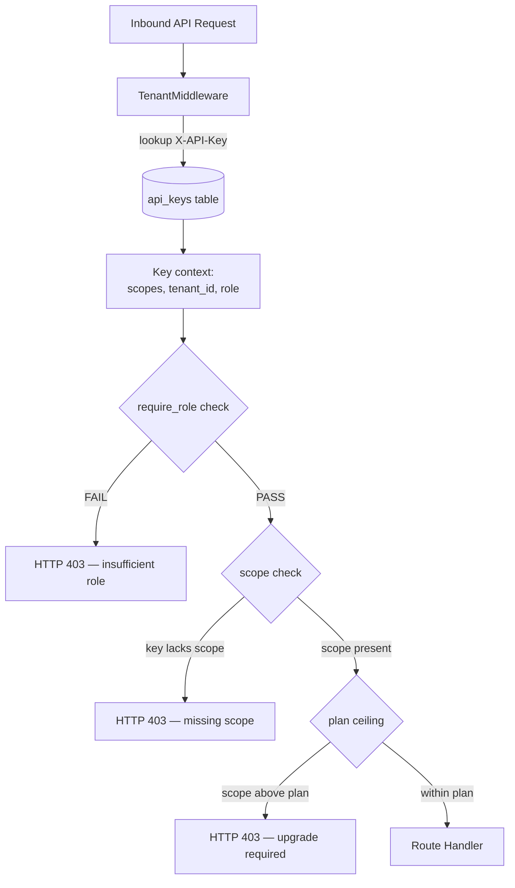

# Scope Explorer

## Overview

The Scope Explorer (`/settings/scopes`, `ScopeExplorerPage`) is a visual reference for every API scope in AgentVerse. It shows which scopes are available, what each one permits, and which scopes are granted to the current tenant's plan. Non-granted scopes display a **Request Access** button that notifies the tenant admin.

Understanding scopes is essential for building integrations: every API key issued for AgentVerse is restricted to the scopes selected at creation time. Scopes are the final enforcement gate after role checks.

---

## All Available Scopes

Scopes are organized into six resource groups:

### Goals

| Scope | Permitted operations | Example endpoints |
|---|---|---|
| `goals:read` | List and inspect goal status | `GET /goals`, `GET /goals/:id` |
| `goals:write` | Submit new goals | `POST /goals` |
| `goals:cancel` | Stop a running goal mid-execution | `POST /goals/:id/cancel` |
| `goals:batch` | Submit multiple goals in one request | `POST /goals/batch` |

### Agents

| Scope | Permitted operations | Example endpoints |
|---|---|---|
| `agents:read` | List and view agent configs | `GET /agents`, `GET /agents/:id` |
| `agents:write` | Create and update agent configs | `POST /agents`, `PUT /agents/:id` |
| `agents:delete` | Permanently remove agents | `DELETE /agents/:id` |
| `agents:snapshot` | Take versioned config snapshots | `POST /agents/:id/snapshot` |

### Knowledge

| Scope | Permitted operations | Example endpoints |
|---|---|---|
| `knowledge:read` | Search collections and read docs | `GET /knowledge/collections`, `GET /knowledge/search` |
| `knowledge:write` | Create collections and ingest docs | `POST /knowledge/collections`, `POST /knowledge/ingest` |
| `knowledge:delete` | Delete entire collections | `DELETE /knowledge/collections/:id` |

### Connectors (MCP)

| Scope | Permitted operations | Example endpoints |
|---|---|---|
| `connectors:read` | List registered MCP servers | `GET /connectors` |
| `connectors:write` | Register new MCP servers | `POST /connectors` |
| `connectors:delete` | Unregister MCP servers | `DELETE /connectors/:id` |

### Governance

| Scope | Permitted operations | Example endpoints |
|---|---|---|
| `governance:read` | View policies and pending approvals | `GET /governance/policies` |
| `governance:write` | Create, modify, and delete policies | `POST /governance/policies` |
| `governance:approve` | Approve or reject HITL requests | `POST /governance/approvals/:id/approve` |

### Analytics

| Scope | Permitted operations | Example endpoints |
|---|---|---|
| `analytics:read` | View cost, eval, and performance data | `GET /analytics/costs`, `GET /analytics/goals` |
| `analytics:export` | Export data and training sets | `POST /intelligence/export-training-data` |

---

## Scope Hierarchy

Scopes are additive — there is no inheritance between scopes. However, the RBAC role assigned to an API key determines which scopes are *eligible*. A `viewer` role API key cannot be granted `agents:write` even if the operator selects it at key creation — the middleware enforces the intersection of role-permitted scopes and key-selected scopes.

### Plan-level scope grants

Different subscription plans provide different scope ceilings:

| Plan | Scopes included |
|---|---|
| `free` | `goals:read`, `agents:read`, `knowledge:read` |
| `starter` | All `free` + `goals:write`, `agents:write`, `knowledge:write`, `connectors:read` |
| `professional` | All `starter` + `goals:cancel`, `goals:batch`, `agents:delete`, `agents:snapshot`, `knowledge:delete`, `connectors:write`, `connectors:delete`, `governance:read`, `analytics:read`, `analytics:export` |
| `enterprise` | All scopes |

Plans form a superset hierarchy: enterprise includes all professional scopes, professional includes all starter scopes, and so on.

---

## Scope Seeder — First Deploy

On first deployment, the `scope_seeder` script initializes the `scopes` table with all known scopes and their descriptions. The seeder is idempotent (`INSERT ... ON CONFLICT DO NOTHING`) and runs automatically during `alembic upgrade head`:

```sql
INSERT INTO scopes (name, description, resource, plan_minimum)
VALUES
  ('goals:read',      'List and read goals',           'goals',      'free'),
  ('goals:write',     'Submit new goals',              'goals',      'starter'),
  ('goals:cancel',    'Cancel running goals',          'goals',      'professional'),
  ...
ON CONFLICT (name) DO NOTHING;
```

The `plan_minimum` column drives the Scope Explorer's plan-level highlighting — scopes with a `plan_minimum` of `enterprise` are dimmed unless the tenant is on the enterprise plan.

---

## Using Scopes with API Keys

When creating an API key, the caller selects a subset of scopes. The key is then restricted to exactly those operations regardless of the key holder's role:

```
POST /tenants/me/api-keys
X-API-Key: <admin_key>
Content-Type: application/json

{
  "name": "CI/CD pipeline key",
  "scopes": ["goals:write", "goals:read", "agents:read"]
}

Response 201:
{
  "key_id": "key_abc123",
  "name": "CI/CD pipeline key",
  "raw_key": "av_live_...",   // Only shown once — store immediately
  "scopes": ["goals:write", "goals:read", "agents:read"],
  "created_at": "2026-06-29T10:00:00Z"
}
```

The `raw_key` value is only returned at creation. It is never returned again. If lost, the key must be revoked and a new one created.

---

## Scope Enforcement Flow



---

## ScopeExplorerPage — UI Features

### Plan-aware highlighting

The page fetches the current tenant's plan via `GET /tenants/me` and compares it against `PLAN_SCOPES`. Granted scopes have a green background and `CheckCircle2` icon. Locked scopes have a grey `Lock` icon and a **Request Access** button.

### Scope group dot matrix

Each scope group header shows a row of colored dots — green for granted, grey for locked — giving an at-a-glance coverage view without expanding each group.

### Search filtering

The search bar filters across scope names and descriptions. Searching `"cancel"` shows only `goals:cancel`; searching `"approval"` shows `governance:approve`.

### Request Access flow

Clicking **Request Access** on a locked scope triggers:

```typescript
toast({ kind: "info", message: `Access request for "${scope}" submitted — your admin will be notified.` });
```

In production, this fires a notification to the tenant admin and creates a pending access request record.

---

## Key Rotation with Scope Selection

When rotating an API key, you can change the scope set at the same time:

```
POST /tenants/me/api-keys/:key_id/rotate
X-API-Key: <admin_key>
Content-Type: application/json

{
  "scopes": ["goals:read", "goals:write"],
  "grace_period_seconds": 3600
}

Response 200:
{
  "new_key_id": "key_def456",
  "raw_key": "av_live_...",
  "scopes": ["goals:read", "goals:write"],
  "old_key_expires_at": "2026-06-29T11:00:00Z"
}
```

The `grace_period_seconds` field keeps the old key valid for the specified duration while callers migrate. After the grace period, the old key is automatically revoked. Both keys remain visible in the key list with `status: "rotating"` on the old key until expiry.

---

## Scope-Restricted Admin Operations

Some operations require not just a role but also the specific scope. This two-factor check (role + scope) is enforced at the middleware level:

| Operation | Required role | Required scope |
|---|---|---|
| Approve HITL request | `approver` or `admin` | `governance:approve` |
| Create governance policy | `admin` | `governance:write` |
| Export training data | `admin` | `analytics:export` |
| Delete knowledge collection | `operator` or `admin` | `knowledge:delete` |
| Unregister an MCP connector | `operator` or `admin` | `connectors:delete` |

This means an `admin` API key scoped to only `["goals:read", "goals:write"]` cannot approve HITL requests — the scope restriction applies even to admin keys.
