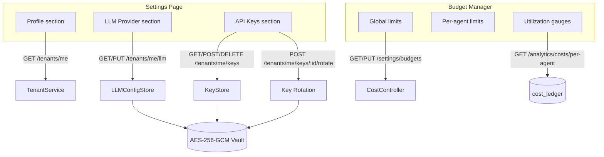

# Settings

## Overview

The Settings page (`/settings`, `SettingsPage`) consolidates tenant configuration into three sections: **Profile**, **LLM Provider**, and **API Keys**. A related page, the **Budget Manager** (`/settings/budgets`, `BudgetManagerPage`), handles LLM cost limits and per-agent spend tracking.

These settings are tenant-scoped — each tenant controls their own LLM provider, key roster, and budget independently of other tenants.

---

## Tenant Profile

The Profile section renders read-only metadata fetched from `GET /tenants/me`:

| Field | Description |
|---|---|
| `tenant_id` | Immutable UUID assigned at tenant creation |
| `name` | Display name (editable via support) |
| `email` | Primary contact email |
| `plan` | Subscription tier: `free`, `starter`, `professional`, `enterprise` |
| `created_at` | Account creation timestamp |

The plan field determines which features and scopes are available — see [09-scope-explorer.md](./09-scope-explorer.md) for plan-to-scope mappings.

---

## LLM Provider Configuration

Every tenant can override the platform-default LLM with their own provider credentials. This "Bring Your Own Key" model means costs are billed directly to the tenant's LLM account rather than AgentVerse's shared pool.

### Supported providers

| Provider | Models |
|---|---|
| `anthropic` | `claude-opus-4-5`, `claude-sonnet-4-5`, `claude-haiku-3-5` |
| `openai` | `gpt-4o`, `gpt-4o-mini`, `gpt-4-turbo` |
| `gemini` | `gemini-1.5-pro`, `gemini-1.5-flash`, `gemini-2.0-flash` |
| `azure_openai` | `gpt-4o`, `gpt-4-turbo` (requires `base_url`) |
| `groq` | `llama-3.1-70b-versatile`, `mixtral-8x7b-32768` |
| `ollama` | `llama3.2`, `mistral`, `qwen2.5` (self-hosted, `base_url` required) |

### API

```
GET /tenants/me/llm
X-API-Key: <key>

Response 200:
{
  "provider": "anthropic",
  "model": "claude-sonnet-4-5",
  "api_key": null,      // never returned in plaintext
  "base_url": null
}
```

```
PUT /tenants/me/llm
X-API-Key: <admin_key>
Content-Type: application/json

{
  "provider": "openai",
  "model": "gpt-4o",
  "api_key": "sk-...",
  "base_url": null
}

Response 200:
{ "provider": "openai", "model": "gpt-4o" }
```

The `api_key` field is write-only — it is stored in the encrypted vault and never returned in GET responses. The Settings UI shows `••••••••` in view mode.

### BYOK — Bring Your Own Key

BYOK covers two distinct scenarios:

**1. LLM provider keys** (described above): Tenant supplies their own Anthropic/OpenAI key. All LLM calls for this tenant are authenticated with that key. Costs appear on the tenant's own provider billing dashboard.

**2. AES-256-GCM vault key override**: Enterprise tenants can supply their own vault encryption key to encrypt secrets stored in AgentVerse:

```
POST /tenants/me/vault-key
X-API-Key: <admin_key>
Content-Type: application/json

{
  "kms_key_arn": "arn:aws:kms:us-east-1:123:key/abc-123",
  "key_type": "aws_kms"
}
```

AgentVerse wraps all secret encryption operations through the tenant's KMS key. Even AgentVerse support staff cannot decrypt tenant secrets without access to the tenant's KMS key. Supported backends: AWS KMS, GCP Cloud KMS, Azure Key Vault.

### Custom base URL (Ollama, proxies, Azure)

For self-hosted or proxied LLM endpoints, set `base_url` to the OpenAI-compatible API root:

```json
{
  "provider": "ollama",
  "model": "llama3.2",
  "base_url": "http://ollama.internal:11434/v1"
}
```

Azure OpenAI requires the full deployment endpoint:

```json
{
  "provider": "azure_openai",
  "model": "gpt-4o",
  "base_url": "https://your-resource.openai.azure.com/openai/deployments/gpt-4o",
  "api_key": "<azure-api-key>"
}
```

---

## API Key Management

The API Keys section lists all keys for the tenant with creation date and last-used timestamp. Three operations are available per key: rotate, revoke, and copy.

### Creating a key

```
POST /tenants/me/keys
X-API-Key: <admin_key>
Content-Type: application/json

{ "name": "production-backend" }

Response 201:
{
  "key_id": "key_abc123",
  "name": "production-backend",
  "raw_key": "av_live_xxxxxxxxxxxxxxxxxxxx",
  "created_at": "2026-06-29T10:00:00Z",
  "last_used_at": null
}
```

**The `raw_key` is only returned once.** The UI displays it in a green banner with a copy button. After dismissal, the raw value is irrecoverable — a new key must be created if lost.

### Listing keys

```
GET /tenants/me/keys
X-API-Key: <key>

Response 200:
[
  {
    "key_id": "key_abc123",
    "name": "production-backend",
    "created_at": "2026-06-29T10:00:00Z",
    "last_used_at": "2026-06-29T12:30:00Z"
  }
]
```

### Rotating a key

Key rotation generates a new credential and optionally maintains a grace period during which both the old and new keys are valid:

```
POST /tenants/me/keys/:key_id/rotate
X-API-Key: <admin_key>

Response 200:
{
  "key_id": "key_def456",          // new key ID
  "raw_key": "av_live_yyyyyy...",  // new raw value — copy now
  "old_key_id": "key_abc123",      // old key, still valid during grace period
  "old_key_expires_at": "2026-06-29T11:00:00Z"
}
```

The default grace period is 1 hour. During this window, requests authenticated with the old key succeed but generate a deprecation header `X-AgentVerse-Key-Rotation: old_key_expires_at=...`. After expiry, old-key requests return HTTP 401.

### Revoking a key

```
DELETE /tenants/me/keys/:key_id
X-API-Key: <admin_key>

Response 204 No Content
```

Revocation is immediate — the key is invalidated on the next request cycle (max 30-second cache TTL on the key lookup). There is no grace period for revocation.

---

## Budget Manager

The Budget Manager (`/settings/budgets`) provides a complete view of LLM cost configuration and live utilization.

### Budget hierarchy

Budgets apply at three levels, in increasing specificity:

```
Tenant daily limit
    └── Per-goal limit
            └── Per-agent override limit
```

| Budget | Default | Description |
|---|---|---|
| `daily_budget_usd` | `$10.00` | Total LLM spend across all goals per UTC day |
| `per_goal_budget_usd` | `$1.00` | Maximum spend for a single goal execution |
| `per_agent_budgets` | `{}` | Per-agent overrides (map of `agent_id → USD`) |
| `alert_threshold_pct` | `80%` | Fire a notification when utilization exceeds this % |

### Alert threshold

The `alert_threshold_pct` slider (50–95%) controls when the `budget_warning` notification event fires. At the threshold, a notification is dispatched to all active channels but execution continues. At 100%, `CostController` blocks further tool calls.

### Budget utilization gauges

Each agent's actual spend is shown as an SVG arc gauge. The gauge turns amber at >50% utilization and red at >80%:

```
$0.42 / $10.00  →  4% (green)
$8.30 / $10.00  →  83% (red)
```

### Per-agent budget overrides

Specific agents can have their own limits independent of the per-goal default. This is useful for high-volume automation agents that need more headroom, or for restricting experimental agents to minimal spend:

```
PUT /settings/budgets
X-API-Key: <admin_key>
Content-Type: application/json

{
  "daily_budget_usd": 100.0,
  "per_goal_budget_usd": 2.0,
  "alert_threshold_pct": 75,
  "per_agent_budgets": {
    "agent_abc123": 25.0,
    "agent_def456": 5.0
  }
}
```

### Cost breakdown by agent

The cost breakdown table shows `total_cost_usd`, `goal_count`, and `avg_cost_per_goal` for each agent over the current billing period. This data comes from `GET /analytics/costs/per-agent` which reads from the `cost_ledger` table.

---

## Settings Architecture



The vault encrypts all secrets at rest using AES-256-GCM. In production (when `VAULT_KMS_KEY_ARN` is set), the vault wraps the AES key using AWS KMS, GCP KMS, or Azure Key Vault. The `api_key` field in LLM configs is stored in the vault, not in the `tenant_llm_configs` table.
