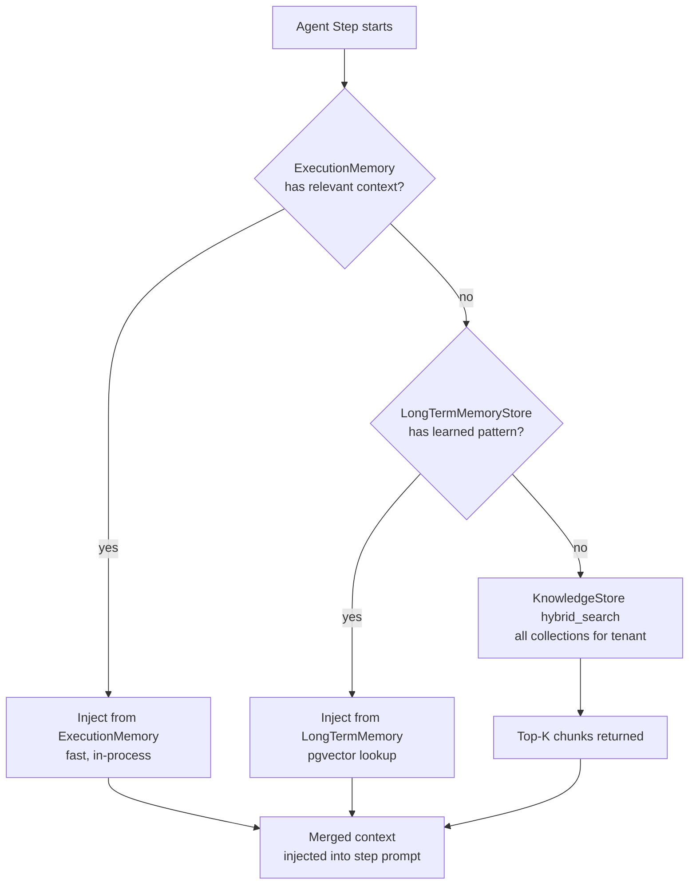
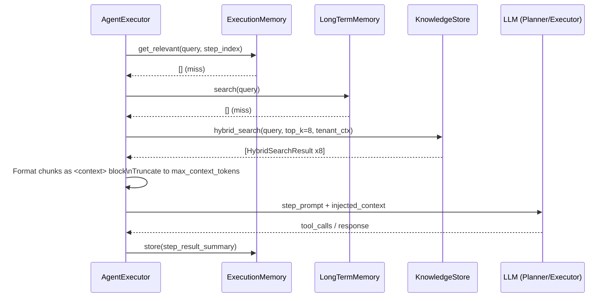

# Knowledge

The Knowledge subsystem is AgentVerse's long-term memory layer. It allows agents to ground their reasoning in documents, code, wikis, APIs, and data pulled from eleven source types. Knowledge is stored as embedding vectors in PostgreSQL with pgvector, searched with a hybrid algorithm, and injected into agent prompts at the step level — giving agents precise, token-efficient context rather than stuffing entire documents into every prompt.

---

## KnowledgeStore Architecture

`KnowledgeStore` (`app/rag/store.py`) operates in two modes:

**In-memory (tests / no DB):** A plain Python dict keyed by `(tenant_id, collection_id)`. Used as the test double and the startup fallback.

**Production (Postgres + pgvector):** When `db_session_factory` is supplied, every mutation fires a fire-and-forget asyncio task that persists to Postgres. The `hybrid_search_db()` path runs the full search server-side using pgvector's HNSW index and PostgreSQL's `pg_trgm` extension.

Every collection is namespaced: the key `(tenant_id, collection_id)` is enforced both at the Python layer and through Row-Level Security at the Postgres layer (`app/db/rls.py`).

---

## Collections

A **Collection** is a named group of chunked documents sharing an embedding model. Collections are the unit of organization and the scope of a search query.

```
Collection
├── collection_id  (UUID)
├── name           (user-defined label)
├── embedder       (e.g. "openai/text-embedding-3-small")
├── doc_count      (derived: number of chunks)
└── created_at
```

Creating a collection does not ingest any content — it is a logical container. Documents are added via the Ingest API. You can point multiple collections at different embedders and search each independently or union them.

---

## Ingest Source Types

The `IngestTab` in `KnowledgePage` exposes eleven source types:

| `source_type` | Description | Required config fields |
|---|---|---|
| `text` | Plain UTF-8 text pasted directly | `content` |
| `markdown` | Markdown content; headers used as chunk boundaries | `content` |
| `url` | Web page crawl (recursive up to `max_depth`) | `url`, `max_depth` |
| `pdf` | Binary PDF upload via multipart `POST /knowledge/ingest/file` | File upload |
| `docx` | Word document upload | File upload |
| `git` | Clone a repo and ingest all tracked files | `content` = repo URL |
| `github` | GitHub repo, issues, and/or PRs via API | `repo`, `include` (code/issues/prs) |
| `openapi` | OpenAPI 3.x spec → one chunk per operation | `content` = spec URL |
| `confluence` | Confluence space pages via REST API | `base_url`, `space_key`, `api_token` |
| `jira` | Jira project issues | `base_url`, `project_key`, `api_token` |
| `slack` | Slack channel history | `bot_token`, `channels` |

File uploads post to `POST /knowledge/ingest/file` as `multipart/form-data` with fields `file` and `collection_id`. The backend determines source type from the file extension (`.pdf` → pdf pipeline, `.docx` → docx pipeline, `.md` → markdown, etc.).

---

## Chunking Algorithm

Raw content is never stored or searched as a monolithic document. The ingestion pipeline splits every document into **chunks** — semantically coherent pieces sized to fit comfortably within the LLM's context window without overwhelming it.

The chunking strategy per source type:

| Source | Strategy |
|---|---|
| Text / Markdown | Sliding window: 512 tokens, 64-token overlap; Markdown headings used as hard split boundaries |
| Code (git / github) | File-level chunks; functions/classes detected and used as natural boundaries |
| PDF | Page-level primary; paragraphs within a page as secondary |
| OpenAPI | One chunk per operation (method + path + description + parameters) |
| Confluence / Jira | One chunk per page/issue; long bodies further split by paragraph |
| Slack | Conversation thread as one chunk; threads > 1024 tokens split at message boundaries |

Each chunk becomes one `Chunk` record with a `chunk_id`, `content`, embedding vector, and `metadata` (source URL, page number, document ID).

---

## Hybrid Search Algorithm

AgentVerse uses a weighted hybrid of semantic (vector) search and lexical (trigram) search. The weights used in the production implementation are:

```
score = 0.7 × cosine_similarity(query_embedding, chunk_embedding)
      + 0.3 × trigram_overlap(query_text, chunk_text)
```

**Why hybrid?** Pure vector search handles semantic similarity but misses exact-match keywords (e.g. a function name like `fire_due_schedules`). Pure trigram search handles exact matches but misses synonyms and paraphrasing. The 70/30 blend gives semantic intent primacy while still surfacing chunks that share significant literal overlap with the query.

In the in-memory fallback the cosine similarity is computed in Python (`_cosine_similarity()`) and the trigram score is a character-level overlap coefficient (`_trigram_score()`). In production, pgvector computes `1 - (embedding <=> query_embedding)` and `pg_trgm` computes `similarity(content, query_text)` server-side, then the weighted sum is computed in SQL and results are `ORDER BY score DESC LIMIT top_k`.

---

## Semantic Cache

Before issuing a new embedding query to the LLM provider, `SemanticCache` (`app/rag/`) checks whether a semantically equivalent query has been answered recently. The mechanism:

1. Embed the query text.
2. Search the cache collection with a high cosine threshold (≥ 0.97).
3. If a cache hit is found, return the stored context without re-querying the provider.
4. If miss, run the real hybrid search, store the result in the cache collection, and return it.

This eliminates redundant embedding calls for repeated sub-goals within a single agent run and across runs that share similar questions (e.g. multiple goals all asking "What are the open P1 bugs?").

---

## 3-Layer RAG at Runtime

When the agent executor prepares context for a step, it draws from three sources in priority order:



**Layer 1 — ExecutionMemory:** Per-goal in-process store. Contains context fragments accumulated in previous steps of the same execution. Zero latency.

**Layer 2 — LongTermMemoryStore:** Cross-session learnings written at goal completion. A successful strategy ("When debugging asyncio timeouts, always check the event loop policy first") is stored here and retrieved by cosine similarity.

**Layer 3 — KnowledgeStore:** The full tenant knowledge base. Searched with the hybrid algorithm across the relevant collection(s). This is where ingested documents, wikis, and API specs live.

The merged context is formatted as a `<context>` block prepended to the step prompt. Chunks are truncated to `max_context_tokens` (configurable) using a greedy algorithm that takes highest-scored chunks first.

---

## API Reference

| Method | Path | Description |
|---|---|---|
| `GET` | `/knowledge/collections` | List collections for tenant |
| `POST` | `/knowledge/collections` | Create a new collection |
| `DELETE` | `/knowledge/collections/{id}` | Delete collection and all its chunks |
| `POST` | `/knowledge/ingest` | Ingest content (JSON body) |
| `POST` | `/knowledge/ingest/file` | Upload a file (multipart) |
| `GET` | `/knowledge/search` | Hybrid search: `?q=...&top_k=10&collection_id=...` |

The search endpoint returns an array of `SearchResult`:

```json
[
  {
    "doc_id": "chunk_abc123",
    "content": "The deploy step requires...",
    "score": 0.8712,
    "metadata": { "source_url": "...", "page_number": 4 }
  }
]
```

---

## Runtime Injection Sequence


