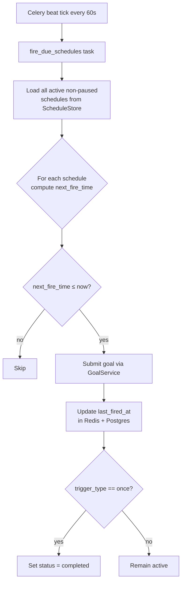
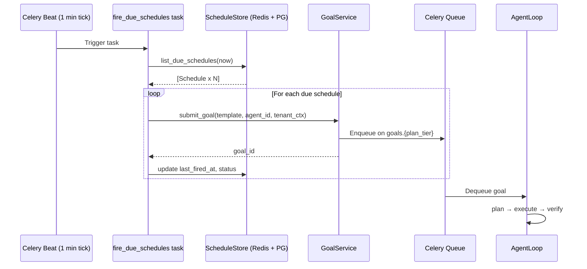

# Schedules

Schedules are the autonomous trigger mechanism for AgentVerse. A schedule binds a natural-language goal template to a firing condition — a cron expression, a fixed interval, a one-shot datetime, or an inbound webhook — and causes the agent loop to be invoked automatically when that condition is met. No human needs to be present; the platform detects due schedules and submits goals independently.

---

## Trigger Types

AgentVerse supports four trigger types, each handled by the `TriggerSpec` model in `app/triggers/models.py`:

### `cron` — Cron Expression

The most flexible type. Uses standard 5-field cron notation (minute, hour, day-of-month, month, day-of-week). Timezone is stored alongside the expression and defaults to UTC.

```
cron_expr: "0 9 * * 1-5"   # 09:00 every weekday
timezone:  "America/New_York"
```

Evaluated using `croniter`. The next fire time is computed by advancing from `last_fired_at` (or `now` for new schedules).

### `interval` — Fixed Seconds

Fires every N seconds after the previous successful fire. Minimum enforced value: 60 seconds. The next fire time is `last_fired_at + interval_seconds`.

```
interval_seconds: 3600  # every hour
```

### `once` — Single Datetime

Fires exactly once at `fire_at_iso` (ISO 8601 UTC string) and transitions to status `completed` after firing. Useful for one-time deferred goals.

```
fire_at_iso: "2026-07-01T09:00:00Z"
```

### `webhook` — Inbound HTTP Trigger

Creates a persistent inbound endpoint at `POST /webhooks/trigger`. An external system POSTs to this URL to fire the associated schedule immediately. HMAC-SHA256 validation is performed if a `webhook_secret` was provided at creation time; the secret is stored in Redis after being stripped from the public-facing Redis payload by `_strip_secret_redis_fields()`.

Callers must include the `X-Webhook-Secret` header with the shared secret value.

---

## NL-to-Schedule

The **NL Scheduler** tab (`POST /nl/schedule`) allows plain-English schedule descriptions to be converted into `TriggerSpec` records without writing cron syntax.

**Examples:**

| User input | LLM output |
|---|---|
| `"Run a PR review every weekday at 9am"` | `trigger_type: cron, cron_expression: "0 9 * * 1-5"` |
| `"Check for new alerts every 15 minutes"` | `trigger_type: interval, interval_seconds: 900` |
| `"Send the weekly report next Monday at 8am"` | `trigger_type: once, fire_at_iso: "..."` |
| `"Every day at 8am and 6pm"` | Two `TriggerSpec` records (compound schedule) |

The LLM is prompted with the current date and timezone and returns a JSON array of `TriggerSpec` objects. The frontend handles both single-record and multi-record responses, displaying each created schedule's ID and cron expression in the chat thread.

---

## Compound Schedules

When the LLM parses a compound time expression like "every day at 8am and 6pm", it returns `list[TriggerSpec]` — two cron schedules. The API accepts an array at `POST /nl/schedule` and creates all schedules atomically, returning the full array. The NL Scheduler UI shows:

```
Created 2 schedules sched_abc (cron 0 8 * * *) and sched_def (cron 0 18 * * *)
```

---

## celery-redbeat: Surviving Restarts

Schedules must survive Celery worker restarts; an in-memory schedule table would be lost on every deploy. AgentVerse uses **celery-redbeat** to store the schedule state in Redis alongside the application data.

Each schedule in `ScheduleStore` mirrors its core fields into a Redis hash at:

```
schedule:{tenant_id}:{schedule_id}
```

The Celery beat scheduler reads from Redis on startup and re-registers all active schedules. `paused` schedules are stored with `paused: true` in the Redis hash and skipped by the beat tick.

Sensitive fields (`webhook_token`, `token`, `password`, `api_key`, `secret`) are stripped from the Redis payload by `_strip_secret_redis_fields()` before writing; they remain only in the Postgres schedules table.

---

## Pause and Resume

Schedules have a `status` field (`active` / `paused`) and a `paused` boolean. Two dedicated endpoints manage state:

- `POST /schedules/{id}/pause` — sets `paused = True`, updates Redis hash and Postgres row
- `POST /schedules/{id}/resume` — sets `paused = False`

The UI shows a Pause icon for active schedules and a Play icon for paused ones. The `fire_due_schedules` Celery task skips any schedule where `paused == True`.

---

## `fire_due_schedules` Celery Task

This is the heartbeat of the scheduling engine. It runs every minute as a Celery beat periodic task:



Goal submission calls `GoalService.submit_goal(goal_template, agent_id, tenant_ctx)`, which enqueues the goal into the appropriate Celery queue based on the tenant's plan tier. The schedule is responsible only for firing; all execution logic lives in the agent loop.

---

## API Reference

| Method | Path | Description |
|---|---|---|
| `GET` | `/schedules` | List all schedules for tenant (refetches every 15s in UI) |
| `POST` | `/schedules` | Create a schedule with explicit `trigger_type` |
| `DELETE` | `/schedules/{id}` | Delete schedule (stops future fires immediately) |
| `POST` | `/schedules/{id}/pause` | Pause without deleting |
| `POST` | `/schedules/{id}/resume` | Resume a paused schedule |
| `POST` | `/nl/schedule` | Natural-language schedule creation (returns `TriggerSpec[]`) |
| `POST` | `/webhooks/trigger` | Inbound webhook endpoint; validates `X-Webhook-Secret` |

**Create schedule request body:**

```json
{
  "goal_template": "Check all open PRs and post a summary",
  "agent_id": "agent_abc123",
  "trigger_type": "cron",
  "cron_expr": "0 9 * * 1-5",
  "source_config": { "webhook_secret": "..." }
}
```

---

## Schedule Redis Payload Structure

Every schedule written to Redis (via `ScheduleStore._redis_payload()`) contains the fields needed by the beat scheduler without requiring a database round-trip:

```json
{
  "schedule_id": "sched_abc123",
  "tenant_id": "tenant_xyz",
  "goal_id": "goal_001",
  "agent_id": "agent_007",
  "goal_template": "Check open PRs and post a summary",
  "trigger_type": "cron",
  "cron_expression": "0 9 * * 1-5",
  "timezone": "America/New_York",
  "interval_seconds": 0,
  "paused": false
}
```

Sensitive fields (`webhook_token`, `token`, `password`, `api_key`, `secret`) are stripped before writing to Redis by `_strip_secret_redis_fields()`. They are retained only in the Postgres `schedules` table, which is protected by Row-Level Security. This means the Redis payload is safe for logging and debugging without leaking credentials.

---

## Activity Diagram: Celery Beat → Goal Execution


