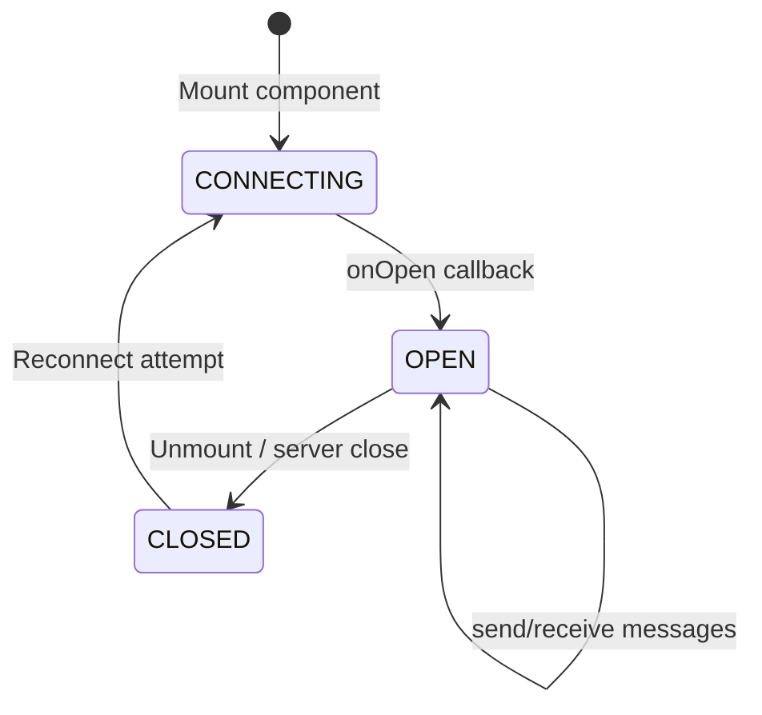
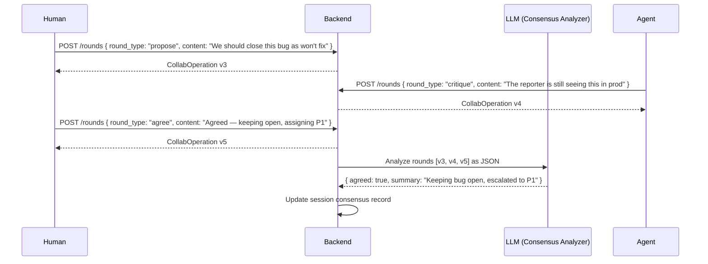
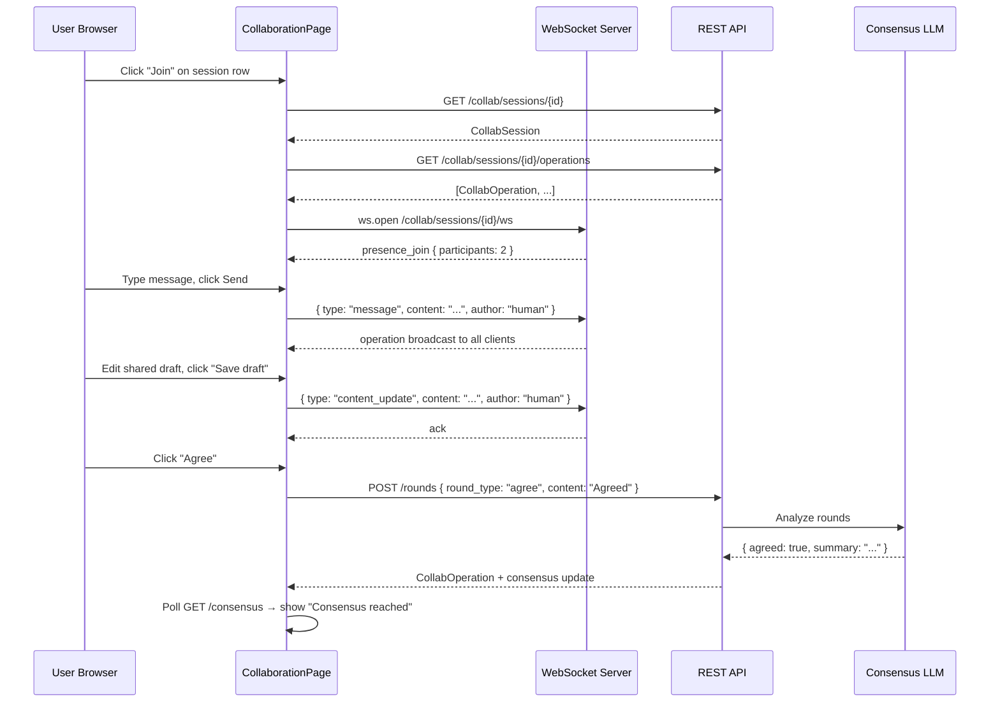

# Collaboration

Collaboration sessions are shared workspaces where humans and agents edit, discuss, and reach consensus on a piece of content in real time. A session can be attached to a running goal, an agent, or neither — it stands alone as a first-class entity. Multiple participants (human users and autonomous agents) join via WebSocket, exchange operations, and the platform tracks a monotonic version counter to serialize concurrent edits without conflicts.

---

## What a Collaboration Session Is

A `CollabSession` has four core fields:

| Field | Purpose |
|---|---|
| `session_id` | Stable identifier |
| `name` | Human-readable label (e.g. "Incident post-mortem draft") |
| `mode` | `review`, `debate`, or `co-write` |
| `content` | The shared mutable text artifact (Jira note, Confluence page, incident update, etc.) |
| `participants` | List of participant identifiers (user IDs / agent IDs) |
| `goal_id` | Optional: links this session to an executing goal |
| `agent_id` | Optional: designates an agent as the primary AI participant |

Sessions are created with `mode = review` by default. The mode shapes how the consensus protocol interprets rounds.

---

## WebSocket Transport

The frontend connects to each session via `useCollabSocket` (`src/lib/ws/useCollabSocket.ts`). The hook manages the full WebSocket lifecycle: opening, message routing, reconnect on unexpected close, and graceful teardown on component unmount.



The WebSocket endpoint is:

```
WS /collab/sessions/{session_id}/ws?api_key={key}
```

The `sendMessage(payload)` helper serializes any object to JSON and writes it to the socket. Inbound messages are routed through `handleMessage()` in `LiveSessionPanel`, which dispatches on `msg.type`:

| Message type | Handler |
|---|---|
| `presence_join` | Update participant count |
| `presence_leave` | Update participant count |
| `content_update` (operation) | Apply `payload.content` to shared draft |
| `ack` | Invalidate operations + consensus queries |
| anything else | Append to messages feed |

---

## Operational Transform-Style Versioning

Rather than a full OT algorithm, AgentVerse uses a simpler but robust **monotonic version counter** backed by `SELECT FOR UPDATE` at the database level. Every write to a session's operations table:

1. Acquires a row lock on the session record (`SELECT ... FOR UPDATE`).
2. Reads the current `version`.
3. Inserts the new `CollabOperation` with `version = current + 1`.
4. Releases the lock.

This serializes all operations and prevents two clients from writing the same version number. The version is visible in the UI per operation (`op.author · v{op.version}`) so participants can see the causal order of edits.

Conflict resolution for simultaneous content edits is "last writer wins" at the session level: a `content_update` operation with a higher version replaces the draft regardless of what it contains. For structured consensus (proposals and agreements) the rounds model provides richer semantics.

---

## Session Modes

| Mode | Intended use | Consensus threshold |
|---|---|---|
| `review` | One author, others comment and approve | Majority agreement |
| `debate` | Multiple agents present competing plans | All parties must agree |
| `co-write` | Parallel contribution to a shared document | First agreement wins |

The mode is fixed at session creation but the consensus protocol adapts its threshold to it at evaluation time.

---

## Consensus Protocol

The consensus engine operates on **rounds** — discrete contributions from participants. Each round has a `round_type`:

| `round_type` | Meaning |
|---|---|
| `propose` | A participant puts forward a position or a draft change |
| `critique` | Another participant identifies a problem or asks a question |
| `counter` | A refined proposal in response to a critique |
| `agree` | A participant signals they accept the current state |

Rounds are submitted via `POST /collab/sessions/{id}/rounds` with `{ agent_id, round_type, content }`. The frontend exposes two quick-action buttons ("Propose" and "Agree") with a free-text input.



---

## LLM Consensus Synthesis

When any `agree` round is submitted, the backend gathers all rounds for the session, serializes them as a JSON array, and submits them to the configured LLM with a consensus-analysis prompt:

```
Given these collaboration rounds: [...]
Determine whether consensus has been reached.
Return JSON: { "agreed": bool, "summary": "...", "dissenter": string | null }
```

The LLM returns structured JSON. The `ConsensusResult` is stored in the session and polled by the frontend every 5 seconds:

```json
{
  "agreed": true,
  "summary": "All participants agree to close the incident and schedule a post-mortem.",
  "dissenter": null
}
```

If `agreed` is still `false`, `dissenter` names the participant whose last round was a `critique` or `counter` without a subsequent `agree`.

---

## Presence Indicators

When a client opens a WebSocket connection to a session, the server broadcasts a `presence_join` message to all other connected clients:

```json
{ "type": "presence_join", "participants": 3 }
```

On disconnect:

```json
{ "type": "presence_leave", "participants": 2 }
```

The frontend shows a live participant count in the session header alongside the connection indicator (`Wifi` icon + "Live" / "Disconnected"). Named participant badges are also shown in the sidebar, pulled from `session.participants` (the static list set at session creation).

---

## Delegate to Agent

Any collaboration session can have an `agent_id` attached at creation time. When set, the agent is a first-class participant: it receives the session's content and operation stream, can submit rounds (`propose`, `critique`, `agree`), and can update the shared draft. From the user's perspective, delegating a task mid-session means typing a message in the live chat and mentioning the agent by ID; the backend routes the message as a `message` operation to the agent's input queue. The agent's response appears as a new operation authored by its `agent_id`.

---

## API Reference

| Method | Path | Description |
|---|---|---|
| `GET` | `/collab/sessions` | List all sessions for tenant |
| `POST` | `/collab/sessions` | Create a new session |
| `GET` | `/collab/sessions/{id}` | Get session state |
| `GET` | `/collab/sessions/{id}/operations` | List all operations (sorted by version) |
| `POST` | `/collab/sessions/{id}/operations` | Submit an operation |
| `POST` | `/collab/sessions/{id}/rounds` | Submit a consensus round |
| `GET` | `/collab/sessions/{id}/consensus` | Get current consensus result |
| `WS` | `/collab/sessions/{id}/ws` | Real-time WebSocket channel |

---

## Sequence: Session Open to Consensus


