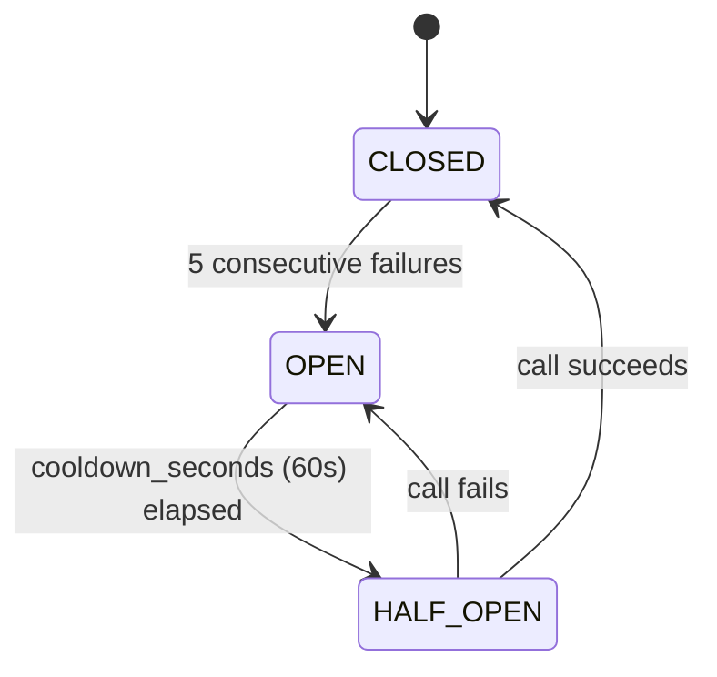
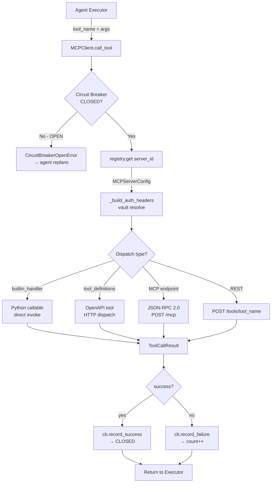
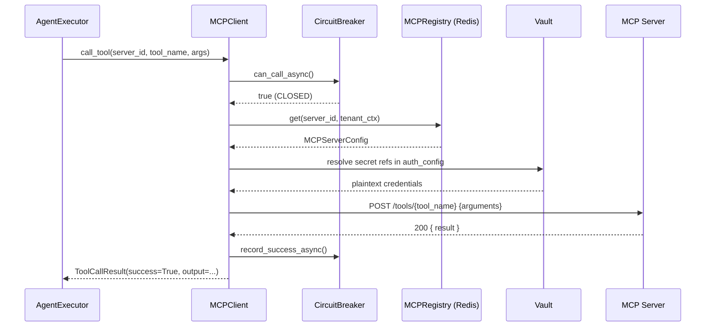

# Connectors Overview

Connectors are how AgentVerse agents reach the outside world. Every API call an agent makes — creating a Jira ticket, querying Datadog, pushing a commit to GitHub — flows through a connector. This document explains the full stack: what MCP is, how AgentVerse implements it, and the exact path a tool call travels from an agent step to an HTTP response and back.

---

## What is MCP?

**Model Context Protocol (MCP)** is an open standard for bridging LLMs to external services through a uniform tool-dispatch interface. Instead of every agent knowing the authentication scheme and API shape of every service it might call, MCP externalizes that knowledge into small adapter servers. The LLM sees a clean `tool_name + arguments` interface; MCP handles the messy authentication, protocol translation, and error mapping behind the scenes.

AgentVerse adopts MCP as its exclusive external-tool mechanism. This means:

- Any MCP-compatible server can be plugged in without code changes to the agent loop.
- Auth credentials never appear in prompts or agent state — they live in the connector's `auth_config`, resolved at dispatch time from the encrypted vault.
- New services become available to every agent the moment their connector is registered.

---

## The Three-Layer Architecture

AgentVerse's connector subsystem has three distinct layers, each with a single responsibility:

```
┌─────────────────────────────────────────────────────┐
│  MCPRegistry  (app/mcp/registry.py)                 │
│  • Stores per-tenant connector configs in Redis      │
│  • Key: mcp:servers:{tenant_id}:{server_id}          │
│  • Index: mcp:server_ids:{tenant_id}  (Redis Set)    │
└────────────────────────┬────────────────────────────┘
                         │ register / get / list / unregister
┌────────────────────────▼────────────────────────────┐
│  MCPClient  (app/mcp/client.py)                     │
│  • Resolves auth headers from vault                  │
│  • Checks circuit breaker before every call          │
│  • Dispatches HTTP (REST or JSON-RPC)                │
│  • Records success/failure for circuit accounting    │
└────────────────────────┬────────────────────────────┘
                         │ HTTP / JSON-RPC 2.0
┌────────────────────────▼────────────────────────────┐
│  MCP Server  (external process / sidecar)            │
│  • Exposes GET /tools  (tool discovery)              │
│  • Exposes POST /tools/{name}  (tool execution)      │
│  • Or: POST /mcp  (JSON-RPC envelope)                │
└─────────────────────────────────────────────────────┘
```

The registry is the single source of truth for what connectors exist. The client is stateless computation; it reads from the registry on every call. The MCP server is entirely external — it can be a third-party container, a sidecar, or one of the 32 built-in catalog templates.

---

## Authentication Types

Every connector declares one of ten `AuthType` values in `MCPServerConfig.auth_type`. The client reads the matching fields from `auth_config` and builds the appropriate HTTP headers before dispatch:

| `auth_type` | Headers / Transport | Typical `auth_config` keys |
|---|---|---|
| `bearer` | `Authorization: Bearer {token}` | `token` |
| `api_key` | `X-Api-Key: {key}` (or custom header name) | `key`, `header` |
| `basic` | `Authorization: Basic base64(user:pass)` | `username`, `password` |
| `oauth_ac` | `Authorization: Bearer {access_token}` | `access_token`, `refresh_token` |
| `pkce` | PKCE flow → stores tokens in vault | `client_id`, `redirect_uri` |
| `oauth_cc` | Client-credentials grant | `client_id`, `client_secret`, `token_url` |
| `custom_header` | Arbitrary header name and value | `header_name`, `header_value` |
| `mtls` | Mutual TLS client certificate | `cert_pem`, `key_pem` |
| `hmac` | `X-Signature: HMAC-SHA256(body, secret)` | `secret`, `algorithm` |
| `none` | No authentication header added | — |

Auth values that start with the sentinel prefix `secret://` are resolved through the vault at runtime; the plaintext never appears in the Redis record.

---

## Redis Namespace Isolation

Every connector record is a JSON blob stored at:

```
mcp:servers:{tenant_id}:{server_id}
```

A Redis Set at `mcp:server_ids:{tenant_id}` acts as the index for that tenant's connectors, enabling O(1) membership checks and full scans with no cross-tenant leakage. The client fetches the full config with a single `GET` before each call, so adding or removing a connector takes effect immediately with no process restart.

Built-in server handlers (Python callables) are held in a process-local `_BUILTIN_HANDLER_REGISTRY` dict keyed by `server_id`. When a config is deserialized from Redis the handler is re-attached by looking up this dict, since callable objects cannot be JSON-serialized.

---

## Circuit Breaker

Every `(tenant_id, server_id)` pair has its own circuit breaker instance managed by `MCPClient._get_circuit_breaker()`. When Redis is available the breaker is a `RedisCircuitBreaker`; otherwise it falls back to an in-memory `CircuitBreaker`.



**Parameters (defaults):**
- `failure_threshold = 5` — consecutive failures to trip OPEN
- `cooldown_seconds = 60.0` — time in OPEN before probing

When the breaker is OPEN, `call_tool()` raises `CircuitBreakerOpenError` immediately, protecting both the downstream service and the tenant's concurrency budget. The agent loop treats this as a retriable failure and may replan around the unavailable connector.

---

## Connector Health Check

`POST /connectors/{id}/test` triggers an on-demand health check. The `MCPClient` fetches the connector's config, builds auth headers identically to a real tool call, then issues either a `GET /tools` or a JSON-RPC `tools/list` probe. The response shape it looks for:

```json
{ "reachable": true, "status": "ok", "latency_ms": 43 }
```

If the HTTP request succeeds and the server returns a parseable tool list, the connector is marked reachable. The test result is surfaced in the UI as a green/red badge against the connector row and stored in `testResults` client-side state.

---

## Full Architecture Diagram



---

## API Reference

| Method | Path | Description |
|---|---|---|
| `GET` | `/connectors` | List all connectors for the authenticated tenant |
| `POST` | `/connectors` | Register a new connector |
| `GET` | `/connectors/{id}` | Get a single connector config |
| `PUT` | `/connectors/{id}` | Update connector config in-place |
| `DELETE` | `/connectors/{id}` | Unregister and remove from Redis |
| `POST` | `/connectors/{id}/test` | Health-check the connector, return `TestResult` |
| `GET` | `/connectors/{id}/tools` | Discover tools exposed by this connector |
| `GET` | `/connectors/catalog` | List built-in catalog templates |

All endpoints require `X-API-Key` header (tenant authentication).

---

## Tool-Call Sequence



If the MCP server returns a JSON-RPC 2.0 envelope, `MCPClient` unwraps `result` before returning. HTTP 4xx/5xx responses are surfaced as `ToolCallResult(success=False, error=...)` and counted by the circuit breaker.
