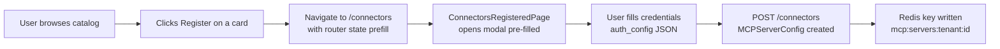
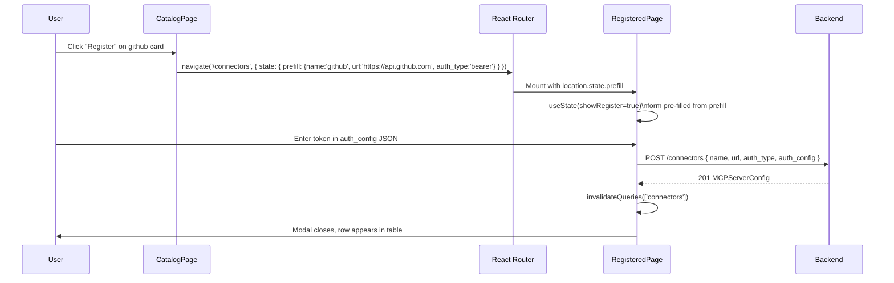

# Connector Catalog

The Connector Catalog is a curated library of 32 pre-built connector templates. Each template (`ConnectorSpec`) provides a default URL, the expected auth scheme, and a human-readable description. A template is not itself a working connector — it is a prefill shortcut that populates the registration form so the user only needs to supply their own credentials.

---

## How the Catalog Works



The catalog is served from `GET /connectors/catalog`. The frontend fetches all 32 entries, renders them as filterable cards with colour-coded auth badges, and on "Register" calls `navigate('/connectors', { state: { prefill: { name, url, auth_type, config_schema } } })`. The registered-connectors page reads `location.state.prefill` on mount and immediately opens the registration modal with those values loaded.

---

## The 32 Built-in Templates

### DevTools (Code & CI/CD)

| Connector | Default URL | Auth |
|---|---|---|
| `github` | `https://api.github.com` | `bearer` |
| `gitlab` | `https://gitlab.com/api/v4` | `bearer` |
| `linear` | `https://api.linear.app` | `api_key` |
| `sentry` | `https://sentry.io/api/0` | `bearer` |
| `circleci` | `https://circleci.com/api/v2` | `bearer` |
| `terraform` | `https://app.terraform.io/api/v2` | `bearer` |
| `kubernetes` | `https://kubernetes.default.svc` | `bearer` |
| `pagerduty` | `https://api.pagerduty.com` | `api_key` |

### Project Management

| Connector | Default URL | Auth |
|---|---|---|
| `jira` | `https://your-domain.atlassian.net` | `api_key` |
| `confluence` | `https://your-domain.atlassian.net/wiki/rest/api` | `api_key` |
| `notion` | `https://api.notion.com` | `bearer` |
| `asana` | `https://app.asana.com/api/1.0` | `bearer` |
| `monday` | `https://api.monday.com/v2` | `bearer` |

### CRM & Support

| Connector | Default URL | Auth |
|---|---|---|
| `salesforce` | `https://login.salesforce.com` | `oauth_ac` |
| `hubspot` | `https://api.hubapi.com` | `oauth_ac` |
| `zendesk` | `https://your-domain.zendesk.com/api/v2` | `api_key` |
| `intercom` | `https://api.intercom.io` | `bearer` |

### Communications

| Connector | Default URL | Auth |
|---|---|---|
| `slack` | `https://slack.com/api` | `oauth_ac` |
| `teams` | `https://graph.microsoft.com/v1.0` | `oauth_ac` |
| `discord` | `https://discord.com/api/v10` | `bearer` |
| `twilio` | `https://api.twilio.com/2010-04-01` | `basic` |

### Cloud & Infrastructure

| Connector | Default URL | Auth |
|---|---|---|
| `aws` | `https://aws.amazon.com` | `api_key` |
| `gcp` | `https://www.googleapis.com` | `oauth_ac` |
| `datadog` | `https://api.datadoghq.com` | `api_key` |
| `okta` | `https://your-domain.okta.com/api/v1` | `api_key` |

### Data

| Connector | Default URL | Auth |
|---|---|---|
| `postgresql` | `postgresql://localhost:5432/db` | `connection_string` |
| `mysql` | `mysql://localhost:3306/db` | `connection_string` |
| `mongodb` | `mongodb://localhost:27017` | `connection_string` |
| `snowflake` | `https://account.snowflakecomputing.com` | `api_key` |

### Productivity & Finance

| Connector | Default URL | Auth |
|---|---|---|
| `google_sheets` | `https://sheets.googleapis.com/v4` | `oauth_ac` |
| `stripe` | `https://api.stripe.com` | `bearer` |
| `quickbooks` | `https://quickbooks.api.intuit.com/v3` | `oauth_ac` |

---

## Auth Type Requirements by Category

The auth type is not a free choice — it is defined in the `ConnectorSpec` and locked to what the target service supports. Understanding the pattern by category helps when registering a custom connector:

| Category | Dominant auth type | Reason |
|---|---|---|
| SaaS DevTools | `bearer` / `api_key` | Simple personal access tokens, no user-level OAuth needed |
| CRM platforms | `oauth_ac` | Multi-user delegated access; refresh tokens needed |
| Communication | `oauth_ac` / `bearer` | Bot tokens (bearer) or user-delegated (oauth_ac) |
| Cloud providers | `api_key` / `oauth_ac` | Service accounts or workload identity |
| Databases | `connection_string` | DSN contains host, port, user, password as a single secret |
| Twilio | `basic` | Canonical Basic auth with AccountSID:AuthToken |

---

## OpenAPI Importer

Beyond the 32 catalog entries, any HTTP API with an OpenAPI 3.x specification can be imported as a connector. The flow:

1. Paste the spec URL (e.g. `https://api.example.com/openapi.json`) into the content field with `source_type = openapi`.
2. The backend fetches and parses the spec, generating one `ToolDefinition` per operation (`operationId` → tool name, `parameters` + `requestBody` → `input_schema`).
3. The generated tool definitions are stored in `MCPServerConfig.tool_definitions` in Redis alongside the connector config.
4. When the agent calls a tool by name, `MCPClient._call_tool_impl()` matches against `tool_definitions` first (before attempting an MCP-style HTTP dispatch) and routes to `_dispatch_openapi_tool()`, which maps HTTP method and path from the stored definition.

This makes every REST API an instant agent capability with no custom adapter code.

---

## Catalog Card Anatomy

Each card in `ConnectorsCatalogPage` displays:

- **Name** — the `ConnectorSpec.name` value, title-cased
- **Auth badge** — colour-coded pill (`bearer` = blue, `api_key` = purple, `oauth_ac`/`pkce` = green, `oauth_cc` = teal, `basic` = grey)
- **Description** — the human-readable `ConnectorSpec.description`
- **Default URL** — the `ConnectorSpec.default_url`, shown in monospace; this is the pre-filled value for the URL field

The search box filters across both `name` and `description` client-side; no API call is made per keystroke.

---

## Pre-fill Registration Flow



The prefill mechanism uses React Router's `state` channel, which is synchronous and never touches the URL, so credentials are never accidentally logged or bookmarked.

---

## Registering a Custom (Non-Catalog) Connector

The catalog is a convenience, not a constraint. Any MCP-compatible server — a custom internal tool, a homegrown microservice, or a language-specific adapter — can be registered manually from the **Registered Connectors** page without going through the catalog:

1. Click **+ Register Connector** to open the modal.
2. Enter a `name` (used as the display label and the tool namespace).
3. Enter the `url` — the base URL the agent will send requests to.
4. Select `auth_type` from the dropdown (all 10 types are available).
5. Paste a JSON object into **Auth Config** with the appropriate credential fields for the chosen auth type.

The form validates that `name` and `url` are non-empty before enabling the Submit button. The `auth_config` value is parsed from the textarea before posting; if the JSON is malformed, a client-side error is shown without making a network call.

---

## Searching and Filtering the Catalog

The catalog search box filters cards client-side with no debounce delay. It matches against both `name` and `description`, so searching "tracking" will surface Jira, Linear, and Sentry even though none of those names contain the word "tracking". This is intentional — the description field is designed for keyword discovery.

The search is case-insensitive and uses `String.prototype.includes()`, meaning it matches substrings. There is no fuzzy matching; if the user misspells a connector name the card will not appear until the query matches a substring of name or description.

---

## Auth Config Schema Hints

Some catalog entries carry a `config_schema` alongside the prefill data. When present, the registration modal can use this schema to render labelled input fields instead of a raw JSON textarea — guiding the user to provide exactly the right keys. The schema is stored in `ConnectorSpec.schema` and passed via the router state as `prefill.config_schema`.

For example, the `jira` connector's schema might specify:
```json
{
  "email": { "type": "string", "description": "Atlassian account email" },
  "api_token": { "type": "string", "description": "Atlassian API token", "secret": true }
}
```

Fields marked `"secret": true` are rendered as `<input type="password">` so the value is not displayed as the user types.
