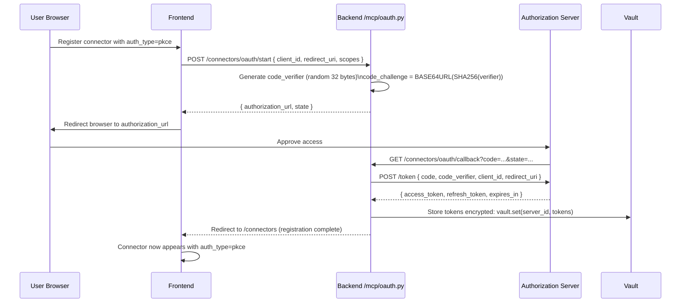
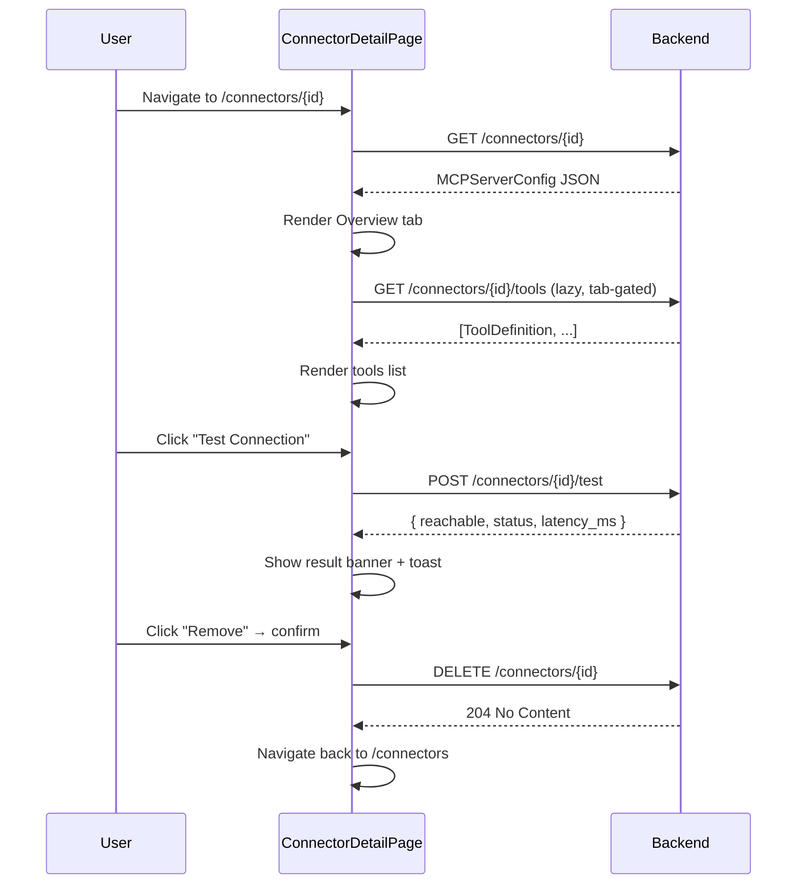

# Connector Detail

The Connector Detail page (`ConnectorDetailPage`) provides a deep-dive view into a single registered connector. It is reached by navigating to `/connectors/{connectorId}` and is split into three tabs: **Overview** (exposed tools + live connectivity test), **Health** (historical poll results), and **Usage** (agents and goals that have consumed this connector).

---

## Overview Tab

The Overview tab does two things simultaneously: fetches the connector's metadata from `GET /connectors/{id}` and, when the tab is active, auto-runs tool discovery against `GET /connectors/{id}/tools`.

**Connector Info panel** shows:

| Field | Source |
|---|---|
| URL | `MCPServerConfig.url` |
| Auth type | `MCPServerConfig.auth_type` |
| Status | `MCPServerConfig.status` (`active`, `draining`, `unhealthy`, `removed`) |

**Exposed Tools panel** lists every tool the MCP server advertises. Each entry shows:

- `name` — the tool identifier the agent will call (monospace badge)
- `description` — the human-readable description from the server's tool manifest

Tools are fetched lazily (only when the Overview tab is active) via `GET /connectors/{id}/tools`, which proxies to `MCPClient.discover_tools()` on the backend. The client issues either `GET /tools` (REST) or a JSON-RPC `tools/list` request (MCP endpoint), depending on whether the connector URL ends in `/mcp`.

---

## Health Tab

The Health tab renders connection health history. Each entry is produced by `POST /connectors/{id}/test`, which calls `MCPClient` with a probe request and returns:

```json
{
  "reachable": true,
  "status": "ok",
  "latency_ms": 43
}
```

The tab shows these poll results in reverse-chronological order. Green entries indicate the connector responded within the timeout window; red entries include the HTTP status or error message. Poll history is stored per-connector in the database and capped at the most recent N records.

---

## Usage Tab

The Usage tab performs a reverse lookup: given this connector's `server_id`, which goals and agents have issued tool calls against it? This answers the question "if I remove this connector, what breaks?" The lookup queries execution history filtered by `server_id`, returning agent names, goal IDs, and call counts. Currently exposed as an empty-state placeholder pending the analytics endpoint being wired.

---

## Test Connection Action

The "Test Connection" button in the page header calls `connectorsApi.test(connectorId)` which posts to `POST /connectors/{id}/test`. The result is shown inline as a coloured banner:

- `✓ Reachable (43ms)` — green banner, circuit breaker reset if previously tripped
- `✗ Unreachable: connection refused` — red banner, failure counted by the circuit breaker

A toast notification also fires for immediate feedback regardless of scroll position.

---

## OAuth PKCE Flow

For connectors with `auth_type = pkce`, the registration flow is extended with a browser-redirect OAuth sequence. PKCE (Proof Key for Code Exchange) is used for public clients (no client secret) where the authorization server supports it — for example, Google, Microsoft, and Atlassian.



At runtime, when `MCPClient._build_auth_headers()` encounters `auth_type = pkce`, it calls `vault.get(server_id)` to retrieve the access token, refreshing it if expired using the stored refresh token.

---

## Connector Update

Clicking **Edit** on a connector row in `ConnectorsRegisteredPage` opens the registration modal pre-filled with the existing `name`, `url`, `auth_type`, and `auth_config`. On submission, the frontend calls `PUT /connectors/{id}` with the updated payload. The backend calls `registry.update(server_id, new_config, tenant_ctx=...)`, which overwrites the Redis key at `mcp:servers:{tenant_id}:{server_id}` while preserving the `server_id` in the index set.

The update is atomic from the Redis perspective: `SET` overwrites the old JSON string without a delete+reinsert, so any concurrent tool call that reads the old config between the set and the index update will still succeed.

---

## Connector Deletion

The **Remove** button calls `DELETE /connectors/{id}`. The backend executes:

1. `redis.delete(mcp:servers:{tenant_id}:{server_id})` — removes the config blob
2. `redis.srem(mcp:server_ids:{tenant_id}, server_id)` — removes from the index set
3. Returns `True` if the key existed; `False` (404) if not

After deletion the circuit breaker key for this connector is orphaned in Redis (it will expire at its TTL). Any in-flight agent calls that already passed the circuit-breaker check will complete or fail naturally.

---

## Reverse Lookup: Which Agents Use This Connector

The Usage tab answers the reverse-direction question: given this connector, which agents and goals have consumed it? This is valuable before deletion — removing a connector that two production agents depend on would silently break their tool calls.

The lookup works by querying the goal execution event store, filtering by `server_id` in the tool call records. For each match it returns:

| Field | Meaning |
|---|---|
| `goal_id` | The goal that made the call |
| `agent_id` | The agent that executed the step |
| `tool_name` | The specific tool called on this connector |
| `call_count` | Number of times this tool was called in this goal |
| `last_called_at` | Timestamp of the most recent call |

This data comes from `app/services/event_store.py` which records every tool dispatch as an immutable event. The Usage tab renders this as a table sorted by `last_called_at` descending.

---

## Tool Discovery: How the Protocol Negotiation Works

When `GET /connectors/{id}/tools` is called, the backend must determine whether the target server speaks REST (`GET /tools`) or JSON-RPC 2.0 (`POST /mcp`). The detection logic in `MCPClient` is:

```python
def _is_mcp_endpoint(url: str) -> bool:
    return url.rstrip("/").endswith("/mcp")
```

If the URL ends in `/mcp`, the client sends a JSON-RPC `tools/list` request. Otherwise it sends a plain `GET /tools`. Both response shapes are normalized: an array is taken as-is; a dict with a `tools` key is unwrapped; a JSON-RPC `result.tools` path is also handled. This means the detail page works correctly for both standard REST MCP servers and the canonical JSON-RPC 2.0 MCP transport.

---

## Status Indicator

The connector's `status` field (`MCPServerConfig.status`) is one of four `ServerStatus` enum values and is displayed in the detail page header:

| Status | Meaning |
|---|---|
| `active` | Registered and reachable; tools are dispatched normally |
| `draining` | Being deprecated; existing calls complete, no new calls routed |
| `unhealthy` | Last health probe failed; circuit breaker may be OPEN |
| `removed` | Soft-deleted; registry entry still exists but calls are rejected |

The platform sets `unhealthy` automatically when the health check probe fails three consecutive times. Operators can override status manually via `PUT /connectors/{id}` with `{ "status": "active" }` to force re-enable without waiting for a successful probe.

---

## Sequence: Detail Page Lifecycle


