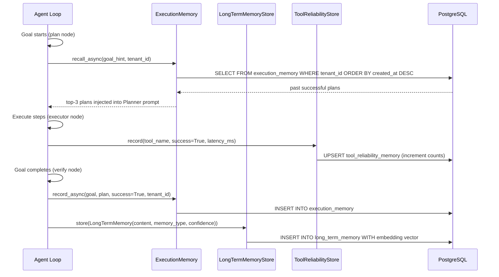
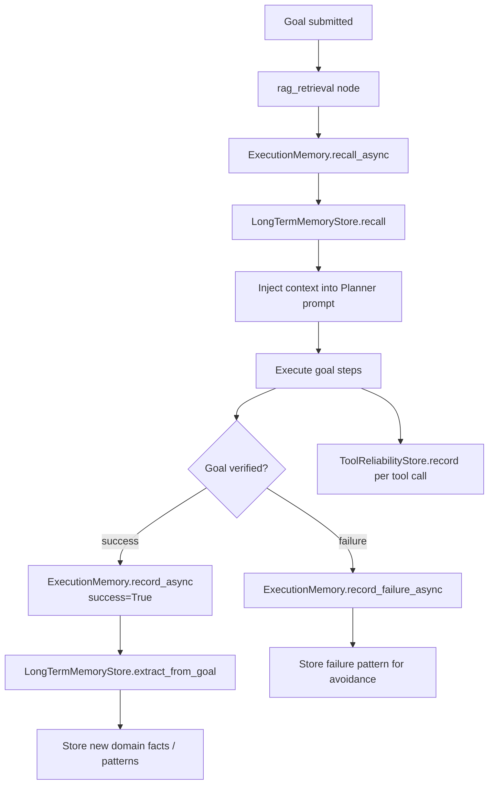

# Memory

AgentVerse uses **three distinct memory layers** that operate at different scopes and lifetimes. Together they allow agents to learn from their own executions, avoid repeating mistakes, and accumulate domain knowledge across sessions — all without any manual curation by the operator.

---

## The Three Memory Layers

```
┌──────────────────────────────────────────────────────────────────────┐
│  Layer 1: ExecutionMemory          Scope: per-session → Postgres      │
│  Winning plans & failure records   Fast in-memory + async DB write    │
├──────────────────────────────────────────────────────────────────────┤
│  Layer 2: LongTermMemoryStore      Scope: cross-session → pgvector    │
│  Domain facts, tool preferences,   Semantic embedding similarity      │
│  success/failure patterns                                              │
├──────────────────────────────────────────────────────────────────────┤
│  Layer 3: ToolReliabilityStore     Scope: cross-session → Postgres    │
│  Per-tool success/failure rates    Accumulated call counters          │
└──────────────────────────────────────────────────────────────────────┘
```

---

## Layer 1: ExecutionMemory

**Source**: `agent-verse-backend/app/memory/execution.py`

`ExecutionMemory` is a per-tenant, in-process store of **past goal executions** — both successes and failures. It is the most frequently written memory layer: every agent goal execution writes to it.

### What is Stored

| Record Type | Fields | When Written |
|---|---|---|
| Success plan | `goal_text`, `plan: list[str]`, `success=True`, `recorded_at` | After successful goal verification |
| Failure record | `goal_text`, `error`, `success=False` | After max iterations exceeded or verification failure |

### Persistence

```python
# app/memory/execution.py:119-126
async with db() as session, session.begin():
    await session.execute(
        text("""INSERT INTO execution_memory
            (id, tenant_id, goal_text, plan, success, created_at)
            VALUES (:id, :tid, :goal, :plan, :success, NOW())"""),
        {"id": uuid.uuid4().hex, "tid": tid,
         "goal": goal[:500], "plan": json.dumps(plan), "success": success}
    )
```

When a database session factory is provided (production with Postgres), records are persisted to the `execution_memory` table. Without a DB (`db=None`), records are kept only in the in-process dict — a sliding window of the **last 100 entries per tenant**.

### Recall

`recall_async()` queries Postgres for the most recent successful plans and filters by keyword similarity to the current goal hint:

```python
# Returns top-3 past plans whose goal text overlaps with current goal keywords
past_plans = await execution_memory.recall_async(
    "deploy service to production",
    tenant_id="t_acme",
    db=db_session_factory,
    limit=3,
)
```

The recall result is injected into the **Planner prompt** at the `rag_retrieval` node in `app/agent/graph.py`:

```
System prompt context block:
---
Past successful plans for similar goals:
Goal: deploy frontend to staging
Plan:
  1. Run build script
  2. Push image to ECR
  3. Update ECS task definition
  4. Trigger deployment
---
```

---

## Layer 2: LongTermMemoryStore

**Source**: `agent-verse-backend/app/memory/long_term.py`

`LongTermMemoryStore` stores **extracted cross-session learnings** — higher-level knowledge distilled from multiple completed goals. While `ExecutionMemory` stores raw plans, `LongTermMemoryStore` stores semantic observations about the world.

### Memory Types

```python
memory_type: str
# "tool_preference"   — "Use jira:search_issues before jira:create_issue to check duplicates"
# "domain_fact"       — "The staging database requires VPN access"
# "failure_pattern"   — "The Salesforce API rate limits at 100 req/min for query endpoints"
# "success_pattern"   — "Always confirm S3 bucket region before PutObject calls"
```

### LongTermMemory Schema

```python
@dataclass
class LongTermMemory:
    content: str               # The learning text
    source_goal_id: str        # Goal that generated this memory
    memory_type: str           # See above
    confidence: float          # 0.0–1.0, defaults to 1.0
    memory_id: str             # UUID hex
    created_at: str            # ISO-8601 UTC
    tags: list[str]            # Free-form labels
```

### Semantic Recall

In the in-memory implementation, recall uses keyword overlap scoring. In production with pgvector, recall uses **embedding cosine similarity** — the `store_async()` method embeds `content` using the tenant's configured embedding provider (Voyage AI or OpenAI `text-embedding-3-small`) and stores the vector in Postgres.

```python
# Production recall path (pgvector)
async def recall_async(query: str, tenant_id: str, top_k: int = 10) -> list[LongTermMemory]:
    query_embedding = await embedder.embed(query)
    rows = await db.execute(
        "SELECT * FROM long_term_memory WHERE tenant_id = :tid "
        "ORDER BY embedding <=> :vec LIMIT :k",
        {"tid": tenant_id, "vec": query_embedding, "k": top_k}
    )
    return [LongTermMemory(**r) for r in rows]
```

The `<=>` operator is pgvector's cosine distance operator. Lower distance = higher relevance.

### Extraction from Goals

`LongTermMemoryStore.extract_from_goal()` is called after a goal succeeds with a high eval score. The Verifier LLM or a dedicated extraction prompt synthesizes learnings from the execution trace.

---

## Layer 3: ToolReliabilityStore

**Source**: `agent-verse-backend/app/memory/tool_reliability.py`

`ToolReliabilityStore` tracks the **cumulative success and failure counts** for every tool invoked by every agent in the tenant. This data drives the Tool Reliability table in the Memory Explorer.

### Schema

**In-process cache** (fast, per-restart):
```python
_cache: dict[str, dict]
# Key: "{tenant_id}:{tool_name}"
# Value: {tool_name, success_count, failure_count, total_latency_ms}
```

**Postgres table** (`tool_reliability_memory`):
```sql
CREATE TABLE tool_reliability_memory (
    tenant_id        TEXT,
    tool_name        TEXT,
    success_count    INTEGER DEFAULT 0,
    failure_count    INTEGER DEFAULT 0,
    total_latency_ms FLOAT   DEFAULT 0.0,
    last_used_at     TIMESTAMPTZ,
    PRIMARY KEY (tenant_id, tool_name)
);
```

### Success Rate Calculation

```
success_rate = success_count / (success_count + failure_count)
```

For example: a tool with 95 successes and 5 failures has `success_rate = 0.95 = 95%`.

The store uses **upsert-with-increment** on every call:

```sql
ON CONFLICT (tenant_id, tool_name) DO UPDATE SET
    success_count    = tool_reliability_memory.success_count + :sc,
    failure_count    = tool_reliability_memory.failure_count + :fc,
    total_latency_ms = tool_reliability_memory.total_latency_ms + :lat,
    last_used_at     = NOW()
```

### Average Latency

Average latency is derived: `avg_latency_ms = total_latency_ms / (success_count + failure_count)`

---

## Memory Explorer UI

The Memory Explorer (`/memory`) exposes all three layers through a unified interface:

### Semantic Recall Panel

```
[  Recall memories relevant to…          ] [Recall]
```

Calls `GET /memory/recall?q=<query>&limit=10`. Results are displayed with:
- Memory content text
- `memory_type` badge
- `confidence` percentage

### Long-term Memories List

Fetches `GET /memory?limit=100`. Each entry shows:
- Content text
- `memory_type · confidence%`
- Tags (comma-separated if present)
- Delete button (calls `DELETE /memory/:id`)

### Tool Reliability Table

Fetches `GET /memory/tool-reliability`. Columns:

| Column | Source |
|---|---|
| Tool | `tool_name` |
| Calls | `total_calls` (`success_count + failure_count`) |
| Failures | `failure_count` |
| Success rate | `success_rate * 100`% |

An empty state ("All tools reliable") is shown when no tools are below the reliability threshold. This threshold is configurable in governance policies.

---

## API Reference

All endpoints require `X-API-Key: <tenant_api_key>`.

### `GET /memory?limit=100`

List all long-term memories for the tenant.

```bash
curl "https://api.agentverse.dev/memory?limit=50" -H "X-API-Key: $API_KEY"
```

```json
[
  {
    "id": "a1b2c3d4",
    "content": "Jira rate limits to 100 req/min. Use bulk operations.",
    "memory_type": "domain_fact",
    "confidence": 0.92,
    "tags": ["jira", "rate-limiting"],
    "created_at": "2024-06-29T10:00:00Z"
  }
]
```

---

### `GET /memory/recall?q=<query>&limit=10`

Semantic recall: find memories most relevant to the query.

```bash
curl "https://api.agentverse.dev/memory/recall?q=Jira+bulk+operations&limit=5" \
  -H "X-API-Key: $API_KEY"
```

```json
[
  {
    "content": "Jira rate limits to 100 req/min. Use bulk operations.",
    "memory_type": "domain_fact",
    "confidence": 0.92
  }
]
```

---

### `DELETE /memory/:id`

Delete a specific memory by ID.

```bash
curl -X DELETE "https://api.agentverse.dev/memory/a1b2c3d4" -H "X-API-Key: $API_KEY"
```

```json
{"deleted": true, "id": "a1b2c3d4"}
```

---

### `GET /memory/tool-reliability`

Get per-tool reliability statistics.

```bash
curl "https://api.agentverse.dev/memory/tool-reliability" -H "X-API-Key: $API_KEY"
```

```json
[
  {
    "tool_name":    "jira:create_issue",
    "total_calls":  243,
    "failures":     12,
    "success_rate": 0.95
  },
  {
    "tool_name":    "salesforce:query",
    "total_calls":  87,
    "failures":     19,
    "success_rate": 0.78
  }
]
```

---

## Memory Injection Sequence



---

## Memory Lifecycle



---

## Storage Backend Details

| Layer | Development | Production |
|---|---|---|
| ExecutionMemory | In-process dict (last 100 / tenant) | PostgreSQL `execution_memory` table |
| LongTermMemoryStore | In-process dict with keyword search | PostgreSQL `long_term_memory` + pgvector |
| ToolReliabilityStore | In-process dict | PostgreSQL `tool_reliability_memory` table |

All three layers use the same pattern: fast in-process cache for reads during a session, async write-through to Postgres for durability. If the DB write fails, a warning is logged but execution continues — memory is best-effort, never blocking.
