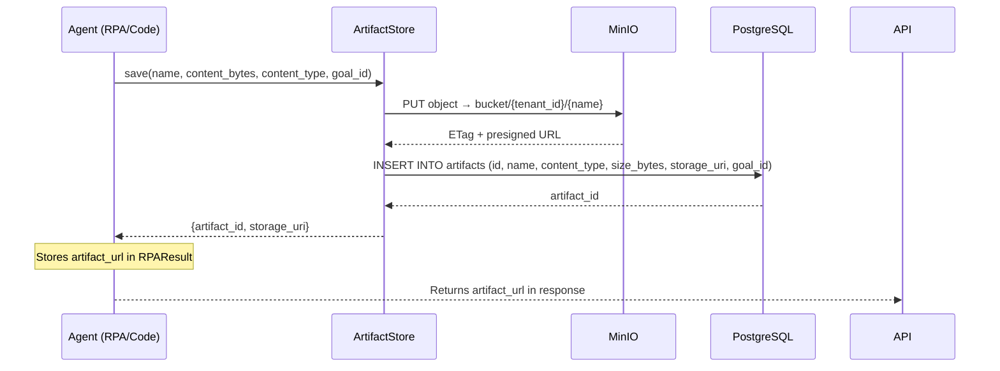

# Artifacts

**Artifacts** are files produced by agent runs. Screenshots taken by the RPA subsystem, exported compliance reports, training data exports, and any file an agent explicitly saves to durable storage all become artifacts. The Artifacts Browser provides a searchable, previewable, downloadable catalog of everything your agents have produced.

---

## What Artifacts Are

Artifacts are **structured file records** with rich metadata. Unlike workspace files (which are ephemeral tenant-scoped `/tmp` storage), artifacts are stored in **MinIO** — a self-hosted S3-compatible object store — and survive container restarts.

```
┌──────────────────────────────────────────────────────┐
│  Agent Run  ──produces──▶  Artifact Record            │
│                                                       │
│  {id, name, content_type, size_bytes, storage_uri,   │
│   goal_id, created_at}                               │
│                          ──stored in──▶ MinIO         │
│                              (S3-compatible, local)   │
└──────────────────────────────────────────────────────┘
```

---

## Artifact Types

| Type | `content_type` | Produced By |
|---|---|---|
| Screenshot | `image/png` | RPA Executor (`rpa_screenshot` tool) |
| PDF export | `application/pdf` | Compliance export, training report |
| JSON result | `application/json` | Goal output serialization |
| CSV data | `text/csv` | Code Runner output, agent data export |
| JSONL training | `application/x-ndjson` | Training Export feature |

The `content_type` field drives the preview behavior in the UI.

---

## Storage: MinIO S3-Compatible Backend

### Architecture

```
Backend writes artifact       MinIO bucket
  ┌────────────┐              ┌─────────────────────┐
  │ ArtifactAPI│──PUT object──▶│ agentverse-artifacts│
  │            │◀──pre-signed──│    bucket           │
  │            │    URL        └─────────────────────┘
  └────────────┘
```

MinIO runs as a Docker service in `infra/docker-compose.yml`. In production, the `MINIO_ENDPOINT`, `MINIO_ACCESS_KEY`, and `MINIO_SECRET_KEY` environment variables point to a real MinIO cluster or AWS S3.

### Storage URI Formats

The `storage_uri` field in an artifact record can take two forms:

| Format | Meaning | Preview |
|---|---|---|
| `https://...` | Direct HTTP URL (MinIO presigned or public) | Available |
| `minio://bucket/path/to/object` | Internal MinIO reference | Not directly previewable |
| `s3://bucket/key` | S3 URI (external) | Not directly previewable |

The frontend detects HTTP URLs with the `isHttpUri(uri)` helper:

```ts
function isHttpUri(uri: string): boolean {
  return /^https?:\/\//.test(uri);
}
```

Only HTTP URIs enable the Download button (as a native `<a href download>` link). Non-HTTP URIs show the URI text in the preview modal.

---

## Artifact Metadata Schema

```typescript
interface Artifact {
  id:           string;   // UUID
  name:         string;   // Filename
  content_type: string;   // MIME type
  size_bytes:   number;   // File size
  storage_uri:  string;   // Where the file lives
  goal_id:      string;   // Which goal produced this artifact
  created_at:   string;   // ISO-8601 UTC timestamp
}
```

---

## Preview System

The Artifacts Browser implements a modal preview system that dispatches on `content_type`:

```typescript
const previewable = useMemo(() => {
  if (!preview) return null;
  if (!isHttpUri(preview.storage_uri)) return { kind: 'ref' };
  if (preview.content_type.startsWith('image/')) return { kind: 'image' };
  if (preview.content_type.startsWith('text/'))  return { kind: 'text' };
  return { kind: 'ref' };
}, [preview]);
```

| `kind` | Render |
|---|---|
| `image` | `` — renders PNG/JPEG screenshots inline |
| `text` | `<iframe src={storage_uri}>` — renders CSV/HTML/text in a sandboxed frame |
| `ref` | Shows raw `storage_uri` string (for non-HTTP or binary types) |

---

## Download: Pre-Signed URLs

When `storage_uri` is an HTTP URL, the Download button is a standard `<a href download>` link pointing directly to MinIO. MinIO supports pre-signed URLs with time-limited access tokens, so even private bucket objects can be shared temporarily.

For non-HTTP storage URIs, the Download button is disabled (reduced opacity, `pointer-events-none`). To download these, generate a pre-signed URL via the API:

```bash
# Request a pre-signed download URL (5-minute expiry)
curl "https://api.agentverse.dev/artifacts/a1b2c3d4/presigned-url?expires=300" \
  -H "X-API-Key: $API_KEY"
```

```json
{
  "url": "https://minio.internal/agentverse-artifacts/t_abc123/screenshot_20240629.png?X-Amz-Expires=300&..."
}
```

---

## Data Retention

Artifacts expire according to the `DATA_RETENTION_DAYS` configuration setting (default: 90 days). The retention policy is enforced by a Celery periodic task (`app/scaling/tasks.py`) that runs daily and deletes objects both from the `artifacts` table and from MinIO.

```python
# Celery task (runs daily at 02:00 UTC)
@celery_app.task
async def cleanup_expired_artifacts():
    cutoff = datetime.now(UTC) - timedelta(days=settings.DATA_RETENTION_DAYS)
    expired = await db.query("SELECT * FROM artifacts WHERE created_at < :cutoff", cutoff=cutoff)
    for artifact in expired:
        await minio_client.delete_object(artifact.storage_uri)
        await db.delete(artifact)
```

Operators can override `DATA_RETENTION_DAYS` per-tenant via the governance policy engine.

---

## API Reference

All endpoints require `X-API-Key: <tenant_api_key>`.

### `GET /artifacts?limit=100`

List artifacts for the tenant.

```bash
curl "https://api.agentverse.dev/artifacts?limit=20" -H "X-API-Key: $API_KEY"
```

```json
[
  {
    "id":           "a1b2c3d4",
    "name":         "screenshot_checkout_flow.png",
    "content_type": "image/png",
    "size_bytes":   245760,
    "storage_uri":  "https://minio.internal/agentverse/t_acme/screenshot_checkout_flow.png",
    "goal_id":      "goal_xyz789",
    "created_at":   "2024-06-29T10:30:00Z"
  }
]
```

---

### `GET /artifacts/:id`

Get a single artifact by ID.

```bash
curl "https://api.agentverse.dev/artifacts/a1b2c3d4" -H "X-API-Key: $API_KEY"
```

---

### `DELETE /artifacts/:id`

Delete an artifact (removes both the DB record and the MinIO object).

```bash
curl -X DELETE "https://api.agentverse.dev/artifacts/a1b2c3d4" -H "X-API-Key: $API_KEY"
```

```json
{"deleted": true, "id": "a1b2c3d4"}
```

---

## Artifacts Browser UI Walkthrough

The `ArtifactsBrowserPage` component (`src/features/artifacts/ArtifactsBrowserPage.tsx`) renders a single card list:

### List View

Each artifact row shows:
- File icon (`<FileText>`)
- `name` (truncated) and `content_type · size · goal <short_id>`
- Eye icon → opens preview modal
- Download icon → `<a href download>` (disabled for non-HTTP URIs)
- Trash icon → `DELETE /artifacts/:id`

### Size Formatting

```typescript
function formatBytes(n: number): string {
  if (n < 1024)           return `${n} B`;
  if (n < 1024 * 1024)    return `${(n / 1024).toFixed(1)} KB`;
  return `${(n / (1024 * 1024)).toFixed(1)} MB`;
}
```

### Preview Modal

Clicking the Eye icon opens a full-screen overlay dialog. The modal dispatches to the appropriate renderer based on `content_type`. Click outside the modal or the × button to close.

---

## Artifact Creation Flow



---

## Common Artifact Patterns

### RPA Screenshot Artifacts

Every `rpa_screenshot` tool call produces an artifact automatically:

```python
# RPAExecutor returns:
RPAResult(
    success=True,
    output="Screenshot captured: checkout_flow.png",
    artifact_url="https://minio.internal/...screenshot.png",
    artifact_name="checkout_flow.png",
)
```

### Training Export Artifacts

When the Training Export feature runs, it creates an artifact for the exported JSONL:

```json
{
  "name": "agentverse_training_openai_20240629_120000.jsonl",
  "content_type": "application/x-ndjson",
  "size_bytes": 1048576
}
```

### Compliance Export Artifacts

GDPR/SOC2/PCI compliance exports create PDF artifacts:

```json
{
  "name": "compliance_audit_20240629.pdf",
  "content_type": "application/pdf",
  "size_bytes": 524288
}
```
