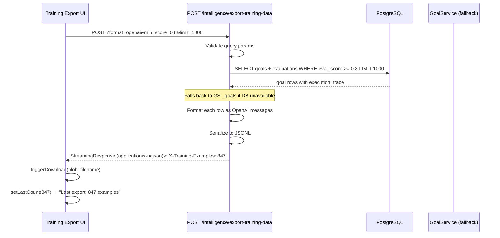
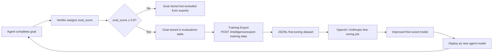

# Training Data Export

The **Training Export** feature lets you extract high-quality agent execution traces from AgentVerse and export them as JSONL fine-tuning datasets. This closes the loop of **constitutional AI**: the system trains on its own verified successes, and each generation of the agent model becomes better at the tasks it has already mastered.

---

## What Training Export Is

Every time an agent completes a goal, the Verifier node assigns an `eval_score` between 0.0 and 1.0. Training Export queries the `evaluations` table for completed goals that meet a minimum score threshold and formats them as fine-tuning examples.

```
AgentVerse execution trace
  {goal_text, planner_messages, executor_messages, verifier_result, eval_score}
       ↓ filter: eval_score ≥ 0.8
  Fine-tuning example
  {messages: [{role, content}, ...], metadata: {eval_score, model}}
       ↓ JSONL stream
  Downloaded .jsonl file → OpenAI / Anthropic fine-tuning job
```

---

## Quality Gate

Only goals with `eval_score ≥ min_score` (default: `0.8`) are exported. This quality gate ensures that fine-tuning datasets contain only well-verified agent behaviors — not partial successes or hallucinations.

```python
# From app/api/training_export.py:20
_MIN_EXPORT_SCORE = 0.8
```

The score threshold is configurable per export — you can raise it to 0.9 for higher-quality but smaller datasets, or lower it to 0.6 to capture borderline successes for negative mining.

---

## Two Output Formats

### OpenAI Format

Compatible with OpenAI's fine-tuning API (`gpt-3.5-turbo`, `gpt-4o-mini`, etc.):

```jsonl
{"messages": [{"role": "system", "content": "You are an AI agent..."}, {"role": "user", "content": "Summarize all open Jira tickets for project PLATFORM"}, {"role": "assistant", "content": "I'll summarize the open Jira tickets. First, let me query the Jira API..."}], "metadata": {"eval_score": 0.93, "goal_id": "goal_abc", "model": "claude-3-sonnet"}}
{"messages": [...], "metadata": {...}}
```

The `messages` array follows OpenAI's chat completions format exactly. The `system` turn contains the full AgentVerse agent system prompt. The `user` turn is the goal text. The `assistant` turn is the full execution trace.

### Anthropic Format

Compatible with Anthropic's fine-tuning API (Claude models):

```jsonl
{"system": "You are an AI agent that completes goals...", "messages": [{"role": "user", "content": "Summarize all open Jira tickets"}, {"role": "assistant", "content": "I'll start by searching Jira..."}], "metadata": {"eval_score": 0.93, "goal_id": "goal_abc", "model": "claude-3-sonnet"}}
```

Anthropic's format separates the `system` prompt from `messages` (not a message turn). The `metadata` field includes `model` — which model was used for the original execution, useful for selective fine-tuning.

---

## StreamingResponse Architecture

The export endpoint uses `StreamingResponse` to avoid buffering large datasets in memory:

```python
# From app/api/training_export.py:58-64
return StreamingResponse(
    io.StringIO(content),
    media_type="application/x-ndjson",
    headers={
        "Content-Disposition": f'attachment; filename="{filename}"',
        "X-Training-Examples": str(len(jsonl_lines)),
    },
)
```

The `X-Training-Examples` response header tells the client how many examples are in the file **before** the download begins. The frontend reads this header and displays it as "Last export: N examples."

The filename is auto-generated:
```
agentverse_training_{format}_{timestamp}.jsonl
# e.g. agentverse_training_openai_20240629_120000.jsonl
```

---

## Data Source

Training examples come from two sources depending on deployment:

**With PostgreSQL** (production): queries the `evaluations` table joined with `goals`:

```sql
SELECT g.goal_text, g.execution_trace, e.eval_score, e.model
FROM goals g
JOIN evaluations e ON e.goal_id = g.id
WHERE e.eval_score >= :min_score
  AND g.tenant_id = :tenant_id
  AND g.status = 'completed'
ORDER BY e.eval_score DESC, g.completed_at DESC
LIMIT :limit
```

**Without PostgreSQL** (development): falls back to the in-memory `GoalService` cache.

---

## API Reference

### `POST /intelligence/export-training-data`

**Authentication**: `X-API-Key: <tenant_api_key>`

**Query Parameters**

| Parameter | Type | Default | Constraints |
|---|---|---|---|
| `min_score` | `float` | `0.8` | 0.0–1.0 |
| `format` | `string` | `"openai"` | `openai` \| `anthropic` |
| `limit` | `integer` | `1000` | 1–10,000 |

```bash
# Export top-1000 examples in OpenAI format
curl -X POST "https://api.agentverse.dev/intelligence/export-training-data?min_score=0.8&format=openai&limit=1000" \
  -H "X-API-Key: $API_KEY" \
  -o training_data.jsonl

# Check how many examples were exported
curl -sI -X POST "..." | grep X-Training-Examples
# X-Training-Examples: 847
```

**Response Headers**

| Header | Value |
|---|---|
| `Content-Type` | `application/x-ndjson` |
| `Content-Disposition` | `attachment; filename="agentverse_training_openai_20240629_120000.jsonl"` |
| `X-Training-Examples` | Number of JSONL lines in the response |

**Response Body**: streaming JSONL (one JSON object per line)

---

## Execution Sequence



---

## Training Export UI Walkthrough

The `TrainingExportPage` component (`src/features/training/TrainingExportPage.tsx`) has a clean single-card form:

### Format Selector

Dropdown with two options:
- **OpenAI** — `{"messages": [...]}` format
- **Anthropic** — `{"system": "...", "messages": [...]}` format

### Minimum Eval Score Slider

Range slider from 0.0 to 1.0 in steps of 0.05. Displays the current value as a decimal (e.g., `0.80`). The live label updates as you drag:

```tsx
<label>Minimum eval score: {minScore.toFixed(2)}</label>
<input type="range" min={0} max={1} step={0.05} value={minScore}
  onChange={e => setMinScore(Number(e.target.value))} />
```

### Max Examples Input

Number input, 1–10,000. Defaults to 1,000.

### Export Button + Last Count

Clicking **Export JSONL** triggers the download. The button label changes to "Exporting…" while the request is in flight. After success, "Last export: N examples." is shown below the button.

The download is triggered programmatically using a synthetic anchor click:

```typescript
function triggerDownload(blob: Blob, filename: string): void {
  const url = URL.createObjectURL(blob);
  const a = document.createElement('a');
  a.href = url; a.download = filename;
  document.body.appendChild(a); a.click(); a.remove();
  URL.revokeObjectURL(url);
}
```

---

## The Constitutional AI Loop



This flywheel is the key differentiator: **AgentVerse doesn't just use LLMs — it produces training data that improves the LLMs it runs on**. Each successful goal execution is a potential training example. The more goals agents complete successfully, the better the models become at your specific domain.

---

## Integration with the Evaluations System

Training Export depends on the `EvalRunner` output stored in the `evaluations` table. Each evaluation record captures:

```python
# Columns in evaluations table
eval_id:       UUID
goal_id:       UUID (FK → goals)
eval_score:    FLOAT (0.0–1.0)
dimensions:    JSONB  # {correctness, completeness, efficiency, safety}
model:         TEXT   # Which LLM generated this execution
executed_at:   TIMESTAMPTZ
```

The `eval_score` is a weighted composite of multiple dimensions. Only goals with a high composite score are exported, ensuring that training data represents **holistically good** executions — not just technically correct ones.

---

## Using Exported Data for Fine-Tuning

### OpenAI (gpt-3.5-turbo / gpt-4o-mini)

```bash
# Upload the dataset
openai api files.create -f agentverse_training_openai_20240629.jsonl -p fine-tune

# Create a fine-tuning job
openai api fine_tuning.jobs.create \
  --training-file file-abc123 \
  --model gpt-4o-mini

# Monitor progress
openai api fine_tuning.jobs.follow ft:gpt-4o-mini-2024-07-18:acme::abc123
```

### Anthropic (Claude)

```bash
# Upload via Anthropic fine-tuning API (beta)
curl -X POST https://api.anthropic.com/v1/fine-tuning/datasets \
  -H "x-api-key: $ANTHROPIC_KEY" \
  --data-binary @agentverse_training_anthropic_20240629.jsonl
```

After fine-tuning, configure the new model ID in AgentVerse via `Settings → LLM Config → Fine-tuned Model`.
