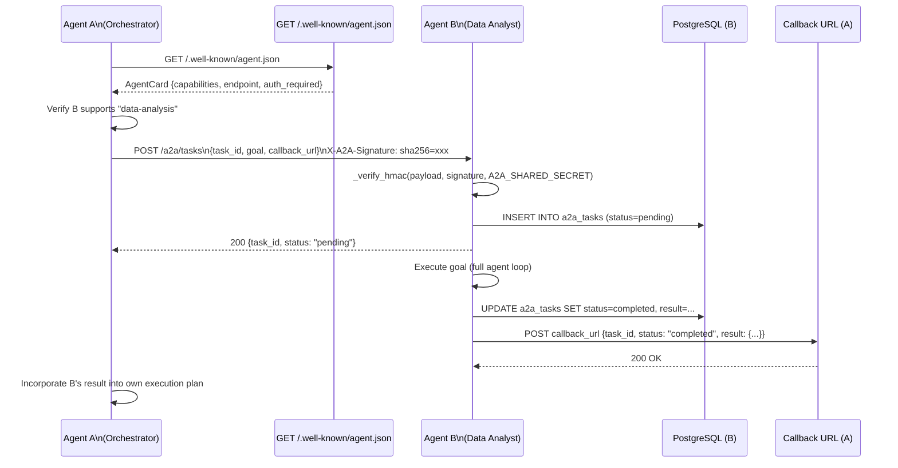

# A2A — Agent-to-Agent Protocol

**A2A (Agent-to-Agent)** is AgentVerse's inter-agent delegation protocol. It allows one AgentVerse agent to discover another agent's capabilities, submit a sub-task to it, and receive the result asynchronously via a callback URL — all with cryptographic authentication.

---

## What A2A Is

The A2A protocol enables **hierarchical agent architectures**: a high-level orchestrator agent breaks a goal into sub-tasks and delegates each to a specialized agent. The specialized agent executes the sub-task with full access to its own tools and tenant context, then reports back.

```
Tenant A — Orchestrator Agent
  └── Delegates: "Analyze Q3 sales data for EMEA region"
        ↓ POST /a2a/tasks (to Agent B's endpoint)

Tenant B — Data Analysis Agent
  └── Receives task → runs analysis → callback to Agent A
        ↑ POST <callback_url>
```

This is distinct from the **multi-agent Supervisor** pattern (which runs multiple agents in the same backend process). A2A enables cross-deployment and cross-tenant delegation over HTTP.

---

## Source

`agent-verse-backend/app/mcp/a2a.py` (protocol types)  
`agent-verse-backend/app/api/a2a.py` (full implementation — HMAC auth, DB persistence, callbacks)

---

## Protocol Types

### AgentCard

The **Agent Card** is a machine-readable descriptor of an agent's capabilities, served at `/.well-known/agent.json`. Any agent that wants to delegate tasks to this agent can discover its capabilities by fetching this URL:

```python
class AgentCard(BaseModel):
    agent_id:      str         # Unique identifier for this agent
    name:          str         # Human-readable name
    version:       str         # Semantic version
    endpoint:      str         # Base URL for A2A task submission
    capabilities:  list[str]   # ["data-analysis", "report-generation"]
    description:   str         # Free-text capability description
    tenant_id:     str         # Which tenant this agent belongs to
    auth_required: bool        # Whether HMAC auth is required
```

**Example Agent Card:**

```json
{
  "agent_id":      "agent_data_analyst_v2",
  "name":          "AgentVerse Data Analyst",
  "version":       "2.1.0",
  "endpoint":      "https://analytics.agentverse.dev",
  "capabilities":  ["data-analysis", "report-generation", "sql-query", "visualization"],
  "description":   "Specializes in structured data analysis, SQL query generation, and chart creation",
  "tenant_id":     "t_analytics_team",
  "auth_required": true,
  "authentication": {"scheme": "hmac-sha256"}
}
```

---

### A2ATask

A task submitted from the originator to the recipient agent:

```python
class A2ATask(BaseModel):
    task_id:          str              # UUID hex, generated by sender
    goal:             str              # Natural language task description
    sender_endpoint:  str              # Originator's A2A base URL (for verification)
    context:          dict[str, Any]   # Arbitrary context key-value pairs
    callback_url:     str | None       # Where to POST the result when complete
    status:           str              # "pending" | "executing" | "completed" | "failed"
```

---

### A2ATaskResult

The result posted back to the originator's `callback_url`:

```python
class A2ATaskResult(BaseModel):
    task_id: str
    status:  str              # "completed" | "failed"
    result:  dict | None      # Structured result payload
    error:   str              # Error message if failed
```

---

## HMAC Authentication

A2A task payloads are signed using HMAC-SHA256. The shared secret is configured via the `A2A_SHARED_SECRET` environment variable:

```python
# From app/api/a2a.py:42-54
def _verify_hmac(payload: bytes, signature: str, secret: str) -> bool:
    if not secret:
        return True   # Dev mode: auth disabled
    if not signature:
        return False
    expected = _hmac.new(secret.encode(), payload, hashlib.sha256).hexdigest()
    return _hmac.compare_digest(f"sha256={expected}", signature)
```

If `A2A_SHARED_SECRET` is not set, **the backend logs a startup warning** and accepts all A2A tasks without authentication. This is acceptable in development but must never be used in production.

```
WARNING: a2a_hmac_disabled — A2A_SHARED_SECRET is not set — incoming A2A tasks 
are accepted without authentication. Set this env var in production to enable 
HMAC-SHA256 request signing.
```

**Signing an outbound task** (originator side):

```python
import hmac, hashlib, json

payload = json.dumps(task.dict()).encode()
signature = "sha256=" + hmac.new(
    A2A_SHARED_SECRET.encode(), payload, hashlib.sha256
).hexdigest()

requests.post(
    f"{recipient_endpoint}/a2a/tasks",
    data=payload,
    headers={
        "Content-Type": "application/json",
        "X-A2A-Signature": signature,
    }
)
```

---

## Task Lifecycle

```
pending → executing → completed
                    ↘ failed
```

| Status | Meaning |
|---|---|
| `pending` | Task received, not yet started |
| `executing` | Agent is actively working on the task |
| `completed` | Task finished successfully, result available |
| `failed` | Task failed, error message in `error` field |

---

## Database Persistence

Tasks are persisted to the `a2a_tasks` PostgreSQL table:

```sql
CREATE TABLE a2a_tasks (
    id            TEXT PRIMARY KEY,
    tenant_id     TEXT,
    goal_text     TEXT,
    status        TEXT DEFAULT 'pending',
    callback_url  TEXT,
    requester_id  TEXT,   -- sender_endpoint
    created_at    TIMESTAMPTZ DEFAULT NOW()
);
```

When the DB is unavailable, tasks fall back to an in-memory dict (`_tasks: dict[str, Any]`).

---

## API Reference

### `GET /.well-known/agent.json`

Returns the Agent Card for this AgentVerse instance.

```bash
curl "https://api.agentverse.dev/.well-known/agent.json"
```

```json
{
  "agent_id":     "agentverse_main",
  "name":         "AgentVerse",
  "version":      "1.0.0",
  "endpoint":     "https://api.agentverse.dev",
  "capabilities": ["goal-execution", "tool-calling", "multi-step-planning"],
  "description":  "Autonomous AI agent for complex multi-step goals",
  "auth_required": true,
  "authentication": {"scheme": "hmac-sha256"}
}
```

---

### `POST /a2a/tasks`

Submit a task to this agent.

```bash
curl -X POST https://api.agentverse.dev/a2a/tasks \
  -H "Content-Type: application/json" \
  -H "X-A2A-Signature: sha256=<computed-hmac>" \
  -d '{
    "task_id":         "task_abc123",
    "goal":            "Generate Q3 EMEA sales report with trend analysis",
    "sender_endpoint": "https://orchestrator.agentverse.dev",
    "context":         {"quarter": "Q3", "region": "EMEA", "format": "pdf"},
    "callback_url":    "https://orchestrator.agentverse.dev/a2a/callbacks/task_abc123",
    "status":          "pending"
  }'
```

**Response**

```json
{
  "task_id": "task_abc123",
  "status":  "pending",
  "message": "Task accepted"
}
```

**Error Responses**

| Status | Condition |
|---|---|
| `403` | Invalid or missing `X-A2A-Signature` |
| `422` | Missing required fields |
| `409` | `task_id` already exists |

---

### `GET /a2a/tasks/:id`

Poll for task status.

```bash
curl "https://api.agentverse.dev/a2a/tasks/task_abc123" \
  -H "X-A2A-Signature: sha256=<hmac-of-empty-body>"
```

```json
{
  "task_id":  "task_abc123",
  "goal":     "Generate Q3 EMEA sales report with trend analysis",
  "status":   "completed",
  "result":   {
    "pdf_url": "https://minio.internal/artifacts/q3_emea_report.pdf",
    "summary": "EMEA Q3 revenue grew 12% YoY. Top performing region: DACH (+23%)."
  },
  "error":    ""
}
```

---

## Callback URL Flow

When the recipient agent completes the task, it POSTs the result back to `callback_url`:

```python
# Pseudocode from app/api/a2a.py
async def _fire_callback(callback_url: str, result: A2ATaskResult) -> None:
    async with httpx.AsyncClient() as client:
        await client.post(
            callback_url,
            json=result.dict(),
            headers={"X-A2A-Signature": _sign(result.json())}
        )
```

If the callback fails (network error, 5xx), the status remains `completed` in the task table — the originator can still poll `GET /a2a/tasks/:id`.

---

## A2A Observability Page

The `A2APage` component (`src/features/a2a/A2APage.tsx`) is a **read-only observability view** (no task submission from the UI). It shows:

### Agent Card Panel

Displays this instance's `/.well-known/agent.json` in a structured card:
- Name + version + `agent_id`
- Authentication scheme badge (e.g., `hmac-sha256`)
- Capabilities list (code tags)
- Supported task types (code tags)

```tsx
const { data: card } = useQuery({
  queryKey: ['a2a-card'],
  queryFn: () => a2aApi.agentCard(),  // GET /.well-known/agent.json
});
```

### Task Lookup

Enter a task ID to retrieve its current status. Results accumulate in the session (most recent first, deduped by `task_id`):

```tsx
const lookupMutation = useMutation({
  mutationFn: (id: string) => a2aApi.getTask(id),
  onSuccess: (task) =>
    setTasks(prev => [task, ...prev.filter(t => t.task_id !== task.task_id)]),
});
```

Each task card shows:
- Task ID (monospace)
- Status badge
- Goal text
- Result (if available)

---

## Full Sequence: Cross-Tenant Delegation



---

## Cross-Tenant Delegation Security

When Agent A in `tenant_acme` delegates to Agent B in `tenant_beta`:

1. `A2A_SHARED_SECRET` must be known to both deployments (pre-shared out-of-band)
2. Agent B executes the task under `tenant_beta`'s context — it cannot access `tenant_acme`'s data
3. Results returned via callback are validated with the same HMAC secret
4. No API key cross-contamination — each agent maintains its own tenant isolation

The `sender_endpoint` field in `A2ATask` is used for logging and optional allowlisting — operators can configure Agent B to only accept tasks from known originator endpoints.
