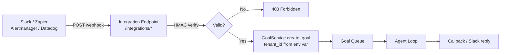

# Integrations Overview

The **Integrations** page (`/integrations`) is a **configuration display and delivery visibility** surface. It shows operators every inbound webhook endpoint that AgentVerse exposes, the environment variables required to activate each integration, and live delivery data for the Zapier trigger.

---

## What This Page Is — and Is Not

### Is: Configuration Display

The Integrations page is a **read-only reference card** for the four supported inbound integration providers. For each provider it shows:

1. The full copyable webhook URL (based on `VITE_API_URL` / `API_BASE`)
2. The required server-side environment variables
3. A live status badge (always "running" if the backend is reachable)

```tsx
// From IntegrationsPage.tsx — static provider config
const PROVIDERS: ProviderConfig[] = [
  {
    name: 'Slack',
    endpoints: [
      { label: 'Slash command',  path: '/integrations/slack/commands'     },
      { label: 'Events',         path: '/integrations/slack/events'        },
      { label: 'Interactive',    path: '/integrations/slack/interactive'   },
    ],
    secretEnv: ['SLACK_SIGNING_SECRET', 'SLACK_TENANT_ID'],
  },
  // ... Zapier, Alertmanager, Datadog
];
```

### Is Not: CRUD

You cannot create, edit, or delete integrations from this page. Integrations are activated entirely through **environment variables** on the backend server. The page simply displays the endpoints and tells you which env vars to set.

---

## Four Supported Providers

| Provider | Purpose | Env Vars Required |
|---|---|---|
| **Slack** | Slash command `/agentverse`, HITL approval buttons | `SLACK_SIGNING_SECRET`, `SLACK_TENANT_ID` |
| **Zapier** | Trigger goals from 3000+ apps; poll for completed goals | `ZAPIER_SECRET`, `ZAPIER_TENANT_ID` |
| **Alertmanager** | Convert Prometheus alert fires into investigation goals | `ALERTMANAGER_TENANT_ID` |
| **Datadog** | Convert critical Datadog events into goals; HMAC-verified | `DATADOG_WEBHOOK_SECRET`, `DATADOG_TENANT_ID` |

All four providers follow the same pattern:
1. Provider sends a POST to AgentVerse's webhook endpoint
2. Backend verifies the request (HMAC signature or shared secret)
3. Backend creates a goal for the configured `*_TENANT_ID`
4. Goal executes via the standard agent loop

---

## Architecture: Inbound Webhook Pipeline



---

## Endpoint Base URL

All integration endpoints are served under the backend base URL configured via `VITE_API_URL` (frontend) / `API_BASE_URL` (backend). The Integrations page computes the full URL dynamically:

```tsx
const fullUrl = `${API_BASE}${e.path}`;
// e.g. https://api.agentverse.dev/integrations/slack/commands
```

The Copy button places this full URL in the clipboard — exactly what you paste into Slack's App Settings or Zapier's webhook URL field.

---

## Zapier Delivery Visibility

The bottom section of the Integrations page shows **recent completed goals that were triggered by Zapier** — the exact payload that Zapier's poll trigger would receive:

```tsx
const { data: zapierGoals = [] } = useQuery({
  queryKey: ['zapier-goals'],
  queryFn: () => integrationsApi.zapierCompletedGoals(),
});
```

This is a live view of `GET /integrations/zapier/goals` — up to the last 50 completed goals from the Zapier tenant. It lets operators confirm that Zapier is receiving goal completion events.

Each row shows:
- Goal text (truncated)
- Status badge (`completed`, `failed`, etc.)

---

## Setting Up an Integration: General Steps

1. **Open the Integrations page** — copy the webhook URL for the provider you want
2. **Set server env vars** — add `*_SIGNING_SECRET` and `*_TENANT_ID` to your backend deployment
3. **Restart the backend** — env vars are read at startup
4. **Configure the provider** — paste the URL into Slack App Settings / Zapier / Alertmanager / Datadog
5. **Test** — trigger a test event from the provider and watch for a new goal in the Goals page

---

## Source Files

| File | Role |
|---|---|
| `agent-verse-frontend/src/features/integrations/IntegrationsPage.tsx` | UI component |
| `agent-verse-backend/app/api/integrations.py` | All integration endpoints (446 lines) |
| `agent-verse-backend/app/integrations/slack/handler.py` | Slack HMAC + slash command handling |

---

## Related Documentation

- [Slack Integration](02-slack.md) — Slash commands, HITL approval, Events API
- [Zapier & Webhooks](03-zapier-webhooks.md) — Zapier trigger, AlertManager, Datadog, generic webhooks
