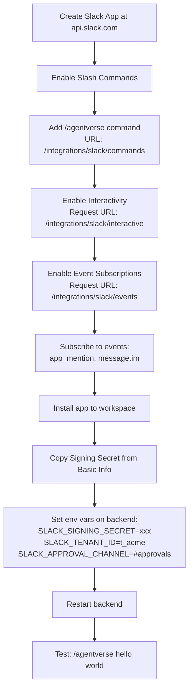
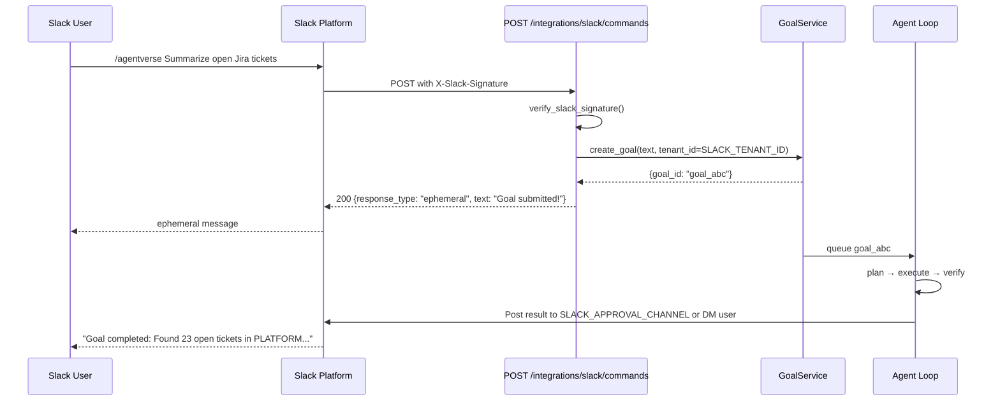

# Slack Integration

The Slack integration is the richest inbound channel in AgentVerse. It supports three distinct interaction types: slash commands to start goals, interactive button components for HITL approval, and the Events API for any other Slack event. All requests are verified using Slack's HMAC-SHA256 signing protocol.

---

## Overview

```
Slack Workspace
  ├── /agentverse [goal text]        → POST /integrations/slack/commands
  ├── Button clicks (approve/reject) → POST /integrations/slack/interactive
  └── Event subscriptions            → POST /integrations/slack/events
```

---

## HMAC Signature Verification

Every request from Slack carries two headers:

| Header | Content |
|---|---|
| `X-Slack-Signature` | `v0=<HMAC-SHA256 of timestamp+body>` |
| `X-Slack-Request-Timestamp` | Unix timestamp (seconds) |

The backend validates all three Slack endpoints using `verify_slack_signature()`:

```python
# app/integrations/slack/handler.py
def verify_slack_signature(
    body: bytes,
    timestamp: str,
    signature: str,
    signing_secret: str,
) -> bool:
    # Reject requests older than 5 minutes (replay protection)
    if abs(time.time() - int(timestamp)) > 300:
        return False

    base = f"v0:{timestamp}:{body.decode()}"
    computed = "v0=" + hmac.new(
        signing_secret.encode(), base.encode(), hashlib.sha256
    ).hexdigest()
    return hmac.compare_digest(computed, signature)
```

The signing secret is read from `SLACK_SIGNING_SECRET` environment variable via `get_slack_signing_secret()`.

```python
# From app/api/integrations.py:34-45
if not verify_slack_signature(
    body,
    x_slack_request_timestamp,
    x_slack_signature,
    get_slack_signing_secret(),
):
    raise HTTPException(403, "Invalid Slack signature")
```

Invalid or expired signatures receive `403 Forbidden`. Slack retries on 5xx — not on 4xx — so the 403 is correct (prevents infinite retries on misconfiguration).

---

## Slash Command: `/agentverse`

### Setup

In your Slack App Settings → Slash Commands:
- Command: `/agentverse`
- Request URL: `https://api.agentverse.dev/integrations/slack/commands`
- Short Description: "Submit a goal to AgentVerse"
- Usage hint: `[describe what you want done]`

### Behavior

```
User types: /agentverse Summarize all open Jira tickets for project PLATFORM
```

1. Slack POSTs the command to `/integrations/slack/commands`
2. Backend verifies HMAC signature (5-minute replay window)
3. Parses `text` from the URL-encoded body
4. Creates a goal for the tenant identified by `SLACK_TENANT_ID`
5. Returns an ephemeral acknowledgement immediately (Slack requires a response in < 3 seconds)
6. Goal executes asynchronously in the background

```python
# From app/api/integrations.py:48-56
params = dict(urllib.parse.parse_qsl(body.decode()))
text = params.get("text", "").strip()
user_id = params.get("user_id", "unknown")

if not text:
    return {
        "response_type": "ephemeral",
        "text": "Usage: /agentverse [your goal description]",
    }
```

**Immediate response** (shown only to the user who typed the command):

```json
{
  "response_type": "ephemeral",
  "text": "Goal submitted! I'll get back to you once it's complete."
}
```

### Handling No Configuration

If `SLACK_TENANT_ID` is not set, the slash command returns a user-visible warning rather than a silent 500:

```json
{
  "response_type": "ephemeral",
  "text": "⚠️ Slack integration not configured. Ask admin to set SLACK_TENANT_ID env var."
}
```

---

## HITL Approval via Slack

When an agent reaches a high-risk step (e.g., `deploy`, `delete`, `production`), the HITL Gateway posts an approval request to `SLACK_APPROVAL_CHANNEL`:

```json
{
  "channel": "#agentverse-approvals",
  "text": "Agent requires approval",
  "blocks": [
    {
      "type": "section",
      "text": {"type": "mrkdwn", "text": "*Goal:* Deploy backend v2.3.1 to production\n*Step:* Run `kubectl apply` on production cluster"},
    },
    {
      "type": "actions",
      "elements": [
        {
          "type": "button",
          "text": {"type": "plain_text", "text": "✅ Approve"},
          "action_id": "hitl_approve",
          "value": "{\"task_id\": \"hitl_abc123\"}"
        },
        {
          "type": "button",
          "text": {"type": "plain_text", "text": "❌ Reject"},
          "action_id": "hitl_reject",
          "style": "danger",
          "value": "{\"task_id\": \"hitl_abc123\"}"
        }
      ]
    }
  ]
}
```

When the operator clicks Approve or Reject, Slack sends an interaction payload to `/integrations/slack/interactive`.

---

## Interactive Components: POST /integrations/slack/interactive

Handles button clicks and modal submissions from Slack Block Kit messages.

### Payload Structure

```json
{
  "type": "block_actions",
  "user": {"id": "U0123456789"},
  "actions": [
    {
      "action_id": "hitl_approve",
      "value": "{\"task_id\": \"hitl_abc123\"}"
    }
  ]
}
```

### Processing

1. HMAC verification (same `X-Slack-Signature` flow)
2. Parse `payload` field from URL-encoded body
3. Dispatch on `action_id`:
   - `hitl_approve` → `hitl_service.approve(task_id, approver=user_id)`
   - `hitl_reject`  → `hitl_service.reject(task_id, approver=user_id)`
4. Update the original Slack message to show the decision (via `response_url`)

```
Operator clicks "✅ Approve" in Slack
  → POST /integrations/slack/interactive
  → hitl_service.approve("hitl_abc123", approver="U0123456789")
  → Agent resumes execution
  → Original Slack message updated: "✅ Approved by @alice"
```

---

## Events API: POST /integrations/slack/events

Used for receiving Slack events that don't originate from a slash command (e.g., `app_mention`, `message.channels` for DMs, reactions).

### URL Verification Challenge

When you first configure the Events API URL in Slack, Slack sends a challenge:

```json
{"type": "url_verification", "challenge": "3eZbrw1aBm2rZgRNFdxV2595E9CY3gmdALWMmHkvFXO7tYXAYM8P"}
```

The endpoint echoes the challenge back:

```json
{"challenge": "3eZbrw1aBm2rZgRNFdxV2595E9CY3gmdALWMmHkvFXO7tYXAYM8P"}
```

### `app_mention` Event

When a user mentions `@AgentVerse` in a channel:

```json
{
  "event": {
    "type": "app_mention",
    "text": "<@BOTID> Create a Jira ticket for the login bug",
    "user": "U0123456789",
    "channel": "C0123456789"
  }
}
```

The backend strips the bot mention and creates a goal from the remaining text. Response is posted back to the channel via the Slack Web API.

---

## API Endpoints

| Method | Path | Purpose |
|---|---|---|
| `POST` | `/integrations/slack/commands` | Slash command (`/agentverse`) |
| `POST` | `/integrations/slack/events` | Events API (mentions, messages) |
| `POST` | `/integrations/slack/interactive` | Block Kit button clicks, modal submissions |

All three endpoints:
- Verify `X-Slack-Signature` + `X-Slack-Request-Timestamp`
- Return `200 OK` immediately (Slack requires response within 3 seconds)
- Process goal creation asynchronously

---

## Setup: Complete Checklist



---

## Sequence: Slash Command → Goal → Reply



---

## Environment Variables Reference

| Variable | Required | Description |
|---|---|---|
| `SLACK_SIGNING_SECRET` | Yes | From Slack App → Basic Information → App Credentials |
| `SLACK_TENANT_ID` | Yes | AgentVerse tenant ID to associate slash command goals with |
| `SLACK_BOT_TOKEN` | For replies | `xoxb-...` token for posting back to Slack channels |
| `SLACK_APPROVAL_CHANNEL` | For HITL | Channel ID or name (e.g., `#agentverse-approvals`) |
