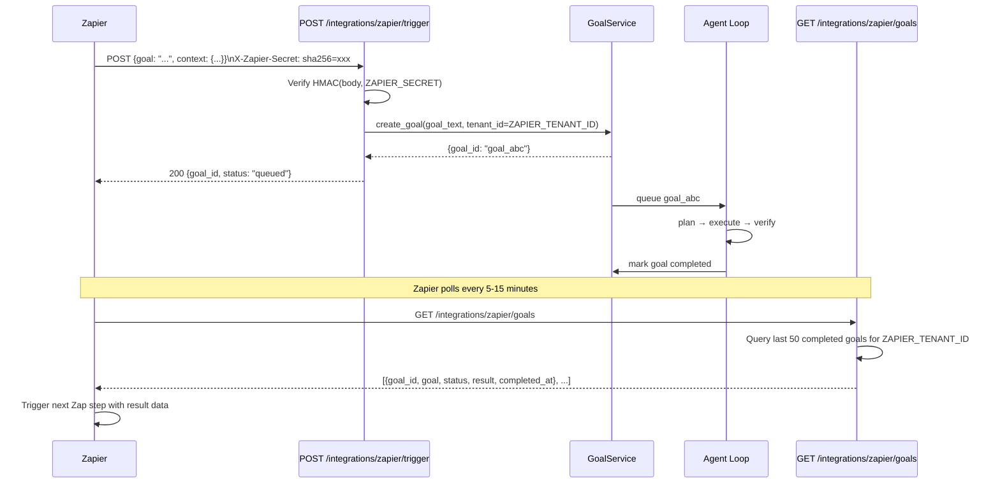
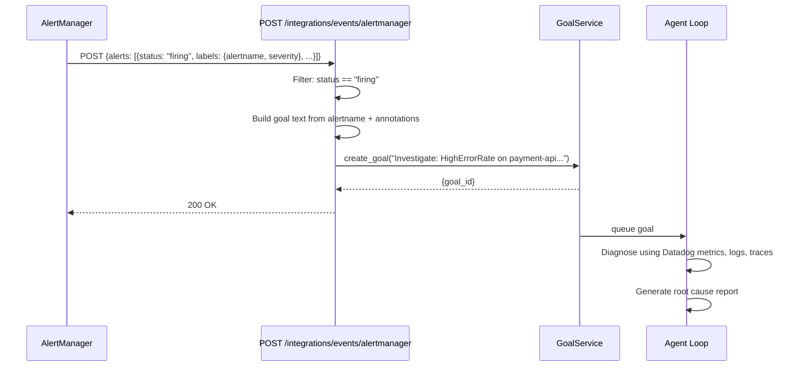

# Zapier, Webhooks & Event Integrations

AgentVerse exposes a family of inbound webhook endpoints beyond Slack: Zapier for broad app connectivity, Prometheus AlertManager and Datadog for observability-driven automation, and a generic events endpoint for any custom payload.

---

## Zapier Integration

### What Zapier Can Do

Zapier connects to 3,000+ applications. With AgentVerse's Zapier integration, you can trigger an agent goal from **any of those apps** without writing code:

- New row added to Google Sheets → create a goal to process it
- Customer submits a Typeform → create an onboarding goal
- GitHub issue labeled "urgent" → create a triage goal
- PagerDuty incident created → create an investigation goal
- Stripe payment fails → create a remediation goal

### Trigger: `POST /integrations/zapier/trigger`

Zapier sends an HMAC-signed payload to this endpoint when the Zap fires.

**Headers**

| Header | Value |
|---|---|
| `Content-Type` | `application/json` |
| `X-Zapier-Secret` | `sha256=<HMAC-SHA256>` |

**Request Body**

```json
{
  "goal": "Process new signup: alice@example.com from Typeform submission #12345",
  "context": {
    "source":    "typeform",
    "form_id":   "abc123",
    "response_id": "resp_xyz"
  }
}
```

| Field | Required | Description |
|---|---|---|
| `goal` | Yes | Natural language goal text |
| `context` | No | Arbitrary key-value pairs passed as goal context |

**Response**

```json
{
  "goal_id": "goal_abc123",
  "status":  "queued",
  "message": "Goal queued successfully"
}
```

### HMAC Verification

The Zapier endpoint verifies the `X-Zapier-Secret` header:

```python
# Pseudocode from app/api/integrations.py
expected = "sha256=" + hmac.new(
    ZAPIER_SECRET.encode(), body, hashlib.sha256
).hexdigest()
if not hmac.compare_digest(expected, x_zapier_secret):
    raise HTTPException(403, "Invalid Zapier signature")
```

Set `ZAPIER_SECRET` in the Zapier Webhook action as a custom header value. Set the same value on the backend.

### Poll Trigger: `GET /integrations/zapier/goals`

Zapier's "polling trigger" pattern requires an endpoint that returns recently completed items. AgentVerse exposes the last 50 completed goals for the Zapier tenant:

```bash
curl "https://api.agentverse.dev/integrations/zapier/goals" \
  -H "X-Zapier-Secret: sha256=<HMAC>"
```

```json
[
  {
    "id":         "goal_abc123",
    "goal_id":    "goal_abc123",
    "goal":       "Process new signup: alice@example.com",
    "status":     "completed",
    "result":     "Onboarding email sent. CRM record created.",
    "completed_at": "2024-06-29T10:30:00Z"
  }
]
```

Zapier polls this endpoint on its own schedule (typically every 5–15 minutes on paid plans). The UI in the Integrations page shows this same data in real time via TanStack Query.

### Setup: Zapier → AgentVerse

1. In Zapier, choose **Webhooks by Zapier** → **POST**
2. URL: `https://api.agentverse.dev/integrations/zapier/trigger`
3. Payload Type: `json`
4. Data: `{"goal": "<your mapped goal text>", "context": {...}}`
5. Headers: `X-Zapier-Secret: sha256=<shared-secret>`
6. Set `ZAPIER_SECRET=<same-secret>` and `ZAPIER_TENANT_ID=<your-tenant-id>` on the backend

---

## AlertManager Integration

### What It Does

Prometheus AlertManager can fire webhooks when alerts transition to `FIRING`. AgentVerse maps each alert to a **investigation goal**, letting agents automatically diagnose infrastructure problems.

### Endpoint: `POST /integrations/events/alertmanager`

AlertManager sends its standard webhook payload:

```json
{
  "alerts": [
    {
      "status": "firing",
      "labels": {
        "alertname":  "HighErrorRate",
        "severity":   "critical",
        "service":    "payment-api"
      },
      "annotations": {
        "summary":     "Error rate > 5% on payment-api",
        "description": "p99 latency spiked to 8.2s"
      },
      "startsAt": "2024-06-29T10:00:00Z"
    }
  ]
}
```

AgentVerse converts each `firing` alert into a goal:

```
"Investigate: HighErrorRate on payment-api — Error rate > 5% (severity: critical). Timestamp: 2024-06-29T10:00:00Z"
```

No HMAC signature is required for AlertManager (internal network assumed). Access control is enforced by `ALERTMANAGER_TENANT_ID` — only goals for that tenant are created.

### AlertManager Webhook Configuration

```yaml
# alertmanager.yml
receivers:
  - name: 'agentverse'
    webhook_configs:
      - url: 'https://api.agentverse.dev/integrations/events/alertmanager'
        send_resolved: false    # Only fire on alerts, not resolutions
        http_config:
          headers:
            X-AgentVerse-Tenant: 'infra-ops-team'
```

---

## Datadog Integration

### What It Does

Datadog Webhook Notifications convert critical/error events (monitors, incidents) into AgentVerse goals. Optionally HMAC-verified using `DATADOG_WEBHOOK_SECRET`.

### Endpoint: `POST /integrations/events/datadog`

Datadog sends its standard monitor notification payload:

```json
{
  "id":          "1234567890",
  "type":        "monitor alert",
  "title":       "[P1] Database connection pool exhausted",
  "body":        "Pool utilization: 100%. New connections failing.",
  "priority":    "P1",
  "alert_type":  "error",
  "tags":        ["env:prod", "service:api"],
  "url":         "https://app.datadoghq.com/monitors/1234567890"
}
```

AgentVerse filters on `alert_type` — only `error` and `critical` events generate goals (not `warning` or `info`).

### HMAC Verification

When `DATADOG_WEBHOOK_SECRET` is set:

```python
# From app/api/integrations.py
x_datadog_secret = request.headers.get("X-Datadog-Signature", "")
if DATADOG_WEBHOOK_SECRET:
    expected = hmac.new(
        DATADOG_WEBHOOK_SECRET.encode(), body, hashlib.sha256
    ).hexdigest()
    if not hmac.compare_digest(expected, x_datadog_secret):
        raise HTTPException(403, "Invalid Datadog signature")
```

### Datadog Webhook Configuration

```
Datadog → Integrations → Webhooks → New Webhook:
  URL:     https://api.agentverse.dev/integrations/events/datadog
  Headers: {"X-Datadog-Signature": "<hmac-secret>"}
  Payload: (use Datadog's default JSON format)
```

---

## Generic Webhook: `POST /integrations/events/*`

For any provider not explicitly supported, AgentVerse accepts arbitrary webhook payloads at:

```
POST /integrations/events/{source}
```

Where `{source}` is a free-form string identifier (`alertmanager`, `datadog`, `custom`, `github-actions`, etc.). The backend treats the full request body as an opaque context block and constructs the goal text from the source name.

**Example: GitHub Actions webhook**

```bash
curl -X POST https://api.agentverse.dev/integrations/events/github-actions \
  -H "X-AgentVerse-Tenant: t_devops" \
  -H "Content-Type: application/json" \
  -d '{
    "workflow": "deploy.yml",
    "run_id": "12345",
    "conclusion": "failure",
    "branch": "main",
    "commit": "abc1234"
  }'
```

Generated goal text:
```
Investigate github-actions event: workflow deploy.yml run 12345 failed on main@abc1234
```

---

## Full Sequence: Zapier Trigger → Goal → Poll Result



---

## Sequence: AlertManager → Investigation Goal



---

## Environment Variables Reference

| Variable | Provider | Description |
|---|---|---|
| `ZAPIER_SECRET` | Zapier | HMAC signing secret (set as Zapier webhook header) |
| `ZAPIER_TENANT_ID` | Zapier | Tenant ID to assign Zapier-triggered goals |
| `ALERTMANAGER_TENANT_ID` | AlertManager | Tenant ID to assign alert-triggered goals |
| `DATADOG_WEBHOOK_SECRET` | Datadog | HMAC secret (optional, disables check if unset) |
| `DATADOG_TENANT_ID` | Datadog | Tenant ID to assign Datadog-triggered goals |

---

## Summary: All Integration Endpoints

| Endpoint | Provider | Auth |
|---|---|---|
| `POST /integrations/slack/commands` | Slack | HMAC `X-Slack-Signature` |
| `POST /integrations/slack/events` | Slack | HMAC `X-Slack-Signature` |
| `POST /integrations/slack/interactive` | Slack | HMAC `X-Slack-Signature` |
| `POST /integrations/zapier/trigger` | Zapier | HMAC `X-Zapier-Secret` |
| `GET /integrations/zapier/goals` | Zapier | HMAC `X-Zapier-Secret` |
| `POST /integrations/events/alertmanager` | AlertManager | Tenant ID only |
| `POST /integrations/events/datadog` | Datadog | HMAC `X-Datadog-Signature` (optional) |
| `POST /integrations/events/{source}` | Generic | Tenant header |
