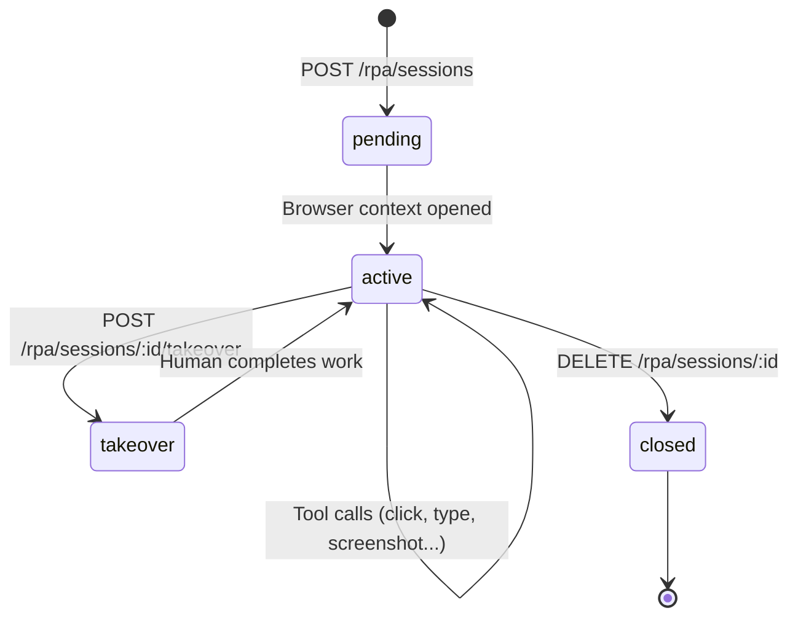
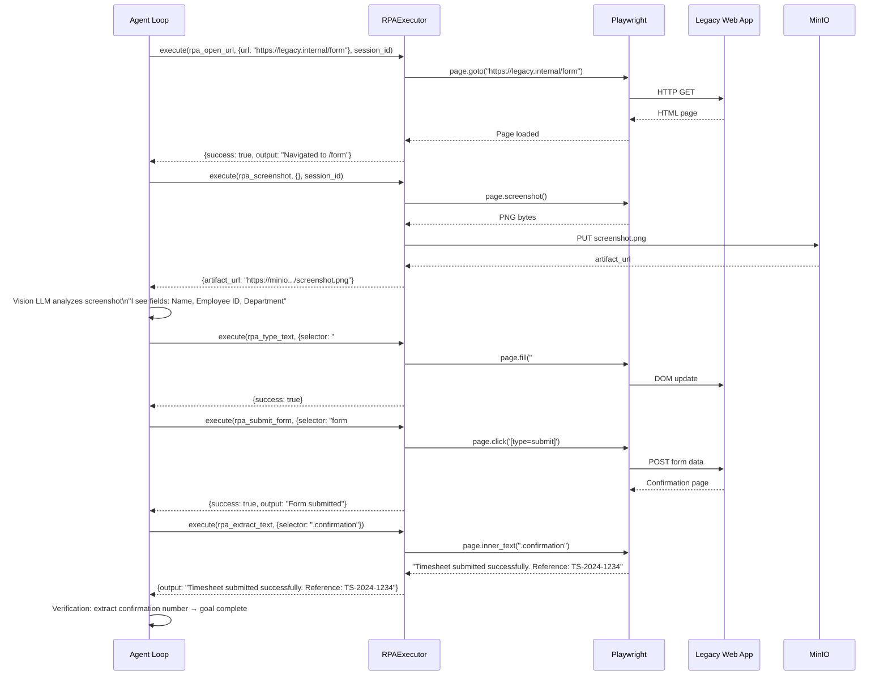

# RPA Live Sessions

**RPA (Robotic Process Automation)** gives AgentVerse agents control over a real Chromium browser. When a web application has no API, the agent pilots the browser — clicking, typing, submitting forms, and taking screenshots — exactly as a human operator would.

---

## What RPA Is

```
Traditional automation path:
  Agent → API call → Service → Result

RPA automation path:
  Agent → RPAExecutor → Playwright → Chromium → Web UI → Extract result
```

RPA is the **last resort and the most powerful** tool in the toolkit. It works on any web-based application — legacy enterprise portals, internal tools, government websites, anything accessible via a browser.

---

## RPAExecutor Architecture

**Source**: `agent-verse-backend/app/rpa/executor.py`

```python
class RPAExecutor:
    def __init__(
        self,
        artifact_store: Any = None,     # MinIO client for screenshot persistence
        session_manager: Any = None,     # Redis-backed session registry
        headless: bool = True,           # False only for local debugging
        vision_provider: Any = None,     # LLM for screenshot analysis
    ) -> None:
```

At construction, `RPAExecutor._check_playwright()` detects whether Playwright is installed. If not, all executions fall back to simulation mode.

### Three Execution Paths

| Condition | Path | Description |
|---|---|---|
| Playwright + SessionManager available | `_execute_with_playwright()` | Full persistent session support |
| Playwright only | `_execute_playwright_standalone()` | Stateless, creates temp browser |
| Neither | `_execute_simulation()` | Returns mock responses for testing |

---

## Browser Session Lifecycle

RPA sessions are **persistent browser contexts** that survive across multiple tool calls. This is essential for multi-step workflows: you open a URL, fill a form, click Submit, read the confirmation — all within the same browser session.



### Ephemeral Sessions

When `session_id` is omitted from a `POST /rpa/execute` request, an **ephemeral session** is created automatically and closed immediately after the tool call:

```python
# From app/rpa/executor.py:60-93
sid = session_id or uuid.uuid4().hex
ephemeral = session_id is None

# ... execute tool ...

if ephemeral and self._session_manager:
    await self._session_manager.close(sid, tenant_id)
```

Use ephemeral sessions for one-off screenshot captures. Use persistent sessions for multi-step automation flows.

---

## The 20+ RPA Tools

All RPA tools are registered in `app/rpa/tools.py` and validated at the API layer:

| Tool Name | Action |
|---|---|
| `rpa_open_url` | Navigate to a URL |
| `rpa_click` | Click an element by CSS selector or XPath |
| `rpa_type_text` | Type text into an input field |
| `rpa_screenshot` | Capture current viewport as PNG |
| `rpa_extract_text` | Extract visible text from the page or selector |
| `rpa_wait` | Wait N milliseconds |
| `rpa_scroll` | Scroll page or element |
| `rpa_hover` | Hover over an element |
| `rpa_select_option` | Select dropdown option by value/label |
| `rpa_submit_form` | Submit a form |
| `rpa_check_element` | Assert an element exists |
| `rpa_get_attribute` | Read an HTML attribute |
| `rpa_evaluate_js` | Execute arbitrary JavaScript in page context |
| `rpa_fill_field` | Clear and fill an input field |
| `rpa_press_key` | Press keyboard key (Enter, Tab, etc.) |
| `rpa_wait_for_selector` | Wait until a CSS selector appears |
| `rpa_upload_file` | Upload a file via `<input type=file>` |
| `rpa_back` | Browser back navigation |
| `rpa_forward` | Browser forward navigation |
| `rpa_get_url` | Return the current page URL |

---

## Vault Credential Injection

Before executing any tool, `RPAExecutor` resolves `vault://` references in the `arguments` dict:

```python
# From app/rpa/executor.py:63-72
if self._credential_injector is not None:
    try:
        arguments = await self._credential_injector.resolve_arguments(arguments)
    except Exception as exc:
        logging.warning("credential_injection_failed error=%s", exc)
```

This allows agent steps to reference credentials symbolically:

```json
{
  "tool_name": "rpa_type_text",
  "arguments": {
    "selector": "#password",
    "text": "vault://smtp_credentials/password"
  }
}
```

The injector resolves `vault://smtp_credentials/password` to the actual password before Playwright types it. Credentials never appear in goal text, execution traces, or logs.

---

## Session Persistence (Redis)

When Redis is available, the session manager persists session state across backend restarts. Session records stored in Redis include:

```json
{
  "session_id":  "sess_abc123",
  "tenant_id":   "t_acme",
  "status":      "active",
  "created_at":  "2024-06-29T10:00:00Z",
  "last_action": "rpa_click on #submit-button"
}
```

Without Redis, sessions are held in-memory and lost on restart.

---

## Human Takeover

The `POST /rpa/sessions/:id/takeover` endpoint transfers control of an active browser session from the agent to a human operator:

```bash
curl -X POST https://api.agentverse.dev/rpa/sessions/sess_abc123/takeover \
  -H "X-API-Key: $API_KEY" \
  -d '{"reason": "Manual intervention required for CAPTCHA"}'
```

```json
{"status": "takeover", "message": "Session transferred to human operator"}
```

The agent's execution pauses. The human operator can now interact with the browser (e.g., via a VNC viewer or Playwright's remote debugging port). When finished, the session is returned to `active` status and the agent resumes.

---

## Artifact Storage (Screenshots → MinIO)

Screenshots taken via `rpa_screenshot` are automatically saved to MinIO and registered as `Artifact` records:

```python
# RPAResult after screenshot
RPAResult(
    success=True,
    output="Screenshot captured",
    artifact_url="https://minio.internal/agentverse-artifacts/t_acme/screenshot_abc.png",
    artifact_name="screenshot_abc.png",
    duration_ms=842.0,
)
```

The `artifact_url` is returned in the API response and stored in the `artifacts` table. Screenshots are visible in the Artifacts Browser.

---

## API Reference

All endpoints require `X-API-Key: <tenant_api_key>`.

### `GET /rpa/sessions`

List active RPA sessions for the tenant.

```bash
curl "https://api.agentverse.dev/rpa/sessions" -H "X-API-Key: $API_KEY"
```

```json
[
  {
    "session_id": "sess_abc123",
    "status":     "active",
    "created_at": "2024-06-29T10:00:00Z",
    "last_action": "rpa_click on #submit-btn"
  }
]
```

---

### `POST /rpa/sessions`

Create a new named RPA session.

```bash
curl -X POST https://api.agentverse.dev/rpa/sessions \
  -H "X-API-Key: $API_KEY" \
  -d '{"name": "checkout-automation"}'
```

```json
{"session_id": "sess_abc123", "status": "pending"}
```

---

### `POST /rpa/execute`

Execute an RPA tool command.

```bash
curl -X POST https://api.agentverse.dev/rpa/execute \
  -H "X-API-Key: $API_KEY" \
  -H "Content-Type: application/json" \
  -d '{
    "tool_name":  "rpa_open_url",
    "arguments":  {"url": "https://app.internal.com/login"},
    "session_id": "sess_abc123"
  }'
```

```json
{
  "success":       true,
  "output":        "Navigated to https://app.internal.com/login",
  "artifact_url":  null,
  "artifact_name": null,
  "duration_ms":   1243.7,
  "error":         null,
  "tool_name":     "rpa_open_url",
  "session_id":    "sess_abc123"
}
```

**Validate Tool Name**: If `tool_name` is not in the registered tools list, the API returns:

```json
{
  "detail": "Unknown RPA tool: rpa_click_somewhere. Valid: ['rpa_back', 'rpa_check_element', ...]"
}
```

---

### `POST /rpa/sessions/:id/takeover`

Request human takeover of a session.

```bash
curl -X POST https://api.agentverse.dev/rpa/sessions/sess_abc123/takeover \
  -H "X-API-Key: $API_KEY" \
  -d '{"reason": "CAPTCHA encountered, manual intervention required"}'
```

---

## RPA Live Sessions UI

The `RpaLivePage` component (`src/features/rpa/RpaLivePage.tsx`) provides a real-time view into active RPA sessions:

### Session List (Left Column)

- Fetches `GET /rpa/sessions` on mount
- Each session shows: first 16 chars of `session_id`, status badge (green=active)
- Clicking a session starts live screenshot polling for it

### Live View (Right Column)

When a session is selected, the UI polls `POST /rpa/execute` with `{tool_name: "rpa_screenshot"}` every **2 seconds**:

```tsx
intervalRef.current = setInterval(async () => {
  const resp = await fetch(`${API_BASE}/rpa/execute`, {
    method: 'POST',
    body: JSON.stringify({
      tool_name: 'rpa_screenshot',
      arguments: {},
      session_id: sessionId,
    }),
  });
  const data = await resp.json();
  if (data.artifact_url) setLastScreenshot(data.artifact_url);
  if (data.output) setActionLog(prev => [data.output, ...prev].slice(0, 20));
}, 2000);
```

The screenshot image updates in place — creating a low-frame-rate "live" view of what the agent is doing.

### Action Log

A scrollable dark terminal panel showing the last 20 actions (newest first):

```
rpa_click on #submit-btn
rpa_type_text into #password  
rpa_open_url to https://app.internal.com/login
```

### Takeover Button

The orange "Takeover" button calls `POST /rpa/sessions/:id/takeover` and shows a browser alert confirming the handoff.

---

## Full Sequence: Agent Fills a Legacy Web Form



---

## Performance Considerations

| Factor | Impact | Recommendation |
|---|---|---|
| Page load time | 1–5s per navigation | Use `rpa_wait_for_selector` instead of `rpa_wait` |
| Screenshot polling interval | 2s in Live UI | Increase for long-running steps |
| Session cleanup | Ephemeral sessions auto-close | Reuse sessions for multi-step flows |
| MinIO upload | ~200ms per screenshot | Only screenshot when needed |
| Playwright install size | ~300MB per browser | Pre-install in production Docker image |
