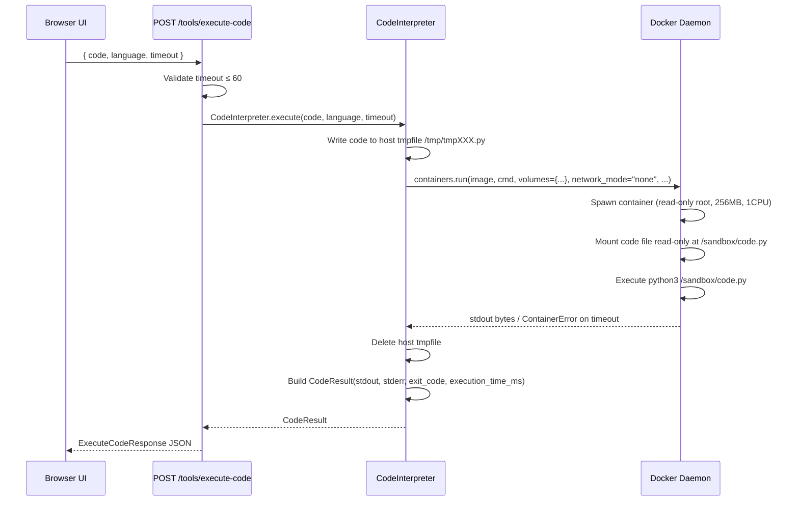

# Code Runner

The **Code Runner** executes arbitrary Python, JavaScript, or Bash code inside an ephemeral Docker container with strict resource and network isolation. It is the backbone of AgentVerse's data-processing, scripting, and automation capabilities.

---

## CodeInterpreter Architecture

### Source

`agent-verse-backend/app/tools/code_interpreter.py`  
`agent-verse-backend/app/api/tools.py:27–54`

### Supported Languages

| Language | Docker Image | File Extension | Entrypoint |
|---|---|---|---|
| `python` | `python:3.12-slim` | `.py` | `python3 /sandbox/code.py` |
| `javascript` | `node:20-alpine` | `.js` | `node /sandbox/code.js` |
| `bash` | `alpine:latest` | `.sh` | `sh /sandbox/code.sh` |

Language selection at the API level is case-sensitive. Sending an unsupported language returns `exit_code=1` with a descriptive `stderr` message without spawning a container.

---

## Security Model

Each execution spins up a **new Docker container from scratch**, runs the code, streams output, and immediately removes the container (`remove=True`). There is no persistent state between executions.

### Isolation Parameters

| Constraint | Value | Implementation |
|---|---|---|
| Network access | None | `network_mode="none"` |
| Memory limit | 256 MB | `mem_limit="256m"` |
| CPU | 1 core | `cpu_quota=100000` (Docker CPU quota units) |
| Filesystem | Read-only root | `read_only=True` |
| Writable `/tmp` | 64 MB, no-exec | `tmpfs={"/tmp": "size=64m,noexec=off"}` |
| User | Non-root | `user="1000:1000"` |
| Write bytecode | Disabled | `PYTHONDONTWRITEBYTECODE=1` env var |
| Container lifecycle | Ephemeral | `remove=True` |

```python
# From app/tools/code_interpreter.py:165-186
result = client.containers.run(
    image,
    command=cmd,
    volumes={tmp_path: {"bind": container_path, "mode": "ro"}},
    remove=True,
    network_mode="none",
    mem_limit="256m",
    cpu_quota=100000,
    read_only=True,
    tmpfs={"/tmp": "size=64m,noexec=off"},
    user="1000:1000",
    environment={"PYTHONDONTWRITEBYTECODE": "1"},
    timeout=effective_timeout,
    detach=False,
)
```

### Code Injection Pattern

The user's code is written to a **host-side temp file** and volume-mounted **read-only** into the container at `/sandbox/code.<ext>`. The container never has write access to the host filesystem. The temp file is cleaned up after the container exits.

```
Host filesystem                 Container filesystem
/tmp/tmpXXXXXX.py (rw) ──ro──▶ /sandbox/code.py (ro)
                                /tmp/           (rw, 64MB tmpfs)
                                / (everything else)  (ro)
```

### Subprocess Fallback

When Docker is not available on the host (`_DOCKER_AVAILABLE = False`), the backend falls back to `subprocess.run()` — **but only** if the environment variable `AGENTVERSE_ALLOW_SUBPROCESS_EXEC=true` is explicitly set. Without that flag the endpoint returns an error. The subprocess path is intentionally unsandboxed and should never be enabled in production.

---

## Timeout Enforcement

| Level | Value | Where enforced |
|---|---|---|
| Frontend default | 30 seconds | `toolsApi.executeCode(code, language, 30)` |
| API hard cap | 60 seconds | `app/api/tools.py:40–44` |
| Docker timeout | `effective_timeout` seconds | `client.containers.run(..., timeout=...)` |

```python
# API layer (app/api/tools.py:40-44)
if body.timeout > 60:
    raise HTTPException(
        status_code=422,
        detail="Maximum timeout is 60 seconds",
    )
```

When a container exceeds the timeout, Docker raises a `ContainerError`; the interpreter catches it and returns `timed_out=True` in the `CodeResult`.

---

## CodeResult Output Schema

```python
@dataclass
class CodeResult:
    stdout: str           # Captured standard output
    stderr: str           # Captured standard error
    exit_code: int        # Process exit code (0 = success)
    timed_out: bool       # True if container was killed by timeout
    execution_time_ms: float  # Wall-clock time in milliseconds

    @property
    def success(self) -> bool:
        return self.exit_code == 0 and not self.timed_out
```

The `success` property is a derived composite: a zero exit code **and** no timeout. A program that prints output and exits with code 1 is `success=False`.

---

## API Reference

### `POST /tools/execute-code`

**Authentication**: `X-API-Key: <tenant_api_key>` (required)

**Request**

```json
{
  "code": "import sys\nprint('hello')\nprint('err', file=sys.stderr)\nsys.exit(0)",
  "language": "python",
  "timeout": 30
}
```

| Field | Type | Default | Constraints |
|---|---|---|---|
| `code` | `string` | required | Any valid code in the selected language |
| `language` | `string` | `"python"` | `python` \| `javascript` \| `bash` |
| `timeout` | `integer` | `30` | 1–60 (seconds) |

**Response**

```json
{
  "stdout": "hello\n",
  "stderr": "err\n",
  "exit_code": 0,
  "success": true,
  "timed_out": false,
  "execution_time_ms": 412.5
}
```

**Error Responses**

| Status | Condition |
|---|---|
| `401` | Missing or invalid API key |
| `422` | `timeout > 60` or unsupported `language` |
| `500` | Docker daemon unreachable and subprocess fallback disabled |

---

## Execution Sequence



---

## How to Use: Step-by-Step

### 1. Open the Tools Page

Navigate to `/tools`. The **Code Runner** tab is active by default.

### 2. Select Language

Use the `Language` dropdown. Options: `python`, `javascript`, `bash`.

### 3. Write Code

Type directly in the monospace textarea. There is no syntax highlighting in the current UI — paste from your editor.

```python
# Example: parse a CSV from stdin using only stdlib
import csv, io, json

data = """name,score
alice,95
bob,87
carol,91"""

reader = csv.DictReader(io.StringIO(data))
rows = sorted(reader, key=lambda r: int(r['score']), reverse=True)
print(json.dumps(rows, indent=2))
```

### 4. Execute

Click **Run code**. The button is disabled while execution is pending.

### 5. Read the Result

The result panel shows:
- A `StatusBadge` (green = success, red = failed)
- `exit <N> · <T>ms` — exit code and wall-clock time
- `stdout` in a grey monospace block
- `stderr` in a red-tinted monospace block (only if non-empty)

If the run times out, the error toast reads "Execution timed out." If the code exits non-zero, it reads "Code exited non-zero."

---

## Example: Running JavaScript

```bash
curl -X POST https://api.agentverse.dev/tools/execute-code \
  -H "X-API-Key: $API_KEY" \
  -H "Content-Type: application/json" \
  -d '{
    "code": "const data = [3,1,4,1,5,9]; console.log(data.sort((a,b)=>b-a));",
    "language": "javascript",
    "timeout": 10
  }'
```

```json
{
  "stdout": "[\n  9, 5, 4,\n  3, 1, 1\n]\n",
  "stderr": "",
  "exit_code": 0,
  "success": true,
  "timed_out": false,
  "execution_time_ms": 287.3
}
```

---

## Example: Detecting a Timeout

```bash
curl -X POST https://api.agentverse.dev/tools/execute-code \
  -H "X-API-Key: $API_KEY" \
  -H "Content-Type: application/json" \
  -d '{
    "code": "import time; time.sleep(120)",
    "language": "python",
    "timeout": 5
  }'
```

```json
{
  "stdout": "",
  "stderr": "",
  "exit_code": -1,
  "success": false,
  "timed_out": true,
  "execution_time_ms": 5021.0
}
```

---

## Agent Loop Integration

During agent goal execution the `Executor` node in `app/agent/graph.py` may call `CodeInterpreter.execute()` directly (as a native tool) — bypassing the API layer. The same `CodeInterpreter` instance bound to `app.state` is shared with the `/tools/execute-code` endpoint, meaning both paths use identical isolation settings.

```mermaid
flowchart LR
    A[/tools/execute-code endpoint] --> C[CodeInterpreter instance\napp.state.code_interpreter]
    B[Agent Executor node] --> C
    C --> D[Docker daemon]
```

---

## Limitations

| Limitation | Detail |
|---|---|
| No package installation | Containers start from slim/alpine images. No `pip install` at runtime |
| No network access | External HTTP calls from code will fail silently or raise exceptions |
| No persistence | Files written inside the container are discarded on exit |
| No GPU | Standard Docker CPU-only execution |
| 64 MB /tmp | Large in-memory computations that spill to disk will fail if they exceed 64 MB |
