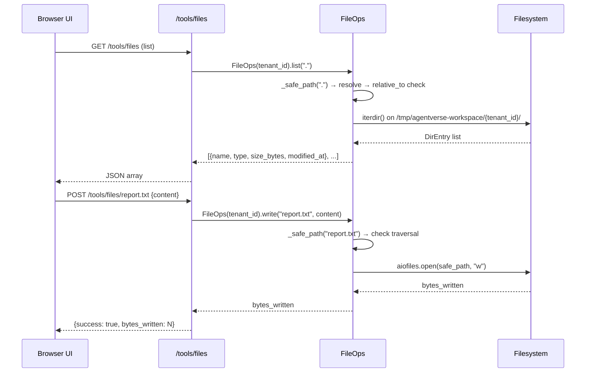

# File Manager

The **File Manager** provides sandboxed, tenant-scoped file operations over a persistent workspace directory. Files written here survive across agent runs and tool sessions for the same tenant — making it the primary scratch space for agent-generated output.

---

## FileOps Architecture

### Source

`agent-verse-backend/app/tools/file_ops.py`  
`agent-verse-backend/app/api/tools.py:63–142`

### Workspace Layout

Every tenant gets an isolated directory at a deterministic path:

```
/tmp/agentverse-workspace/
└── {tenant_id}/          ← FileOps._workspace
    ├── reports/
    │   └── q3_summary.txt
    ├── data.csv
    └── scripts/
        └── process.py
```

The root workspace is created with `parents=True, exist_ok=True` on first `FileOps()` construction. The base path `/tmp/agentverse-workspace` is hardcoded as `_BASE_WORKSPACE` in `file_ops.py:12`.

> **Note**: Because the workspace is under `/tmp`, it is **ephemeral** on the host — it does not survive container restarts. For durable storage use the Artifacts subsystem backed by MinIO.

---

## Path Traversal Protection

All path arguments are passed through `FileOps._safe_path()` before any filesystem operation:

```python
def _safe_path(self, path: str) -> pathlib.Path:
    resolved = (self._workspace / path).resolve()
    workspace_resolved = self._workspace.resolve()
    try:
        resolved.relative_to(workspace_resolved)
    except ValueError:
        raise PermissionError(
            f"Path {path!r} resolves outside workspace for tenant {self._tenant_id}"
        )
    return resolved
```

**How it works:**

1. The input path is joined with the tenant workspace using `pathlib.Path / path`.
2. Both the result and the workspace root are passed through `.resolve()`, which collapses all `..` components and symlinks.
3. `relative_to()` raises `ValueError` if `resolved` is not a descendant of `workspace_resolved`.
4. The `ValueError` is caught and re-raised as `PermissionError`.

This means `../../../../etc/passwd` is resolved to `/etc/passwd` before the check, which correctly raises `PermissionError` because `/etc/passwd` is not under `/tmp/agentverse-workspace/{tenant_id}/`.

---

## Operations Reference

### `async def read(path: str) → str`

Reads the full UTF-8 text content of a file.

```python
ops = FileOps(tenant_id="t_abc123")
content = await ops.read("reports/q3_summary.txt")
```

Raises `FileNotFoundError` if the file does not exist. Raises `PermissionError` on traversal attempts. Uses `aiofiles` when available (non-blocking I/O), falls back to synchronous `pathlib.read_text()`.

---

### `async def write(path: str, content: str) → int`

Writes UTF-8 text to a file, creating parent directories as needed. Returns the number of bytes written.

```python
bytes_written = await ops.write("scripts/process.py", "print('hello')\n")
```

Safe path check is applied before the write. Parent directories are created with `mkdir(parents=True, exist_ok=True)` so writing to `nested/path/file.txt` works without pre-creating directories.

---

### `async def list(directory: str = ".") → list[dict]`

Lists all entries in a directory (non-recursive). Returns a list of dicts sorted alphabetically by `name`:

```python
entries = await ops.list(".")
# [
#   {"name": "data.csv",  "type": "file",      "size_bytes": 4096, "modified_at": 1719600000.0},
#   {"name": "reports",   "type": "directory",  "size_bytes": 0,    "modified_at": 1719599000.0},
#   {"name": "scripts",   "type": "directory",  "size_bytes": 0,    "modified_at": 1719598000.0},
# ]
```

`size_bytes` is set to 0 for directories. `modified_at` is a Unix timestamp (`st_mtime`).

---

### `async def delete(path: str) → bool`

Deletes a file or recursively removes a directory (via `shutil.rmtree`). Returns `True` if the path existed and was deleted, `False` if it did not exist.

---

### `async def exists(path: str) → bool`

Returns `True` if the path exists within the workspace. Returns `False` (rather than raising) on traversal attempts.

---

## API Reference

All endpoints require `X-API-Key: <tenant_api_key>`.

### `GET /tools/files?directory=.`

List files in a directory.

```bash
curl "https://api.agentverse.dev/tools/files?directory=reports" \
  -H "X-API-Key: $API_KEY"
```

```json
[
  {"name": "q3_summary.txt", "type": "file", "size_bytes": 2048, "modified_at": 1719600000.0},
  {"name": "q4_draft.txt",   "type": "file", "size_bytes": 512,  "modified_at": 1719601000.0}
]
```

---

### `GET /tools/files/{path}`

Read a file's content.

```bash
curl "https://api.agentverse.dev/tools/files/reports/q3_summary.txt" \
  -H "X-API-Key: $API_KEY"
```

```json
{
  "success": true,
  "path": "reports/q3_summary.txt",
  "content": "Q3 2024 Summary\n================\n..."
}
```

**Error example (traversal attempt)**:

```json
{
  "success": false,
  "error": "Path '../../etc/passwd' resolves outside workspace for tenant t_abc123"
}
```

---

### `POST /tools/files/{path}`

Write content to a file (creates or overwrites).

```bash
curl -X POST "https://api.agentverse.dev/tools/files/output/result.json" \
  -H "X-API-Key: $API_KEY" \
  -H "Content-Type: application/json" \
  -d '{"content": "{\"status\": \"ok\", \"count\": 42}"}'
```

```json
{
  "success": true,
  "path": "output/result.json",
  "bytes_written": 28
}
```

---

### `DELETE /tools/files/{path}`

Delete a file or directory.

```bash
curl -X DELETE "https://api.agentverse.dev/tools/files/output/result.json" \
  -H "X-API-Key: $API_KEY"
```

```json
{"success": true, "path": "output/result.json"}
```

---

## Execution Sequence



---

## File Manager UI Walkthrough

The `FileManager` component in `ToolsPage.tsx` presents a two-column layout:

**Left column — Workspace tree**:
- Loads via `GET /tools/files` (TanStack Query `queryKey: ['workspace-files', directory]`)
- Refresh button manually invalidates the query
- Clicking a file name loads it into the editor via `GET /tools/files/{path}`
- Trash icon deletes immediately (no confirmation dialog)

**Right column — Editor**:
- File path input (manual entry or auto-filled on open)
- Monospace textarea for content
- **Save file** button calls `POST /tools/files/{path}`

```tsx
// From ToolsPage.tsx:134-140
const saveMutation = useMutation({
  mutationFn: () => toolsApi.writeFile(selectedPath, content),
  onSuccess: () => {
    toast({ kind: 'success', message: 'File saved.' });
    qc.invalidateQueries({ queryKey: ['workspace-files'] });
  },
});
```

---

## Multi-Tenant Isolation

Because each tenant has its own subdirectory, two tenants with the same relative path (`reports/summary.txt`) are completely isolated:

```
/tmp/agentverse-workspace/
├── tenant_acme/
│   └── reports/summary.txt    ← tenant ACME's file
└── tenant_beta/
    └── reports/summary.txt    ← tenant BETA's file (different inode)
```

The tenant ID comes from `request.state.tenant.tenant_id`, injected by `TenantMiddleware` after validating the `X-API-Key` header.

---

## File Size Considerations

There is no explicit file size limit enforced in `FileOps.write()`. Practical limits come from:

- The workspace living in `/tmp` — subject to host tmpfs or disk constraints
- Python memory during `aiofiles.read()` — large files are loaded fully into memory
- The API response body — very large files will be slow over HTTP

For files larger than ~5 MB, prefer using the MinIO-backed Artifacts system.

---

## Agent Loop Integration

The Code Runner and File Manager are tightly coupled during agent execution. A common pattern:

```
1. Agent Executor calls CodeInterpreter.execute(python_script)
   → Script produces output file at /tmp/output.csv (inside sandbox)
   
2. Agent Executor calls FileOps.write("output.csv", csv_content)
   → Saves to persistent workspace

3. Subsequent goal can read /tools/files/output.csv
   → Data persists across goal runs
```

Agents access `FileOps` directly (not via HTTP) — the same class with the same path safety rules.
