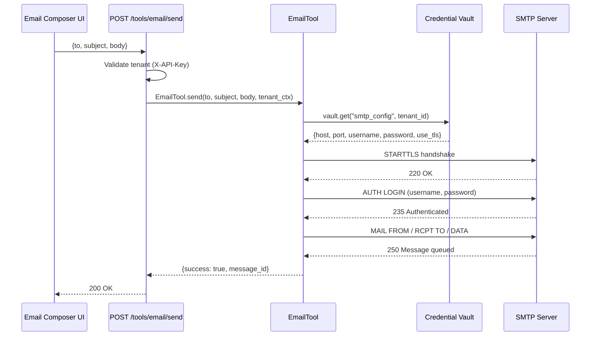
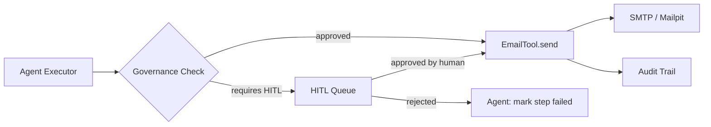

# Email Composer

The **Email Composer** is the direct-access interface for AgentVerse's `EmailTool` — the native SMTP email sending primitive. Agents use it programmatically during goal execution; the Email tab on the Tools page makes it available to operators for testing, one-off sends, and SMTP configuration validation.

---

## Architecture

### Source

`agent-verse-backend/app/api/tools.py` (email route)  
`agent-verse-backend/app/tools/email_tool.py`

### Core Principle

`EmailTool` is a thin wrapper around Python's `smtplib` / `aiosmtplib`. All SMTP credentials are stored in the **credential vault** (`app/providers/vault.py`) — never in plaintext environment variables. In development, all outbound email is routed to **Mailpit** running on `localhost:1025`, a local SMTP catch-all that never delivers mail externally.

```
Production                    Development
  ┌───────────────┐             ┌───────────────┐
  │  Real SMTP    │             │    Mailpit     │
  │ (configurable)│             │  :1025 catch-  │
  │               │             │  all, no TLS   │
  └───────────────┘             └───────────────┘
         ↑                             ↑
     EmailTool                    EmailTool
  (vault credentials)          (MAILPIT_* envvars)
```

---

## EmailTool Capabilities

| Feature | Supported |
|---|---|
| To (multiple recipients) | Yes |
| CC | Yes |
| BCC | Yes |
| HTML body | Yes |
| Plain-text body | Yes |
| Subject templates | Yes |
| File attachments | No (roadmap) |
| TLS/STARTTLS | Yes |
| Authentication (LOGIN, PLAIN) | Yes |

The current **UI** only exposes `To`, `Subject`, and plain-text `Body`. To use CC, BCC, or HTML body, call the API directly or invoke `EmailTool` through an agent goal.

---

## SMTP Vault Configuration

Credentials are stored as an encrypted secret in the vault under the key `smtp_config` per tenant:

```json
{
  "host":     "smtp.sendgrid.net",
  "port":     587,
  "username": "apikey",
  "password": "SG.XXXXXXXXXX",
  "use_tls":  true,
  "from_addr": "noreply@acme.com"
}
```

To register SMTP credentials:

```bash
# Store via the vault API
curl -X POST https://api.agentverse.dev/vault/credentials \
  -H "X-API-Key: $API_KEY" \
  -H "Content-Type: application/json" \
  -d '{
    "key": "smtp_config",
    "value": {
      "host": "smtp.sendgrid.net",
      "port": 587,
      "username": "apikey",
      "password": "SG.XXXXXXXXXX",
      "use_tls": true,
      "from_addr": "noreply@acme.com"
    }
  }'
```

---

## Dev Mode: Mailpit

In `ENVIRONMENT=development`, `EmailTool` ignores vault credentials and routes to Mailpit:

```yaml
# infra/docker-compose.yml (excerpt)
mailpit:
  image: axllent/mailpit
  ports:
    - "1025:1025"   # SMTP
    - "8025:8025"   # Web UI
```

Open `http://localhost:8025` to view captured emails. No email will actually be delivered.

The `MAILPIT_HOST` and `MAILPIT_PORT` environment variables can override the defaults (`localhost:1025`).

---

## API Reference

### `POST /tools/email/send`

**Authentication**: `X-API-Key: <tenant_api_key>` (required)

**Request (minimal)**

```json
{
  "to": "alice@example.com",
  "subject": "Quarterly report ready",
  "body": "Hi Alice,\n\nThe Q3 report has been generated.\n\nBest,\nAgentVerse"
}
```

**Request (full options)**

```json
{
  "to": "alice@example.com",
  "cc": ["bob@example.com"],
  "bcc": ["audit@internal.com"],
  "subject": "Quarterly report ready",
  "body": "<h1>Q3 Report</h1><p>Please review the attached analysis.</p>",
  "html": true
}
```

| Field | Type | Required | Description |
|---|---|---|---|
| `to` | `string` | Yes | Primary recipient email |
| `cc` | `string[]` | No | Carbon copy recipients |
| `bcc` | `string[]` | No | Blind carbon copy recipients |
| `subject` | `string` | Yes | Email subject line |
| `body` | `string` | Yes | Email body (plain text or HTML) |
| `html` | `boolean` | No | Set `Content-Type: text/html` when `true` |

**Response**

```json
{
  "success": true,
  "message_id": "<20240629120000.abc123@agentverse.dev>"
}
```

**Error Responses**

| Status | Condition |
|---|---|
| `401` | Missing or invalid API key |
| `422` | Missing required fields (`to`, `subject`, `body`) |
| `503` | SMTP server unreachable / auth failed |

---

## Execution Sequence



---

## Email Composer UI Walkthrough

The `EmailComposer` component is implemented as a standard HTML `<form>` in `ToolsPage.tsx:222–286`:

```tsx
<form onSubmit={(e) => { e.preventDefault(); sendMutation.mutate(); }}>
  <input id="to"      value={to}      onChange={e => setTo(e.target.value)} />
  <input id="subject" value={subject} onChange={e => setSubject(e.target.value)} />
  <textarea id="message" value={body} onChange={e => setBody(e.target.value)} />
  <button type="submit" disabled={!to.trim() || !subject.trim() || sendMutation.isPending}>
    <Send /> Send email
  </button>
</form>
```

Key behavior:
- The Send button is disabled until both `to` and `subject` are non-empty
- On success, all three fields are cleared automatically
- A toast notification (`Email sent.`) confirms delivery
- Errors propagate as error toast messages

---

## Subject Templates

When `EmailTool` is invoked by an agent (not from the UI), subject and body support template variable interpolation. Template variables are resolved from the agent's execution context:

```json
{
  "to": "{{goal.requester_email}}",
  "subject": "Goal completed: {{goal.title}}",
  "body": "Your goal '{{goal.title}}' finished in {{goal.duration_seconds}}s.\n\nResult:\n{{goal.result_summary}}"
}
```

Template resolution happens in `EmailTool` before SMTP dispatch.

---

## Agent Loop Integration

The `email:send` capability is registered as an MCP-compatible tool in the agent's tool registry. When the Executor node decides to send an email, it calls:

```python
# Simplified — actual call goes through MCPClient dispatch
await email_tool.send(
    to=step.arguments["to"],
    subject=step.arguments["subject"],
    body=step.arguments["body"],
    tenant_ctx=tenant_ctx,
)
```

This call is governance-logged (audit trail), subject to the tenant's email budget policy, and can require HITL approval if the governance policy for `email:send` requires it.



---

## Testing Email in Development

1. Start Mailpit via Docker Compose:
   ```bash
   docker-compose -f infra/docker-compose.yml up -d mailpit
   ```
2. Open the Email tab on the Tools page
3. Send to any address — all mail is captured by Mailpit
4. Open Mailpit UI at `http://localhost:8025` to inspect

The Mailpit container does not require authentication, does not perform MX lookups, and accepts any sender/recipient. It is purely a local SMTP sink.

---

## Limitations and Roadmap

| Limitation | Status |
|---|---|
| No file attachments in UI | Roadmap |
| No template variable UI | API-only |
| One From address per tenant | Current design |
| No delivery receipt / bounce tracking | Roadmap |
| Rate limiting per tenant | Controlled by governance cost policy |
