# AgentVerse — End-to-End Platform Masterclass

> A step-by-step, diagram-driven guide to how a natural-language goal travels through
> the entire AgentVerse backend: goal intake → goal analysis → runtime-profile assembly
> (model + agent pattern + RAG strategy + security + memory + evals) → the LangGraph
> agent loop → retrieval → prompt building → tool execution → guardrails → governance →
> verification → hallucination handling → agent self-improvement → observability.
>
> Everything below is traced from the real code under `agent-verse-backend/app/`. File
> paths and class/function names are cited so you can jump straight to the source.

---

## How to read this document

The document is organized as a set of "Parts". Each Part is self-contained and ends
with a **step-by-step recap** and at least one **Mermaid diagram**. If you only want the
big picture, read **Part 1**. If you want a specific subsystem, jump to its Part:

| Part | Subsystem | Answers the question |
|------|-----------|----------------------|
| **1** | End-to-end goal execution | "What happens from goal to answer?" |
| **2** | Goal analysis & Runtime Profile | "How does it pick the model / pattern / RAG strategy?" |
| **3** | The LangGraph agent loop | "What are the nodes and how do they transition?" |
| **4** | Agent patterns (ReAct, ToT, Reflexion, Debate…) | "What reasoning strategies exist and when?" |
| **5** | Knowledge bases, chunking, embeddings, vector DB, retrieval | "How does RAG actually work?" |
| **6** | Memory (execution / long-term / episodic) | "What does the agent remember?" |
| **7** | Prompt building & context assembly | "How is the prompt constructed?" |
| **8** | Guardrails, governance, HITL, policy, cost | "What keeps it safe and compliant?" |
| **9** | Hallucination handling (grounding, consensus, calibration) | "How does it avoid making things up?" |
| **10** | Multi-model executor & MCP tool execution | "How does it call real-world tools?" |
| **11** | Workflows, triggers, scheduling | "How do automated/recurring runs work?" |
| **12** | OCR engine | "How are documents/images read?" |
| **13** | RPA & perception | "How does browser automation work?" |
| **14** | Evals & agent self-improvement | "How are agents scored and improved?" |
| **15** | Observability | "How is everything traced and measured?" |

A note on maturity: AgentVerse is a large platform where some subsystems are **fully
active** on the goal path and others are **wired-but-inert** (present, importable, but
not yet reached by the live loop). This document flags each with:

- ✅ **Active** — on the live goal-execution path.
- 🟡 **Reachable** — only via an explicit API request or feature flag.
- ⚪ **Inert / scaffolded** — present in code but not wired into the live path yet.

---

## Part 1 — End-to-end goal execution (the 30,000-ft view)

A goal is a single natural-language instruction ("Deploy the staging branch and verify
the health check", "Summarize last quarter's incident reports"). AgentVerse turns that
into an autonomous, tool-using, self-verifying execution with **zero hardcoded
workflows** — the plan is generated per goal.

### 1.1 The seven macro-stages

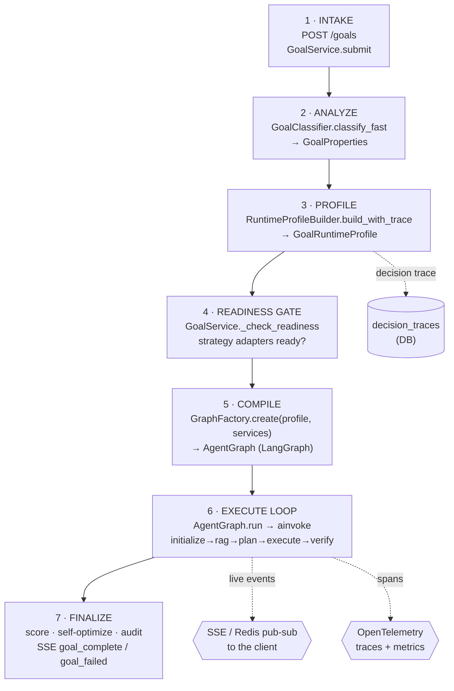

**Key idea:** stages 2–5 are the "**profile-before-compile**" philosophy. AgentVerse
*first analyzes the goal and assembles a complete execution profile*, *then* compiles a
graph shaped exactly for that goal. Nothing about the loop is fixed in advance — the
number of nodes, the reasoning strategy, the RAG strategy, whether human approval is
required, which models are used, and which eval suite runs are all **derived from the
goal text**.

### 1.2 Where each stage lives in the code

| Stage | Entry point | File |
|-------|-------------|------|
| Intake | `GoalService.submit()` / goals router | `app/services/goal_service.py`, `app/api/goals.py` |
| Analyze | `GoalClassifier.classify_fast()` (+ optional LLM tier) | `app/orchestration/goal_classifier.py` |
| Profile | `RuntimeProfileBuilder.build_with_trace()` | `app/orchestration/runtime_profile_builder.py` |
| Readiness | `GoalService._check_readiness()` → readiness gate | `app/services/goal_service.py`, `app/orchestration/strategy_readiness.py` |
| Compile | `GraphFactory.create()` | `app/orchestration/graph_factory.py` |
| Execute | `AgentGraph.run()` → `self._graph.ainvoke()` | `app/agent/graph.py` + `app/agent/nodes/*` |
| Finalize | verifier node + `_trigger_self_optimization()` | `app/agent/nodes/verifier_mixin.py`, `app/agent/graph.py` |

### 1.3 The two-phase service wiring you must understand first

Before any goal runs, the whole application is assembled in `app/main.py → create_app()`.
This happens in **two phases** and it explains most "works in tests but not in prod"
confusion:

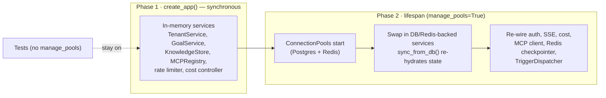

- **Phase 1** constructs *in-memory* versions of every service and binds them to
  `app.state`.
- **Phase 2** (the FastAPI `lifespan`, only when `manage_pools=True`) starts
  `ConnectionPools`, then **replaces** the in-memory services with DB/Redis-backed ones
  and re-hydrates from Postgres via `sync_from_db()`. The LangGraph **Redis checkpointer**,
  the **MCP client**, the **TriggerDispatcher**, cost control, and SSE delivery are all
  wired here.
- Dependency resolution reads `app.state` *dynamically*, so the swap takes effect without
  re-registering middleware.
- **Tests** typically build the app *without* `manage_pools`, so they exercise the
  in-memory path with `FakeProvider` (deterministic, no API keys).

### 1.4 Step-by-step: the life of one goal

1. **Client submits** a goal (`POST /goals` with `{goal, agent_id?, context?}`), authenticated
   by the tenant API key (`TenantMiddleware`). A `goals` row is created; RLS scopes it to
   the tenant.
2. **GoalService** persists the goal, opens an SSE channel, and either routes to a named
   agent or lets the router pick one (Part 3).
3. **Analyze**: `GoalClassifier.classify_fast()` extracts `GoalProperties`
   (complexity, risk, domain, time-sensitivity, requires_code/web, is_generative). For
   ambiguous MEDIUM-complexity goals it escalates to a fast LLM tier (Part 2).
4. **Profile**: `RuntimeProfileBuilder` turns those properties into a full
   `GoalRuntimeProfile` — the agent patterns, RAG strategy, model plan, security bundle,
   memory/cache policy, and eval config — plus a `DecisionTrace` recording *why* each
   choice was made. The profile is persisted.
5. **Readiness gate**: the selected strategies are checked against the strategy registry
   (are the adapters `READY`?). Unready strategies fall back to safe defaults.
6. **Compile**: `GraphFactory.create()` translates the profile's selected strategy IDs into
   LangGraph node flags and constructs an `AgentGraph` with all injected services.
7. **Execute**: `AgentGraph.run()` builds the initial `GraphState`, optionally resumes from
   a DB checkpoint, and calls `self._graph.ainvoke()`. The loop runs
   `initialize → rag_retrieval → [think/tree_of_thoughts] → plan → execute →
   [refine/self_consistency] → verify → [peer_review] → route`.
8. **Finalize**: the verifier scores the run (`RuntimeScorecard`); poor scores fire
   self-optimization; audit records are written; a terminal SSE event (`goal_complete` /
   `goal_failed`) is emitted, and OpenTelemetry spans/metrics close.

Everything after this document's Part 1 zooms into one of these stages.

---

## Part 2 — Goal analysis & the Runtime Profile (the platform's "brain")

This is the single most important subsystem to understand: **how a goal string becomes a
complete execution plan**. It is a pure, fast, deterministic pipeline (keyword tier ~sub-ms,
optional LLM tier ~200ms) that never calls a tool — it only *decides how the goal should
be executed*.

### 2.1 Two-tier goal classification

`app/orchestration/goal_classifier.py`

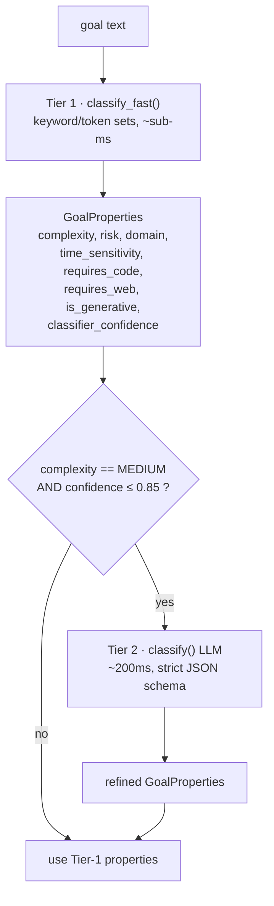

**Tier 1 (`classify_fast`)** derives properties from keyword/token sets:

- **Risk** — `_CRITICAL_RISK` phrases (e.g. destructive/production words) → `CRITICAL`;
  otherwise elevated to `HIGH` on other risk signals; default `LOW`. Guarantees a floor:
  a high/critical-risk *simple* goal is bumped to at least `MEDIUM` complexity.
- **Complexity** — counts hits against `_COMPLEXITY_EXPERT` and `_COMPLEXITY_COMPLEX`
  token sets → `EXPERT`, `COMPLEX`, `MEDIUM`, or `SIMPLE`.
- **Domain** — scored across `TECHNICAL / CREATIVE / ANALYTICAL / OPERATIONAL /
  CONVERSATIONAL`; ties default to `OPERATIONAL`.
- **Signals** — `requires_web` (web/realtime signal words), `requires_code`,
  `is_generative` (`write/generate/create/draft/compose`), `time_sensitivity`.
- **Confidence** — 0.95 for high/critical risk, 0.9 web, 0.85 simple non-code, else ~0.65–0.88.

**Tier 2 (`classify`)** runs *only* when the goal is genuinely ambiguous (MEDIUM +
low confidence). It asks a fast LLM for a strict JSON verdict
(`{complexity, domain, risk, requires_web, requires_code, estimated_steps, confidence}`)
and overlays it onto the Tier-1 base. This keeps 99% of goals on the cheap path while
still resolving the hard cases.

### 2.2 From properties to a full profile

`app/orchestration/runtime_profile_builder.py → build_with_trace()` orchestrates six
`PatternSelector` decisions and a strategy-composition step. Each decision is appended to
a `DecisionTrace` (persisted to `decision_traces`) so every choice is auditable.

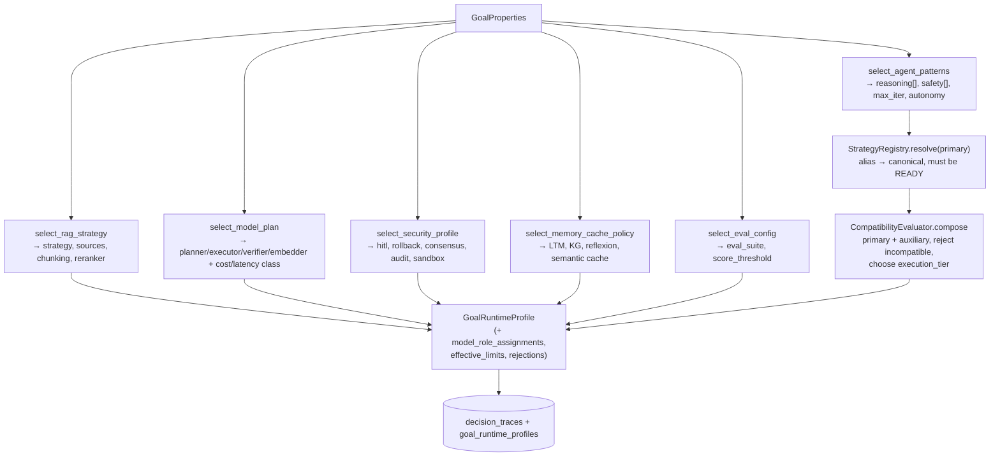

### 2.3 The decision matrix (the actual rules)

This is the heart of "how does it choose". These rules come verbatim from
`app/orchestration/pattern_selector.py`. **Safety rules can only ADD, never remove** — a
core invariant.

**Agent patterns (`select_agent_patterns`)**

| Goal property | Effect on reasoning / safety | max_iter |
|---------------|------------------------------|----------|
| default | `react` + `guardrails`, autonomy `bounded-autonomous` | 15 |
| risk = HIGH/CRITICAL | + `hitl`, `rollback`; autonomy → `supervised` | — |
| risk = CRITICAL | + `consensus_verification` | — |
| complexity = COMPLEX/EXPERT | + `chain_of_thought` (if registered), + `reflection` | 25 |
| COMPLEX + ANALYTICAL + not realtime | + `self_consistency` | — |
| complexity = EXPERT | multi-agent → `goal_tree`; + `tree_of_thoughts` (if not realtime); `persistence=True` | 50 |
| requires_code | + `self_refine` | — |
| generative / CREATIVE | + `self_refine` | — |
| generative + HIGH/CRITICAL risk | + `peer_review` | — |

**RAG strategy (`select_rag_strategy`)**

| Goal property | Strategy chosen | Sources / extras |
|---------------|-----------------|------------------|
| simple, no signal | `CORRECTIVE` (CRAG) | knowledge_base |
| requires_web / realtime | `FLARE` | + web_search, web_fallback |
| kb_state EMPTY/SPARSE | (adds) web_search fallback | — |
| complexity COMPLEX | `FUSION` (multi-query) | + long_term_memory, reranker=rrf, 7k tokens |
| complexity EXPERT | `RAPTOR` (hierarchical) | + long_term_memory + knowledge_graph, graph=entity, rrf, 8k tokens |
| requires_code | `COLBERT` (late interaction) | chunking=ast, embedding=code |
| realtime, no web | `SELF_RAG` | 2k tokens |

**Model plan (`select_model_plan`)** — cost/latency *classes* (not vendor names):
realtime → `realtime`/low; simple+low-risk → low; expert or high/critical risk → high;
otherwise interactive/medium. The concrete provider is resolved later from the tenant's
configured models (Part 10).

**Security (`select_security_profile`)** — CRITICAL → hitl + consensus + rollback +
forensic audit + strict guardrails + enterprise governance + (sandbox if code); HIGH →
hitl + rollback + full audit + strict; MEDIUM → full audit; irreversible → rollback;
requires_code → sandbox.

**Memory/cache (`select_memory_cache_policy`)** — long-term memory & reflexion for
COMPLEX/EXPERT; knowledge graph for EXPERT; semantic cache only for simple, low-risk,
non-realtime goals.

**Evals (`select_eval_config`)** — suite = `coding` (code) / `security` (high risk) /
`rag` (expert) / `default`; score threshold 0.72; a failing run auto-creates a regression
case.

### 2.4 Strategy resolution, compatibility & readiness

- **`StrategyRegistry`** (`app/orchestration/strategy_registry.py`) holds every strategy's
  canonical ID, adapter version, and lifecycle **state** (`READY`, `PLANNED`, …). Aliases
  (e.g. `zero_shot_cot`) resolve to a canonical ID. A strategy the profile wants but which
  is only `PLANNED` is **rejected and replaced** with a ready fallback — this is the "inert
  tier" guard in action.
- **`CompatibilityEvaluator.compose()`** takes the requested primary + auxiliary strategy
  IDs, drops the incompatible/unready ones (recording a `StrategyRejection` with a reason
  code such as `reviewer_not_independent`), and picks the **execution tier**
  (`LOCAL` vs `DISTRIBUTED`). `DISTRIBUTED` requires the StrategyRunner and is refused by the
  local `GraphFactory`.
- The profile carries `effective_limits` (tenant cost/latency ceilings intersected with the
  request), `model_role_assignments` (planner/executor/verifier/embedder/classifier/reviewer),
  and a `profile_id` derived deterministically from
  `(tenant, goal, registry_revision, strategies)`.

### 2.5 Compile: profile → LangGraph flags

`app/orchestration/graph_factory.py` maps selected strategy IDs to boolean node flags and
builds the graph:

```
selected_ids = {primary} ∪ {auxiliary}
enable_cot            = "chain_of_thought" in selected_ids
enable_reflection     = "reflection"       in selected_ids
enable_self_refine    = "self_refine"      in selected_ids
enable_self_consistency = "self_consistency" in selected_ids
enable_tree_of_thoughts = "tree_of_thoughts" in selected_ids
enable_peer_review    = "peer_review"      in selected_ids
AgentGraph(**services, **flags, runtime_profile=profile)
```

These flags are exactly what add/remove nodes in Part 3. The factory also validates the
profile is version 2, identifies a real goal+tenant, is not `DISTRIBUTED`, and that
`planner/executor/verifier` services are present.

### 2.6 Step-by-step recap (Part 2)

1. `classify_fast(goal)` → `GoalProperties` (keywords, sub-ms).
2. If MEDIUM + low confidence → LLM Tier-2 refinement.
3. `select_agent_patterns / rag_strategy / model_plan / security / memory / eval` → six configs.
4. `StrategyRegistry.resolve` + `CompatibilityEvaluator.compose` → primary + auxiliary + rejections + tier.
5. Assemble `GoalRuntimeProfile` (+ `model_role_assignments`, `effective_limits`), persist profile + `DecisionTrace`.
6. Readiness gate; unready → fallback.
7. `GraphFactory.create` → node flags → `AgentGraph`.

---

<!-- SUBSEQUENT PARTS (3–15) APPENDED BELOW AS SUBSYSTEM MAPS COMPLETE -->

## Part 3 — The LangGraph agent loop

`app/agent/graph.py` defines `AgentGraph`, a **thin orchestrator** whose node logic lives
in mixins under `app/agent/nodes/` (`InitializeMixin`, `RAGMixin`, `ReasoningMixin`,
`PlannerMixin`, `ExecutorMixin`, `VerifierMixin`, `RoutingMixin`). The graph is **built
per goal** — nodes are added/removed based on the profile flags from Part 2.

### 3.1 The full topology (all optional nodes shown)

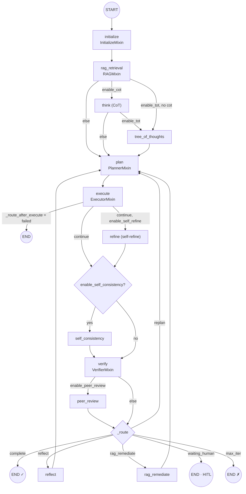

The **always-present** spine is `initialize → rag_retrieval → plan → execute → verify →
route`. Everything else (`think`, `tree_of_thoughts`, `self_consistency`, `refine`,
`reflect`, `peer_review`, `supervisor`, `debate`) is conditionally added by the
corresponding `enable_*` flag. Note the graph doc-comment says "MemorySaver" but in
production the constructor accepts a **RedisSaver-backed async checkpointer** (falling back
to `MemorySaver` if the checkpointer isn't async-safe — see §3.4).

### 3.2 What each node does

| Node | Mixin | Responsibility |
|------|-------|----------------|
| `initialize` | `InitializeMixin` | Seed `AgentState`, set status, stamp `_goal_start_ms`, emit `goal_started`. |
| `rag_retrieval` | `RAGMixin` | Retrieve knowledge/memory/graph context per the profile's RAG strategy; populate `state.context` (Part 5). |
| `think` | `ReasoningMixin` | Chain-of-thought scratchpad before planning. |
| `tree_of_thoughts` | `ReasoningMixin` | Explore/score multiple reasoning branches before planning. |
| `plan` | `PlannerMixin` | **Planner LLM** turns goal+context into an ordered `plan: list[str]`. |
| `execute` | `ExecutorMixin` | **Executor LLM** runs each step, issuing MCP tool calls; produces `StepResult`s. |
| `refine` | `ReasoningMixin` | Self-refine the last output before verification. |
| `self_consistency` | `ReasoningMixin` | Sample multiple executions and take a majority. |
| `verify` | `VerifierMixin` | **Verifier LLM** judges success; runs grounding/consensus/scorecard (Parts 9 & 14). |
| `peer_review` | `ReasoningMixin` | Independent reviewer model critiques before routing. |
| `reflect` | `ReasoningMixin` | Reflexion — generate a lesson, then replan. |
| `rag_remediate` | `RAGMixin` | Re-retrieve missing context when a *context gap* is detected, then replan. |

### 3.3 The routing decision (after `verify`)

`RoutingMixin._route()` is the loop's decision function. It is evaluated **in this order**
(first match wins):

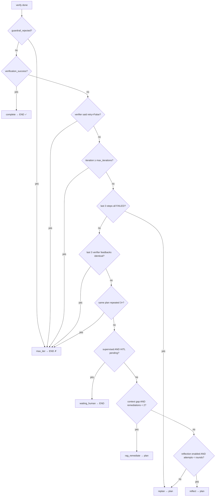

This gives AgentVerse several **anti-thrash guarantees**: it forces a replan when steps
keep failing (stuck-loop), and it hard-fails fast when the *same* feedback or the *same
plan* repeats three times (stagnation) — instead of burning the whole iteration budget.
`_route_after_execute()` is a simpler gate: if `execute` set status `FAILED` it goes
straight to `END`, otherwise `continue`.

### 3.4 Checkpointing & resume

- The graph is compiled with a checkpointer. In production the lifespan wires an
  `AsyncRedisSaver`; the constructor **guards** that the checkpointer implements async
  `aget_tuple` and otherwise falls back to `MemorySaver` (a sync `RedisSaver` inside the
  Celery worker would raise `NotImplementedError`).
- Independently, `AgentGraph._write_checkpoint()` writes a **DB row** (`GoalCheckpoint`,
  RLS-scoped) after each successful step, and `_load_checkpoint()` restores the latest one
  on `run()` so a crashed goal resumes from where it stopped (keyed by `thread_id =
  goal-{goal_id}`).

### 3.5 State object

`AgentState` (`app/agent/state.py`) is the serializable record threaded through the loop:
`goal`, `tenant_ctx`, `goal_id`, `status` (`GoalStatus`), `iterations`, `steps`
(`StepResult[]`), `plan` (`str[]`), `context` (dict — RAG results, tool outputs, flags),
`verification_feedback/success`, `sub_goals` (`SubGoal[]` for goal-tree), and grounding
fields (`ungrounded_claims`, `consecutive_ungrounded`, `cited_answer`, `provenance`).
`StepStatus` includes an `UNGROUNDED` state used by hallucination handling (Part 9).

### 3.6 Step-by-step recap (Part 3)

1. `run()` builds `GraphState`, optionally resumes from a DB checkpoint, opens an OTel span.
2. `initialize` seeds state; `rag_retrieval` fills context.
3. Optional `think` / `tree_of_thoughts` precede `plan`.
4. `plan` (Planner LLM) → ordered steps; `execute` (Executor LLM) runs steps with tools.
5. Optional `refine` / `self_consistency` precede `verify` (Verifier LLM).
6. Optional `peer_review`, then `_route` decides: complete / replan / reflect / rag_remediate / waiting_human / max_iter.
7. Each successful step DB-checkpoints; terminal state emits an SSE event.

---

## Part 4 — Agent patterns (reasoning strategies)

AgentVerse ships a large **pattern library** under `app/agent/patterns/` (ReAct, ToT,
Graph-of-Thoughts, LATS, ReWOO, LLMCompiler, Reflexion, Self-Refine, Self-Consistency,
Least-to-Most, Program-of-Thought, CodeAct, AutoGPT, BabyAGI, Voyager, Constitutional-AI,
Debate, Consensus, Peer-Review, Supervisor, Plan-Execute, Goal-Tree, …). Which ones are
*live* is decided by the profile (Part 2) → graph flags (Part 3).

### 4.1 Live vs reachable vs inert

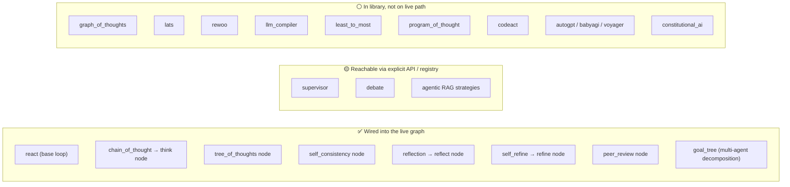

The `StrategyRegistry` marks each strategy `READY` / `PLANNED`. The profile builder's
compatibility step **rejects** any `PLANNED` strategy and substitutes a ready fallback, so
"inert" strategies can be selected by rules but never actually execute until their adapter
is promoted to `READY`. `supervisor` and `debate` have conditional node stubs
(`_enable_supervisor`, `_enable_debate`) and can be reached with an explicit request even
though the live selector doesn't add them by default.

### 4.2 How the mainstream patterns map to nodes

| Pattern | Trigger (from Part 2 rules) | Graph effect |
|---------|-----------------------------|--------------|
| **ReAct** | always (default reasoning) | the base `plan→execute→verify` loop with tool calls |
| **Chain-of-Thought** | COMPLEX/EXPERT | inserts `think` before `plan` |
| **Reflection (Reflexion)** | COMPLEX/EXPERT | `verify → reflect → plan`, bounded rounds |
| **Self-Refine** | requires_code OR generative/creative | `execute → refine → verify` |
| **Self-Consistency** | COMPLEX + ANALYTICAL + not realtime | `execute → self_consistency → verify` |
| **Tree-of-Thoughts** | EXPERT + not realtime | inserts `tree_of_thoughts` before `plan` |
| **Peer-Review** | generative + HIGH/CRITICAL risk (independent reviewer) | `verify → peer_review → route` |
| **Goal-Tree** | EXPERT | decomposes goal into `SubGoal[]` run with dependencies |
| **Consensus verification** | CRITICAL risk | 3-way verifier vote in `verify` (Part 9) |

### 4.3 Goal-Tree decomposition (multi-agent)

For EXPERT goals the multi-agent config becomes `goal_tree`. `AgentState.sub_goals`
(`SubGoal` dataclass) holds a DAG of decomposed sub-goals with `depends_on` edges; each
sub-goal carries its own `provenance`, `retrieval_trace`, and `events`. This is how a
single large goal fans out into parallel/ordered sub-executions while remaining one
auditable run.

### 4.4 Reflexion loop (bounded)

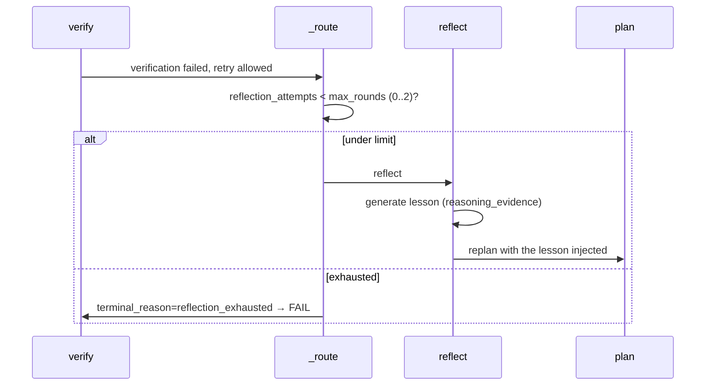

`_max_reflection_rounds()` clamps rounds to `[0, 2]` (from the profile's
`effective_limits.rounds`). Each reflect appends a `reasoning_evidence` record so the loop
can prove it actually reflected, and the lesson feeds the next `plan`.

### 4.5 Step-by-step recap (Part 4)

1. Profile picks a reasoning set → graph flags add/remove pattern nodes.
2. Ready-only guard: `PLANNED` strategies are rejected and replaced.
3. Base ReAct always runs; CoT/ToT precede planning; self-refine/self-consistency precede verify; reflection/peer-review/consensus wrap verify.
4. EXPERT goals decompose into a `SubGoal` DAG (goal-tree).
5. Reflexion and consensus are bounded and evidence-logged.

---

## Part 5 — Knowledge bases, chunking, embeddings, vector DB & retrieval (the RAG deep-dive)

This is the subsystem the user most wants dissected. RAG in AgentVerse is a **large, multi-
pipeline system** that shares database tables but has several parallel entry points. The
mental model to hold: **ingest → chunk → embed → store (pgvector) → retrieve (multi-strategy)
→ rerank → synthesize with citations**. The profile's `RAGStrategyConfig` (Part 2) chooses
*which* strategy runs.

### 5.0 The seams (read this first)

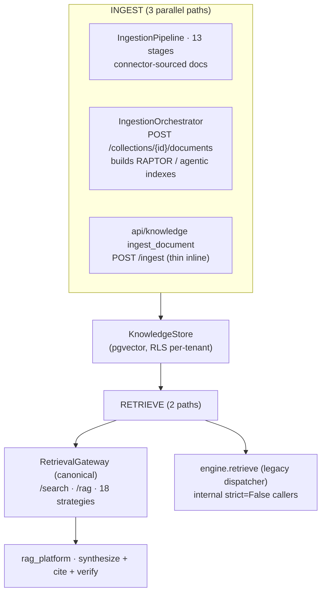

Three ingestion paths, two retrieval paths, one store. Much of `app/embedding/` and parts of
`app/knowledge_graph/` are **advisory or inert** relative to this live path — flagged below.

### 5.1 Knowledge base schema (`app/db/models/knowledge.py`)

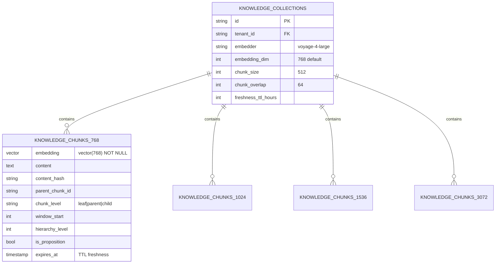

**Key design choice: dimension-specific chunk tables.** Instead of one table with a variable
vector, AgentVerse has `knowledge_chunks_768 / _1024 / _1536 / _3072`, each with a fixed
`vector(<dim>)` column. A collection's `embedding_dim` selects the table. This keeps HNSW
indexes valid (one dimension per index) and lets different collections use different embedders.
RLS scopes every row to its tenant via the `app.tenant_id` GUC.

### 5.2 Ingestion — the 13-stage pipeline (`app/ingestion/pipeline.py`)

```mermaid
flowchart LR
    A["1 RECEIVE<br/>quota"] --> B["2 VALIDATE<br/>size"]
    B --> C["3 CONTENT_HASH<br/>SHA-256 dedup"]
    C --> D["4 CLASSIFY<br/>ContentType"]
    D --> E["5 PARSE<br/>ParserRegistry"]
    E --> F["6 PII_DETECT<br/>Presidio"]
    F --> G["7 QUALITY_GATE<br/>score"]
    G --> H["8 CHUNK<br/>strategy selector"]
    H --> I["9 ENRICH<br/>metadata + ACL"]
    I --> J["10 EMBED<br/>embed_texts"]
    J --> K["11 DEDUP_CHUNKS<br/>SHA-256"]
    K --> L["12 INDEX<br/>ingest_chunks_async"]
    L --> M["13 EMIT<br/>knowledge.updated"]
```

Each stage fails safe into `PipelineResult.status` (e.g. `dedup`, `no_source_config`,
`low_quality`) rather than crashing. There are **41 connectors** (`s3, gdrive, github,
confluence, jira, notion, slack, snowflake, bigquery, kafka, postgres, web_crawl, …`) that
yield `RawDocument`s via `get_delta()`; they never parse/chunk/embed themselves — that is the
pipeline's job. The `ParserRegistry` maps ~19 `ContentType`s to ~18 parsers (Text, Code, HTML,
DOCX, CSV, PDFText, JSON/Vision/Audio/Video, Excel/YAML/Parquet/Avro/LaTeX bridges).

### 5.3 Chunking — every strategy & real token sizing

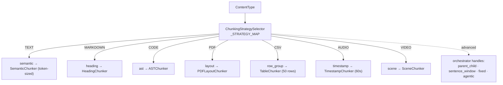

- **`SemanticChunker`** (`app/ingestion/chunkers/semantic.py`) — the **ING-9 fix**: sizes chunks
  by **real tokens** (`count_tokens`, `max_chunk_tokens=512`), not the old `char//4` heuristic.
  It packs paragraphs greedily to the token budget, then recursively splits oversize paragraphs
  by sentence, then by words.
- **The ING-6 / P0-8 strategy-dispatch fix**: `select_and_chunk` now routes through
  `get_chunker_for_strategy(strategy)` so advertised strategies (layout/paragraph/dom/region/
  row_group/record) reach a real chunker instead of silently degrading to fixed-size. Only on
  exception does it fall back to `fixed`.
- **Advanced chunkers** (`app/rag/`): `ParentChildChunker` (parent 1500 / child 400 chars +
  overlap → small-to-large expansion), `SentenceWindowChunker` (±2 sentences of context),
  `LateChunker` (embed-then-chunk).
- **Token counting** (`app/agent/tokenizer.py`): tiktoken `cl100k_base`; the `bytes//4`
  heuristic survives only as the *fallback* when tiktoken is unavailable.

> ⚠️ Footgun to know: there are **two** `SemanticChunker` classes — a token-based one in
> `ingestion/chunkers/` and a char-based one in `rag/chunker.py`.

### 5.4 Ingestion-time hierarchical indexes (RAPTOR / agentic chunking)

For EXPERT-class collections the `RAGIndexingPipeline` (`app/rag/indexing.py`) precomputes a
hierarchy:

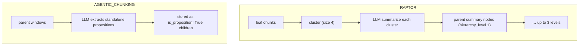

RAPTOR gives multi-level retrieval (retrieve a high-level summary or drill to leaves); agentic
chunking indexes atomic factual propositions for precise grounding. Records get stable
`uuid5` IDs (idempotent re-index) and are written via `persist_index_records`.

### 5.5 Embedding — provider ladder & dimensions

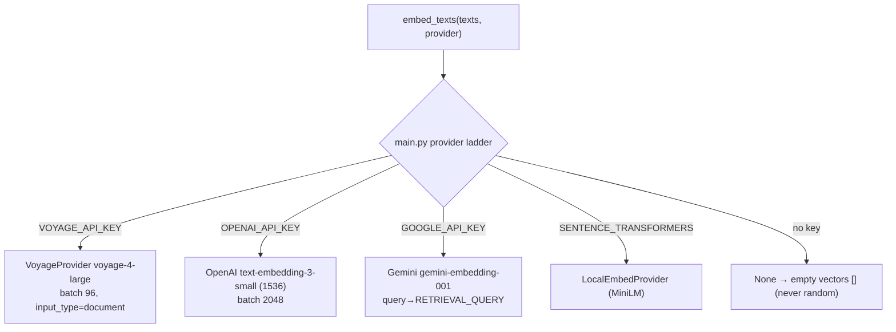

- The embedder is chosen by a **hardcoded ladder in `main.py`** (not the LLM registry, which
  only picks completion providers). No key ⇒ **empty vectors** everywhere (deliberate — never
  inject random vectors; callers must tolerate `[]`).
- Dimensions are whatever the API returns (voyage-4-large; 1536 for text-embedding-3-small;
  gemini). The collection's `embedding_dim` selects the storage table.
- `EmbedRequest(texts, input_type="query"|"document")` — Voyage/Gemini use the type to pick the
  right embedding space (asymmetric retrieval).

> The `app/embedding/` policy package (`EmbeddingOrchestrator`, `dimension_policy`,
> `reembedding_policy`, `drift_monitor`, `VectorIndexPolicy`) is **advisory/inert** on the live
> path — the orchestrator's selection is written into chunk metadata but never chooses the real
> embedder. `embedding_router` is a side-channel used only by the `/api/embeddings/*` routes and
> the Celery re-embed task.

### 5.6 Vector DB — pgvector, HNSW, cosine

- **Extensions:** `vector` + `pg_trgm`.
- **Index type: HNSW everywhere** (`m=16, ef_construction=64`); IVFFlat is a dead enum — never
  created.
- **Metric: cosine everywhere** — every ANN index uses `vector_cosine_ops`, every query uses the
  `<=>` cosine-distance operator scored as `1 - (a <=> b)`. No L2/inner-product anywhere.
- Per chunk table: a `*_vector` HNSW index, a `*_trgm` GIN index (`content gin_trgm_ops`), and a
  `*_fts` GIN index (`to_tsvector('english', content)`).
- **3072-dim is special:** it exceeds pgvector's 2000-dim HNSW limit, so it uses a
  `halfvec(3072)` HNSW index (`halfvec_cosine_ops`) and the engine casts `embedding::halfvec(3072)`
  at query time.
- The gateway runs a **fail-closed readiness preflight** asserting all four chunk tables, the
  `<=>` operator, and exactly 4 HNSW + 4 trigram + 4 FTS indexes exist before serving.

### 5.7 Retrieval — the 4-leg RRF engine

The core retrieval primitive (`app/rag/engine.py::hybrid_search`) fuses up to **four legs**
with **Reciprocal Rank Fusion** (k=60):

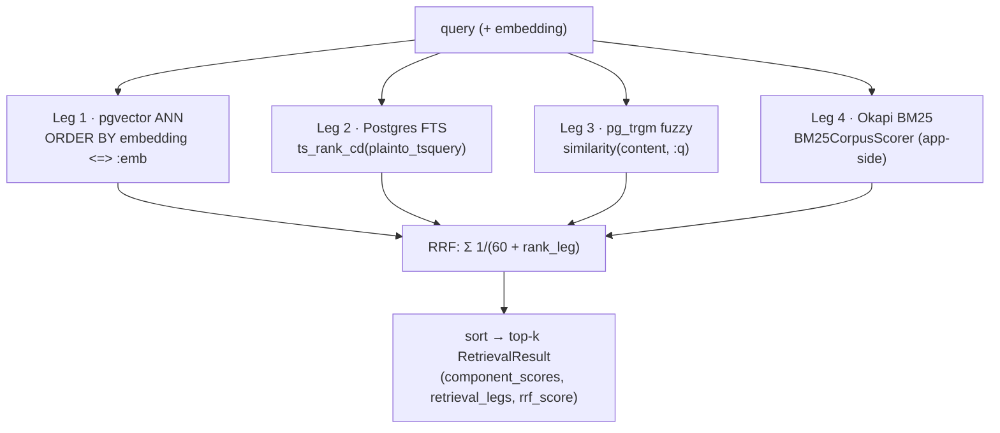

**Retrieval modes:** `hybrid` (all legs), `lexical` (FTS + trigram), `vector` (ANN only).
Collections without vectors degrade gracefully to FTS + trigram. A live-chunk filter
(`expires_at IS NULL OR > now()`) enforces freshness; `metadata @> :filter` enables metadata
filtering.

### 5.8 The strategy gateway — 18 strategies (`app/rag/gateway.py`)

The profile picks a strategy (CORRECTIVE / FLARE / FUSION / RAPTOR / COLBERT / SELF_RAG / …);
the **canonical `RetrievalGateway.execute()`** resolves it to an adapter and runs it under a
budget guard + timeout, **refusing silent strategy substitution** (it raises if the resolved
strategy ID doesn't match).

```mermaid
flowchart TD
    PROF["profile.rag_strategy.strategy"] --> GW["RetrievalGateway.execute"]
    GW --> V["validate capabilities · authorize collection (RLS)"]
    V --> ADP{"strategy adapter"}
    ADP -->|naive/hybrid| BASE["persisted search + RRF"]
    ADP -->|corrective (CRAG)| CR["loop: search → LLM grade → reformulate → web fallback"]
    ADP -->|hyde| HY["LLM hypothetical doc → embed → vector search"]
    ADP -->|multi_hop| MH["LLM decompose → parallel sub-queries → merge"]
    ADP -->|fusion| FU["query expansion variants → per-variant RRF"]
    ADP -->|raptor/agentic_chunking| PRE["search precomputed hierarchical index"]
    ADP -->|colbert| CB["hybrid + ColBERT late-interaction rerank"]
    ADP -->|graph| GR["vector seeds + graph_capability.retrieve_evidence → merge"]
    ADP -->|web_augmented| WEB["policy check + hybrid + SearXNG results"]
    ADP -->|adaptive| AD["select_adaptive_strategy → recurse"]
    ADP --> NORM["_canonical_result: citations, legs, strategy_trace, grounded"]
```

**Mapping back to Part 2's rules:** simple→CORRECTIVE, web/realtime→FLARE, COMPLEX→FUSION,
EXPERT→RAPTOR (+graph), code→COLBERT, realtime-no-web→SELF_RAG. **Reranking** options:
cross-encoder (`rag/cross_encoder.py`), ColBERT late-interaction, RRF-based diversity (there is
no dedicated MMR re-ranker — diversity emerges from multi-leg fusion). `rag_platform/retriever.py`
then **synthesizes** a cited answer (`cite with [N]`) and runs `MinimalCitationVerifier` (atomic-
claim entailment) — the RAG-side grounding gate (distinct from the agent-loop grounding in Part 9).

### 5.9 Semantic cache — cosine LLM-call dedup (`app/rag/semantic_cache.py`)

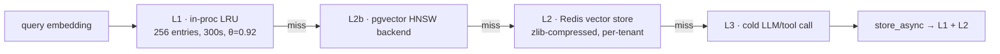

Cosine similarity ≥ 0.92 (~23°) serves a cached LLM response, deduping near-identical calls
across replicas. `stats` reports hit-rate and bytes saved; a batch API dedupes all plan steps at
once. This is what `MemoryCacheConfig.use_semantic_cache` (Part 2, enabled for simple low-risk
non-realtime goals) switches on.

### 5.10 Knowledge graph (`app/knowledge_graph/`)

- **Model:** `GraphNode` (10 `NodeType`s: document/chunk/entity/concept/goal/tool/…) and
  `GraphEdge` (10 `EdgeType`s: mentions/supports/contradicts/depends_on/…), tables
  `knowledge_nodes` / `knowledge_edges` (RLS-scoped).
- **Extraction:** `EntityExtractor` — deterministic regex entities (confidence 0.7) or LLM
  entity+relationship triples.
- **Store:** `KnowledgeGraphStore` (in-memory + fire-and-forget Postgres), `find_path` (BFS ≤
  max_hops), and **Union-Find community detection** (not Louvain).
- **Retrieval integration:** the gateway's `graph` strategy is *real* (vector seeds + graph
  evidence merge) and requires a bound `graph_capability`; the legacy engine's graph leg is a
  stub that falls back to hybrid.

> ⚠️ **Key maturity finding:** the KG is **NOT auto-populated during ingestion** —
> `KGIngestionHook` is dead code (never instantiated, references nonexistent classes). Today the
> graph is populated/queried only through the `/knowledge-graph` REST API. `MultiHopReasoner` and
> `GraphAccessControl` are inert.

### 5.11 Step-by-step recap (Part 5)

1. **Ingest** via one of three paths → parse → PII/quality gate → **chunk** (token-sized semantic,
   or content-specific: heading/ast/layout/row/scene) → **embed** (provider ladder) → **store** in
   the dimension-specific pgvector table.
2. EXPERT collections also build **RAPTOR / proposition** hierarchical indexes.
3. **Retrieve** via the gateway: the profile's strategy runs (CRAG/FLARE/FUSION/RAPTOR/COLBERT/…),
   built on the **4-leg RRF** primitive (ANN + FTS + trigram + BM25), then reranked.
4. **Synthesize** a cited answer and **verify** citations by entailment.
5. The **semantic cache** deduplicates near-identical LLM calls by cosine ≥ 0.92.

---

## Part 6 — Agent memory (what the agent remembers)

Memory is how AgentVerse gets better *within* and *across* goals. The profile's
`MemoryCacheConfig` (Part 2) decides which memory tiers are active for a given goal. There
is a large memory taxonomy under `app/memory/`, but **only two tiers are truly load-bearing
on every run**; the rest are wired for specific paths or are scaffolding.

### 6.1 The memory taxonomy and what actually fires

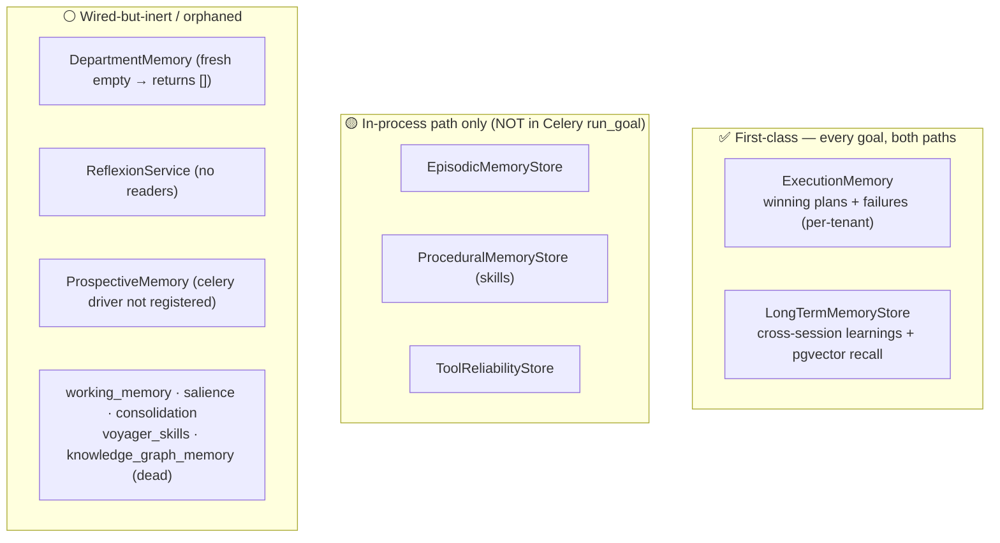

**Critical path asymmetry to know:** the documented production executor is the **Celery
`run_goal`** task (`app/scaling/tasks.py`). It constructs a fresh `AgentGraph` and passes
**only** `exec_memory`, `long_term_memory`, and `embedder`. The **in-process** path
(`GoalService` → `AgentGraph`) additionally wires episodic/procedural/tool-reliability
memory. So in a real Celery deployment, episodic/procedural/tool-reliability memory **do not
participate**, even though the planner/verifier mixins contain code to use them.

### 6.2 ExecutionMemory — winning plans & failures (`app/memory/execution.py`)

- **Written** in the `verify` node on success (`record` sync + `record_async` → Postgres
  `execution_memory`), and on RPA tool failure in `execute` (`record_failure_async`).
- **Read** in the `rag_retrieval` node: `recall_async` returns past *winning plans*
  (`[Past winning plans]`) and `recall_failures` returns *failed approaches to avoid*
  (`[Previously Failed Approaches — Avoid These]`).
- Recall is **keyword-filtered** (no embeddings): it selects success rows for the tenant and
  Python-filters by overlap with the goal's first five words. Scoped **per tenant only**.

### 6.3 LongTermMemoryStore — semantic cross-session memory (`app/memory/long_term.py`)

- The **only** memory with true semantic recall. On goal success the `verify` node calls
  `extract_from_goal` → content `"Goal: … → Result: …"`, `memory_type="success_pattern"`,
  `confidence=0.8`; then `store_async` embeds the content (via the tenant embedder) and
  UPSERTs a `long_term_memory` row with a pgvector `embedding` column (`vector(1536)`).
- RPA text/vision extractions are chunked (>500 chars, 50-char overlap) and stored with
  their own embeddings (`memory_type="rpa_extraction"`).
- **Recall** in `rag_retrieval`: `recall_async` embeds the goal and runs a **pgvector cosine
  search** (`1 - (embedding <=> :qvec)`), RLS-scoped, top-k=3, surfaced as `[Domain knowledge]`.
  Falls back to an in-memory keyword scorer when no embedder/DB.

### 6.4 How memory reaches the prompt

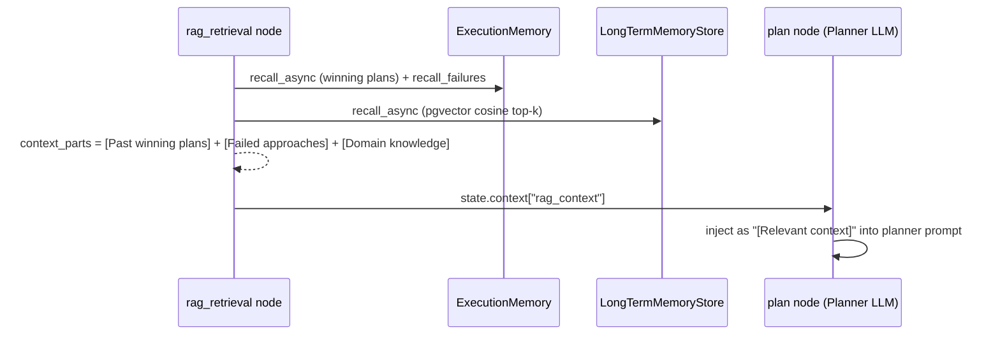

This is the concrete point where recalled plans, failures, and domain knowledge **bias the
next plan** — the platform's within-tenant learning loop.

### 6.5 Step-by-step recap (Part 6)

1. Profile's `MemoryCacheConfig` decides which tiers are on (LTM/KG/reflexion for COMPLEX/EXPERT).
2. `rag_retrieval` reads ExecutionMemory (plans + failures, keyword) and LongTermMemory (pgvector semantic).
3. Results become `rag_context`, injected into the planner prompt.
4. `verify` writes back: ExecutionMemory record + LongTermMemory extraction (embedded).
5. Celery path only wires ExecutionMemory + LongTermMemory; episodic/procedural/tool-reliability are in-process-only.

---

## Part 7 — Prompt building & context assembly

There is **no central "prompt service"**. Prompt/context assembly happens inline inside the
node mixins, pairing a **static system prompt** (from `app/agent/prompts.py`) with a
**hand-assembled user message**. A secondary library, `app/context/`, is reached from exactly
one place to transform retrieved RAG chunks into role-scoped context strings.

### 7.1 The three role prompts (`app/agent/prompts.py`)

| Constant | Role | Output contract |
|----------|------|-----------------|
| `PLANNER_SYSTEM` | Planner | `{"steps":[…]}` JSON |
| `STRUCTURED_PLANNER_SYSTEM` | Planner (goal-tree on) | dependency-aware steps with `tool`/`risk`/`depends_on`/`expected_output` |
| `EXECUTOR_SYSTEM` | Executor | grounding rules + tool-call JSON `{"tool":…,"arguments":…}` |
| `VERIFIER_SYSTEM` | Verifier | `{"success","reason","retry"}` |

Others (`GOAL_TREE_SYSTEM`, `CHAIN_OF_THOUGHT_SYSTEM`, `REFLECTION_SYSTEM`,
`SELF_REFINE_SYSTEM`, `GROUNDING_SYSTEM`, `SYNTHESIS_SYSTEM`, `JUDGE_RUBRIC_SYSTEM`) feed the
reasoning/grounding/synthesis subsystems. Every constant has a live consumer.

### 7.2 Where each context slot is filled (the planner assembly)

The `plan` node (`app/agent/nodes/planner_mixin.py`) is the richest assembly point. It builds
the user message by appending, in order:

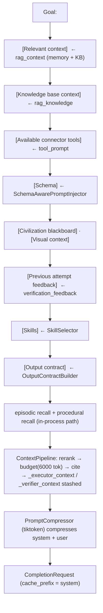

`ContextPipeline` (`app/context/context_pipeline.py`) is the **only** entry into
`app/context/`. It reranks retrieved chunks (strategy from the profile — SCORE / RRF /
DIVERSITY / CROSS_ENCODER / LLM), applies a token budget, threads citations, and produces
three role-scoped context strings (`planner`/`executor`/`verifier`) — the executor and
verifier ones are stashed in `state.context` for the downstream nodes so they inherit the
same reranked, budgeted context.

### 7.3 Budgeting & compression (three independent layers)

1. `ContextBudget.apply` — naïve `chars//4` token estimate, cap 6000 tokens / 20 chunks.
2. `PromptBuilder._truncate_chunks` / `_auto_compress` — per-slot truncation; auto-compress
   when text exceeds 0.85× the window.
3. `PromptCompressor` (`app/agent/prompt_compressor.py`, ACTIVE singleton) — heuristic,
   zero-LLM: collapses blank lines, strips filler, caps `[…context]` blocks to ~500 tokens,
   caps tool lists to 30. Uses `Tokenizer` (tiktoken `cl100k_base`, byte//4 fallback).

> **Maturity note:** a sophisticated typed budgeter (`app/context/prompt_budget.py`,
> `PromptBudget`/`PromptBlock` — immutable, partition-aware, exact-token, provenance-preserving)
> exists but is **orphaned** (test-only). The live loop uses the crude `ContextBudget` +
> heuristic compressor instead. Also, all `app/context/` calls are lazy and wrapped in silent
> try/except, so any failure degrades to the raw `rag_context` without surfacing — a known
> observability gap.

### 7.4 Reflexion into the prompt

On failure, the `ReflexionWirer` writes lessons (`verifier_mixin`), which `GoalService`
recalls into `initial_context["_reflexion_lessons"]` on the next attempt; those flow into
`ContextPipeline.run(reflexion_lessons=…)` and thus into the planner prompt. This closes the
reflect→replan loop from Part 4.

### 7.5 Step-by-step recap (Part 7)

1. Each role uses a static system prompt from `prompts.py`.
2. The planner hand-assembles ~10 labelled context slots into the user message.
3. `ContextPipeline` reranks + budgets + cites retrieved chunks and produces role-scoped context.
4. `PromptCompressor` (tiktoken) compresses system + user before the LLM call.
5. `cache_prefix = system` enables provider prompt caching.

---

## Part 8 — Guardrails, governance, HITL, policy & cost

This is the safety and control plane. It is the densest part of the loop: **every step and
every tool call** passes through a fixed sequence of gates inside the `execute` node
(`app/agent/nodes/executor_mixin.py::_execute_step`).

### 8.1 The governance gate order (per step)

```mermaid
flowchart TD
    S["planned step"] --> SAFE["action-safety profile"]
    SAFE --> DED["dedup cache"]
    DED --> CB["circuit breaker"]
    CB --> PM["PermissionMatrix.check → DENY only"]
    PM --> GR["Guardrails A (regex) + profile enforcer (flag)"]
    GR --> POL["PolicyEngine.evaluate → DENY / REQUIRE_APPROVAL"]
    POL --> KW["keyword high-risk gate (deploy/delete/prod)"]
    KW --> LLM["Executor LLM call (emits tool call)"]
    LLM --> COST["CostController.check_and_record → block if over budget"]
    COST --> GA["Guardrails B (six-layer) + C (tenant rules) on tool args"]
    GA --> EXG["exfil_guard (secrets/oversized → block)"]
    EXG --> TR["classify_tool_risk → destructive=deny · write_high=HITL"]
    TR --> MCP["MCP dispatch (Part 10)"]
    MCP --> OUT["output guardrails + sanitize + PII redact"]
    OUT --> AUD["AuditLog.record"]
```

Two nuances worth memorizing:
1. **Cost is checked *after* the executor LLM call** — an over-budget step still pays for its
   planning tokens before the tool is blocked.
2. **`PermissionMatrix.APPROVAL` is inert** — the loop only branches on `DENY`; HITL is
   reached exclusively via the policy engine, the keyword gate, and tool-risk `write_high`.

### 8.2 Three guardrail engines (and which actually fire)

AgentVerse has **three parallel guardrail implementations**. On a default deployment the
effective set reduces to three things:

| Engine | File | Status | What fires |
|--------|------|--------|-----------|
| **A — GuardrailChecker** | `app/intelligence/guardrails.py` | ✅ always-on baseline | regex injection (base64/ROT13/homoglyph/leet), dangerous commands (`rm -rf`, `DROP TABLE`), PII in output |
| **B — GuardrailEngine** (aka `GuardrailEngineV2`) | `app/intelligence/guardrail_engine.py` | ✅ bound to `app.state`, tool-arg/output only | six layers (injection, recursive arg scan, PII redact, cloud-destruction, LLM-judge*, output scan) |
| **C — GuardrailsEngine** ("Guardrails 2.0") | `app/guardrails_v2/engine.py` | 🟡 wired-but-inert | per-tenant rules — **only fires if rules seeded via admin API** (9 layers, 6 actions, compliance bundles) |

\* Engine B's `LLMJudge` layer is config-gated off by default; its `evaluate_goal`/
`evaluate_output` methods are never called on the agent path. Engine C is the richest design
(GDPR/SOC2/HIPAA/PCI bundles, HITL/quarantine actions) but dormant because nothing seeds
rules at startup. Additional dead modules: `streaming_guard`, `toxicity`, `encoding_attacks`,
`output_anomaly`, `Redactor`.

Two always-on hard blocks live outside the "engines": **`sanitization.py`** (credential
redaction + truncation on every tool output/event) and **`exfil_guard.py`**
(`check_tool_args_for_exfil` in the MCP client blocks secrets/oversized payloads to write
sinks; `check_tool_output_for_injection` annotates indirect-injection in tool output).

### 8.3 Governance subsystems (`app/governance/`)

| Subsystem | File | Role | Status |
|-----------|------|------|--------|
| **Audit** | `audit.py` | append-only trail, in-memory + async Postgres `audit_log` | ✅ primary |
| Audit v3 | `audit_v3.py` | hash-chained tamper-evident WAL (Redis→`audit_events`) | 🟡 wired, not the loop writer yet |
| **Cost** | `cost.py` | per-goal ($10) / per-tenant-daily ($500) budgets; `RedisCostController` atomic Lua for cross-replica | ✅ enforcing (blocks) |
| **HITL** | `hitl.py` | approval queue; cross-replica via Redis BLPOP; multi-approver; startup restore | ✅ |
| Tool risk | `tool_risk.py` | classify `read/write_low/write_high/destructive` | ✅ |
| **Policies** | `policies.py` | glob tool policies + time windows + domain failsafe; Redis pub/sub reload; version snapshots | ✅ |
| **Permissions** | `permissions.py` | `(tenant,tool) → ALLOW/ALLOW_LOG/APPROVAL/DENY` | ✅ DENY-branch only |
| Pricing | `pricing.py` | per-1k-token price table for cost estimate | ✅ |
| Legal holds / compliance bundles / SIEM | — | retention holds, compliance toggles, SIEM export | 🟡 API/conditional |

### 8.4 HITL — how a human gets in the loop

```mermaid
sequenceDiagram
    participant EX as execute node
    participant HG as HITLGateway
    participant DB as approval_requests (DB)
    participant R as Redis (cross-replica)
    participant H as Human
    EX->>HG: request_approval(action, risk=high)  [policy / keyword / write_high]
    HG->>DB: persist pending request
    HG->>H: notify (Slack/webhook via NotificationService)
    alt autonomy_mode == supervised
        EX->>HG: wait_for_approval (asyncio.Event race Redis BLPOP)
        H->>HG: approve() / reject() (any replica)
        HG->>R: publish resolution (RPUSH, 24h TTL)
        HG-->>EX: APPROVED → dispatch tool · REJECTED/TIMEOUT → PermissionError
    else bounded / fully-autonomous
        HG-->>EX: request-and-log, do not block
    end
```

Only **supervised** autonomy actually blocks; bounded/fully-autonomous request-and-log. The
route back to the loop: a rejection publishes `hitl_rejected:{goal_id}` so the planner can
replan, and the router returns `waiting_human` (Part 3) when approvals are pending.

### 8.5 Step-by-step recap (Part 8)

1. Each step runs the fixed gate chain: safety → dedup → breaker → permissions → guardrails → policy → keyword-HITL → LLM → cost → tool-arg guardrails → exfil → tool-risk → dispatch → output-guardrails → audit.
2. Effective guardrails = engine A (always), engine B (tool args/output), exfil_guard + sanitization.
3. Cost blocks over-budget steps (post-LLM); HITL blocks only in supervised mode.
4. Every step is audited; policies/permissions/cost are Redis-backed for cross-replica accuracy.

---

## Part 9 — Hallucination handling (grounding, consensus, calibration)

AgentVerse fights hallucination at three points: **per-step grounding**, **high-risk
consensus verification**, and **citation-carrying synthesis** — plus verifier **calibration**
for measuring trustworthiness over time.

### 9.1 Per-step grounding (`app/agent/grounding.py`)

```mermaid
flowchart TD
    OUT["executor step output"] --> EC["extract_claims()<br/>regex: numbers, dates, URLs, entities"]
    EC --> CG{"check_grounding vs tool_outputs"}
    CG -->|no claims| OK["grounded (nothing to verify)"]
    CG -->|claims present, evidence absent| UNG["UNGROUNDED (P0-4: fail-closed)"]
    CG -->|claims supported| OK
    CG -->|claims unsupported| UNG
    UNG --> CU["consecutive_ungrounded += 1"]
    CU --> Q{"≥ 2 consecutive?"}
    Q -->|yes| RR["route → rag_remediate / replan"]
    Q -->|no| CONT["continue, flag ungrounded_claims"]
```

`check_grounding` verifies that concrete claims (numbers, dates, URLs, named entities) in the
output are supported by the step's tool outputs. A key hardening (**P0-4**): *claims present
but evidence absent* counts as **ungrounded** (previously fail-open). `AgentState` tracks
`ungrounded_claims`, `consecutive_ungrounded`, and marks steps `StepStatus.UNGROUNDED`; two
consecutive ungrounded steps trigger `rag_remediate` (re-retrieve) or replan.

### 9.2 Consensus verification for high-risk goals (`app/agent/consensus.py`)

```mermaid
sequenceDiagram
    participant V as verify node (primary Verifier)
    participant RC as requires_consensus?
    participant CV as ConsensusVerifier
    V->>RC: high-risk / regulated / write_high step AND primary said FAIL?
    RC-->>CV: yes (only when primary fails — saves cost)
    CV->>CV: run N verifiers in parallel (primary + others)
    CV->>CV: majority vote (fail-closed: exception = fail vote)
    CV-->>V: ConsensusResult(agreement, majority_reason, requires_hitl)
    Note over V: if requires_hitl → HITLGateway.request_approval
```

Consensus runs **only when the primary verifier already failed** on a high-risk/regulated/
`write_high` goal (cost-saving). Each verifier's exception counts as a fail vote
(fail-closed). The majority verdict can override the primary and can escalate to HITL.

### 9.3 Citation-carrying synthesis (`app/agent/synthesis.py`)

`AnswerSynthesizer.synthesize()` builds a `CitedAnswer` from completed steps using
`SYNTHESIS_SYSTEM`, extracting `[Step N]` citations into `Citation` objects. The
`RAGStrategyConfig.citation_required` flag (Part 2) and `ContextPipeline`'s citation threading
(Part 7) mean answers can be traced back to evidence sources — the antidote to unsupported
claims.

### 9.4 Verifier calibration (`app/intelligence/verifier_calibration.py`)

Every verifier verdict is recorded to a calibration store, so the platform can measure how
often "success" verdicts were actually correct — feeding reliability metrics and the eval
loop (Part 14). Related reachable-but-not-live checkers: `claim_decomposer.py` (decompose an
answer into atomic claims) and `nli_checker.py` (NLI entailment of claims against evidence)
provide a stronger grounding path that is available but not on the default loop.

### 9.5 Step-by-step recap (Part 9)

1. After each step, extract concrete claims and check them against tool-output evidence (fail-closed on missing evidence).
2. Two consecutive ungrounded steps → rag_remediate/replan.
3. High-risk + primary-verifier-fail → parallel consensus vote (fail-closed), can escalate to HITL.
4. Final answers are synthesized with `[Step N]` citations; verdicts are recorded for calibration.

---

## Part 10 — Multi-model executor & MCP tool execution

"Multi-model" has two meanings here: (a) the **three LLM roles** (planner/executor/verifier)
each get their own provider/model from the profile's `model_role_assignments` (Part 2), and
(b) the executor calls **real-world tools** over the **Model Context Protocol (MCP)**. This
Part covers how a tool call actually executes.

### 10.1 The connector registry (`app/mcp/registry.py`)

- Connectors are stored **per-tenant in Redis** (keys `mcp:servers:{tenant}:{server_id}` +
  index set `mcp:server_ids:{tenant}`) — isolation is structural (tenant is baked into the key).
- `MCPServerConfig` carries `base_url`, `auth_type` (bearer/api_key/oauth_ac/oauth_cc/pkce/
  basic/custom_header/mtls/hmac/none), `auth_config` (creds, may be vault refs),
  `tool_definitions`, `transport` (http/ws), and a process-local `builtin_handler` (excluded
  from JSON, re-attached from a module-level registry after the Redis round-trip).

### 10.2 Discovery and the two transports

`MCPClient` speaks two dialects, chosen by URL shape:
- URL ending `/mcp` → **JSON-RPC 2.0 over streamable HTTP** (with an `initialize` handshake,
  `Mcp-Session-Id`, SSE framing) — `tools/list`, `tools/call`.
- otherwise → **plain REST** (`GET /tools`, `POST /tools/{name}`).

`discover_all_tools(tenant_ctx)` iterates the tenant's connectors and returns
`ToolDefinition`s (name, description, input_schema, server_id). This is what the planner's tool
list is built from (`AgentGraph._mcp_client.discover_all_tools`).

### 10.3 The tool-call pipeline (`call_tool`)

```mermaid
flowchart TD
    A["agent emits tool call<br/>(server_id, tool_name, args)"] --> V["validate args"]
    V --> CB{"circuit breaker open?"}
    CB -->|yes| STALE["serve stale cache OR raise CircuitBreakerOpenError"]
    CB -->|no| REG["registry.get(server_id)"]
    REG --> RES["resolve args vs schema (tool intelligence)"]
    RES --> CH{"result cache hit?"}
    CH -->|yes| RET["return cached"]
    CH -->|no| EXG["exfil_guard: secrets/oversized → block"]
    EXG --> DISP["dispatch: builtin | ws | openapi | jira | MCP/HTTP"]
    DISP --> HEAL{"argument error?"}
    HEAL -->|yes| SH["LLM self-heal args → retry once"]
    HEAL -->|no| POST["cache (unless write) · record CB success · update tool stats"]
    POST --> R["ToolCallResult(success, output, error)"]
```

Cross-cutting concerns layered on every call: **SSRF guard** on the URL, **exfil guard** on
write-sink args, **circuit breakers** (per tenant+server, 5 failures / 60s, Redis-backed for
cross-replica), a **two-tier result cache** (`ToolResultCache`: L1 in-proc + L2 Redis zlib,
TTL by tool class — writes never cached and invalidate reads), **argument resolution +
LLM self-heal**, and **tool stats** updates. Every failure returns a structured
`ToolCallResult(success=False, error=…)` rather than raising to the agent.

### 10.4 Auth injection & OAuth/PKCE (`app/mcp/oauth.py`)

`_build_auth_headers` injects per `auth_type`: bearer / api_key / basic / custom_header, and the
OAuth family via `OAuthFlowManager.get_token` (refreshing if expired). PKCE: `start_flow`
generates a `code_verifier` + S256 `code_challenge`; `exchange_code` completes with the stored
verifier; tokens are stored in-process and **vault-encrypted** in the `oauth_tokens` table for
cross-restart recovery.

> Maturity notes: `mtls` and `hmac` are declared enums with **no header branch** (inert);
> WebSocket transport is reachable but off the default path; `oauth_cc` (client-credentials) has
> no dedicated token acquisition — it relies on a pre-existing token.

### 10.5 Step-by-step recap (Part 10)

1. Planner/executor/verifier each use their own model from `model_role_assignments`.
2. Tools are discovered per-tenant from Redis-stored MCP connectors.
3. Each tool call passes: validate → breaker → registry → arg-resolve → cache → exfil → dispatch → self-heal → cache/stats.
4. Auth headers are injected per connector; OAuth/PKCE tokens are vault-encrypted and refreshed.
5. Results are cached by tool class; writes invalidate reads; failures are structured, never raised.

---

## Part 11 — Workflows, triggers & scheduling

There are **two separate automation subsystems** frequently conflated. Keep them distinct:

- **Triggers + Scheduling** — fire → dispatch → **create a Goal** (the agent loop). **Fully wired
  and proven by an e2e test.**
- **Workflow Automation Engine** (`app/workflow/`) — a DSL-defined multi-step LangGraph
  StateGraph with its own compiler/runner. **A scaffold in production** (see §11.4).

### 11.1 Triggers — the unified 12-step dispatch (`app/triggers/dispatcher.py`)

```mermaid
flowchart TD
    T["trigger fires (API / webhook / schedule)"] --> S1["1 RBAC check_permission(fire)"]
    S1 --> S2["2 payload size (per-plan cap)"]
    S2 --> S3["3 derive idempotency_key (per-family)"]
    S3 --> S4["4 dedup (Redis SET NX, 60s window)"]
    S4 --> S5["5 rate limit (per-plan)"]
    S5 --> S6["6 circuit breaker"]
    S6 --> S7["7 bulkhead (per-tenant concurrency)"]
    S7 --> S8["8 condition eval (CEL)"]
    S8 --> S9["9 render goal_template ({{payload.x}})"]
    S9 --> S10{"10 simulation?"}
    S10 -->|yes| SIM["return would_have_fired (no goal)"]
    S10 -->|no| S11["11 create_goal → GoalService"]
    S11 --> S12["12 persist TriggerEvent (ON CONFLICT DO NOTHING)"]
```

- **58 trigger types across 9 families** (time/schedule, goal-chain, conversational,
  condition/state, external webhooks, data/file, monitoring, API/polling, IoT) — all carried by
  one `TriggerSpec` dataclass.
- **Deduplication is two-layered:** a Redis `SET NX` 60-second window (idempotency key derived
  per-family: time triggers key on the scheduled instant, goal-chain on source-goal+event,
  webhooks on payload hash), plus a durable `trigger_events` `ON CONFLICT (tenant_id,
  idempotency_key) DO NOTHING`.
- **`NLScheduler`** turns natural language ("every weekday at 9am, summarize new tickets") into
  `TriggerSpec`s via an LLM (with a regex keyword-routing fallback).

### 11.2 Trigger → Goal (the proven live path)

```mermaid
sequenceDiagram
    participant API as POST /triggers/{id}/fire
    participant D as TriggerDispatcher
    participant GS as GoalService.create_goal
    participant W as Celery run_goal
    API->>D: dispatch(spec, payload, tenant_ctx)
    D->>D: 12-step pipeline (dedup, rate, condition…)
    D->>GS: create_goal(goal_text, agent_id, idempotency_key)
    GS->>W: submit_goal → enqueue_goal(queue=goals.{plan})
    W-->>API: goal executes; events stream back via Redis pub/sub → SSE
```

The e2e test (`tests/e2e_full/test_trigger_fire_e2e.py`) proves: fire → real non-null `goal_id`,
the goal is fetchable, the `trigger_events` row persists, and a **second identical fire returns
`skip_reason="dedup"`** with no new goal.

### 11.3 Scheduling — cron/interval/once (`fire_due_schedules` beat task)

```mermaid
flowchart TD
    BEAT["Celery beat every 60s<br/>@beat_task_guard (Redis lock, no overlap)"] --> DISC["scan Redis schedule:* (+ opt-in DB)"]
    DISC --> EV{"per schedule"}
    EV -->|CRON| CRON["croniter.get_prev(now); due if last_fired < previous_run"]
    EV -->|INTERVAL| INT["due if now - last_fired ≥ interval_seconds"]
    EV -->|ONCE| ONCE["due if fire_at ≤ now and never fired"]
    EV -->|FILE_DROP| FD["scan path; ≤5 new files/cycle"]
    CRON --> DISP["deterministic goal_id = sched_ + sha256(key:fire_instant)"]
    INT --> DISP
    ONCE --> DISP
    DISP --> MARK["mark last_fired_at; dispatch run_scheduled_goal → run_goal"]
```

Duplicate suppression is belt-and-suspenders: a **deterministic `goal_id`** from the fire instant
(re-firing the same instant collapses to the same goal), the `beat_task_guard` overlap lock, and
the `last_fired_at` advance.

### 11.4 Celery — per-plan queue routing (`app/scaling/`)

```mermaid
flowchart LR
    SG["GoalService.submit_goal"] --> Q["CeleryGoalTaskQueue.enqueue_goal"]
    Q --> MAP["PLAN_QUEUE_MAP[plan]"]
    MAP -->|free| QF["goals.free"]
    MAP -->|starter| QS["goals.starter"]
    MAP -->|professional| QP["goals.professional"]
    MAP -->|enterprise| QE["goals.enterprise (dedicated, no noisy-neighbour)"]
    QE --> WORK["run_goal worker → AgentGraph"]
```

Enterprise tenants get a **dedicated queue** so free-tier bursts can't starve them. Beat also
runs ~30 maintenance tasks (schedule firing 60s, MCP health 30s, stuck-goal detection 300s,
retention, HITL expiry, audit WAL flush, etc.), with **RedBeat** ensuring a single beat leader
across replicas.

### 11.5 GoalService — the governed submission pipeline & cross-replica SSE

`create_goal` (what the trigger calls) delegates to **`GoalService.submit_goal`**, the single
governed entry point. Note this is a *second* dedup layer, orthogonal to the trigger's 12-step
dedup (Part 11.1):

```mermaid
flowchart TD
    CG["create_goal (from trigger)"] --> SG["submit_goal"]
    SG --> D1["1 daily limit — Redis atomic INCR daily_goals:{tenant}:{date}<br/>validate-then-DECR rollback (cross-replica)"]
    D1 --> D2["2 concurrency limit → PlanLimitExceededError (429) at cap"]
    D2 --> D3["3 goal-text dedup — identical in-flight goal short-circuits<br/>({deduplicated:true}); goal_id minted here"]
    D3 --> D4["4 auto-routing (agent_id None → agent_router; multi_agent fan-out)"]
    D4 --> D5["5 GoalRecord + _db_persist_goal (sync when task queue wired)"]
    D5 --> FORK{"6 enqueue fork"}
    FORK -->|task_queue set| CEL["CeleryGoalTaskQueue.enqueue_goal(queue=goals.{plan})"]
    FORK -->|task_queue None| INP["in-process asyncio.create_task(_run_agent_loop)"]
```

- **The master active/inert switch** for the whole goal path is here: `CeleryGoalTaskQueue` is
  injected **only when `manage_pools and settings.redis_url`**; otherwise `_task_queue=None` and
  `submit_goal` runs the agent loop **in-process** (`asyncio.create_task`). This is why tests
  (in-memory) and production (Celery) exercise different execution paths.
- **`create_goal`'s idempotency key is only stored** (in
  `execution_context["trigger_idempotency_key"]`), never enforced by the service — enforcement is
  entirely upstream in the dispatcher (Redis `trigger_dedup:*` 60s + `trigger_events` ON CONFLICT).

**Worker → browser SSE fan-out (how a Celery-executed goal streams to any replica):**

```mermaid
sequenceDiagram
    participant W as Celery run_goal worker
    participant R as Redis pub/sub
    participant API as API replica (GoalService)
    participant C as Browser (SSE)
    W->>W: build worker-local GoalService bridge (own DB + EventStore)
    W->>R: publish goal_events:{tenant}:{goal_id} (then persist)
    API->>R: psubscribe("goal_events:*")  [started in lifespan]
    R-->>API: event → local SSE subscriber queues
    API-->>C: text/event-stream
    Note over API: also psubscribe("hitl_rejected:*") for HITL fan-out
```

The **`EventStore`** is the durable side (DB-backed): `append_event` computes
`sequence = COALESCE(MAX(sequence),0)+1` *inside* the transaction (race-free, backed by a unique
`(tenant_id, goal_id, sequence)` constraint), and `list_events_since(after_sequence)` powers SSE
**resume-from-cursor**. `NotificationService` (Slack/webhook/Teams) is **off** this hot path — it
is the HITL side channel (`notify_approval_required` / `notify_approval_timeout`).

### 11.6 Known wiring gaps (flagged honestly)

| Gap | Detail |
|-----|--------|
| **Workflow engine is a scaffold** | `WorkflowRunner` is built with no run-store and no Celery, never upgraded; there is no `workflow_runs` table; `trigger()` compiles a placeholder empty definition and runs inline, returning `status:"pending"`. WT-7 only removed the old 500. |
| **Goal-template rendering gap** | A trigger's `goal_template` lives on the store record, not on the `TriggerSpec` the dispatcher renders, so fires fall back to `"Trigger fired: {{trigger_type}}"`. The renderer is regex, not Jinja2. |
| **Timezone gap** | `Schedule.timezone` is stored but ignored — cron fires on UTC boundaries. `next_fire_at` is never persisted. |
| **DB schedule discovery is opt-in** | Default beat evaluates only Redis-mirrored schedules. |

### 11.7 Step-by-step recap (Part 11)

1. A trigger (API/webhook/schedule/NL) fires and runs the 12-step dispatch (RBAC → dedup → rate → bulkhead → condition → render → create goal → persist event).
2. Schedules are evaluated every 60s by a lock-guarded beat task; cron/interval/once due-logic produces a deterministic goal_id.
3. `create_goal` → `submit_goal` → Celery `run_goal` on the tenant's per-plan queue → the agent loop.
4. Live events stream back via Redis pub/sub → SSE across replicas.
5. The Workflow DSL engine exists and is unit-tested, but its production trigger path is currently a scaffold.

---

## Part 12 — OCR engine (`app/ocr/`)

The OCR engine turns images and PDFs into text + structured fields, feeding ingestion, the
agent's `ocr_tool`, and the `/ocr/extract` REST API.

### 12.1 The pipeline

```mermaid
flowchart TD
    IN["image_bytes / pdf_bytes"] --> IMG["_to_images<br/>PIL / pdf2image → pages"]
    IMG --> PRE["_preprocess_image<br/>grayscale → sharpen → autocontrast"]
    PRE --> OCR{"_ocr_page: Tesseract"}
    OCR -->|conf ≥ 0.6| TXT["tesseract text + confidence"]
    OCR -->|conf < 0.6 or missing| LLM["LLM vision fallback<br/>provider.complete(image)"]
    TXT --> CLS["DocumentClassifier.classify<br/>keyword + regex scoring"]
    LLM --> CLS
    CLS --> EXT["get_extractor(doc_type)<br/>id_docs / financial / general / LLM-structured"]
    EXT --> RES["OcrResult(raw_text, document_type,<br/>fields, engine_used, confidence, page_count)"]
```

- **Primary engine: Tesseract** (local, offline, free), tried with `hin+eng` then `eng`.
  Preprocessing (grayscale → sharpen → autocontrast) improves binarization.
- **Fallback: LLM vision** — if Tesseract is missing or its average confidence is below **0.6**,
  the page image is base64-encoded and sent to a vision-capable provider ("Extract all text…").
- **Classification:** `DocumentClassifier` scores the text against keyword sets + regex patterns
  (e.g. PAN `[A-Z]{5}\d{4}[A-Z]`, Aadhaar `\d{4}\s\d{4}\s\d{4}`) → one of 13 `DocumentType`s
  (PAN, Aadhaar, passport, driving license, voter ID, GSTIN, cheque, salary slip, invoice, bank
  statement, receipt, … else GENERAL).
- **Extraction:** a per-type extractor pulls structured `ExtractedField`s (name, value,
  confidence, `masked_value` for sensitive fields); the `LlmStructuredExtractor` runs async for
  general documents.

### 12.2 Where OCR is used

- `app/api/ocr.py` — REST `POST /ocr/extract` and `/extract-batch` (concurrent).
- `app/tools/ocr_tool.py` — exposes OCR as an agent tool so a goal can read a document mid-loop.

### 12.3 Step-by-step recap (Part 12)

1. Input bytes → PIL images (PDF via pdf2image).
2. Preprocess (grayscale/sharpen/autocontrast) → Tesseract (`hin+eng`→`eng`).
3. If confidence < 0.6 or Tesseract absent → LLM vision fallback.
4. Classify document type (keyword + regex), pick the matching extractor.
5. Return `OcrResult` with raw text, type, structured fields (masked where sensitive), engine used, and confidence.

---

## Part 13 — RPA & perception (`app/rpa/`)

RPA is browser automation exposed as tools every agent can call. There are **two RPA stacks**:
the async, Playwright-backed **executor stack** (live) and a synchronous **runner stack**
(orphaned scaffold). Everything the running system uses flows through `RPAExecutor`.

### 13.1 The action model & tools (`app/rpa/tools.py`)

An RPA "action" is just a `(tool_name, arguments)` pair. `RPA_TOOLS` declares 13 tools with a
`risk` field that drives governance:

| Tool | Risk | Purpose |
|------|------|---------|
| `rpa_open_url` | low | navigate |
| `rpa_click` / `rpa_type` | high | click by selector/text; fill input |
| `rpa_extract_text` / `rpa_screenshot` | read | read `inner_text` / capture PNG |
| `rpa_select_option` / `rpa_upload_file` / `rpa_download_file` / `rpa_submit_form` | high | form ops |
| `rpa_wait_for_text` | read | poll until text appears |
| `rpa_detect_captcha` / `rpa_request_human_help` / `rpa_wait_for_network_idle` | read | (stubs) |

Every agent gets these prepended to its tool context (`server_id="rpa"`), so browser automation
is always available.

### 13.2 Execution flow

```mermaid
flowchart TD
    A["agent tool call: rpa_*"] --> EX["RPAExecutor.execute(tool, args, tenant, goal)"]
    EX --> BK{"backend selection"}
    BK -->|Playwright + session mgr| P1["stateful: reuse BrowserSession.page"]
    BK -->|Playwright only| P2["standalone: open+close browser per call"]
    BK -->|neither| SIM["simulation: '[simulated] …' (CI-safe)"]
    P1 --> DISP["if/elif tool dispatch: Chromium (headless)"]
    P2 --> DISP
    DISP --> ART["screenshots → MinIO/temp artifact store"]
    DISP --> R["RPAResult(success, output, artifact_url, duration_ms)"]
```

- **Engine: Playwright + Chromium, headless.** Import is guarded everywhere — no Playwright →
  deterministic **simulation** strings (CI-safe). Risk classification routes `high`-risk clicks/
  types/uploads through the HITL gate (Part 8).
- **Sessions:** `BrowserSessionManager` pools browsers per `(session_id, tenant)` with a
  per-tenant cap and oldest-idle eviction; artifacts (screenshots/downloads) go to a MinIO/temp
  store; screenshots can be vision-analyzed by the embedder (perception).

### 13.3 Perception (`app/perception/`)

Page analysis + vision-via-embedder turns screenshots into structured observations the agent can
reason over (used for visual grounding and the `[Visual context]` prompt slot from Part 7).

### 13.4 Known gaps (flagged honestly)

- **Credential injection is dead in production** (`_credential_injector` never set) — `vault://`
  refs would reach the page literally.
- **The agent path never passes a `session_id`** → every agent RPA call is **ephemeral** (browser
  opened+closed per call); the pooling machinery is effectively unused by the loop.
- `cleanup_expired()` is never scheduled; `rpa_detect_captcha`/`rpa_wait_for_network_idle` are
  simulation-only stubs; the download-artifact upload calls a non-existent `store_bytes` (silently
  falls back to temp); the entire synchronous runner stack is orphaned.

### 13.5 Step-by-step recap (Part 13)

1. Agent emits an `rpa_*` tool call; high-risk verbs route through HITL.
2. `RPAExecutor` picks a backend: pooled Playwright / standalone / simulation.
3. Chromium (headless) runs the action; screenshots/downloads persist to the artifact store.
4. Perception can vision-analyze screenshots into `[Visual context]`.
5. Result returns as `RPAResult`; failures feed ExecutionMemory/SelfOptimizer.

---

## Part 14 — Evals & agent self-improvement

Evaluation and improvement close the loop: every goal is scored, poor scores trigger learning,
and (for one optimizer) improvements are written back to the agent's config. There are **two
eval stacks** and **three improvement stacks**; this Part maps what actually runs.

### 14.1 How an eval runs (the primary path)

```mermaid
flowchart TD
    V["verify node: goal COMPLETE"] --> ER["EvalRunner.score_and_persist"]
    ER --> D7["7 heuristic dimensions:<br/>task_completion · efficiency · accuracy* · safety<br/>coherence* · sla · tool_relevance"]
    D7 --> JUDGE["* accuracy & coherence via LLM-judge (verifier model)"]
    JUDGE --> AVG["average score, pass ≥ 0.70"]
    AVG --> DB["persist to evaluations table"]
    AVG --> GATE{"score < threshold?"}
    GATE -->|yes| SI["SelfImprovementEngine.decide_actions"]
    GATE -->|no| DONE["done"]
```

- **`EvalRunner`** (`app/intelligence/eval_runner.py`, ACTIVE) scores **7 dimensions** 0–1:
  `task_completion`, `efficiency` (iterations + cost), `accuracy`, `safety` (deny/injection
  events), `coherence`, `sla`, `tool_relevance`. `accuracy` and `coherence` are refined by an
  LLM-judge (the verifier model). Aggregate = mean; **pass threshold 0.70**; a failing run can
  auto-create a regression case.
- **`EvalSuiteRunner`** runs golden-task suites (substring/tool assertions) via the enterprise
  API and powers the agent **rollout gate** (`pass_rate ≥ 0.8` over ≥5 runs).
- The **profile's `EvalConfig`** (Part 2) picks the suite (coding/security/rag/default).

> Maturity: a second, richer 9-dimension **`RuntimeScorecard`** (weighted, coverage-aware) exists
> and drives `SelfImprovementEngine` + `RegressionGate`, but it is **gated behind runtime flags
> that default off** (`dynamic_orchestration`/`enable_runtime_scorecard`). On a stock deployment
> only the 7-dim `EvalRunner` heuristic path runs. The richer `LLMJudge` and the regression-
> promotion/certification machinery are wired-but-inert.

### 14.2 The self-improvement stacks (what actually changes behavior)

```mermaid
flowchart TD
    subgraph LIVE["✅ Actually improve live behavior"]
        RW["ReflexionWirer: failure → lesson → recalled into next planner prompt"]
        V2["SelfOptimizerV2: Bayesian A/B → UPDATE agents SET config"]
        SIE["SelfImprovementEngine: model-downgrade flag + tool blacklist"]
    end
    subgraph COMPUTE["⚠️ Compute-but-never-applied"]
        PO["PromptOptimizer: selects+scores variants, maybe_promote never called"]
        AB["ab_testing: records arms, can_promote never called"]
        SIE2["SelfImprovementEngine: rag/regression actions emit-only"]
    end
    subgraph DEAD["⚪ Orphaned / deprecated"]
        SO1["SelfOptimizer v1 (deprecated, apply is no-op)"]
        OPT["app/optimization/* (except ab_testing)"]
        IAE["ImprovementActionExecutor (empty handler map)"]
    end
```

- **Reflexion loop (ACTIVE, closed):** on failure the `ReflexionWirer` extracts a lesson,
  classifies the failure, and persists it; the next goal recalls up to 5 lessons into
  `_reflexion_lessons`, which flow into the planner prompt (Part 7). This is the platform's real
  cross-goal learning.
- **`SelfOptimizerV2` (ACTIVE + APPLIED):** the *only* optimizer that writes back — it runs a
  Bayesian A/B experiment per (tenant, agent), and on a winning candidate does a real
  `UPDATE agents SET config = :candidate` and writes an `agent_optimization_history` audit row.
- **`SelfImprovementEngine` (PARTIAL):** applies model-downgrade flags and tool blacklists; its
  RAG-strategy and regression-case actions are emitted over SSE but not acted on.

> The headline honesty finding: **`PromptOptimizer` runs a full A/B measurement apparatus every
> goal — selecting variants, recording scores, persisting win/loss — but its promotion step
> (`maybe_promote`) is never called**, so a statistically-winning prompt is never adopted. Much of
> `app/optimization/` and several `app/intelligence/` modules (`improvement_action_executor` with
> an empty handler map, `experiment_registry`, `learning_experiments`, `benchmarking`) are
> scaffolding with no runtime callers. `process_feedback_batch` exists as a Celery task but was
> never added to the beat schedule.

### 14.3 Step-by-step recap (Part 14)

1. On completion the verifier runs `EvalRunner` (7 dims, 2 via LLM-judge), persists scores, pass ≥ 0.70.
2. Golden-task suites + rollout gates guard agent promotion via the enterprise API.
3. On failure the ReflexionWirer stores a lesson that biases the next plan (real closed loop).
4. `SelfOptimizerV2` runs Bayesian A/B and writes winning config back to the agent.
5. Much of the richer eval/optimizer machinery is present but flag-gated or compute-only — treat it as roadmap, not runtime.

---

## Part 15 — Observability (`app/observability/`)

Everything above is traced, measured, and streamed. Observability has three tiers: active
plumbing (metrics, logging, health, manual spans), active-but-degradable (OTLP tracing, cost
breakdown, SSE decision emitter), and wired-but-inert (SLO tracker, alert router, the
`emit_*_trace` trio).

### 15.1 Tracing, metrics, logging

```mermaid
flowchart LR
    subgraph LOOP["Agent loop spans (manual)"]
        S1["agentverse.goal.run"] --> S2["agentverse.plan"]
        S2 --> S3["agentverse.step.execute"]
        S3 --> S4["agentverse.tool.call"]
        S4 --> S5["agentverse.verify"]
    end
    S1 --> OTLP["OTLP gRPC :4317 → otel-collector"]
    OTLP --> JAEGER["Jaeger (traces, :16686)"]
    OTLP --> PROM2["Prometheus (metrics)"]
    MET["Prometheus registry<br/>agentverse_* metrics"] --> SCRAPE["GET /metrics"]
    LOG["structlog JSON (prod) / console (dev)<br/>contextvars: request_id, tenant_id, goal_id"]
```

- **Tracing** (`tracing.py`): OTLP-over-gRPC exporter → otel-collector → Jaeger; falls back to an
  **in-memory span exporter** (feeding a `/spans` debug endpoint) when no OTLP endpoint. Spans are
  **manually placed** at the loop's node boundaries — there is **no FastAPI/httpx/asyncpg/redis
  auto-instrumentation**, so trace coverage is the agent loop, not HTTP/DB.
- **Metrics** (`metrics.py`): ~28 Prometheus metrics (`agentverse_goal_*`, `tool_call_*`,
  `llm_tokens_*`, `cost_usd_*`, `orchestration_*`, `strategy_*`, …) with strict **cardinality
  control** — `tenant_id` is deliberately never a label; unknown labels collapse to `"unknown"`.
- **Logging** (`logging.py`): structlog, JSON in production; correlation via contextvars
  (`request_id`, `tenant_id`, `goal_id`).
- **Health** (`health.py`): `/health` runs registered dependency checks concurrently (200/503).
- **RuntimeSSEEmitter** (`runtime_decision_trace.py`): pushes structured **decision events** onto
  the goal SSE stream (`runtime_profile_selected`, `rag_strategy_selected`, `model_route_selected`,
  `chunking_strategy_selected`, `embedding_strategy_selected`, `eval_score_recorded`, …) — this is
  how the client sees *why* the agent chose each strategy live.

### 15.2 Maturity notes

- SLO tracking (`slo_tracker.py`) and alert routing (`alert_router.py`, Slack-webhook-ready) are
  fully implemented but **never wired into an evaluation loop** (inert, in-memory).
- The `emit_model_trace / emit_pattern_trace / emit_rag_trace` trio is **dead code** superseded by
  `RuntimeSSEEmitter`.
- Per-role **USD cost is currently recorded as 0.0** at the planner/verifier sites (tokens are
  attributed, dollars are a placeholder).

### 15.3 Step-by-step recap (Part 15)

1. The loop emits manual OTel spans (goal→plan→execute→tool→verify) → OTLP → Jaeger.
2. Prometheus metrics (`/metrics`) track goals, tools, tokens, cost, and orchestration decisions with strict cardinality.
3. structlog emits correlated JSON logs; `/health` gates readiness.
4. The SSE decision emitter streams *why* each strategy/model/chunking/embedding was chosen, live to the client.

---

## Appendix A — Platform maturity map (active vs inert, at a glance)

AgentVerse is best understood as a **fully-active spine** with **many advanced tiers that are
present but not yet reached by the live loop**. This is the single most important thing to
communicate to a new engineer, so nothing is mistaken for finished.

| Dimension | ✅ Active on the live path | ⚪ Present but inert / flag-gated |
|-----------|---------------------------|----------------------------------|
| Orchestration | Goal classify → profile build → GraphFactory → loop | `DynamicGraphAssembler` (unused) |
| Reasoning | ReAct base; CoT/reflection/self-refine/self-consistency/ToT/peer-review **when profile/flags select** | Graph-of-Thoughts, LATS, ReWOO, LLMCompiler, CodeAct, AutoGPT, Voyager (library only) |
| Multi-agent | Supervisor + Debate (via `/goals` modes); Goal-tree (config-gated, ≥4 steps) | civilization debate/supervisor attribute mismatches |
| RAG | 3 ingestion paths, 4-leg RRF, gateway's 10 direct strategies, semantic cache | `app/embedding/` policy pkg, KG auto-population, IVFFlat |
| Memory | ExecutionMemory + LongTermMemory (pgvector) | episodic/procedural/tool-reliability (in-process only), ~⅔ of `app/memory/` |
| Prompt | prompts.py + inline mixin assembly + ContextPipeline | typed `PromptBudget`, `PromptVariantSelector` off hot path |
| Guardrails | Engine A (regex) + Engine B (tool args/output) + exfil + sanitize | Guardrails-2.0 tenant rules (no seed), streaming/toxicity/anomaly |
| Governance | Audit, Cost (blocks), HITL (supervised), Policy, Permissions (DENY) | Audit v3 as loop writer, `PermissionMatrix.APPROVAL`, time_policy |
| Hallucination | regex grounding + 2-ungrounded replan, verifier, cited synthesis | LLM 2-pass grounding, claim decomposer, NLI, real consensus, self-consistency (flag-off) |
| Tools/MCP | Registry, JSON-RPC+REST, breaker, cache, self-heal, OAuth/PKCE | mtls/hmac auth, WS transport, oauth_cc |
| Workflows/Triggers | Triggers→Goal (e2e-proven), scheduling, per-plan Celery | Workflow DSL engine (scaffold), goal-template render, timezone |
| Evals/Improvement | EvalRunner (7-dim), reflexion loop, SelfOptimizerV2 (applied) | RuntimeScorecard (flag), PromptOptimizer promotion, `app/optimization/*` |
| Observability | metrics, logging, health, manual spans, SSE decisions | SLO tracker, alert router, emit_*_trace, per-role USD cost |

Legend: ✅ reached by the live Celery `run_goal` path; ⚪ importable/tested but not on that path
(feature-flagged, API-only, or orphaned).

## Appendix B — The one-page mental model

```mermaid
flowchart TD
    G["Natural-language goal"] --> CLS["Classify → GoalProperties"]
    CLS --> PROF["Build GoalRuntimeProfile<br/>model · pattern · RAG · security · memory · eval"]
    PROF --> COMPILE["GraphFactory → AgentGraph"]
    COMPILE --> LOOP["initialize → RAG retrieve → plan → execute → verify → route"]
    LOOP -->|retrieve| RAG["pgvector 4-leg RRF + strategy + memory"]
    LOOP -->|each tool| GOV["governance gates + MCP call + guardrails"]
    LOOP -->|each step| GRND["grounding check → replan if ungrounded"]
    LOOP -->|verify| EVAL["EvalRunner score + reflexion + SelfOptimizerV2"]
    LOOP --> DONE["complete / replan / HITL / fail"]
    DONE --> OBS["OTel spans · Prometheus · SSE decision stream"]
```

**In one sentence:** AgentVerse *analyzes each goal to assemble a bespoke execution profile,
compiles a LangGraph agent shaped to that profile, then runs a retrieval-grounded, governed,
self-verifying, self-improving loop over real MCP tools — streaming every decision back live and
learning from every outcome.*

## Appendix C — Glossary

| Term | Meaning |
|------|---------|
| **GoalRuntimeProfile** | The per-goal execution plan: model roles, agent patterns, RAG strategy, security, memory, eval config. |
| **DecisionTrace** | Auditable record of *why* each profile choice was made (persisted to `decision_traces`). |
| **AgentGraph** | The LangGraph state machine compiled per goal from the profile. |
| **AgentState** | The serializable, checkpointable runtime state threaded through the loop. |
| **RRF** | Reciprocal Rank Fusion — fuses vector/FTS/trigram/BM25 retrieval legs. |
| **RAPTOR** | Hierarchical multi-level retrieval index (clustered LLM summaries). |
| **Reflexion** | Failure → lesson → recalled into the next plan (cross-goal learning). |
| **HITL** | Human-in-the-loop approval gateway for high-risk actions. |
| **MCP** | Model Context Protocol — the tool-calling transport to external connectors. |
| **Inert tier** | Code that is present/importable/tested but not reached by the live goal path. |

---

*This document was generated from a deep, code-grounded exploration of the `agent-verse-backend`
source. Every subsystem claim is traceable to a file path cited in its Part. Where a component is
present but not yet on the live execution path, it is explicitly flagged so the architecture is
never overstated.*
