# AgentVerse — The Master Activity Diagram (one-picture, end-to-end)

> **Goal of this page:** a single, sequential activity/workflow diagram that shows *every*
> stage a goal passes through — from the moment it arrives (or a trigger fires) to the moment
> it completes, fails, or waits for a human — with every decision branch, governance gate,
> retrieval step, and learning callback in execution order. Read the diagram top-to-bottom;
> the numbered walkthrough underneath narrates the same steps in words.
>
> Interactive, zoomable version (pan/zoom + phase legend): published as an Artifact
> (link shared alongside this file).

Legend: solid arrows = the execution spine · dashed = cross-cutting (observability /
persistence) · red terminals = FAIL / REJECT · green = COMPLETE · amber = WAITING_HUMAN ·
`[opt]` nodes appear only when the goal's runtime profile enables them.

---

## The diagram

```mermaid
flowchart TD
    %% ============ ENTRY ============
    subgraph ENTRY["① ENTRY — how a goal starts"]
        direction TB
        E1["Client POST /goals<br/>tenant API key · RLS"]
        E2["Trigger fires<br/>webhook / schedule / NL / event"]
        E2 --> E2a["12-step dispatch<br/>RBAC · size · dedup 60s · rate<br/>breaker · bulkhead · CEL · render"]
        E2a --> E2b["create_goal"]
        E1 --> J0(("·"))
        E2b --> J0
    end

    %% ============ SUBMIT ============
    subgraph SUBMIT["② GOVERNED SUBMISSION — GoalService.submit_goal"]
        direction TB
        S1["2.1 Daily-limit check<br/>Redis atomic INCR"]
        S2["2.2 Concurrency check"]
        S3["2.3 Goal-text dedup<br/>in-flight duplicate?"]
        S4["2.4 Auto-route agent<br/>if no agent_id"]
        S5["2.5 Persist GoalRecord · open SSE"]
        S6{"2.6 Enqueue fork"}
        S1 --> S2 --> S3 --> S4 --> S5 --> S6
        S6 -->|task_queue set| S7a["Celery run_goal<br/>queue = goals.{plan}"]
        S6 -->|task_queue None| S7b["in-process asyncio task"]
    end
    J0 --> S1

    S1 -.over limit.-> XLIM["REJECT 429<br/>daily limit"]
    S2 -.at cap.-> XCAP["REJECT 429<br/>concurrency"]
    S3 -.duplicate.-> XDUP["short-circuit<br/>deduplicated"]
    S7a --> P1
    S7b --> P1

    %% ============ ANALYZE + PROFILE ============
    subgraph PROFILE["③ ANALYZE + BUILD RUNTIME PROFILE — profile-before-compile"]
        direction TB
        P1["3.1 classify_fast<br/>complexity · risk · domain<br/>time · requires_code/web"]
        P2{"3.2 ambiguous?<br/>MEDIUM + low conf"}
        P2 -->|yes| P3["3.3 LLM Tier-2 refine"]
        P2 -->|no| P4
        P3 --> P4["3.4 PatternSelector<br/>reasoning · RAG · model plan<br/>security · memory · eval"]
        P4 --> P5["3.5 Resolve + compose strategies<br/>drop unready → safe fallback"]
        P5 --> P6["3.6 Assemble GoalRuntimeProfile<br/>+ DecisionTrace (persisted)"]
        P1 --> P2
    end

    %% ============ COMPILE ============
    subgraph COMPILE["④ READINESS + COMPILE"]
        direction TB
        C1{"4.1 Readiness gate<br/>adapters READY?"}
        C1 -->|unready| C1f["substitute safe default"]
        C1 -->|ready| C2
        C1f --> C2["4.2 GraphFactory.create<br/>profile → node flags → AgentGraph<br/>Redis checkpointer"]
    end
    P6 --> C1

    %% ============ AGENT LOOP ============
    C2 --> L1
    subgraph LOOP["⑤ THE AGENT LOOP — LangGraph state machine"]
        direction TB
        L1["5.1 initialize<br/>seed AgentState · resume checkpoint<br/>stamp start · emit goal_started"]
        L2["5.2 rag_retrieval<br/>ExecutionMemory recall + failures<br/>LongTermMemory pgvector cosine<br/>gateway strategy · 4-leg RRF"]
        L3["[opt] 5.3 think (CoT)<br/>[opt] tree_of_thoughts"]
        L4["5.4 plan — Planner LLM<br/>assemble ~10 context slots<br/>ContextPipeline rerank/budget/cite<br/>PromptCompressor → steps[]"]
        L1 --> L2 --> L3 --> L4 --> EX0

        subgraph EXEC["5.5 execute — Executor LLM · per step & per tool call"]
            direction TB
            EX0["for each planned step"]
            EX1{"Permission DENY?"}
            EX2["Guardrails A regex + B six-layer"]
            EX3{"Policy DENY /<br/>REQUIRE_APPROVAL?"}
            EX4{"high-risk keyword /<br/>tool_risk write_high?"}
            EX5["Executor LLM emits tool call"]
            EX6{"Cost over budget?"}
            EX7["exfil guard on write-sink args"]
            EX8["MCP call_tool<br/>breaker → cache → resolve args<br/>→ dispatch → self-heal"]
            EX9["output guardrails · sanitize · PII redact"]
            EXG{"grounding check<br/>claims vs evidence"}
            EXA["Audit record"]
            EX0 --> EX1
            EX1 -->|no| EX2
            EX2 --> EX3
            EX3 -->|allow| EX4
            EX4 -->|no| EX5
            EX4 -->|yes · supervised| HITL1{"HITL wait_for_approval"}
            HITL1 -->|approved| EX5
            EX5 --> EX6
            EX6 -->|ok| EX7
            EX7 --> EX8 --> EX9 --> EXG
            EXG --> EXA
        end

        VF0["[opt] 5.6 refine (self-refine)<br/>[opt] self_consistency vote"]
        VF1["5.7 verify — Verifier LLM<br/>success / reason / retry"]
        EXA --> VF0 --> VF1

        subgraph VERIFY["5.7 verify callbacks"]
            direction TB
            VC1{"high-risk + fail?"}
            VC1 -->|yes| VC2["consensus vote → maybe HITL"]
            VC1 -->|no| VC3
            VC2 --> VC3["EvalRunner score_and_persist<br/>7 dims · 2 via LLM-judge"]
            VC3 --> VC4["on fail → ReflexionWirer store lesson"]
            VC4 --> VC5["on low score → SelfOptimizerV2<br/>Bayesian A/B → UPDATE agents.config"]
        end
        VF1 --> VC1
        VC5 --> PR["[opt] 5.8 peer_review"]

        RT{"5.9 ROUTE decision"}
        PR --> RT
    end

    %% ---- Execute-phase early exits ----
    EX1 -->|DENY| FAIL
    EX3 -->|DENY| FAIL
    EX4 -->|rejected / timeout| FAIL
    HITL1 -->|rejected| FAIL
    EX6 -->|over budget| SKIP["skip step<br/>budget exceeded"]
    SKIP --> VF1
    EXG -->|2+ consecutive ungrounded| REMED["rag_remediate<br/>re-retrieve missing context"]
    REMED --> L4

    %% ---- Routing outcomes ----
    RT -->|verification success| DONE
    RT -->|guardrail rejected| FAIL
    RT -->|retry is false| FAIL
    RT -->|iteration reaches max| FAIL
    RT -->|stagnation, 3x same feedback or plan| FAIL
    RT -->|stuck, 3 failed steps| L4
    RT -->|supervised and HITL pending| WAIT
    RT -->|context gap, under 2 remediations| REMED
    RT -->|reflection rounds left| REFL["reflect → lesson"]
    RT -->|else| L4
    REFL --> L4

    %% ============ FINALIZE ============
    subgraph FINAL["⑥ FINALIZE"]
        direction TB
        F1["6.1 Synthesize cited answer<br/>final-output guardrail redact"]
        F2["6.2 Write LongTermMemory extraction<br/>+ ExecutionMemory record"]
        F3["6.3 Emit terminal SSE<br/>goal_complete / goal_failed"]
        F1 --> F2 --> F3
    end
    DONE["✅ COMPLETE"] --> F1
    FAIL["❌ FAILED"] --> F3
    WAIT["⏸ WAITING_HUMAN"] --> F3

    %% ============ FAN-OUT + OBSERVABILITY ============
    F3 --> FANOUT["6.4 Redis pub/sub goal_events:*<br/>→ any API replica → browser SSE<br/>(EventStore: durable · resume cursor)"]

    OBS["⑦ OBSERVABILITY — cross-cutting<br/>OTel spans goal→plan→step→tool→verify → Jaeger<br/>Prometheus metrics · RuntimeSSEEmitter decisions · Audit trail"]
    L1 -.spans/metrics.-> OBS
    EX8 -.spans/metrics.-> OBS
    VF1 -.spans/metrics.-> OBS
    P6 -.decision events.-> OBS

    %% ============ styling ============
    classDef fail fill:#7f1d1d,stroke:#ef4444,color:#fff;
    classDef done fill:#14532d,stroke:#22c55e,color:#fff;
    classDef wait fill:#78350f,stroke:#f59e0b,color:#fff;
    classDef gate fill:#1e293b,stroke:#64748b,color:#e2e8f0;
    classDef obs fill:#0c4a6e,stroke:#38bdf8,color:#e0f2fe;
    class FAIL,XLIM,XCAP fail;
    class DONE done;
    class WAIT wait;
    class XDUP wait;
    class OBS,FANOUT obs;
    class EX1,EX3,EX4,EX6,EXG,RT,C1,S6,P2,VC1,HITL1 gate;
```

---

## The same journey, step by step (numbered walkthrough)

Read this alongside the diagram — each number matches a node.

### ① Entry (two ways a goal starts)
- **E1 — Direct:** a client calls `POST /goals` with a natural-language goal, authenticated by
  the tenant API key; Row-Level Security scopes everything to that tenant.
- **E2 — Automated:** a **trigger** fires (webhook / schedule / NL / event). It runs the
  **12-step dispatch** (RBAC → payload-size → dedup 60s → rate-limit → circuit-breaker →
  bulkhead → CEL condition → template render), then calls `create_goal`. Both paths converge.

### ② Governed submission (`GoalService.submit_goal`)
1. **Daily-limit** check (Redis atomic INCR) — over the plan's daily quota → **REJECT 429**.
2. **Concurrency** check — at the tenant's in-flight cap → **REJECT 429**.
3. **Goal-text dedup** — an identical in-flight goal short-circuits (`deduplicated`). *This is a
   second dedup layer, independent of the trigger's dedup.*
4. **Auto-route** an agent when no `agent_id` was supplied.
5. **Persist** the `GoalRecord`, open the SSE channel.
6. **Enqueue fork** — the master active/inert switch: with a Celery task queue wired
   (`manage_pools + redis_url`) the goal runs on the per-plan queue `goals.{plan}`; otherwise it
   runs **in-process** (`asyncio.create_task`). Enterprise tenants get a dedicated queue (no
   noisy-neighbour).

### ③ Analyze + build the Runtime Profile (*profile-before-compile*)
7. **`classify_fast`** → `GoalProperties` (complexity, risk, domain, time-sensitivity,
   requires_code/web, is_generative) from keyword/token sets, sub-millisecond.
8. If the goal is genuinely **ambiguous** (MEDIUM + low confidence) → an **LLM Tier-2** refine.
9. **PatternSelector** turns properties into six configs: reasoning patterns, RAG strategy,
   model plan, security bundle, memory/cache policy, eval config.
10. **Resolve + compose** strategies against the registry — any unready (`PLANNED`) strategy is
    dropped and replaced with a ready fallback (the "inert-tier" guard).
11. Assemble the **`GoalRuntimeProfile`** and a **`DecisionTrace`** (persisted — every choice is
    auditable).

### ④ Readiness + compile
12. **Readiness gate** — unready adapters substitute a safe default.
13. **`GraphFactory.create`** maps the profile's selected strategies to LangGraph **node flags**
    and compiles an **`AgentGraph`** with a Redis checkpointer.

### ⑤ The agent loop (LangGraph state machine)
14. **initialize** — seed `AgentState`, resume from a DB checkpoint if one exists, stamp the
    start time, emit `goal_started`.
15. **rag_retrieval** — recall winning plans + failures (ExecutionMemory), semantic domain
    knowledge (LongTermMemory pgvector cosine), and run the profile's retrieval strategy on the
    **4-leg RRF** engine (vector + FTS + trigram + BM25) → `rag_context`.
16. **[opt] think / tree_of_thoughts** — only when the profile enabled CoT/ToT.
17. **plan (Planner LLM)** — assemble ~10 labelled context slots, rerank/budget/cite via
    `ContextPipeline`, compress, and emit an ordered `steps[]`.
18. **execute (Executor LLM)** — for **each step and each tool call**, in order:
    - Permission `DENY` → **FAIL**.
    - Guardrails **A** (regex) + **B** (six-layer) on step/args.
    - Policy `DENY` → **FAIL**; `REQUIRE_APPROVAL` or high-risk keyword / `write_high` →
      **HITL**; in *supervised* mode this blocks and a rejection → **FAIL**.
    - Executor LLM emits the tool call.
    - **Cost** check — over budget → **skip step** (note: charged for planning tokens first).
    - **exfil guard** blocks secrets/oversized payloads to write sinks.
    - **MCP `call_tool`** — circuit-breaker → result-cache → arg-resolve → dispatch → LLM
      self-heal on arg errors.
    - Output guardrails + sanitize + PII redaction.
    - **Grounding check** — claims vs tool-output evidence; **2 consecutive ungrounded** steps →
      `rag_remediate` (re-retrieve) → replan.
    - **Audit** record.
19. **[opt] refine / self_consistency** — self-refine or majority-vote before verify.
20. **verify (Verifier LLM)** — success / reason / retry, then callbacks:
    - High-risk + primary-fail → **consensus** vote (may escalate to HITL).
    - **EvalRunner** scores 7 dimensions and persists.
    - On failure → **ReflexionWirer** stores a lesson (recalled into the *next* plan).
    - On low score → **SelfOptimizerV2** runs Bayesian A/B and can write the winning config
      back to `agents.config`.
21. **[opt] peer_review**, then the **ROUTE** decision (first match wins):
    - `verification_success` → **COMPLETE**
    - `guardrail_rejected` / `retry=false` / `iteration ≥ max` / stagnation → **FAIL**
    - stuck (3 failed steps) → **replan**
    - supervised + HITL pending → **WAITING_HUMAN**
    - context gap (< 2 remediations) → **rag_remediate**
    - reflection rounds left → **reflect** → replan
    - else → **replan**

### ⑥ Finalize
22. Synthesize a **cited answer**; the final-output guardrail redacts if needed.
23. Write the **LongTermMemory extraction** (embedded) + ExecutionMemory record — the learning
    write-back.
24. Emit the **terminal SSE** event (`goal_complete` / `goal_failed`).
25. **Fan-out** — the event is published to `goal_events:*` on Redis; any API replica bridges it
    to the browser's SSE stream (durable in `EventStore` with a resume cursor), so a goal run on
    a Celery worker streams live to a client attached to a different replica.

### ⑦ Observability (cross-cutting, the whole way)
- **OTel spans** wrap `goal.run → plan → step.execute → tool.call → verify` → OTLP → **Jaeger**.
- **Prometheus** metrics (goals, tools, tokens, cost, orchestration decisions) with strict
  cardinality.
- **RuntimeSSEEmitter** streams *why* each strategy/model/chunking/embedding was chosen, live.
- The **append-only audit trail** records every governed action.

---

## How to read the branches at a glance

| You see… | It means… |
|----------|-----------|
| **REJECT 429 / deduplicated** | Stopped before the loop — quota, concurrency, or duplicate. |
| **HITL wait** | A human must approve a high-risk action (only blocks in *supervised* mode). |
| **skip step / budget exceeded** | The tool call was blocked for cost; the loop continues. |
| **rag_remediate** | The agent lacked evidence (ungrounded) and is re-retrieving before replanning. |
| **replan / reflect** | The verifier failed the attempt; the agent revises its plan (bounded). |
| **FAIL (stagnation / stuck / max-iter)** | Anti-thrash guards stopped a hopeless loop early. |
| **COMPLETE** | The verifier confirmed the goal; a cited answer is synthesized. |

> Every element above is traced to real code in the companion
> [End-to-End Masterclass](00-END-TO-END-MASTERCLASS.md) (Parts 1–15), where each stage is
> expanded with file paths, data structures, and its own focused diagram.
